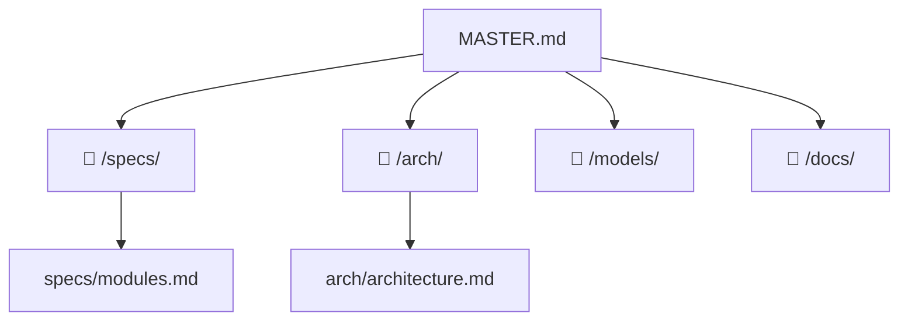

# 🧭 Project Navigator: integration-test

> 📊 Meta: `{"version": "0.2", "last_updated": "2026-04-05", "context_depth": "L0", "repo": "/private/var/folders/kn/nwnn_7597fbb155wsjrb452r0000gn/T/pytest-of-dakh/pytest-17/test_agent_run_full_cycle0/my-repo"}`

## 1. 🎯 Executive Summary
- **Цель:** Модульное приложение с многоуровневой архитектурой (Presentation → Application → Domain → Infrastructure), обеспечивающее изоляцию бизнес-логики и независимую масштабируемость компонентов
- **Текущий статус:** `🟡 DRAFT`
- **Ключевые ограничения:**
  - Domain Layer не имеет внешних зависимостей (чистая бизнес-логика)
  - Все межслойные зависимости инвертированы через интерфейсы (DIP)

## 2. 🗺️ Context Map


## 3. 🧩 Modular Sections

> Каждый раздел — ссылка на один файл.
> Загружать только при явном запросе: `@Orchestrator: раскрой раздел "..."`.

### Архитектура приложения
- **Описание:** Многоуровневая модульная архитектура: Presentation / Application / Domain / Infrastructure. Диаграммы, ADR, нефункциональные требования.
- **Ссылка:** `📁 /arch/architecture.md | 🗃️ doc:arch/architecture | 🔑 sha:7481c4b72094`
- **Статус:** `🟡 DRAFT`
- **Ответственный агент:** `@Orchestrator`

### Спецификация модулей
- **Описание:** Контракты и интерфейсы каждого модуля (api, app, domain, infra). Схема зависимостей.
- **Ссылка:** `📁 /specs/modules.md | 🗃️ doc:specs/modules | 🔑 sha:a0839f1e57e2`
- **Статус:** `🟡 DRAFT`
- **Ответственный агент:** `@Orchestrator`

## 4. ⚡ Quick Actions & Handoffs
```json
{
  "next_step": "Детализировать доменные модели (models/), описать API-контракты (specs/api.md), настроить CI/CD",
  "required_input": "Конкретные сущности домена, технологический стек, требования к API",
  "blocked_by": []
}
```

## 5. ✅ Validation & Changelog
```json
{
  "self_check": {
    "links_verified": true,
    "hashes_match": true,
    "no_hallucinations": true,
    "context_depth": "L1",
    "missing_info": [
      "Доменные модели (/models/) не созданы",
      "API-спецификация (specs/api.md) не создана",
      "Технологический стек не зафиксирован"
    ]
  },
  "changelog": [
    {
      "date": "2026-04-05",
      "action": "Init project",
      "author": "COD-DOC",
      "scope": "master"
    },
    {
      "date": "2026-04-05",
      "action": "Created arch/architecture.md: модульная архитектура, диаграммы, интерфейсы, ADR",
      "author": "COD-DOC Orchestrator",
      "scope": "arch",
      "task": "1cf87ee5"
    },
    {
      "date": "2026-04-05",
      "action": "Created specs/modules.md: контракты и зависимости модулей api/app/domain/infra",
      "author": "COD-DOC Orchestrator",
      "scope": "specs",
      "task": "1cf87ee5"
    },
    {
      "date": "2026-04-05",
      "action": "Updated MASTER.md: Executive Summary, разделы архитектуры, обновлён Context Map",
      "author": "COD-DOC Orchestrator",
      "scope": "master",
      "task": "1cf87ee5"
    }
  ]
}
```

---

## 📖 Snowball Protocol

| Уровень | Загружено | Когда |
|---------|-----------|-------|
| `L0` | Только `MASTER.md` | Старт сессии (по умолчанию) |
| `L1` | MASTER.md + 1 целевой файл | Явный запрос раздела |
| `L2` | L1 + зависимости | Запрос анализа зависимостей |

**Формат ссылки:** `📁 {path} | 🗃️ doc:{id} | 🔑 sha:{12hex}`
**Статусы:** `🟢 VERIFIED` | `🟡 DRAFT` | `🔴 STALE` | `🔴 BROKEN`
