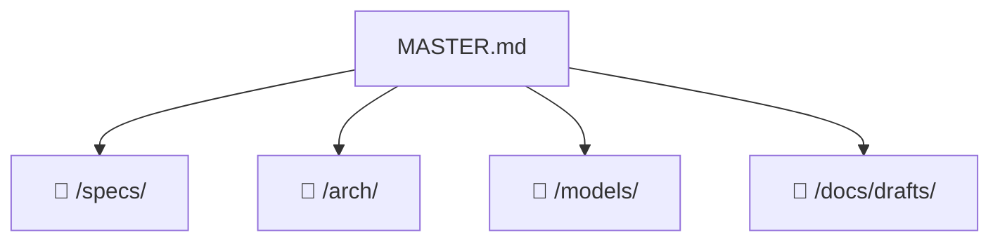

# 🧭 Project Navigator: {PROJECT_NAME}

> 📊 Meta: `{"version": "0.1", "last_updated": "2026-04-05", "context_depth": "L0", "repo": "git@github.com:{owner}/{repo}.git"}`

## 1. 🎯 Executive Summary
- **Цель:** {Одно предложение — опишите цель проекта}
- **Текущий статус:** `🟡 DRAFT`
- **Ключевые ограничения:**
  - {ограничение 1}
  - {ограничение 2}

## 2. 🗺️ Context Map


## 3. 🧩 Modular Sections

> **Инструкция:** Каждый раздел — ссылка на один файл. Загружать файл только при явном запросе (`@Orchestrator: раскрой раздел "..."`).

### {Section Name}
- **Описание:** {≤2 строки описания}
- **Ссылка:** `📁 /specs/{file}.md | 🗃️ doc:specs_{file} | 🔑 sha:{12-char-hash}`
- **Статус:** `🟡 DRAFT`
- **Ответственный агент:** `@{Role}`

<!--
Шаблон для добавления нового раздела:
### {Section Name}
- **Описание:** {≤2 строки}
- **Ссылка:** `📁 /path/to/file.ext | 🗃️ doc:{sanitized_path} | 🔑 sha:{hash}`
- **Статус:** `🟡 DRAFT`
- **Ответственный агент:** `@{Role}`
-->

## 4. ⚡ Quick Actions & Handoffs
```json
{
  "next_step": "Заполнить Executive Summary и добавить первые разделы",
  "required_input": "Название проекта, цель, список модулей/компонентов",
  "blocked_by": []
}
```

## 5. ✅ Validation & Changelog
```json
{
  "self_check": {
    "links_verified": true,
    "hashes_match": true,
    "no_hallucinations": true,
    "context_depth": "L0",
    "missing_info": [
      "PROJECT_NAME не задан",
      "Разделы ещё не созданы"
    ]
  },
  "changelog": [
    {
      "date": "2026-04-05",
      "action": "Init scaffold",
      "author": "Orchestrator",
      "scope": "master"
    }
  ]
}
```

---

## 📖 Правила работы с этим файлом

| Уровень | Что загружено | Когда активен |
|---------|--------------|---------------|
| `L0` | Только `MASTER.md` | По умолчанию, старт сессии |
| `L1` | `MASTER.md` + 1 целевой файл | При явном запросе раскрытия раздела |
| `L2` | `L1` + прямые зависимости | При запросе анализа зависимостей |

**Запрещено** загружать `L2+` без явной команды.  
**Формат ссылки:** `📁 {path} | 🗃️ doc:{id} | 🔑 sha:{12chars}`  
**Статусы:** `🟢 VERIFIED` | `🟡 DRAFT` | `🔴 STALE` | `🔴 BROKEN`
