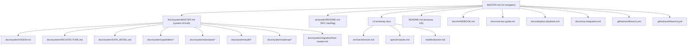

# 🧭 Project Navigator: cod-doc

> 📊 Meta: `{"version": "2.11", "last_updated": "2026-09-07", "context_depth": "L0", "repo": "/Users/dakh/Git/_my/cod-doc"}`

> **Этот файл — тонкий L0-навигатор для агента и нового контрибьютора.**
> Source of truth целевого состояния системы — [`docs/system/MASTER.md`](docs/system/MASTER.md).
> Приоритеты и милстоуны — [`docs/system/roadmap/ROADMAP.md`](docs/system/roadmap/ROADMAP.md).
> Каталог RFC и заимствований — [`proposals/README.md`](proposals/README.md).

## 1. 🎯 Executive Summary

- **Проект:** COD-DOC (Context Orchestrator for Documentation) — автономный
  агент и MCP-сервер управления проектной документацией с БД-бэкендом и
  markdown-проекциями.
- **Архитектура:** многоуровневая модульная (Presentation → Application →
  Domain ← Infrastructure) с DIP-инверсией.
- **Текущий статус:** 🟢 ACTIVE — **M5 «Гейт, которому можно верить + симбиоз в бою» закрыт 2026-09-06**.
  Прогон 2026-09-07: 1639 тестов зелёные, ruff/mypy чистые, ~137 документов
  (`stale_export`=0 после reconcile миграций 0026–0029). Поверхность:
  ~110 MCP-тулов (профиль `agent` — 6), 12 скиллов, 6 ADR, 25 stories.
  CI на main впервые зелёный (`bcb32f2`, [run 33765619088](https://github.com/Orange-hanter/cod-doc/actions/runs/33765619088)).
- **Текущий приоритет: adoption через симбиоз.** Пилоты переназначены на
  **ZAIrgRush** (мульти-агентная петля) и **Orakul/ai-review** (LLM-ревью PR) —
  [RFC 22](proposals/22-symbiosis-zairgrush-orakul.md), решение 2026-08-25.
  cod-doc отдаёт спеки/ADR/контекст, пилоты возвращают findings и измерения.
- **Подготовка к M6 «Hub + кросс-проектность»:** M1–M5 закрыты, ведётся
  подготовка к M6. **Цели M6:** (1) кросс-проектный поиск через hub-БД
  (`[[doc:slug:key]]`), (2) фикс ChromaDB L3-режима для мульти-проектности,
  (3) расширение `agent_pick --projects` для работы с несколькими проектами,
  (4) запуск RFC 23 (Cloud decentralized agent plane) и RFC 24 (единый контур
  structure/contracts/scenarios). **Прогресс:** SYM-011 (кросс-проектный
  поиск, low priority) открыт и ожидает начала; RFC 23 и RFC 24 спроектированы
  (статус 🟠 DEFERRED), задачи CAP-*/STR-* не начаты; треки D/E (STO-* Postgres
  parity, ADO-071..095 friction) идут фоном. Полная дорожная карта —
  [ROADMAP](docs/system/roadmap/ROADMAP.md).
- **Открыто:** план `adoption-2026-08` — M1–M5 закрыты.
  **Остаток Фазы 5:** SYM-011 (кросс-проектный поиск, `[[doc:slug:key]]`, low).
  **Треки D/E:** STO-* (Postgres parity, 25 задач), ADO-071..095 (friction из живой работы).
  STB-023 (SSE, low) — держится закрытым до event-driven сценария.
  STB-012 закрыт `cancelled` (re-scoped в ADO-013).

## 2. 🗺️ Context Map

```mermaid
graph TD
    Root["MASTER.md (L0 navigator)"] --> Sys["docs/system/MASTER.md (system-of-truth)"]
    Root --> Prop["proposals/README.md (RFC backlog)"]
    Root --> Legacy["L0 bootstrap docs"]

    Sys --> Vision["docs/system/VISION.md"]
    Sys --> ArchSys["docs/system/ARCHITECTURE.md"]
    Sys --> Data["docs/system/DATA_MODEL.md"]
    Sys --> Caps["docs/system/capabilities/*"]
    Sys --> Stand["docs/system/standards/*"]
    Sys --> Audit["docs/system/audit/*"]
    Sys --> Road["docs/system/roadmap/*"]
    Sys --> Migr["docs/system/migration/from-restate.md"]

    Legacy --> Arch["arch/architecture.md"]
    Legacy --> Specs["specs/modules.md"]
    Legacy --> Models["models/domain.md"]

    Root --> Readme["README.md (витрина, EN)"]
    Root --> Hand["docs/HANDBOOK.md"]
    Root --> Guide["docs/cod-doc-guide.md"]
    Root --> Play["docs/adoption-playbook.md"]
    Root --> MCP["docs/mcp-integration.md"]
    Root --> CI[".github/workflows/ci.yml"]
    Root --> CD[".github/workflows/cd.yml"]
```

## 3. 🧩 Modular Sections

> Каждый раздел — ссылка на один файл. Для агента: `@Orchestrator: раскрой раздел "..."`.
> Хеши проверены `check_stale_refs(cod-doc)` 2026-09-13 → **16/16 VALID**.

### System Documentation Index (canonical) ⭐
- **Описание:** Целевой пакет описания COD-DOC: VISION, ARCHITECTURE, DATA_MODEL,
  capabilities/*, standards/*, audit/*, roadmap/*, migration/. Это source of
  truth для поведения системы и единая точка входа для контрибьютора.
- **Ссылка:** `📁 /docs/system/MASTER.md | 🗃️ doc:docs_system_MASTER_md | 🔑 sha:f203fd5d25ad`
- **Статус:** `🟢 VERIFIED`

### Proposals (RFC backlog)
- **Описание:** 24 RFC в четырёх треках:
  - **01–15 (paperclip-track):** 🟢 Реализованы — адаптация паттернов paperclipai/paperclip
    (skills, heartbeat, wake-payload, run-id, issue docs, checkout, routines,
    status taxonomy, activity log, adapter pattern, AGENTS.md, approvals,
    import UX, legacy migration, link system). План закрыт.
  - **16–21 (hackathon-track):** 🔴 Отбракованы 2026-08-29 — AI-Pair-Hacker,
    Living Specification, Vibecoder's Diary, Context-Scout, Multi-Agent Standup,
    Degraded-Path Auditability. См. [proposals/README.md](proposals/README.md) § «Отбраковка 2026-08-29».
  - **22 (symbiosis-track):** 🟢 Активен — Symbiosis: ZAIrgRush + Orakul/ai-review
    (hub-БД, findings-ingest, doc-контекст для внешней петли и AI-ревью).
    Декомпозиция — секция E плана `adoption-2026-08`.
  - **23 (cloud-track):** 🟠 DEFERRED — Cloud decentralized agent plane
    (team-узел в облаке, ИИ-воркеры через remote MCP, SoT = Postgres).
    Задачи CAP-001…CAP-033 спроектированы, отложены до M6.
  - **24 (structure-track):** 🟠 DEFERRED — Единый контур structure/contracts/scenarios
    (docs↔code граница, obligations_export, structure_facts, scenario assessment).
    Поглощает внешнюю часть RFC 17, зависит от RFC 22. Producer готов (фазы 1–2),
    задачи STR-001…STR-004 отложены до M6.
- **Ссылка:** `📁 /proposals/README.md | 🗃️ doc:proposals_README_md | 🔑 sha:92a044375021`
- **Статус:** `🟢 VERIFIED`

### CI Pipeline (GitHub Actions)
- **Описание:** Непрерывная интеграция: ruff-линтинг (blocking), mypy strict
  (blocking), pytest matrix Python 3.11/3.12/3.13, Docker build + smoke test.
- **Ссылка:** `📁 /.github/workflows/ci.yml | 🗃️ doc:github_workflows_ci_yml | 🔑 sha:d9c7a1a33f0e`
- **Статус:** `🟢 VERIFIED`
- **Ответственный агент:** `@Orchestrator`

### CD Pipeline (GitHub Actions)
- **Описание:** Доставка: сборка Docker-образа и публикация в GHCR при
  тегировании v* (семантическое версионирование: v1.2.3).
- **Ссылка:** `📁 /.github/workflows/cd.yml | 🗃️ doc:github_workflows_cd_yml | 🔑 sha:bec2cea789cd`
- **Статус:** `🟢 VERIFIED`
- **Ответственный агент:** `@Orchestrator`

### Архитектура (L0 bootstrap, обзорная) — legacy
- **Описание:** Многоуровневая архитектура Presentation/Application/Domain/
  Infrastructure, ADR, нефункциональные требования. Сжатый обзор для агента.
  Канонический source — [`docs/system/ARCHITECTURE.md`](docs/system/ARCHITECTURE.md).
- **Ссылка:** `📁 /arch/architecture.md | 🗃️ doc:arch_architecture_md | 🔑 sha:7d32687d9139`
- **Статус:** `🟡 LEGACY` — обзор, актуальные детали см. в canonical.
- **Ответственный агент:** `@Orchestrator`

### Спецификация модулей (L0 bootstrap) — legacy
- **Описание:** Контракты api/app/domain/infra, схема зависимостей. Карта
  bootstrap-контрактов. Canonical-разбивка функциональности — в
  [`docs/system/capabilities/`](docs/system/capabilities/).
- **Ссылка:** `📁 /specs/modules.md | 🗃️ doc:specs_modules_md | 🔑 sha:5c335c97fd99`
- **Статус:** `🟡 LEGACY`
- **Ответственный агент:** `@Orchestrator`

### Доменные модели (L0 bootstrap) — legacy
- **Описание:** Aggregates (Project, Task, Document), Value Objects, доменные
  события, порты-репозитории. Canonical schema-описание — в
  [`docs/system/DATA_MODEL.md`](docs/system/DATA_MODEL.md).
- **Ссылка:** `📁 /models/domain.md | 🗃️ doc:models_domain_md | 🔑 sha:0a25ddfd9b0c`
- **Статус:** `🟡 LEGACY`
- **Ответственный агент:** `@Orchestrator`

### README (витрина проекта, английский) ⭐
- **Описание:** Точка входа для внешнего читателя GitHub/PyPI: что это, зачем
  БД вместо голого markdown, quick start на 5 строк, четыре поверхности,
  таблица ссылок на остальную документацию. Подставляется как
  `long_description` пакета (`pyproject.toml → readme`).
- **Ссылка:** `📁 /README.md | 🗃️ doc:README_md | 🔑 sha:cdb02d871cd1`
- **Статус:** `🟢 VERIFIED`

### Handbook (пользовательский справочник)
- **Описание:** Полное руководство: установка, Quick Start, Web UI tour, CLI,
  конфигурация, MCP, ИИ-агент, ChromaDB, troubleshooting.
- **Ссылка:** `📁 /docs/HANDBOOK.md | 🗃️ doc:docs_HANDBOOK_md | 🔑 sha:91cf98985845`
- **Статус:** `🟢 VERIFIED`

### Гайд по документированию (tutorial)
- **Описание:** Пошаговое руководство по созданию документации проекта с нуля
  через COD-DOC (~30 минут, пример weather-cli).
- **Ссылка:** `📁 /docs/cod-doc-guide.md | 🗃️ doc:docs_cod-doc-guide_md | 🔑 sha:562c1f392f47`
- **Статус:** `🟢 VERIFIED`

### Adoption Playbook (как завести на своих проектах) ⭐
- **Описание:** Сценарии заведения COD-DOC на **существующих** репозиториях с
  накопленным markdown: починка конфига, выбор пилота, 4 архетипа проектов,
  ежедневный цикл, известные шероховатости. В отличие от tutorial — про
  живые репозитории, а не про пример с нуля.
- **Ссылка:** `📁 /docs/adoption-playbook.md | 🗃️ doc:docs_adoption-playbook_md | 🔑 sha:9ba4d87dc9c2`
- **Статус:** `🟢 VERIFIED`

### MCP-интеграция (catalog)
- **Описание:** Подключение cod-doc к VS Code Copilot, Claude Desktop, Claude
  Code, другим LLM-системам через MCP. Каталог инструментов.
- **Ссылка:** `📁 /docs/mcp-integration.md | 🗃️ doc:docs_mcp-integration_md | 🔑 sha:d015b53c85cf`
- **Статус:** `🟢 VERIFIED`

### ROADMAP (милстоуны и приоритеты) ⭐
- **Описание:** Милстоуны M1–M6, статусы фаз, декомпозиция планов. M1–M5 закрыты,
  M6 (hub + кросс-проектность) в подготовке.
- **Ссылка:** `📁 /docs/system/roadmap/ROADMAP.md | 🗃️ doc:docs_system_roadmap_ROADMAP_md | 🔑 sha:a1c480d5c5c8`
- **Статус:** `🟢 VERIFIED`

### RFC 22: Symbiosis (ZAIrgRush + Orakul)
- **Описание:** Proposal программы симбиоза: cod-doc отдаёт спеки/ADR/контекст,
  пилоты возвращают findings и измерения. Решение 2026-08-25 о переназначении
  пилотов.
- **Ссылка:** `📁 /proposals/22-symbiosis-zairgrush-orakul.md | 🗃️ doc:proposals_22-symbiosis-zairgrush-orakul_md | 🔑 sha:f949443ce8b5`
- **Статус:** `🟢 VERIFIED`

### RFC 23: Cloud Decentralized Agent Plane
- **Описание:** Proposal облачной децентрализованной агентной плоскости:
  team-узел в облаке, ИИ-воркеры через remote MCP, source of truth = Postgres.
  Задачи CAP-001…CAP-033 спроектированы, отложены до M6.
- **Ссылка:** `📁 /proposals/23-cloud-decentralized-agent-plane.md | 🗃️ doc:proposals_23-cloud-decentralized-agent-plane_md | 🔑 sha:8127ffd13bb8`
- **Статус:** `🟠 DEFERRED`

### RFC 24: Structure/Contracts/Scenarios (единый контур)
- **Описание:** Proposal единого контура structure/contracts/scenarios:
  docs↔code граница, obligations_export, structure_facts, scenario assessment.
  Поглощает внешнюю часть RFC 17, зависит от RFC 22. Producer готов (фазы 1–2),
  задачи STR-001…STR-004 отложены до M6.
- **Ссылка:** `📁 /proposals/24-structure-contracts-scenarios.md | 🗃️ doc:proposals_24-structure-contracts-scenarios_md | 🔑 sha:05c0a2070c2c`
- **Статус:** `🟠 DEFERRED`

## 4. 📝 Changelog

- **2026-09-07:** Актуализирован статус RFC 23 и RFC 24 (🟡 DRAFT → 🟠 DEFERRED).
  Обновлены Executive Summary (§1), Proposals section (§3), ROADMAP (секция M6).
  Задачи CAP-001…CAP-033 и STR-001…STR-004 отложены до M6 «Hub + кросс-проектность».
  Версия 2.11.
- **2026-09-13:** Аудит ссылок MASTER.md: проверено 16 гибридных ссылок
  (docs/system/*, proposals/*, L0 bootstrap docs) — **16/16 VALID**.
  Все хэши совпадают, файлы существуют. Обновлён `last_updated` до 2026-09-13,
  версия 2.10.
- **2026-09-12:** Обновлён Executive Summary §1: актуализирован прогресс по M6
  (SYM-011 в статусе pending, RFC 23/24 — 🟡 DRAFT, не начаты), обновлён
  `last_updated` в meta-блоке до 2026-09-12, версия 2.9.
