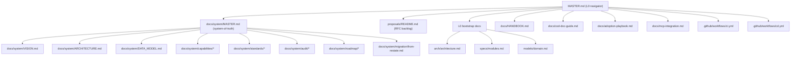

# 🧭 Project Navigator: cod-doc

> 📊 Meta: `{"version": "2.2", "last_updated": "2026-08-25", "context_depth": "L0", "repo": "/Users/dakh/Git/_my/cod-doc"}`

> **Этот файл — тонкий L0-навигатор для агента и нового контрибьютора.**
> Source of truth целевого состояния системы — [`docs/system/MASTER.md`](docs/system/MASTER.md).
> Приоритеты и милстоуны — [`docs/system/roadmap/ROADMAP.md`](docs/system/roadmap/ROADMAP.md).
> Каталог RFC и заимствований — [`proposals/README.md`](proposals/README.md).

## 1. 🎯 Executive Summary

- **Проект:** COD-DOC (Context Orchestrator for Documentation) — автономный
  агент и MCP-сервер управления проектной документацией с БД-бэкендом и
  markdown-проекциями.
- **Архитектура:** многоуровневая модульная (Presentation → Application →
  Domain ← Infrastructure) с DIP-инверсией.
- **Текущий статус:** 🟢 ACTIVE — **все 8 планов закрыты**, стабилизация
  12/13. Прогон 2026-07-29: 1356 тестов зелёные, ruff/mypy чистые, 106
  документов `in_sync`, 0 issues в `plan audit`. Поверхность: 103 MCP-тула
  (профиль `agent` — 6), 12 скиллов, 6 ADR, 25 stories.
- **Текущий приоритет: adoption через симбиоз.** Пилоты переназначены на
  **ZAIrgRush** (мульти-агентная петля) и **Orakul/ai-review** (LLM-ревью PR) —
  [RFC 22](proposals/22-symbiosis-zairgrush-orakul.md), решение 2026-08-25.
  cod-doc отдаёт спеки/ADR/контекст, пилоты возвращают findings и измерения.
  Милстоуны — [ROADMAP](docs/system/roadmap/ROADMAP.md) (M1 «Пилот работает» →
  M2 «Обратная связь встроена» → M3 «Первая фича по спросу»).
- **Открыто:** план `adoption-2026-08` — 24 задачи (Фаза 0: SYM-001…004 +
  ADO-001/010/015; пилоты ADO-016/017; Фазы 1–5: SYM-005…011), STB-023 (SSE,
  low). STB-012 закрыт `cancelled` (re-scoped в ADO-013).

## 2. 🗺️ Context Map


```mermaid
graph TD
    Root["MASTER.md (L0 navigator)"] --> Sys["docs/system/MASTER.md (system-of-truth)"]
    Root --> Prop["proposals/README.md (RFC backlog)"]
    Root --> Legacy["L0 bootstrap docs"]

    Sys --> Vision["docs/system/VISION.md"]
    Sys --> ArchSys["docs/system/ARCHITECTURE.md"]
    Sys --> Data["docs/system/DATA_MODEL.md"]
    Sys --> Caps["docs/system/capabilities/*"]
    Sys --> Stand["docs/system/standards/*"]
    Sys --> Audit["docs/system/audit/*"]
    Sys --> Road["docs/system/roadmap/*"]
    Sys --> Migr["docs/system/migration/from-restate.md"]

    Legacy --> Arch["arch/architecture.md"]
    Legacy --> Specs["specs/modules.md"]
    Legacy --> Models["models/domain.md"]

    Root --> Hand["docs/HANDBOOK.md"]
    Root --> Guide["docs/cod-doc-guide.md"]
    Root --> Play["docs/adoption-playbook.md"]
    Root --> MCP["docs/mcp-integration.md"]
    Root --> CI[".github/workflows/ci.yml"]
    Root --> CD[".github/workflows/cd.yml"]
```

## 3. 🧩 Modular Sections

> Каждый раздел — ссылка на один файл. Для агента: `@Orchestrator: раскрой раздел "..."`.
> Хеши проверены `check_stale_refs(cod-doc)` 2026-05-07 → 10/10 VALID.

### System Documentation Index (canonical) ⭐
- **Описание:** Целевой пакет описания COD-DOC: VISION, ARCHITECTURE, DATA_MODEL,
  capabilities/*, standards/*, audit/*, roadmap/*, migration/. Это source of
  truth для поведения системы и единая точка входа для контрибьютора.
- **Ссылка:** [`📁 docs/system/MASTER.md`](docs/system/MASTER.md)
- **Статус:** `🟢 ACTIVE`

### Proposals (RFC backlog)
- **Описание:** 22 RFC: 01–15 — адаптация паттернов paperclipai/paperclip
  (реализованы, план закрыт), 16–21 — hackathon-track (только proposals),
  22 — **Symbiosis** (ZAIrgRush + Orakul/ai-review, активная программа;
  декомпозиция — секция E плана `adoption-2026-08`).
- **Ссылка:** [`📁 proposals/README.md`](proposals/README.md)
- **Статус:** `🟢 ACTIVE`

### CI Pipeline (GitHub Actions)
- **Описание:** Непрерывная интеграция: ruff-линтинг (blocking), mypy strict
  (blocking), pytest matrix Python 3.11/3.12/3.13, Docker build + smoke test.
- **Ссылка:** `📁 /.github/workflows/ci.yml | 🗃️ doc:github_workflows_ci_yml | 🔑 sha:2b0809be8fcc`
- **Статус:** `🟢 VERIFIED`
- **Ответственный агент:** `@Orchestrator`

### CD Pipeline (GitHub Actions)
- **Описание:** Доставка: сборка Docker-образа и публикация в GHCR при
  тегировании v* (semver).
- **Ссылка:** `📁 /.github/workflows/cd.yml | 🗃️ doc:github_workflows_cd_yml | 🔑 sha:bec2cea789cd`
- **Статус:** `🟢 VERIFIED`
- **Ответственный агент:** `@Orchestrator`

### Архитектура (L0 bootstrap, обзорная) — legacy
- **Описание:** Многоуровневая архитектура Presentation/Application/Domain/
  Infrastructure, ADR, нефункциональные требования. Сжатый обзор для агента.
  Канонический source — [`docs/system/ARCHITECTURE.md`](docs/system/ARCHITECTURE.md).
- **Ссылка:** `📁 /arch/architecture.md | 🗃️ doc:arch_architecture_md | 🔑 sha:7d32687d9139`
- **Статус:** `🟡 LEGACY` — обзор, актуальные детали см. в canonical.
- **Ответственный агент:** `@Orchestrator`

### Спецификация модулей (L0 bootstrap) — legacy
- **Описание:** Контракты api/app/domain/infra, схема зависимостей. Карта
  bootstrap-контрактов. Canonical-разбивка функциональности — в
  [`docs/system/capabilities/`](docs/system/capabilities/).
- **Ссылка:** `📁 /specs/modules.md | 🗃️ doc:specs_modules_md | 🔑 sha:5c335c97fd99`
- **Статус:** `🟡 LEGACY`
- **Ответственный агент:** `@Orchestrator`

### Доменные модели (L0 bootstrap) — legacy
- **Описание:** Aggregates (Project, Task, Document), Value Objects, доменные
  события, порты-репозитории. Canonical schema-описание — в
  [`docs/system/DATA_MODEL.md`](docs/system/DATA_MODEL.md).
- **Ссылка:** `📁 /models/domain.md | 🗃️ doc:models_domain_md | 🔑 sha:2e5d66877b50`
- **Статус:** `🟡 LEGACY`
- **Ответственный агент:** `@Orchestrator`

### Handbook (пользовательский справочник)
- **Описание:** Полное руководство: установка, Quick Start, Web UI tour, CLI,
  конфигурация, MCP, ИИ-агент, ChromaDB, troubleshooting.
- **Ссылка:** `📁 /docs/HANDBOOK.md | 🗃️ doc:docs_HANDBOOK_md | 🔑 sha:702215d16ac4`
- **Статус:** `🟢 VERIFIED`

### Гайд по документированию (tutorial)
- **Описание:** Пошаговое руководство по созданию документации проекта с нуля
  через COD-DOC (~30 минут, пример weather-cli).
- **Ссылка:** `📁 /docs/cod-doc-guide.md | 🗃️ doc:docs_cod-doc-guide_md | 🔑 sha:562c1f392f47`
- **Статус:** `🟢 VERIFIED`

### Adoption Playbook (как завести на своих проектах) ⭐
- **Описание:** Сценарии заведения COD-DOC на **существующих** репозиториях с
  накопленным markdown: починка конфига, выбор пилота, 4 архетипа проектов,
  ежедневный цикл, известные шероховатости. В отличие от tutorial — про
  живые репозитории, а не про пример с нуля.
- **Ссылка:** `📁 /docs/adoption-playbook.md | 🗃️ doc:docs_adoption-playbook_md | 🔑 sha:ec7b8b660080`
- **Статус:** `🟢 VERIFIED`

### MCP-интеграция (catalog)
- **Описание:** Подключение cod-doc к VS Code Copilot, Claude Desktop, Claude
  Code, другим LLM-системам через MCP. Каталог инструментов.
- **Ссылка:** `📁 /docs/mcp-integration.md | 🗃️ doc:docs_mcp-integration_md | 🔑 sha:0ce0a4a39b75`
- **Статус:** `🟢 VERIFIED`

## 4. ⚡ Quick Actions & Handoffs
```json
{
  "quick_actions": {
    "lint": [
      {"cmd": "ruff check cod_doc/ tests/", "desc": "Проверка стиля и ошибок (pycodestyle, pyflakes, isort, bugbear)"},
      {"cmd": "ruff format --check cod_doc/ tests/", "desc": "Проверка форматирования (без записи)"},
      {"cmd": "mypy cod_doc/", "desc": "Статическая типизация (strict mode)"}
    ],
    "test": [
      {"cmd": "pip install -e .[dev]", "desc": "Установка dev-зависимостей (pytest, ruff, mypy, hypothesis)"},
      {"cmd": "pytest tests/ -v --tb=short", "desc": "Запуск всех тестов"},
      {"cmd": "pytest tests/ -v --tb=short --timeout=120", "desc": "Тесты с таймаутом 120s (как в CI)"}
    ],
    "docker": [
      {"cmd": "docker build -t cod-doc .", "desc": "Локальная сборка образа (python:3.12-slim)"},
      {"cmd": "docker compose up -d", "desc": "Запуск сервиса (порт 8765, healthcheck через 15s)"},
      {"cmd": "docker compose down", "desc": "Остановка и удаление контейнера"}
    ],
    "docs": [
      {"cmd": "open docs/system/MASTER.md", "desc": "Открыть system-of-truth"},
      {"cmd": "open proposals/README.md", "desc": "RFC backlog (paperclip adoption)"},
      {"cmd": "cod-doc doc drift --project cod-doc --all", "desc": "Проверить DB↔markdown drift без перезаписи файлов"}
    ],
    "health": [
      {"cmd": "curl http://localhost:8765/api/projects/cod-doc/health", "desc": "JSON-сводка DB health: doc drift, unresolved links, doc_drift routine"}
    ]
  },
  "handoffs": {
    "ci": {
      "workflow": "📁 /.github/workflows/ci.yml | 🗃️ doc:github_workflows_ci_yml | 🔑 sha:2b0809be8fcc",
      "trigger": "push / pull_request в main и develop",
      "pipeline": "ruff → mypy → pytest (матрица 3.11/3.12/3.13) → docker build + smoke test"
    },
    "cd": {
      "workflow": "📁 /.github/workflows/cd.yml | 🗃️ doc:github_workflows_cd_yml | 🔑 sha:bec2cea789cd",
      "trigger": "push тега v* (семантическое версионирование: v1.2.3)",
      "pipeline": "docker build → push в GHCR (теги: version, major.minor, major, sha)"
    }
  },
  "handoff_rules": {
    "on_missing_file": "Искать файл на диске → если отсутствует, поднять задачу через task_create",
    "on_hash_mismatch": "Пересчитать хэш через hash_file → обновить ссылку в MASTER.md → статус 🔴 STALE до синхронизации",
    "on_broken_section": "Пометить 🔴 BROKEN, запросить восстановление через task_create",
    "on_legacy_doc": "L0 bootstrap-документы (arch/specs/models) дают обзор; за деталями идти в docs/system/",
    "context_gate": "L0 (этот файл) — старт сессии; L1 — при явном запросе раздела; L2 — только при анализе зависимостей"
  }
}
```

## 5. ✅ Validation & Changelog

### 5.1 📋 Validation Table

| # | Документ | 🗃️ doc-id | 🔑 Хэш (sha:12) | 📅 Проверен | Статус |
|---|----------|-----------|-----------------|-------------|--------|
| 1 | MASTER.md (этот файл) | `doc:MASTER_md` | regen-on-write | 2026-07-29 | 🟢 VERIFIED |
| 2 | CI Pipeline | `doc:github_workflows_ci_yml` | `2b0809be8fcc` | 2026-07-29 | 🟢 VERIFIED |
| 3 | CD Pipeline | `doc:github_workflows_cd_yml` | `bec2cea789cd` | 2026-07-29 | 🟢 VERIFIED |
| 4 | Архитектура (legacy) | `doc:arch_architecture_md` | `7d32687d9139` | 2026-07-29 | 🟡 LEGACY |
| 5 | Спецификация модулей (legacy) | `doc:specs_modules_md` | `5c335c97fd99` | 2026-07-29 | 🟡 LEGACY |
| 6 | Доменные модели (legacy) | `doc:models_domain_md` | `2e5d66877b50` | 2026-07-29 | 🟡 LEGACY |
| 7 | Handbook | `doc:docs_HANDBOOK_md` | `2edf006548df` | 2026-07-29 | 🟢 VERIFIED |
| 8 | Гайд по документированию | `doc:docs_cod-doc-guide_md` | `562c1f392f47` | 2026-07-29 | 🟢 VERIFIED |
| 9 | MCP-интеграция | `doc:docs_mcp-integration_md` | `0ce0a4a39b75` | 2026-07-29 | 🟢 VERIFIED |
| 10 | Adoption Playbook | `doc:docs_adoption-playbook_md` | `c4d21d12427b` | 2026-07-29 | 🟢 VERIFIED |

> **Всего:** 10 документов | 🟢 VERIFIED: 7 | 🟡 LEGACY: 3 | 🔴 STALE: 0 | 🔴 BROKEN: 0
>
> **Пересчёт 2026-07-29:** 4 хэша были STALE (`arch/architecture.md`,
> `HANDBOOK.md`, `cod-doc-guide.md`, `mcp-integration.md`) — файлы правились
> легитимными коммитами (`3d2b329`, `27f3d6f`, `c310503`, `b4ad388`,
> `a73dcbb`), а реестр отстал. Контент сверен по git-истории перед
> обновлением (skill `drift-handling`: не обновлять хэши наугад).
>
> **Canonical-пакет** (`docs/system/`) — отдельный реестр документов, см.
> [`docs/system/MASTER.md §5`](docs/system/MASTER.md).

### 5.2 🤖 Agent Self-Check
```json
{
  "self_check": {
    "links_verified": true,
    "hashes_match": true,
    "no_hallucinations": true,
    "context_depth": "L0",
    "missing_info": [
      "В корне нет README.md — pyproject подставляет docs/cod-doc-guide.md (F6 аудита 2026-07-29, задача C-2)",
      "capabilities/project-bootstrap.md описывает 'cod-doc project new'; CLI даёт 'project add' + 'project init' (задача D-4)",
      "66 живых web-роутов отсутствуют в capabilities/web-frontend.md §3 (F3, задача D-1)"
    ]
  }
}
```

### 5.3 📝 Changelog
```json
{
  "changelog": [
    {
      "date": "2026-08-25",
      "version": "2.2",
      "action": "Программа Symbiosis (RFC 22): пилоты переназначены Mushrooms/yana → ZAIrgRush/Orakul (ADO-003/004 cancelled, созданы ADO-016/017); в план adoption-2026-08 добавлена секция E (SYM-001…011, Фазы 0–5); STB-012 cancelled (re-scoped в ADO-013); ADO-010 разбит на 2 этапа (guard → byte-identical); ADO-015 расширен под типы пилотов. ROADMAP пересобран, RFC-каталог 21 → 22.",
      "author": "Symbiosis Reorg 2026-08-25",
      "scope": "master",
      "rfc": "proposals/22-symbiosis-zairgrush-orakul.md"
    },
    {
      "date": "2026-07-29",
      "version": "2.1",
      "action": "State-of-the-project refresh. Прогон: 1356 tests passed, ruff/mypy clean, 106 docs in_sync, plan audit ×5 без issues. Закрыт STB-013 (ContextService L2/L3 реализованы — снят устаревший docstring). Построен repo-index (625 файлов / 3021 символ). Каталог скиллов 9 → 12: извлечены project-onboarding, ground-truth-reconcile, rfc-authoring. L0-payload agent_capabilities ужат 4543 → 3586 байт (вырезаны trigger-списки). Пересчитаны 4 STALE-хэша реестра. Добавлен docs/adoption-playbook.md. ROADMAP пересобран: приоритет смещён со фич на adoption (M1/M2/M3).",
      "author": "State Refresh 2026-07-29",
      "scope": "master",
      "audit": "docs/system/audit/2026-07-29-state-of-the-project.md"
    },
    {
      "date": "2026-05-07",
      "version": "2.0",
      "action": "Cycle-1 consolidation: rewrote root MASTER as thin L0 navigator → docs/system + proposals; removed integration-test fixture leak; legacy L0 bootstrap (arch/specs/models) marked 🟡 LEGACY with canonical pointers; verified hash registry (10/10 VALID)",
      "author": "Cod-Doc Consolidation Cycle 1",
      "scope": "master",
      "audit": "docs/system/audit/2026-05-07-doc-consolidation-cycle-1.md"
    },
    {
      "date": "2026-04-05",
      "version": "1.0",
      "action": "Bootstrap MASTER.md (см. предыдущую историю в git log MASTER.md)",
      "author": "COD-DOC Orchestrator",
      "scope": "master"
    }
  ]
}
```

---

## 📖 Snowball Protocol

| Уровень | Загружено | Когда |
|---------|-----------|-------|
| `L0` | Только `MASTER.md` (этот файл) | Старт сессии (по умолчанию) |
| `L1` | MASTER.md + 1 целевой файл | Явный запрос раздела |
| `L2` | L1 + зависимости | Запрос анализа зависимостей |

**Формат гибридной ссылки:** `📁 {path} | 🗃️ doc:{id} | 🔑 sha:{12hex}`
**Статусы:** `🟢 VERIFIED` | `🟡 LEGACY` | `🟡 DRAFT` | `🔴 STALE` | `🔴 BROKEN`

**Где что искать:**
- Приоритеты, милстоуны, что делать дальше → [`docs/system/roadmap/ROADMAP.md`](docs/system/roadmap/ROADMAP.md)
- Как завести cod-doc на своём проекте → [`docs/adoption-playbook.md`](docs/adoption-playbook.md)
- Каталог скиллов (12) → [`cod_doc/skills/`](cod_doc/skills/)
- Целевая архитектура и DATA_MODEL → [`docs/system/`](docs/system/)
- Capability-описания (одна возможность = один файл) → [`docs/system/capabilities/`](docs/system/capabilities/)
- Стандарты frontmatter / task-plan / link / sensitive-data → [`docs/system/standards/`](docs/system/standards/)
- Audit-отчёты по секциям → [`docs/system/audit/`](docs/system/audit/)
- Планы выполнения (execution-plan) → [`docs/system/roadmap/`](docs/system/roadmap/)
- Заимствования и идеи на внедрение → [`proposals/`](proposals/)
