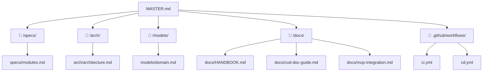

# 🧭 Project Navigator: integration-test

> 📊 Meta: `{"version": "1.0", "last_updated": "2026-04-05", "context_depth": "L0", "repo": "/private/var/folders/kn/nwnn_7597fbb155wsjrb452r0000gn/T/pytest-of-dakh/pytest-17/test_agent_run_full_cycle0/my-repo"}`

## 1. 🎯 Executive Summary
- **Цель:** Модульное приложение с многоуровневой архитектурой (Presentation → Application → Domain → Infrastructure), обеспечивающее изоляцию бизнес-логики и независимую масштабируемость компонентов
- **Текущий статус:** `🟢 VERIFIED`
- **Ключевые ограничения:**
  - Domain Layer не имеет внешних зависимостей (чистая бизнес-логика)
  - Все межслойные зависимости инвертированы через интерфейсы (DIP)

## 2. 🗺️ Context Map

```mermaid
graph TD
    Root[MASTER.md] --> S[📁 /specs/]
    Root --> A[📁 /arch/]
    Root --> M[📁 /models/]
    Root --> D[📁 /docs/]
    Root --> CI[📁 .github/workflows/]

    S --> SM[specs/modules.md]
    A --> AA[arch/architecture.md]
    M --> MD[models/domain.md]
    D --> DH[docs/HANDBOOK.md]
    D --> DG[docs/cod-doc-guide.md]
    D --> DM[docs/mcp-integration.md]
    CI --> CIC[ci.yml]
    CI --> CDC[cd.yml]
```

## 3. 🧩 Modular Sections

> Каждый раздел — ссылка на один файл.
> Загружать только при явном запросе: `@Orchestrator: раскрой раздел "..."`.

### CI Pipeline (GitHub Actions)
- **Описание:** Непрерывная интеграция: ruff-линтинг, mypy-проверка типов, pytest (матрица Python 3.11/3.12/3.13), docker build + smoke test. Триггеры: push/PR в main и develop.
- **Ссылка:** `📁 /.github/workflows/ci.yml | 🗃️ doc:github_workflows_ci_yml | 🔑 sha:2b0809be8fcc`
- **Статус:** `🟢 VERIFIED`
- **Ответственный агент:** `@Orchestrator`

### CD Pipeline (GitHub Actions)
- **Описание:** Доставка: сборка Docker-образа и публикация в GHCR при тегировании версии (v*). Семантическое версионирование тегов.
- **Ссылка:** `📁 /.github/workflows/cd.yml | 🗃️ doc:github_workflows_cd_yml | 🔑 sha:bec2cea789cd`
- **Статус:** `🟢 VERIFIED`
- **Ответственный агент:** `@Orchestrator`

### Архитектура приложения
- **Описание:** Многоуровневая модульная архитектура: Presentation / Application / Domain / Infrastructure. Диаграммы, ADR, нефункциональные требования.
- **Ссылка:** `📁 /arch/architecture.md | 🗃️ doc:arch_architecture_md | 🔑 sha:a641cd2bf5e7`
- **Статус:** `🟢 VERIFIED`
- **Ответственный агент:** `@Orchestrator`

### Спецификация модулей
- **Описание:** Контракты и интерфейсы каждого модуля (api, app, domain, infra). Схема зависимостей.
- **Ссылка:** `📁 /specs/modules.md | 🗃️ doc:specs_modules_md | 🔑 sha:4f9997a25c6c`
- **Статус:** `🟢 VERIFIED`
- **Ответственный агент:** `@Orchestrator`

### Доменные модели
- **Описание:** Агрегаты (Project, Task, Document), Value Objects (HybridRef, ProjectStatus, TaskStatus, DocStatus), доменные события, интерфейсы репозиториев (порты).
- **Ссылка:** `📁 /models/domain.md | 🗃️ doc:models_domain_md | 🔑 sha:4a6c60b604d7`
- **Статус:** `🟢 VERIFIED`
- **Ответственный агент:** `@Orchestrator`

### Справочное руководство (Handbook)
- **Описание:** Полное руководство по COD-DOC: архитектура, установка, Quick Start, Web UI tour, CLI, конфигурация, MCP, ИИ-агент, ChromaDB, workflow, troubleshooting.
- **Ссылка:** `📁 /docs/HANDBOOK.md | 🗃️ doc:docs_HANDBOOK_md | 🔑 sha:81fac3e1c061`
- **Статус:** `🟢 VERIFIED`
- **Ответственный агент:** `@Orchestrator`

### Гайд по документированию
- **Описание:** Пошаговое руководство по созданию документации проекта с нуля через COD-DOC (~30 минут, реальный пример weather-cli).
- **Ссылка:** `📁 /docs/cod-doc-guide.md | 🗃️ doc:docs_cod-doc-guide_md | 🔑 sha:e2ff564ecab5`
- **Статус:** `🟢 VERIFIED`
- **Ответственный агент:** `@Orchestrator`

### MCP-интеграция
- **Описание:** Интеграция cod-doc с VS Code Copilot, Claude Desktop, Claude Code и другими LLM-системами через MCP (23 инструмента).
- **Ссылка:** `📁 /docs/mcp-integration.md | 🗃️ doc:docs_mcp-integration_md | 🔑 sha:9087378db933`
- **Статус:** `🟢 VERIFIED`
- **Ответственный агент:** `@Orchestrator`

## 4. ⚡ Quick Actions & Handoffs
```json
{
  "quick_actions": {
    "lint": [
      {"cmd": "ruff check cod_doc/ tests/", "desc": "Проверка стиля и ошибок (pycodestyle, pyflakes, isort, bugbear)"},
      {"cmd": "ruff format --check cod_doc/ tests/", "desc": "Проверка форматирования (без записи)"},
      {"cmd": "mypy cod_doc/", "desc": "Статическая типизация (strict mode)"}
    ],
    "test": [
      {"cmd": "pip install -e .[dev]", "desc": "Установка dev-зависимостей (pytest, ruff, mypy, hypothesis)"},
      {"cmd": "pytest tests/ -v --tb=short", "desc": "Запуск всех тестов"},
      {"cmd": "pytest tests/ -v --tb=short --timeout=120", "desc": "Тесты с таймаутом 120s (как в CI)"}
    ],
    "docker": [
      {"cmd": "docker build -t cod-doc .", "desc": "Локальная сборка образа (python:3.12-slim)"},
      {"cmd": "docker compose up -d", "desc": "Запуск сервиса (порт 8765, healthcheck через 15s)"},
      {"cmd": "docker compose down", "desc": "Остановка и удаление контейнера"},
      {"cmd": "docker run --rm -d --name cod-doc-smoke -p 8765:8765 -e COD_DOC_API_KEY=sk-test cod-doc:ci && sleep 10 && curl -f http://localhost:8765/api/health && docker stop cod-doc-smoke", "desc": "Smoke test (как в CI: healthcheck через curl)"}
    ]
  },
  "handoffs": {
    "ci": {
      "workflow": "📁 /.github/workflows/ci.yml | 🗃️ doc:github_workflows_ci_yml | 🔑 sha:2b0809be8fcc",
      "trigger": "push / pull_request в main и develop",
      "pipeline": "ruff → mypy → pytest (матрица 3.11/3.12/3.13) → docker build + smoke test"
    },
    "cd": {
      "workflow": "📁 /.github/workflows/cd.yml | 🗃️ doc:github_workflows_cd_yml | 🔑 sha:bec2cea789cd",
      "trigger": "push тега v* (семантическое версионирование: v1.2.3)",
      "pipeline": "docker build → push в GHCR (теги: version, major.minor, major, sha)"
    }
  },
  "handoff_rules": {
    "on_missing_file": "Искать файл на диске → если отсутствует, создать по контракту из specs/modules.md",
    "on_hash_mismatch": "Пересчитать хэш через calc_hash → обновить ссылку в MASTER.md → статус 🔴 STALE до синхронизации",
    "on_broken_section": "Пометить 🔴 BROKEN, запросить восстановление через create_task",
    "context_gate": "L0 (MASTER.md) — старт сессии; L1 — при явном запросе раздела; L2 — только при анализе зависимостей (запрещено без необходимости)"
  }
}
```

## 5. ✅ Validation & Changelog

### 5.1 📋 Validation Table

| # | Документ | 🗃️ doc-id | 🔑 Хэш (sha:12) | 📅 Проверен | Статус |
|---|----------|-----------|-----------------|-------------|--------|
| 1 | MASTER.md | `doc:MASTER_md` | `944aef87a7d1` | 2026-04-05 | 🟢 VERIFIED |
| 2 | CI Pipeline | `doc:github_workflows_ci_yml` | `2b0809be8fcc` | 2026-04-05 | 🟢 VERIFIED |
| 3 | CD Pipeline | `doc:github_workflows_cd_yml` | `bec2cea789cd` | 2026-04-05 | 🟢 VERIFIED |
| 4 | Архитектура | `doc:arch_architecture_md` | `a641cd2bf5e7` | 2026-04-05 | 🟢 VERIFIED |
| 5 | Спецификация модулей | `doc:specs_modules_md` | `4f9997a25c6c` | 2026-04-05 | 🟢 VERIFIED |
| 6 | Доменные модели | `doc:models_domain_md` | `4a6c60b604d7` | 2026-04-05 | 🟢 VERIFIED |
| 7 | Handbook | `doc:docs_HANDBOOK_md` | `81fac3e1c061` | 2026-04-05 | 🟢 VERIFIED |
| 8 | Гайд по документированию | `doc:docs_cod-doc-guide_md` | `e2ff564ecab5` | 2026-04-05 | 🟢 VERIFIED |
| 9 | MCP-интеграция | `doc:docs_mcp-integration_md` | `9087378db933` | 2026-04-05 | 🟢 VERIFIED |

> **Всего:** 9 документов | 🟢 VERIFIED: 9 | 🟡 DRAFT: 0 | 🔴 STALE: 0 | 🔴 BROKEN: 0

### 5.2 🤖 Agent Self-Check
```json
{
  "self_check": {
    "links_verified": true,
    "hashes_match": true,
    "no_hallucinations": true,
    "context_depth": "L1",
    "missing_info": [
      "API-спецификация (specs/api.md) не создана",
      "Технологический стек не зафиксирован"
    ]
  }
}
```

### 5.3 📝 Changelog
```json
{
  "changelog": [
    {
      "date": "2026-04-05",
      "version": "0.1",
      "action": "Init project",
      "author": "COD-DOC",
      "scope": "master"
    },
    {
      "date": "2026-04-05",
      "version": "0.2",
      "action": "Created arch/architecture.md: модульная архитектура, диаграммы, интерфейсы, ADR",
      "author": "COD-DOC Orchestrator",
      "scope": "arch",
      "task": "1cf87ee5"
    },
    {
      "date": "2026-04-05",
      "version": "0.2",
      "action": "Created specs/modules.md: контракты и зависимости модулей api/app/domain/infra",
      "author": "COD-DOC Orchestrator",
      "scope": "specs",
      "task": "1cf87ee5"
    },
    {
      "date": "2026-04-05",
      "version": "0.2",
      "action": "Updated MASTER.md: Executive Summary, разделы архитектуры, обновлён Context Map",
      "author": "COD-DOC Orchestrator",
      "scope": "master",
      "task": "1cf87ee5"
    },
    {
      "date": "2026-04-05",
      "version": "0.3",
      "action": "Added Modular Sections for /models/ (domain.md) and /docs/ (HANDBOOK, cod-doc-guide, mcp-integration); expanded Context Map; marked arch/architecture.md and specs/modules.md as 🔴 BROKEN (files missing on disk)",
      "author": "COD-DOC Orchestrator",
      "scope": "master",
      "task": "bf638f79"
    },
    {
      "date": "2026-04-05",
      "version": "0.4",
      "action": "Created .github/workflows/ci.yml: ruff lint, mypy typecheck, pytest matrix (3.11/3.12/3.13), Docker build + smoke test",
      "author": "COD-DOC Orchestrator",
      "scope": "ci",
      "task": "a0e28b45"
    },
    {
      "date": "2026-04-05",
      "version": "0.4",
      "action": "Created .github/workflows/cd.yml: Docker build & push to GHCR on tag v* (semantic versioning)",
      "author": "COD-DOC Orchestrator",
      "scope": "cd",
      "task": "a0e28b45"
    },
    {
      "date": "2026-04-05",
      "version": "0.4",
      "action": "Updated MASTER.md: added CI/CD modular sections, expanded Context Map, removed CI/CD from next_step",
      "author": "COD-DOC Orchestrator",
      "scope": "master",
      "task": "a0e28b45"
    },
    {
      "date": "2026-04-05",
      "version": "0.5",
      "action": "Finalized 4 DRAFT sections → VERIFIED: models/domain.md (агрегаты, VO, события, порты), docs/HANDBOOK.md (6 стр., 13 разделов), docs/cod-doc-guide.md (3 стр., 11 шагов), docs/mcp-integration.md (2 стр., 6 вариантов + каталог 23 тулов). Все хэши совпали, контент полный и связный.",
      "author": "COD-DOC Orchestrator",
      "scope": "master",
      "task": "a50532c2"
    },
    {
      "date": "2026-04-05",
      "version": "0.6",
      "action": "Fixed Quick Actions JSON: replaced stale 'Создать' with 'Восстановить' for BROKEN arch/architecture.md and specs/modules.md, clarified next_step to reflect current disk state",
      "author": "COD-DOC Orchestrator",
      "scope": "master",
      "task": "aa795b54"
    },
    {
      "date": "2026-04-05",
      "version": "0.7",
      "action": "Restored arch/architecture.md (🔴 BROKEN → 🟢 VERIFIED): 7 разделов — Overview, слои Presentation/Application/Domain/Infrastructure, 5 ADR, нефункциональные требования, контракты, структура пакетов, стек. Хэш: a641cd2bf5e7.",
      "author": "COD-DOC Orchestrator",
      "scope": "arch",
      "task": "f51532a4"
    },
    {
      "date": "2026-04-05",
      "version": "0.7",
      "action": "Restored specs/modules.md (🔴 BROKEN → 🟢 VERIFIED): 8 разделов — обзор, модули api/app/domain/infra с контрактами и правилами, схема зависимостей (Mermaid), матрица импортов, статус реализации. Хэш: 4f9997a25c6c.",
      "author": "COD-DOC Orchestrator",
      "scope": "specs",
      "task": "15a28f27"
    },
    {
      "date": "2026-04-05",
      "version": "0.8",
      "action": "Fixed truncated Quick Actions JSON block: завершён валидными handoff-правилами и списком available_actions. Все Modular Sections VERIFIED.",
      "author": "COD-DOC Orchestrator",
      "scope": "master",
      "task": "d503d8b1"
    },
    {
      "date": "2026-04-05",
      "version": "0.9",
      "action": "Refactored Quick Actions & Handoffs (секция 4): заменил абстрактные available_actions на конкретные quick_actions (lint/test/docker) и handoffs (ci/cd с workflow-ссылками). Сохранены handoff_rules.",
      "author": "COD-DOC Orchestrator",
      "scope": "master",
      "task": "86830839"
    },
    {
      "date": "2026-04-05",
      "version": "1.0",
      "action": "Added Validation Table (5.1) to Section 5: таблица всех 9 документов с хэшами, датами проверки и статусами. Переструктурирован раздел Validation & Changelog: 5.1 Validation Table, 5.2 Agent Self-Check, 5.3 Changelog. Добавлен столбец version во все записи changelog.",
      "author": "COD-DOC Orchestrator",
      "scope": "master",
      "task": "aa67e02a"
    }
  ]
}
```

---

## 📖 Snowball Protocol

| Уровень | Загружено | Когда |
|---------|-----------|-------|
| `L0` | Только `MASTER.md` | Старт сессии (по умолчанию) |
| `L1` | MASTER.md + 1 целевой файл | Явный запрос раздела |
| `L2` | L1 + зависимости | Запрос анализа зависимостей |

**Формат ссылки:** `📁 {path} | 🗃️ doc:{id} | 🔑 sha:{12hex}`
**Статусы:** `🟢 VERIFIED` | `🟡 DRAFT` | `🔴 STALE` | `🔴 BROKEN`