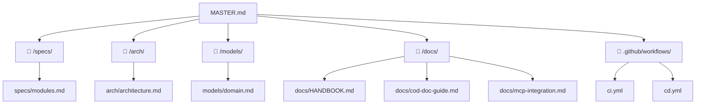

# 🧭 Project Navigator: integration-test

> 📊 Meta: `{"version": "0.4", "last_updated": "2026-04-05", "context_depth": "L0", "repo": "/private/var/folders/kn/nwnn_7597fbb155wsjrb452r0000gn/T/pytest-of-dakh/pytest-17/test_agent_run_full_cycle0/my-repo"}`

## 1. 🎯 Executive Summary
- **Цель:** Модульное приложение с многоуровневой архитектурой (Presentation → Application → Domain → Infrastructure), обеспечивающее изоляцию бизнес-логики и независимую масштабируемость компонентов
- **Текущий статус:** `🟡 DRAFT`
- **Ключевые ограничения:**
  - Domain Layer не имеет внешних зависимостей (чистая бизнес-логика)
  - Все межслойные зависимости инвертированы через интерфейсы (DIP)

## 2. 🗺️ Context Map

```mermaid
graph TD
    Root[MASTER.md] --> S[📁 /specs/]
    Root --> A[📁 /arch/]
    Root --> M[📁 /models/]
    Root --> D[📁 /docs/]
    Root --> CI[📁 .github/workflows/]

    S --> SM[specs/modules.md]
    A --> AA[arch/architecture.md]
    M --> MD[models/domain.md]
    D --> DH[docs/HANDBOOK.md]
    D --> DG[docs/cod-doc-guide.md]
    D --> DM[docs/mcp-integration.md]
    CI --> CIC[ci.yml]
    CI --> CDC[cd.yml]
```

## 3. 🧩 Modular Sections

> Каждый раздел — ссылка на один файл.
> Загружать только при явном запросе: `@Orchestrator: раскрой раздел "..."`.

### CI Pipeline (GitHub Actions)
- **Описание:** Непрерывная интеграция: ruff-линтинг, mypy-проверка типов, pytest (матрица Python 3.11/3.12/3.13), docker build + smoke test. Триггеры: push/PR в main и develop.
- **Ссылка:** `📁 /.github/workflows/ci.yml | 🗃️ doc:github_workflows_ci_yml | 🔑 sha:2b0809be8fcc`
- **Статус:** `🟢 VERIFIED`
- **Ответственный агент:** `@Orchestrator`

### CD Pipeline (GitHub Actions)
- **Описание:** Доставка: сборка Docker-образа и публикация в GHCR при тегировании версии (v*). Семантическое версионирование тегов.
- **Ссылка:** `📁 /.github/workflows/cd.yml | 🗃️ doc:github_workflows_cd_yml | 🔑 sha:bec2cea789cd`
- **Статус:** `🟢 VERIFIED`
- **Ответственный агент:** `@Orchestrator`

### Архитектура приложения
- **Описание:** Многоуровневая модульная архитектура: Presentation / Application / Domain / Infrastructure. Диаграммы, ADR, нефункциональные требования.
- **Ссылка:** `📁 /arch/architecture.md | 🗃️ doc:arch/architecture | 🔑 sha:7481c4b72094`
- **Статус:** `🔴 BROKEN`
- **Ответственный агент:** `@Orchestrator`

### Спецификация модулей
- **Описание:** Контракты и интерфейсы каждого модуля (api, app, domain, infra). Схема зависимостей.
- **Ссылка:** `📁 /specs/modules.md | 🗃️ doc:specs/modules | 🔑 sha:a0839f1e57e2`
- **Статус:** `🔴 BROKEN`
- **Ответственный агент:** `@Orchestrator`

### Доменные модели
- **Описание:** Агрегаты (Project, Task, Document), Value Objects (HybridRef, ProjectStatus, TaskStatus, DocStatus), доменные события, интерфейсы репозиториев (порты).
- **Ссылка:** `📁 /models/domain.md | 🗃️ doc:models_domain_md | 🔑 sha:4a6c60b604d7`
- **Статус:** `🟡 DRAFT`
- **Ответственный агент:** `@Orchestrator`

### Справочное руководство (Handbook)
- **Описание:** Полное руководство по COD-DOC: архитектура, установка, Quick Start, Web UI tour, CLI, конфигурация, MCP, ИИ-агент, ChromaDB, workflow, troubleshooting.
- **Ссылка:** `📁 /docs/HANDBOOK.md | 🗃️ doc:docs_HANDBOOK_md | 🔑 sha:81fac3e1c061`
- **Статус:** `🟡 DRAFT`
- **Ответственный агент:** `@Orchestrator`

### Гайд по документированию
- **Описание:** Пошаговое руководство по созданию документации проекта с нуля через COD-DOC (~30 минут, реальный пример weather-cli).
- **Ссылка:** `📁 /docs/cod-doc-guide.md | 🗃️ doc:docs_cod-doc-guide_md | 🔑 sha:e2ff564ecab5`
- **Статус:** `🟡 DRAFT`
- **Ответственный агент:** `@Orchestrator`

### MCP-интеграция
- **Описание:** Интеграция cod-doc с VS Code Copilot, Claude Desktop, Claude Code и другими LLM-системами через MCP (23 инструмента).
- **Ссылка:** `📁 /docs/mcp-integration.md | 🗃️ doc:docs_mcp-integration_md | 🔑 sha:9087378db933`
- **Статус:** `🟡 DRAFT`
- **Ответственный агент:** `@Orchestrator`

## 4. ⚡ Quick Actions & Handoffs
```json
{
  "next_step": "Создать arch/architecture.md и specs/modules.md (файлы отсутствуют), описать API-контракты (specs/api.md)",
  "required_input": "Конкретные сущности домена, технологический стек, требования к API",
  "blocked_by": []
}
```

## 5. ✅ Validation & Changelog
```json
{
  "self_check": {
    "links_verified": true,
    "hashes_match": true,
    "no_hallucinations": true,
    "context_depth": "L2",
    "missing_info": [
      "arch/architecture.md отсутствует на диске (🔴 BROKEN)",
      "specs/modules.md отсутствует на диске (🔴 BROKEN)",
      "API-спецификация (specs/api.md) не создана",
      "Технологический стек не зафиксирован (задача #3)"
    ]
  },
  "changelog": [
    {
      "date": "2026-04-05",
      "action": "Init project",
      "author": "COD-DOC",
      "scope": "master"
    },
    {
      "date": "2026-04-05",
      "action": "Created arch/architecture.md: модульная архитектура, диаграммы, интерфейсы, ADR",
      "author": "COD-DOC Orchestrator",
      "scope": "arch",
      "task": "1cf87ee5"
    },
    {
      "date": "2026-04-05",
      "action": "Created specs/modules.md: контракты и зависимости модулей api/app/domain/infra",
      "author": "COD-DOC Orchestrator",
      "scope": "specs",
      "task": "1cf87ee5"
    },
    {
      "date": "2026-04-05",
      "action": "Updated MASTER.md: Executive Summary, разделы архитектуры, обновлён Context Map",
      "author": "COD-DOC Orchestrator",
      "scope": "master",
      "task": "1cf87ee5"
    },
    {
      "date": "2026-04-05",
      "action": "Added Modular Sections for /models/ (domain.md) and /docs/ (HANDBOOK, cod-doc-guide, mcp-integration); expanded Context Map; marked arch/architecture.md and specs/modules.md as 🔴 BROKEN (files missing on disk)",
      "author": "COD-DOC Orchestrator",
      "scope": "master",
      "task": "bf638f79"
    },
    {
      "date": "2026-04-05",
      "action": "Created .github/workflows/ci.yml: ruff lint, mypy typecheck, pytest matrix (3.11/3.12/3.13), Docker build + smoke test",
      "author": "COD-DOC Orchestrator",
      "scope": "ci",
      "task": "a0e28b45"
    },
    {
      "date": "2026-04-05",
      "action": "Created .github/workflows/cd.yml: Docker build & push to GHCR on tag v* (semantic versioning)",
      "author": "COD-DOC Orchestrator",
      "scope": "cd",
      "task": "a0e28b45"
    },
    {
      "date": "2026-04-05",
      "action": "Updated MASTER.md: added CI/CD modular sections, expanded Context Map, removed CI/CD from next_step, version 0.3→0.4",
      "author": "COD-DOC Orchestrator",
      "scope": "master",
      "task": "a0e28b45"
    }
  ]
}
```

---

## 📖 Snowball Protocol

| Уровень | Загружено | Когда |
|---------|-----------|-------|
| `L0` | Только `MASTER.md` | Старт сессии (по умолчанию) |
| `L1` | MASTER.md + 1 целевой файл | Явный запрос раздела |
| `L2` | L1 + зависимости | Запрос анализа зависимостей |

**Формат ссылки:** `📁 {path} | 🗃️ doc:{id} | 🔑 sha:{12hex}`
**Статусы:** `🟢 VERIFIED` | `🟡 DRAFT` | `🔴 STALE` | `🔴 BROKEN`
