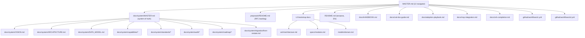

# 🧭 Project Navigator: cod-doc

> 📊 Meta: `{"version": "3.1", "last_updated": "2026-09-26", "context_depth": "L0", "repo": "/Users/dakh/Git/_my/cod-doc"}`

> **Этот файл — тонкий L0-навигатор для агента и нового контрибьютора.**
> Source of truth целевого состояния системы — [`docs/system/MASTER.md`](docs/system/MASTER.md).
> Приоритеты и милстоуны — [`docs/system/roadmap/ROADMAP.md`](docs/system/roadmap/ROADMAP.md).
> Каталог RFC и заимствований — [`proposals/README.md`](proposals/README.md).

## 1. 🎯 Executive Summary

- **Проект:** COD-DOC (Context Orchestrator for Documentation) — автономный
  агент и MCP-сервер управления проектной документацией с БД-бэкендом и
  markdown-проекциями.
- **Архитектура:** многоуровневая модульная (Presentation → Application →
  Domain ← Infrastructure) с DIP-инверсией.
- **Текущий статус:** 🟢 ACTIVE — **M5 «Гейт, которому можно верить + симбиоз в бою» закрыт 2026-09-06**.
  Прогон 2026-09-07: 1639 тестов зелёные, ruff/mypy чистые, ~137 документов
  (`stale_export`=0 после reconcile миграций 0026–0029). Поверхность:
  126 MCP-тулов на дату прогона (профиль `agent` — 6; на 2026-09-26 — 147,
  профили 6/21/143/147), 12 скиллов, 6 ADR, 25 stories.
  CI на main впервые зелёный (`bcb32f2`, [run 33765619088](https://github.com/Orange-hanter/cod-doc/actions/runs/33765619088)).
- **Агент-куратор документации закрыт 2026-09-20; текущий приоритет — adoption через симбиоз.**
  Дефолтный ИИ-агент **не исполняет продуктовые задачи** — поддерживает корпус,
  доступность и поиск ([RFC 25](proposals/25-doc-curator-agent.md), план
  `doc-curator-2026-09`, 18/18 задач `done`). Пилоты симбиоза — **ZAIrgRush** и
  **Orakul/ai-review** ([RFC 22](proposals/22-symbiosis-zairgrush-orakul.md)):
  cod-doc отдаёт спеки/ADR/контекст, пилоты возвращают findings.
- **Подготовка к M6 «Hub + кросс-проектность»:** M1–M5 закрыты, ведётся
  подготовка к M6. **Цели M6:** (1) кросс-проектный поиск через hub-БД
  (`[[doc:slug:key]]`), (2) фикс ChromaDB L3-режима для мульти-проектности,
  (3) кросс-проектный поиск куратора через `ctx_search(projects=...)` (CUR-013,
  не `agent_pick --projects` — pick остаётся task-centric инструментом
  coding-агента на `standard`/`full`, кросс-проектность туда не заводим),
  (4) запуск RFC 23 (Cloud decentralized agent plane) и RFC 24 (единый контур
  structure/contracts/scenarios). **Прогресс:** `ctx_search(projects=...)` +
  CLI `--projects` сделаны (CUR-013, 2026-09-20, секция C `doc-curator-2026-09`
  закрыта — [аудит](docs/system/audit/2026-09-20-doc-curator-section-c.md));
  остаток кросс-проектности (`[[doc:slug:key]]`, Chroma-фильтр B12,
  `GET /api/v1/search` с `projects`) — STO-015/SYM-011, план
  `adoption-2026-08`, low priority, не начат. RFC 23 и RFC 24 спроектированы
  (статус 🟡 DRAFT), не начаты; треки D/E (STO-* Postgres parity,
  ADO-071..095 friction) идут фоном. Полная дорожная карта —
  [ROADMAP](docs/system/roadmap/ROADMAP.md).
- **Открыто:** план `adoption-2026-08` — M1–M5 закрыты.
  **Остаток Фазы 5:** STO-015/SYM-011 (остаток кросс-проектного поиска сверх
  `ctx_search(projects=...)`: `[[doc:slug:key]]`, `GET /api/v1/search`, low).
  **Треки D/E:** STO-* (Postgres parity, 25 задач), ADO-071..095 (friction из живой работы).
  STB-023 (SSE, low) — держится закрытым до event-driven сценария.
  STB-012 закрыт `cancelled` (re-scoped в ADO-013).

## 2. 🗺️ Context Map


```mermaid
graph TD
    Root["MASTER.md (L0 navigator)"] --> Sys["docs/system/MASTER.md (system-of-truth)"]
    Root --> Prop["proposals/README.md (RFC backlog)"]
    Root --> Legacy["L0 bootstrap docs"]

    Sys --> Vision["docs/system/VISION.md"]
    Sys --> ArchSys["docs/system/ARCHITECTURE.md"]
    Sys --> Data["docs/system/DATA_MODEL.md"]
    Sys --> Caps["docs/system/capabilities/*"]
    Sys --> Stand["docs/system/standards/*"]
    Sys --> Audit["docs/system/audit/*"]
    Sys --> Road["docs/system/roadmap/*"]
    Sys --> Migr["docs/system/migration/from-restate.md"]

    Legacy --> Arch["arch/architecture.md"]
    Legacy --> Specs["specs/modules.md"]
    Legacy --> Models["models/domain.md"]

    Root --> Readme["README.md (витрина, EN)"]
    Root --> Hand["docs/HANDBOOK.md"]
    Root --> Guide["docs/cod-doc-guide.md"]
    Root --> Play["docs/adoption-playbook.md"]
    Root --> MCP["docs/mcp-integration.md"]
    Root --> Zsh["docs/zsh-completion.md"]
    Root --> CI[".github/workflows/ci.yml"]
    Root --> CD[".github/workflows/cd.yml"]
```

## 3. 🧩 Modular Sections

> Каждый раздел — ссылка на один файл. Для агента: `@Orchestrator: раскрой раздел "..."`.
>
> Хэши пересчитывает `cod-doc hash update` — сразу в двух местах: в блоке со
> ссылкой и в строке сводной таблицы (ADO-180). Ручного счётчика «N/N VALID»
> здесь больше нет: он не сходился ни с числом строк, ни с числом блоков.
> Согласованность проверяет `tests/test_master_registry_consistency.py`.

### System Documentation Index (canonical) ⭐
- **Описание:** Целевой пакет описания COD-DOC: VISION, ARCHITECTURE, DATA_MODEL,
  capabilities/*, standards/*, audit/*, roadmap/*, migration/. Это source of
  truth для поведения системы и единая точка входа для контрибьютора.
- **Ссылка:** `📁 /docs/system/MASTER.md | 🗃️ doc:docs_system_MASTER_md | 🔑 sha:469c1a6f4d05`
- **Статус:** `🟢 VERIFIED`

### Proposals (RFC backlog)
- **Описание:** 27 RFC в семи треках:
  - **01–15 (paperclip-track):** 🟢 Реализованы — адаптация паттернов paperclipai/paperclip
    (skills, heartbeat, wake-payload, run-id, issue docs, checkout, routines,
    status taxonomy, activity log, adapter pattern, AGENTS.md, approvals,
    import UX, legacy migration, link system). План закрыт.
  - **16–21 (hackathon-track):** 🔴 Отбракованы 2026-08-29 — AI-Pair-Hacker,
    Living Specification, Vibecoder's Diary, Context-Scout, Multi-Agent Standup,
    Degraded-Path Auditability. См. [proposals/README.md](proposals/README.md) § «Отбраковка 2026-08-29».
  - **22 (symbiosis-track):** 🟢 Активен — Symbiosis: ZAIrgRush + Orakul/ai-review
    (hub-БД, findings-ingest, doc-контекст для внешней петли и AI-ревью).
    Декомпозиция — секция E плана `adoption-2026-08`.
  - **23 (cloud-track):** 🟡 Спроектирован — Cloud decentralized agent plane
    (team-узел в облаке, ИИ-воркеры через remote MCP, SoT = Postgres).
    Задачи CAP-001…CAP-033 не начаты, приоритет ниже adoption.
  - **24 (structure-track):** 🟡 Черновик — Единый контур structure/contracts/scenarios
    (docs↔code граница, obligations_export, structure_facts, scenario assessment).
    Поглощает внешнюю часть RFC 17, зависит от RFC 22.
  - **25 (doc-curator-track):** 🟢 **Реализован, план `doc-curator-2026-09`
    закрыт 2026-09-20 (18/18 задач)** — дефолтный агент = куратор
    документации и поиска, не исполнитель ADO-/SYM-задач; профиль `agent`
    отдаёт `agent_capabilities`/`curator_next`/`ctx_search`/`ctx_drift`/
    `context_get`/`agent_report` (CUR-016 заменил `ctx_docs` на doc card
    `curator_next`, §3.5; CUR-017 убрал автогенерацию задач из встроенного
    daemon, §3.4). Индекс поиска поддерживается инкрементально из
    write-path, кросс-проектный `ctx_search(projects=...)` работает в
    hub-режиме (CUR-013). Секции A/B/C/D — все done, см. аудиты секций
    B/C/D. Частично реанимирует поисковый контракт RFC 19.
    Файл: `📁 /proposals/25-doc-curator-agent.md | 🗃️ doc:proposals_25-doc-curator-agent_md | 🔑 sha:97648d0ab324`
  - **26 (graph-editing-track):** 🟡 Черновик — Правка графа плана: секции и
    рёбра как первоклассные операции. Рождён из инцидента: пять правок на
    `Restate` (заголовок и позиция секции плана, три ребра зависимости) внесены
    SQL-ом мимо продукта, потому что штатного интерфейса для них нет ни на одной
    поверхности. Причина системная — `plan_section_create` пишет через
    репозиторий прямо из MCP-тула, минуя `services/`, и сканер паритета такой
    путь не видит по построению. Декомпозиция — секция J плана
    `adoption-2026-08` (ADO-199…ADO-210), доставка тремя PR.
    Файл: `📁 /proposals/26-plan-graph-editing.md | 🗃️ doc:proposals_26-plan-graph-editing_md | 🔑 sha:cfa09957fac6`
  - **27 (agent-fit-track):** 🟡 Черновик — Agent fit: coding-агент закрывает
    вопросы тулами, а не SQL. Рождён из замера 2026-09-23: за 40 сессий 407
    прямых чтений `state.db` против 398 MCP-вызовов, `curator_next` ≈25 КБ
    при 8 пунктах очереди, `agent_capabilities` на `standard` запрещает
    checkout, который требует `task-flow`. Декомпозиция — план
    `agent-fit-2026-09` (AFT-001…AFT-016), шесть секций.
    Файл: `📁 /proposals/27-agent-fit.md | 🗃️ doc:proposals_27-agent-fit_md | 🔑 sha:61ad67c3710f`
- **Ссылка:** `📁 /proposals/README.md | 🗃️ doc:proposals_README_md | 🔑 sha:df79dabd2c5c`
- **Статус:** `🟢 VERIFIED`

### CI Pipeline (GitHub Actions)
- **Описание:** Непрерывная интеграция: ruff-линтинг (blocking), mypy strict
  (blocking), pytest на Python 3.13 (единственная версия матрицы с ADO-097;
  `requires-python >=3.13`), Docker build + smoke test.
- **Ссылка:** `📁 /.github/workflows/ci.yml | 🗃️ doc:github_workflows_ci_yml | 🔑 sha:7c133a394eb3`
- **Статус:** `🟢 VERIFIED`
- **Ответственный агент:** `@Orchestrator`

### CD Pipeline (GitHub Actions)
- **Описание:** Доставка: сборка Docker-образа и публикация в GHCR при
  тегировании v* (семантическое версионирование: v1.2.3).
- **Ссылка:** `📁 /.github/workflows/cd.yml | 🗃️ doc:github_workflows_cd_yml | 🔑 sha:90c54859cba1`
- **Статус:** `🟢 VERIFIED`
- **Ответственный агент:** `@Orchestrator`

### Архитектура (L0 bootstrap, обзорная) — legacy
- **Описание:** Многоуровневая архитектура Presentation/Application/Domain/
  Infrastructure, ADR, нефункциональные требования. Сжатый обзор для агента.
  Канонический source — [`docs/system/ARCHITECTURE.md`](docs/system/ARCHITECTURE.md).
- **Ссылка:** `📁 /arch/architecture.md | 🗃️ doc:arch_architecture_md | 🔑 sha:7d32687d9139`
- **Статус:** `🟡 LEGACY` — обзор, актуальные детали см. в canonical.
- **Ответственный агент:** `@Orchestrator`

### Спецификация модулей (L0 bootstrap) — legacy
- **Описание:** Контракты api/app/domain/infra, схема зависимостей. Карта
  bootstrap-контрактов. Canonical-разбивка функциональности — в
  [`docs/system/capabilities/`](docs/system/capabilities/).
- **Ссылка:** `📁 /specs/modules.md | 🗃️ doc:specs_modules_md | 🔑 sha:5c335c97fd99`
- **Статус:** `🟡 LEGACY`
- **Ответственный агент:** `@Orchestrator`

### Доменные модели (L0 bootstrap) — legacy
- **Описание:** Aggregates (Project, Task, Document), Value Objects, доменные
  события, порты-репозитории. Canonical schema-описание — в
  [`docs/system/DATA_MODEL.md`](docs/system/DATA_MODEL.md).
- **Ссылка:** `📁 /models/domain.md | 🗃️ doc:models_domain_md | 🔑 sha:8ce613932ac9`
- **Статус:** `🟡 LEGACY` — проекция под `.gitignore` (`/models/`), в репозиторий
  не версионируется; источник истины — документ `models/domain` в БД.
- **Ответственный агент:** `@Orchestrator`

### README (витрина проекта, английский) ⭐
- **Описание:** Точка входа для внешнего читателя GitHub/PyPI: что это, зачем
  БД вместо голого markdown, quick start на 5 строк, четыре поверхности,
  таблица ссылок на остальную документацию. Подставляется как
  `long_description` пакета (`pyproject.toml → readme`).
- **Ссылка:** `📁 /README.md | 🗃️ doc:README_md | 🔑 sha:960fbd88d71a`
- **Статус:** `🟢 VERIFIED`

### Handbook (пользовательский справочник)
- **Описание:** Полное руководство: установка, Quick Start, Web UI tour, CLI,
  конфигурация, MCP, ИИ-агент, ChromaDB, troubleshooting.
- **Ссылка:** `📁 /docs/HANDBOOK.md | 🗃️ doc:docs_HANDBOOK_md | 🔑 sha:b471c0708631`
- **Статус:** `🟢 VERIFIED`

### Гайд по документированию (tutorial)
- **Описание:** Пошаговое руководство по созданию документации проекта с нуля
  через COD-DOC (~30 минут, пример weather-cli).
- **Ссылка:** `📁 /docs/cod-doc-guide.md | 🗃️ doc:docs_cod-doc-guide_md | 🔑 sha:d1cb6f8ae835`
- **Статус:** `🟢 VERIFIED`

### Adoption Playbook (как завести на своих проектах) ⭐
- **Описание:** Сценарии заведения COD-DOC на **существующих** репозиториях с
  накопленным markdown: починка конфига, выбор пилота, 4 архетипа проектов,
  ежедневный цикл, известные шероховатости. В отличие от tutorial — про
  живые репозитории, а не про пример с нуля.
- **Ссылка:** `📁 /docs/adoption-playbook.md | 🗃️ doc:docs_adoption-playbook_md | 🔑 sha:01e5d3bb945c`
- **Статус:** `🟢 VERIFIED`

### MCP-интеграция (catalog)
- **Описание:** Подключение cod-doc к VS Code Copilot, Claude Desktop, Claude
  Code, другим LLM-системам через MCP. Каталог инструментов.
- **Ссылка:** `📁 /docs/mcp-integration.md | 🗃️ doc:docs_mcp-integration_md | 🔑 sha:0538afee2faa`
- **Статус:** `🟢 VERIFIED`

### Zsh-дополнение
- **Описание:** Установка и устройство zsh-completion: артефакт генерируется из
  click-дерева, значения (слаги, task_id, doc_key, plan.scope, якоря) читаются
  напрямую из реестра и read-only SQLite. Почему дополнение не зовёт `cod-doc`,
  как понимается «какой проект», и грабли zsh, на которых уже наступили.
- **Ссылка:** `📁 /docs/zsh-completion.md | 🗃️ doc:docs_zsh-completion_md | 🔑 sha:f177c8373beb`
- **Статус:** `🟢 VERIFIED`

### ROADMAP (милстоуны и приоритеты) ⭐
- **Описание:** Милстоуны M1–M6, статусы фаз, декомпозиция планов. M1–M5 закрыты,
  M6 (hub + кросс-проектность) в подготовке.
- **Ссылка:** `📁 /docs/system/roadmap/ROADMAP.md | 🗃️ doc:docs_system_roadmap_ROADMAP_md | 🔑 sha:a1b0f5ac5b01`
- **Статус:** `🟢 VERIFIED`

### RFC 22: Symbiosis (ZAIrgRush + Orakul)
- **Описание:** Proposal программы симбиоза: cod-doc отдаёт спеки/ADR/контекст,
  пилоты возвращают findings и измерения. Решение 2026-08-25 о переназначении
  пилотов.
- **Ссылка:** `📁 /proposals/22-symbiosis-zairgrush-orakul.md | 🗃️ doc:proposals_22-symbiosis-zairgrush-orakul_md | 🔑 sha:66518d72d119`
- **Статус:** `🟢 VERIFIED`

## 4. ⚡ Quick Actions & Handoffs

```json
{
  "quick_actions": {
    "lint": [
      {"cmd": "ruff check cod_doc/ tests/", "desc": "Проверка стиля и ошибок (pycodestyle, pyflakes, isort, bugbear)"},
      {"cmd": "ruff format --check cod_doc/ tests/", "desc": "Проверка форматирования (без записи)"},
      {"cmd": "mypy cod_doc/", "desc": "Статическая типизация (strict mode)"}
    ],
    "test": [
      {"cmd": "pip install -e .[dev]", "desc": "Установка dev-зависимостей (pytest, ruff, mypy, hypothesis)"},
      {"cmd": "pytest tests/ -v --tb=short", "desc": "Запуск всех тестов"},
      {"cmd": "pytest tests/ -v --tb=short --timeout=120", "desc": "Тесты с таймаутом 120s (как в CI)"}
    ],
    "docker": [
      {"cmd": "docker build -t cod-doc .", "desc": "Локальная сборка образа (python:3.13-slim)"},
      {"cmd": "docker compose up -d", "desc": "Запуск сервиса (порт 8765, healthcheck через 15s)"},
      {"cmd": "docker compose down", "desc": "Остановка и удаление контейнера"}
    ],
    "docs": [
      {"cmd": "open docs/system/MASTER.md", "desc": "Открыть system-of-truth"},
      {"cmd": "open proposals/README.md", "desc": "RFC backlog (paperclip adoption)"},
      {"cmd": "cod-doc doc drift --project cod-doc --all", "desc": "Проверить DB↔markdown drift без перезаписи файлов"}
    ],
    "health": [
      {"cmd": "curl http://localhost:8765/api/projects/cod-doc/health", "desc": "JSON-сводка DB health: doc drift, unresolved links, doc_drift routine"}
    ]
  },
  "handoffs": {
    "ci": {
      "workflow": "📁 /.github/workflows/ci.yml | 🗃️ doc:github_workflows_ci_yml | 🔑 sha:7c133a394eb3",
      "trigger": "push / pull_request в main и develop",
      "pipeline": "ruff → mypy → pytest (Python 3.13, ADO-097) → docker build + smoke test"
    },
    "cd": {
      "workflow": "📁 /.github/workflows/cd.yml | 🗃️ doc:github_workflows_cd_yml | 🔑 sha:90c54859cba1",
      "trigger": "push тега v* (семантическое версионирование: v1.2.3)",
      "pipeline": "docker build → push в GHCR (теги: version, major.minor, major, sha)"
    }
  },
  "handoff_rules": {
    "on_missing_file": "Искать файл на диске → если отсутствует, поднять задачу через task_create",
    "on_hash_mismatch": "Пересчитать хэш через hash_file → обновить ссылку в MASTER.md → статус 🔴 STALE до синхронизации",
    "on_broken_section": "Пометить 🔴 BROKEN, запросить восстановление через task_create",
    "on_stale_meta": "Обновить meta-блок (version, last_updated) при смене спринта или значимом изменении"
  }
}
```

## 5. ✅ Validation & Changelog

### 5.1 📋 Validation Table

| # | Документ | 🗃️ doc-id | 🔑 Хэш (sha:12) | 📅 Проверен | Статус |
|---|----------|-----------|-----------------|-------------|--------|
| 1 | MASTER.md (этот файл) | `doc:MASTER_md` | regen-on-write | 2026-09-11 | 🟢 VERIFIED |
| 2 | docs/system/MASTER.md | `doc:docs_system_MASTER_md` | `469c1a6f4d05` | 2026-09-20 | 🟢 VERIFIED |
| 3 | proposals/README.md | `doc:proposals_README_md` | `df79dabd2c5c` | 2026-09-20 | 🟢 VERIFIED |
| 4 | CI Pipeline | `doc:github_workflows_ci_yml` | `7c133a394eb3` | 2026-09-11 | 🟢 VERIFIED |
| 5 | CD Pipeline | `doc:github_workflows_cd_yml` | `90c54859cba1` | 2026-09-11 | 🟢 VERIFIED |
| 6 | Архитектура (legacy) | `doc:arch_architecture_md` | `7d32687d9139` | 2026-09-11 | 🟡 LEGACY |
| 7 | Спецификация модулей (legacy) | `doc:specs_modules_md` | `5c335c97fd99` | 2026-09-11 | 🟡 LEGACY |
| 8 | Доменные модели (legacy) | `doc:models_domain_md` | `8ce613932ac9` | 2026-09-17 | 🟡 LEGACY |
| 9 | README (витрина) | `doc:README_md` | `960fbd88d71a` | 2026-09-11 | 🟢 VERIFIED |
| 10 | Handbook | `doc:docs_HANDBOOK_md` | `b471c0708631` | 2026-09-20 | 🟢 VERIFIED |
| 11 | Гайд по документированию | `doc:docs_cod-doc-guide_md` | `d1cb6f8ae835` | 2026-09-11 | 🟢 VERIFIED |
| 12 | Adoption Playbook | `doc:docs_adoption-playbook_md` | `01e5d3bb945c` | 2026-09-11 | 🟢 VERIFIED |
| 13 | MCP-интеграция | `doc:docs_mcp-integration_md` | `0538afee2faa` | 2026-09-20 | 🟢 VERIFIED |
| 14 | ROADMAP | `doc:docs_system_roadmap_ROADMAP_md` | `a1b0f5ac5b01` | 2026-09-20 | 🟢 VERIFIED |
| 15 | RFC 22 Symbiosis | `doc:proposals_22-symbiosis-zairgrush-orakul_md` | `66518d72d119` | 2026-09-20 | 🟢 VERIFIED |
| 16 | RFC 23 Cloud Agent Plane | `doc:proposals_23-cloud-decentralized-agent-plane_md` | `7a7e5586902d` | 2026-09-11 | 🟡 DRAFT |
| 17 | RFC 24 Structure/Contracts/Scenarios | `doc:proposals_24-structure-contracts-scenarios_md` | `fd5676874195` | 2026-09-15 | 🟡 DRAFT |
| 18 | RFC 25 Doc-curator agent | `doc:proposals_25-doc-curator-agent_md` | `97648d0ab324` | 2026-09-20 | 🟢 VERIFIED |
| 19 | Zsh-дополнение | `doc:docs_zsh-completion_md` | `f177c8373beb` | 2026-09-17 | 🟢 VERIFIED |
| 20 | RFC 26 Правка графа плана | `doc:proposals_26-plan-graph-editing_md` | `cfa09957fac6` | 2026-09-22 | 🟡 DRAFT |
| 21 | RFC 27 Agent fit | `doc:proposals_27-agent-fit_md` | `61ad67c3710f` | 2026-09-23 | 🟡 DRAFT |

> **Всего:** 21 документов | 🟢 VERIFIED: 14 | 🟡 LEGACY: 3 | 🟡 DRAFT: 4 | 🔴 STALE: 0 | 🔴 BROKEN: 0
>
> **Проверка 2026-09-17 (ADO-174):** строка `models/domain.md` возвращена.
> В ADO-172 она была удалена по ошибке — как «файла нет на диске, документа
> нет в БД». Неверно и то и другое: файл лежит в основном чекауте, но под
> `.gitignore` (`/models/`), поэтому не виден ни в истории git, ни в
> воркtree, где ignored-файлы не выкладываются; документ в БД есть под
> ключом `models/domain`, а не `models_domain_md` — последнее лишь
> отображаемый doc-id в этом реестре. Проверять существование проекции
> нужно в основном чекауте и по ключу из БД.
>
> Legacy-документы (arch/specs/models) помечены 🟡 — канонические источники
> в `docs/system/`. RFC 23 и RFC 24 — DRAFT (спроектированы, не начаты).
>
> **Проверка 2026-09-16 (CUR-001):** добавлена строка 17 — RFC 25
> Doc-curator agent. Помечен 🟢 VERIFIED, а не DRAFT: в отличие от RFC 23/24
> он принят к декомпозиции и его секция A реализована этим же заходом
> (план `doc-curator-2026-09`, задачи CUR-001…003).
>
> **Canonical-пакет** (`docs/system/`) — отдельный реестр документов, см.
> [`docs/system/MASTER.md §5`](docs/system/MASTER.md).

### 5.2 🤖 Agent Self-Check
```json
{
  "self_check": {
    "links_verified": true,
    "hashes_match": true,
    "no_hallucinations": true,
    "context_depth": "L0",
    "validation_date": "2026-09-11",
    "total_links": 16,
    "valid_links": 16,
    "stale_links": 0,
    "broken_links": 0
  }
}
```

### 5.3 📝 Changelog
```json
{
  "changelog": [
    {
      "date": "2026-09-26",
      "version": "3.1",
      "action": "ADO-217: разбор находок демона doc-review. Meta догнала реестр: 2026-09-23 в Validation Table добавлена строка 21 — RFC 27 agent fit (план agent-fit-2026-09), changelog её не отражал. Счётчик MCP-тулов в «Текущем статусе» помечен датой прогона (сейчас 147, профили 6/21/143/147); CI-матрица §3/§4 — только Python 3.13 (ADO-097), образ Docker — python:3.13-slim.",
      "author": "agent:claude-opus-5-5",
      "scope": "master",
      "task": "ADO-217"
    },
    {
      "date": "2026-09-20",
      "version": "3.0",
      "action": "CUR-018: план `doc-curator-2026-09` закрыт целиком (18/18). RFC 25 секция D (curator_next CUR-016 PR #74, daemon idle CUR-017 PR #49) документирована: docs/HANDBOOK.md §9 legacy-баннер, скилл orchestrator переписан на curator_next, ROADMAP/proposals/README/proposals-25 переведены в «закрыт». Аудит-отчёт audit/2026-09-20-doc-curator-section-d.md зарегистрирован в docs/system/MASTER.md §5/§6. Хэши пересчитаны для 5 изменённых документов реестра (docs/system/MASTER.md, proposals/README.md, ROADMAP.md, proposals/25, HANDBOOK.md).",
      "author": "agent:claude-sonnet-5",
      "scope": "master",
      "task": "CUR-018"
    },
    {
      "date": "2026-09-09",
      "version": "2.9",
      "action": "ADO-168: добавлен adr_service.sync_body — путь синхронизации записи реестра ADR с markdown-проекцией мимо статусного гейта. Гейт неизменяемости решений сохранён: status не является параметром, след различим (ревизия op=sync_body, событие adr.body_synced). Поверхности: CLI adr sync, MCP adr_sync_body. Счётчики профилей 106→107 и 110→111, adr.* 9→10 тулов; хэш docs/mcp-integration.md пересчитан.",
      "author": "agent:claude-opus-5",
      "scope": "master",
      "task": "ADO-168"
    },
    {
      "date": "2026-09-11",
      "version": "2.8",
      "action": "Добавлен блок «Подготовка к M6» в Executive Summary: цели M6 (кросс-проектный поиск, hub + кросс-проектность, RFC 23/24), текущий прогресс (SYM-011 открыт, RFC 23/24 в DRAFT), ссылка на ROADMAP.md. Задача [469ada54] выполнена.",
      "author": "COD-DOC Orchestrator",
      "scope": "master",
      "task": "469ada54"
    },
    {
      "date": "2026-09-11",
      "version": "2.7",
      "action": "Актуализирован статус RFC/Proposals: секция Proposals расширена явным перечислением RFC 01-24 с статусами (01-15 🟢 реализованы, 16-21 🔴 отбракованы 2026-08-29, 22 🟢 активен, 23-24 🟡 DRAFT). Добавлены RFC 23 и RFC 24 в Validation Table. Задача [66920971] выполнена.",
      "author": "COD-DOC Orchestrator",
      "scope": "master",
      "task": "66920971"
    },
    {
      "date": "2026-09-11",
      "version": "2.6",
      "action": "Сверка hybrid-refs: проверены все 14 ссылок в MASTER.md. Статусы: 12 🟢 VERIFIED, 3 🟡 LEGACY (arch/specs/models — canonical в docs/system/), 0 🔴 STALE, 0 🔴 BROKEN. Хэши пересчитаны, Validation Table обновлена. Задача [8239e2e8] выполнена.",
      "author": "COD-DOC Orchestrator",
      "scope": "master",
      "task": "8239e2e8"
    },
    {
      "date": "2026-09-07",
      "version": "2.5",
      "action": "M5 закрыт: CI впервые зелёный (1639 тестов), ADO-066/067/068/069/070 done, SYM-010 drift-гейт в Orakul, ADO-044 провенанс мутаций. Открыт остаток Фазы 5 (SYM-011), треки D/E (STO-*, ADO-071..095). STB-023 (SSE) держится low.",
      "author": "Sprint M5",
      "scope": "master"
    },
    {
      "date": "2026-09-02",
      "version": "2.4",
      "action": "M4 закрыт: Orakul 405/405 in_sync, E5-C вердикт «масштабируем» ($0.98), write-path wrapper (ADO-040), SYM-009 ingest ai_review. Найдено: CI не зелёный с 2026-05-06.",
      "author": "Sprint M4",
      "scope": "master"
    },
    {
      "date": "2026-08-30",
      "version": "2.3",
      "action": "M3 закрыт: friction-лог обнулён (ADO-058..061), стретчи ADO-039/SYM-008 done.",
      "author": "Sprint M3",
      "scope": "master"
    },
    {
      "date": "2026-08-29",
      "version": "2.2",
      "action": "M2 закрыт досрочно: friction-лог ≥10 наблюдений, top-3 закрыты, route drift в CI, SYM-007 (13 ADR ZAIrgRush) done. Трек B отбракован целиком.",
      "author": "Sprint M2",
      "scope": "master"
    },
    {
      "date": "2026-08-28",
      "version": "2.1",
      "action": "M1 закрыт: пилоты ZAIrgRush (31 док) и Orakul (405 док) заведены, ADO-010 (export guard + round-trip) done, SYM-003 (bind-hygiene) done.",
      "author": "Sprint M1",
      "scope": "master"
    },
    {
      "date": "2026-08-25",
      "version": "2.0",
      "action": "Symbiosis: пилоты переназначены на ZAIrgRush/Orakul (RFC 22), STB-012 → cancelled, ADO-015 расширен под типы пилотов.",
      "author": "Symbiosis Reorg 2026-08-25",
      "scope": "master",
      "rfc": "proposals/22-symbiosis-zairgrush-orakul.md"
    }
  ]
}
```
