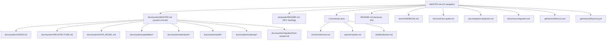

# 🧭 Project Navigator: cod-doc

> 📊 Meta: `{"version": "2.5", "last_updated": "2026-09-07", "context_depth": "L0", "repo": "/Users/dakh/Git/_my/cod-doc"}`

> **Этот файл — тонкий L0-навигатор для агента и нового контрибьютора.**
> Source of truth целевого состояния системы — [`docs/system/MASTER.md`](docs/system/MASTER.md).
> Приоритеты и милстоуны — [`docs/system/roadmap/ROADMAP.md`](docs/system/roadmap/ROADMAP.md).
> Каталог RFC и заимствований — [`proposals/README.md`](proposals/README.md).

## 1. 🎯 Executive Summary

- **Проект:** COD-DOC (Context Orchestrator for Documentation) — автономный
  агент и MCP-сервер управления проектной документацией с БД-бэкендом и
  markdown-проекциями.
- **Архитектура:** многоуровневая модульная (Presentation → Application →
  Domain ← Infrastructure) с DIP-инверсией.
- **Текущий статус:** 🟢 ACTIVE — **M5 «Гейт, которому можно верить + симбиоз в бою» закрыт 2026-09-06**.
  Прогон 2026-09-07: 1639 тестов зелёные, ruff/mypy чистые, ~137 документов
  (`stale_export`=0 после reconcile миграций 0026–0029). Поверхность:
  ~110 MCP-тулов (профиль `agent` — 6), 12 скиллов, 6 ADR, 25 stories.
  CI на main впервые зелёный (`bcb32f2`, [run 33765619088](https://github.com/Orange-hanter/cod-doc/actions/runs/33765619088)).
- **Текущий приоритет: adoption через симбиоз.** Пилоты переназначены на
  **ZAIrgRush** (мульти-агентная петля) и **Orakul/ai-review** (LLM-ревью PR) —
  [RFC 22](proposals/22-symbiosis-zairgrush-orakul.md), решение 2026-08-25.
  cod-doc отдаёт спеки/ADR/контекст, пилоты возвращают findings и измерения.
  Милстоуны — [ROADMAP](docs/system/roadmap/ROADMAP.md): M1–M5 закрыты,
  ведётся подготовка к M6 (hub + кросс-проектность).
- **Открыто:** план `adoption-2026-08` — M1–M5 закрыты.
  **Остаток Фазы 5:** SYM-011 (кросс-проектный поиск, `[[doc:slug:key]]`, low).
  **Треки D/E:** STO-* (Postgres parity, 25 задач), ADO-071..095 (friction из живой работы).
  STB-023 (SSE, low) — держится закрытым до event-driven сценария.
  STB-012 закрыт `cancelled` (re-scoped в ADO-013).

## 2. 🗺️ Context Map


```mermaid
graph TD
    Root["MASTER.md (L0 navigator)"] --> Sys["docs/system/MASTER.md (system-of-truth)"]
    Root --> Prop["proposals/README.md (RFC backlog)"]
    Root --> Legacy["L0 bootstrap docs"]

    Sys --> Vision["docs/system/VISION.md"]
    Sys --> ArchSys["docs/system/ARCHITECTURE.md"]
    Sys --> Data["docs/system/DATA_MODEL.md"]
    Sys --> Caps["docs/system/capabilities/*"]
    Sys --> Stand["docs/system/standards/*"]
    Sys --> Audit["docs/system/audit/*"]
    Sys --> Road["docs/system/roadmap/*"]
    Sys --> Migr["docs/system/migration/from-restate.md"]

    Legacy --> Arch["arch/architecture.md"]
    Legacy --> Specs["specs/modules.md"]
    Legacy --> Models["models/domain.md"]

    Root --> Readme["README.md (витрина, EN)"]
    Root --> Hand["docs/HANDBOOK.md"]
    Root --> Guide["docs/cod-doc-guide.md"]
    Root --> Play["docs/adoption-playbook.md"]
    Root --> MCP["docs/mcp-integration.md"]
    Root --> CI[".github/workflows/ci.yml"]
    Root --> CD[".github/workflows/cd.yml"]
```

## 3. 🧩 Modular Sections

> Каждый раздел — ссылка на один файл. Для агента: `@Orchestrator: раскрой раздел "..."`.
> Хеши проверены `check_stale_refs(cod-doc)` 2026-05-07 → 10/10 VALID.

### System Documentation Index (canonical) ⭐
- **Описание:** Целевой пакет описания COD-DOC: VISION, ARCHITECTURE, DATA_MODEL,
  capabilities/*, standards/*, audit/*, roadmap/*, migration/. Это source of
  truth для поведения системы и единая точка входа для контрибьютора.
- **Ссылка:** [`📁 docs/system/MASTER.md`](docs/system/MASTER.md)
- **Статус:** `🟢 ACTIVE`

### Proposals (RFC backlog)
- **Описание:** 23 RFC: 01–15 — адаптация паттернов paperclipai/paperclip
  (реализованы, план закрыт), 16–21 — hackathon-track (только proposals,
  отбракованы 2026-08-29), 22 — **Symbiosis** (ZAIrgRush + Orakul/ai-review, активная программа;
  декомпозиция — секция E плана `adoption-2026-08`), 23 — cloud agent plane
  (спроектирован, не начат), 24 — structure/contracts/scenarios (в работе).
- **Ссылка:** [`📁 proposals/README.md`](proposals/README.md)
- **Статус:** `🟢 ACTIVE`

### CI Pipeline (GitHub Actions)
- **Описание:** Непрерывная интеграция: ruff-линтинг (blocking), mypy strict
  (blocking), pytest matrix Python 3.11/3.12/3.13, Docker build + smoke test.
- **Ссылка:** `📁 /.github/workflows/ci.yml | 🗃️ doc:github_workflows_ci_yml | 🔑 sha:d9c7a1a33f0e`
- **Статус:** `🟢 VERIFIED`
- **Ответственный агент:** `@Orchestrator`

### CD Pipeline (GitHub Actions)
- **Описание:** Доставка: сборка Docker-образа и публикация в GHCR при
  тегировании v* (semver).
- **Ссылка:** `📁 /.github/workflows/cd.yml | 🗃️ doc:github_workflows_cd_yml | 🔑 sha:bec2cea789cd`
- **Статус:** `🟢 VERIFIED`
- **Ответственный агент:** `@Orchestrator`

### Архитектура (L0 bootstrap, обзорная) — legacy
- **Описание:** Многоуровневая архитектура Presentation/Application/Domain/
  Infrastructure, ADR, нефункциональные требования. Сжатый обзор для агента.
  Канонический source — [`docs/system/ARCHITECTURE.md`](docs/system/ARCHITECTURE.md).
- **Ссылка:** `📁 /arch/architecture.md | 🗃️ doc:arch_architecture_md | 🔑 sha:7d32687d9139`
- **Статус:** `🟡 LEGACY` — обзор, актуальные детали см. в canonical.
- **Ответственный агент:** `@Orchestrator`

### Спецификация модулей (L0 bootstrap) — legacy
- **Описание:** Контракты api/app/domain/infra, схема зависимостей. Карта
  bootstrap-контрактов. Canonical-разбивка функциональности — в
  [`docs/system/capabilities/`](docs/system/capabilities/).
- **Ссылка:** `📁 /specs/modules.md | 🗃️ doc:specs_modules_md | 🔑 sha:5c335c97fd99`
- **Статус:** `🟡 LEGACY`
- **Ответственный агент:** `@Orchestrator`

### Доменные модели (L0 bootstrap) — legacy
- **Описание:** Aggregates (Project, Task, Document), Value Objects, доменные
  события, порты-репозитории. Canonical schema-описание — в
  [`docs/system/DATA_MODEL.md`](docs/system/DATA_MODEL.md).
- **Ссылка:** `📁 /models/domain.md | 🗃️ doc:models_domain_md | 🔑 sha:0a25ddfd9b0c`
- **Статус:** `🟡 LEGACY`
- **Ответственный агент:** `@Orchestrator`

### README (витрина проекта, английский) ⭐
- **Описание:** Точка входа для внешнего читателя GitHub/PyPI: что это, зачем
  БД вместо голого markdown, quick start на 5 строк, четыре поверхности,
  таблица ссылок на остальную документацию. Подставляется как
  `long_description` пакета (`pyproject.toml → readme`).
- **Ссылка:** `📁 /README.md | 🗃️ doc:README_md | 🔑 sha:cdb02d871cd1`
- **Статус:** `🟢 VERIFIED`

### Handbook (пользовательский справочник)
- **Описание:** Полное руководство: установка, Quick Start, Web UI tour, CLI,
  конфигурация, MCP, ИИ-агент, ChromaDB, troubleshooting.
- **Ссылка:** `📁 /docs/HANDBOOK.md | 🗃️ doc:docs_HANDBOOK_md | 🔑 sha:389ea7641970`
- **Статус:** `🟢 VERIFIED`

### Гайд по документированию (tutorial)
- **Описание:** Пошаговое руководство по созданию документации проекта с нуля
  через COD-DOC (~30 минут, пример weather-cli).
- **Ссылка:** `📁 /docs/cod-doc-guide.md | 🗃️ doc:docs_cod-doc-guide_md | 🔑 sha:562c1f392f47`
- **Статус:** `🟢 VERIFIED`

### Adoption Playbook (как завести на своих проектах) ⭐
- **Описание:** Сценарии заведения COD-DOC на **существующих** репозиториях с
  накопленным markdown: починка конфига, выбор пилота, 4 архетипа проектов,
  ежедневный цикл, известные шероховатости. В отличие от tutorial — про
  живые репозитории, а не про пример с нуля.
- **Ссылка:** `📁 /docs/adoption-playbook.md | 🗃️ doc:docs_adoption-playbook_md | 🔑 sha:9ba4d87dc9c2`
- **Статус:** `🟢 VERIFIED`

### MCP-интеграция (catalog)
- **Описание:** Подключение cod-doc к VS Code Copilot, Claude Desktop, Claude
  Code, другим LLM-системам через MCP. Каталог инструментов.
- **Ссылка:** `📁 /docs/mcp-integration.md | 🗃️ doc:docs_mcp-integration_md | 🔑 sha:d015b53c85cf`
- **Статус:** `🟢 VERIFIED`

## 4. ⚡ Quick Actions & Handoffs
```json
{
  "quick_actions": {
    "lint": [
      {"cmd": "ruff check cod_doc/ tests/", "desc": "Проверка стиля и ошибок (pycodestyle, pyflakes, isort, bugbear)"},
      {"cmd": "ruff format --check cod_doc/ tests/", "desc": "Проверка форматирования (без записи)"},
      {"cmd": "mypy cod_doc/", "desc": "Статическая типизация (strict mode)"}
    ],
    "test": [
      {"cmd": "pip install -e .[dev]", "desc": "Установка dev-зависимостей (pytest, ruff, mypy, hypothesis)"},
      {"cmd": "pytest tests/ -v --tb=short", "desc": "Запуск всех тестов"},
      {"cmd": "pytest tests/ -v --tb=short --timeout=120", "desc": "Тесты с таймаутом 120s (как в CI)"}
    ],
    "docker": [
      {"cmd": "docker build -t cod-doc .", "desc": "Локальная сборка образа (python:3.12-slim)"},
      {"cmd": "docker compose up -d", "desc": "Запуск сервиса (порт 8765, healthcheck через 15s)"},
      {"cmd": "docker compose down", "desc": "Остановка и удаление контейнера"}
    ],
    "docs": [
      {"cmd": "open docs/system/MASTER.md", "desc": "Открыть system-of-truth"},
      {"cmd": "open proposals/README.md", "desc": "RFC backlog (paperclip adoption)"},
      {"cmd": "cod-doc doc drift --project cod-doc --all", "desc": "Проверить DB↔markdown drift без перезаписи файлов"}
    ],
    "health": [
      {"cmd": "curl http://localhost:8765/api/projects/cod-doc/health", "desc": "JSON-сводка DB health: doc drift, unresolved links, doc_drift routine"}
    ]
  },
  "handoffs": {
    "ci": {
      "workflow": "📁 /.github/workflows/ci.yml | 🗃️ doc:github_workflows_ci_yml | 🔑 sha:d9c7a1a33f0e",
      "trigger": "push / pull_request в main и develop",
      "pipeline": "ruff → mypy → pytest (матрица 3.11/3.12/3.13) → docker build + smoke test"
    },
    "cd": {
      "workflow": "📁 /.github/workflows/cd.yml | 🗃️ doc:github_workflows_cd_yml | 🔑 sha:bec2cea789cd",
      "trigger": "push тега v* (семантическое версионирование: v1.2.3)",
      "pipeline": "docker build → push в GHCR (теги: version, major.minor, major, sha)"
    }
  },
  "handoff_rules": {
    "on_missing_file": "Искать файл на диске → если отсутствует, поднять задачу через task_create",
    "on_hash_mismatch": "Пересчитать хэш через hash_file → обновить ссылку в MASTER.md → статус 🔴 STALE до синхронизации",
    "on_broken_section": "Пометить 🔴 BROKEN, запросить восстановление через task_create",
    "on_stale_meta": "Обновить meta-блок (version, last_updated) при смене спринта или значимом изменении"
  }
}

## 5. 📜 Changelog

- **2026-09-07** — M5 закрыт: CI впервые зелёный (1639 тестов), ADO-066/067/068/069/070 done,
  SYM-010 drift-гейт в Orakul, ADO-044 провенанс мутаций. Открыт остаток Фазы 5 (SYM-011),
  треки D/E (STO-*, ADO-071..095). STB-023 (SSE) держится low.
- **2026-09-02** — M4 закрыт: Orakul 405/405 in_sync, E5-C вердикт «масштабируем» ($0.98),
  write-path wrapper (ADO-040), SYM-009 ingest ai_review. Найдено: CI не зелёный с 2026-05-06.
- **2026-08-30** — M3 закрыт: friction-лог обнулён (ADO-058..061), стретчи ADO-039/SYM-008 done.
- **2026-08-29** — M2 закрыт досрочно: friction-лог ≥10 наблюдений, top-3 закрыты,
  route drift в CI, SYM-007 (13 ADR ZAIrgRush) done. Трек B отбракован целиком.
- **2026-08-28** — M1 закрыт: пилоты ZAIrgRush (31 док) и Orakul (405 док) заведены,
  ADO-010 (export guard + round-trip) done, SYM-003 (bind-hygiene) done.
- **2026-08-25** — Symbiosis: пилоты переназначены на ZAIrgRush/Orakul (RFC 22),
  STB-012 → cancelled, ADO-015 расширен под типы пилотов.
