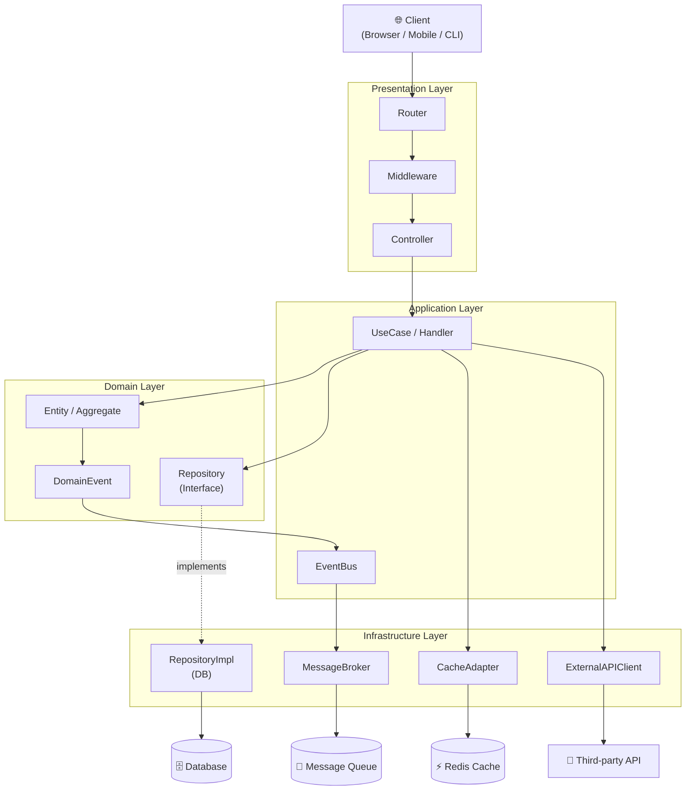

# 🏗️ Архитектура приложения: integration-test

> 📊 Meta: `{"version": "0.1", "status": "DRAFT", "created": "2026-04-05", "author": "COD-DOC Orchestrator"}`

---

## 1. Обзор архитектуры

Приложение построено по **модульной многоуровневой архитектуре** (Layered + Modular Architecture).  
Каждый уровень изолирован и взаимодействует с соседними через строго определённые интерфейсы.

```
┌─────────────────────────────────────────────────────┐
│                   Presentation Layer                 │
│           (UI / API Gateway / CLI)                  │
├─────────────────────────────────────────────────────┤
│                  Application Layer                   │
│           (Use Cases / Orchestration)               │
├─────────────────────────────────────────────────────┤
│                   Domain Layer                       │
│         (Business Logic / Domain Models)            │
├─────────────────────────────────────────────────────┤
│               Infrastructure Layer                   │
│      (DB / External APIs / Message Broker)          │
└─────────────────────────────────────────────────────┘
```

---

## 2. Модули системы

### 2.1 Presentation Layer — `module/api`

| Атрибут | Значение |
|---|---|
| **Назначение** | Входная точка: REST API, GraphQL или CLI-интерфейс |
| **Технология** | HTTP Server (e.g., FastAPI / Express / Spring MVC) |
| **Ответственность** | Маршрутизация запросов, валидация входных данных, сериализация ответов |
| **Зависит от** | Application Layer |

**Компоненты:**
- `Router` — маршрутизация HTTP-запросов по контроллерам
- `Controller` — обработчики эндпоинтов, делегируют в Use Cases
- `Middleware` — аутентификация, логирование, rate limiting
- `Serializer` — преобразование доменных объектов в DTO/JSON

---

### 2.2 Application Layer — `module/app`

| Атрибут | Значение |
|---|---|
| **Назначение** | Оркестрация бизнес-сценариев (Use Cases) |
| **Ответственность** | Координация доменных объектов, транзакции, авторизация сценариев |
| **Зависит от** | Domain Layer, Infrastructure Layer (через интерфейсы) |

**Компоненты:**
- `UseCase<Input, Output>` — базовый интерфейс сценария
- `CommandHandler` — обработчики команд (CQRS-паттерн)
- `QueryHandler` — обработчики запросов (только чтение)
- `ApplicationService` — сложные сценарии с несколькими доменными объектами
- `EventBus` — внутренняя шина событий для inter-use-case коммуникации

---

### 2.3 Domain Layer — `module/domain`

| Атрибут | Значение |
|---|---|
| **Назначение** | Ядро бизнес-логики, не зависит ни от одного другого слоя |
| **Ответственность** | Сущности, правила, инварианты, доменные события |
| **Зависит от** | Ни от чего (чистая бизнес-логика) |

**Компоненты:**
- `Entity` — объект с идентичностью и жизненным циклом
- `ValueObject` — иммутабельный объект без идентичности
- `Aggregate` — корень агрегата, точка входа для изменений
- `DomainEvent` — событие, произошедшее в домене
- `Repository<T>` — интерфейс (контракт) доступа к данным
- `DomainService` — логика, не принадлежащая одной сущности

---

### 2.4 Infrastructure Layer — `module/infra`

| Атрибут | Значение |
|---|---|
| **Назначение** | Реализации технических деталей: БД, очереди, внешние сервисы |
| **Ответственность** | Реализует интерфейсы Domain Layer, работа с IO |
| **Зависит от** | Domain Layer (реализует его интерфейсы) |

**Компоненты:**
- `RepositoryImpl` — реализация репозиториев (SQL, NoSQL, in-memory)
- `MessageBroker` — интеграция с очередями (Kafka / RabbitMQ / Redis Streams)
- `ExternalAPIClient` — HTTP-клиенты к внешним сервисам
- `CacheAdapter` — адаптер кэша (Redis, Memcached)
- `MigrationRunner` — управление схемой БД

---

## 3. Диаграмма взаимодействий



---

## 4. Межмодульные интерфейсы

### 4.1 Presentation → Application

```typescript
// Контракт UseCase
interface UseCase<TInput, TOutput> {
  execute(input: TInput): Promise<TOutput>;
}

// Пример DTO запроса
interface CreateEntityRequest {
  name: string;
  payload: Record<string, unknown>;
}

// Пример DTO ответа
interface CreateEntityResponse {
  id: string;
  createdAt: string;
}
```

### 4.2 Application → Domain (Repository Interface)

```typescript
interface Repository<T extends Entity> {
  findById(id: EntityId): Promise<T | null>;
  findAll(filter?: FilterOptions): Promise<T[]>;
  save(entity: T): Promise<void>;
  delete(id: EntityId): Promise<void>;
}
```

### 4.3 Domain → Infrastructure (Event Contract)

```typescript
interface DomainEvent {
  readonly eventId: string;
  readonly occurredAt: Date;
  readonly aggregateId: string;
  readonly eventType: string;
  readonly payload: Record<string, unknown>;
}
```

### 4.4 Internal Message Format (EventBus)

```json
{
  "eventId": "uuid-v4",
  "eventType": "entity.created",
  "aggregateId": "string",
  "occurredAt": "ISO-8601",
  "version": 1,
  "payload": {}
}
```

---

## 5. Принципы проектирования

| Принцип | Применение |
|---|---|
| **Dependency Inversion** | Domain не зависит от Infrastructure; зависимости инжектируются |
| **Single Responsibility** | Каждый модуль — одна зона ответственности |
| **Open/Closed** | Расширение через новые UseCase/Handler без изменения существующих |
| **CQRS** | Разделение команд (Write) и запросов (Read) на уровне Application |
| **Fail Fast** | Валидация на входе (Presentation), инварианты в Entity |
| **Idempotency** | Все команды поддерживают повторное выполнение без побочных эффектов |

---

## 6. Структура директорий

```
/
├── module/
│   ├── api/                  # Presentation Layer
│   │   ├── router/
│   │   ├── controller/
│   │   └── middleware/
│   ├── app/                  # Application Layer
│   │   ├── use-cases/
│   │   ├── commands/
│   │   └── queries/
│   ├── domain/               # Domain Layer
│   │   ├── entities/
│   │   ├── value-objects/
│   │   ├── repositories/     # interfaces only
│   │   └── events/
│   └── infra/                # Infrastructure Layer
│       ├── db/
│       ├── cache/
│       ├── broker/
│       └── external/
├── specs/                    # Спецификации
├── arch/                     # Архитектурные решения (этот файл)
├── models/                   # Модели данных
└── docs/                     # Документация
```

---

## 7. Нефункциональные требования к архитектуре

| Атрибут | Цель | Механизм |
|---|---|---|
| **Масштабируемость** | Горизонтальное масштабирование | Stateless сервисы, внешний кэш/сессии |
| **Наблюдаемость** | Трассировка запросов end-to-end | Correlation ID, структурированные логи |
| **Надёжность** | Graceful degradation | Circuit Breaker для внешних вызовов |
| **Тестируемость** | Unit-тесты без IO | Dependency Injection, моки репозиториев |
| **Безопасность** | Защита данных | Auth в Middleware, шифрование в Infrastructure |

---

## 8. ADR (Architecture Decision Records)

### ADR-001: Выбор многоуровневой архитектуры
- **Контекст:** Необходима чёткая изоляция бизнес-логики от инфраструктуры
- **Решение:** Layered Architecture с инверсией зависимостей на границе Domain/Infrastructure
- **Статус:** ✅ Принято
- **Последствия:** Требует абстракций (интерфейсов), но даёт полную тестируемость домена

### ADR-002: CQRS на уровне Application Layer
- **Контекст:** Чтение и запись имеют разные требования к производительности
- **Решение:** Разделить CommandHandler и QueryHandler; QueryHandler может обращаться к read-реплике
- **Статус:** ✅ Принято
- **Последствия:** Усложняет структуру, но позволяет независимо масштабировать R/W

---

*Файл обновлён: 2026-04-05 | Автор: COD-DOC Orchestrator*
