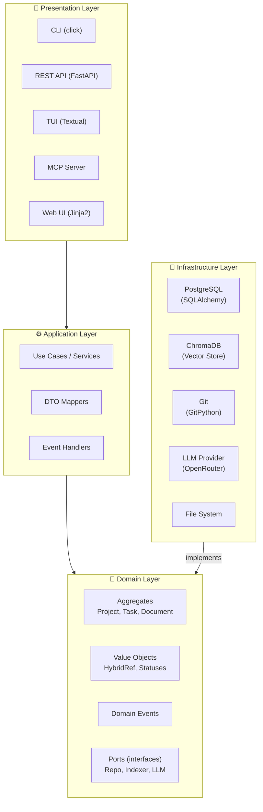

# 🏛️ Architecture: COD-DOC (LEGACY)

> ⚠️ **DEPRECATED.** This file is an outdated L0/L1 overview for the agent Snowball protocol.
> The current source of truth: [`docs/system/ARCHITECTURE.md`](../docs/system/ARCHITECTURE.md).
> On disagreement, the canonical takes priority. This file is kept only for compatibility
> with old references from task context_refs.

> 📊 Meta: `{"version": "0.3", "last_updated": "2026-05-07", "layer": "arch", "context_depth": "L1", "status": "legacy-overview", "canonical_source": "docs/system/ARCHITECTURE.md"}`

## 1. Overview

COD-DOC (Context Orchestrator for Documentation) is an autonomous documentation management agent built on a multi-layer modular architecture with dependency inversion (DIP).

**Dependency direction:** `Presentation → Application → Domain ← Infrastructure`

The Domain Layer is the core of the system and does not depend on any external layer. All interactions with infrastructure are inverted through interface ports.



---

## 2. Layers

### 2.1 Presentation Layer

**Purpose:** receiving external commands, response serialization.

| Component | Technology | Purpose |
|-----------|------------|------------|
| CLI | `click` | Command line: `cod-doc`, `cod-doc-mcp` |
| REST API | `FastAPI` + `uvicorn` | HTTP API for the Web UI and external integrations |
| TUI | `Textual` | Terminal interface for interactive work |
| MCP Server | `mcp` | Model Context Protocol — integration with Claude, VS Code Copilot, etc. |
| Web UI | `Jinja2` + HTML/CSS/JS | Browser dashboard for project management |

**Layer rules:**
- Contains no business logic
- Calls Application Services via DTO
- All endpoints are typed (Pydantic schemas)

---

### 2.2 Application Layer

**Purpose:** coordination of use cases, orchestration of domain objects.

| Component | Description |
|-----------|----------|
| Use Cases | `CreateProject`, `QueueTask`, `ExecuteTask`, `IndexDocument`, `ArchiveProject` |
| DTO Mappers | Converting domain models ↔ Pydantic DTO |
| Event Handlers | Reacting to domain events: `on_task_completed`, `on_document_stale` |

**Layer rules:**
- Contains no domain logic (only delegates to Domain)
- Does not work with DB/files directly (only via ports)
- DTOs are flat data structures without behavior

---

### 2.3 Domain Layer

**Purpose:** pure business logic, independent of infrastructure.

| Component | Description |
|-----------|----------|
| **Aggregates** | `Project`, `Task`, `Document` (see 📁 /models/domain.md) |
| **Value Objects** | `HybridRef`, `ProjectStatus`, `TaskStatus`, `DocStatus` |
| **Domain Events** | `ProjectCreated`, `TaskQueued`, `TaskStarted`, `TaskCompleted`, `TaskFailed`, `DocumentIndexed`, `DocumentBecameStale`, `ProjectArchived` |
| **Ports (interfaces)** | `ProjectRepository`, `TaskRepository`, `DocumentRepository`, `VectorIndexer`, `LLMProvider`, `GitProvider` |

**Layer rules:**
- Zero external dependencies (no `import fastapi`, no `import sqlalchemy`)
- All external calls go through abstract ports
- Business invariants are checked inside aggregates
- No I/O operations inside domain methods

---

### 2.4 Infrastructure Layer

**Purpose:** implementation of ports, work with external systems.

| Component | Technology | Implements port |
|-----------|------------|----------------|
| SQL Repositories | `SQLAlchemy 2.0` + `alembic` | `ProjectRepository`, `TaskRepository`, `DocumentRepository` |
| Vector Store | `ChromaDB` | `VectorIndexer` |
| LLM Client | `openai` (OpenRouter API) | `LLMProvider` |
| Git Adapter | `GitPython` | `GitProvider` |
| File System | `Path` (stdlib) | `FileSystem` (internal port) |
| Background Agent | `asyncio` | `AgentScheduler` (internal port) |

**Layer rules:**
- The only layer with the right to I/O
- Implements the interfaces defined in Domain
- Connected via DI (Dependency Injection)

---

## 3. Architectural decisions (ADR)

> **The source of truth has moved.** ADRs live in the DB as first-class entities
> (see [capability adr-system](../docs/system/capabilities/adr-system.md))
> with auto-numbering, a supersede chain, and a Web UI editor.
> Canonical list: `/p/<slug>/adr` in the Web UI; the markdown projection is
> `docs/adr/ADR-NNN.md` (generated by `cod-doc adr export`).
> The tables below remain as a **bootstrap source** for one-time
> migration via [`adr_migrator.py`](../cod_doc/services/adr_migrator.py)
> when initializing a new project. Make any edits **in the Web UI / CLI**,
> not here.

### ADR-001: Multi-layer architecture with DIP

| Field | Value |
|------|----------|
| **Status** | ✅ Accepted |
| **Date** | 2026-04-05 |
| **Context** | The agent must work with different LLM providers, databases, and file systems, while the business logic must not depend on specific implementations |
| **Decision** | Classic 4-layer architecture: Presentation → Application → Domain ← Infrastructure. Domain defines ports, Infrastructure implements them |
| **Alternatives** | Clean Architecture (overkill), vertical slices (blurs boundaries) |
| **Consequences** | + Isolated business logic, testability, replaceable infrastructure. − More boilerplate code for ports and DI |

### ADR-002: Python 3.11+ with FastAPI

| Field | Value |
|------|----------|
| **Status** | ✅ Accepted |
| **Date** | 2026-04-05 |
| **Context** | An async web server with OpenAPI documentation and a stable AI/ML ecosystem is needed |
| **Decision** | FastAPI + Pydantic v2 + SQLAlchemy 2.0 (async). Minimum Python version — 3.11 (`tomllib` support, improved asyncio) |
| **Alternatives** | Django Ninja, Litestar |
| **Consequences** | + Auto API documentation, native async. − Tied to the Pydantic/SQLAlchemy ecosystem |

### ADR-003: ChromaDB as the vector store

| Field | Value |
|------|----------|
| **Status** | ✅ Accepted |
| **Date** | 2026-04-05 |
| **Context** | Documents need to be indexed for semantic dependency search. A local solution without external services is required |
| **Decision** | ChromaDB in embedded mode. Optional backend — `sentence-transformers` for local embeddings (without OpenAI) |
| **Alternatives** | Pinecone (SaaS dependency), FAISS (indexing only, no metadata) |
| **Consequences** | + Fully local, simple API. − Embedded mode does not scale horizontally |

### ADR-004: Snowball Protocol for context loading

| Field | Value |
|------|----------|
| **Status** | ✅ Accepted |
| **Date** | 2026-04-05 |
| **Context** | The AI agent must minimize token consumption by loading only the necessary context |
| **Decision** | Three-level protocol: L0 (MASTER.md), L1 (+target file), L2 (+dependencies). Hybrid references with hashes for integrity checks |
| **Alternatives** | Loading the entire repository, RAG-only approach |
| **Consequences** | + Token savings, fail-fast on hash mismatch. − Requires discipline when updating hashes |

### ADR-005: Data storage — PostgreSQL

| Field | Value |
|------|----------|
| **Status** | ✅ Accepted |
| **Date** | 2026-04-05 |
| **Context** | Projects, tasks, and document metadata require relational storage with transactions and migrations |
| **Decision** | PostgreSQL via SQLAlchemy 2.0 (async) + Alembic for migrations. ULID as primary keys |
| **Alternatives** | SQLite (not suitable for production), MongoDB (no strict schemas) |
| **Consequences** | + ACID, migrations. − Requires PostgreSQL in Docker |

---

## 4. Non-functional requirements

### 4.1 Performance

| Metric | Target value |
|---------|------------------|
| API response time (p95) | < 200ms |
| Document indexing (~10KB) | < 500ms |
| Snowball L0→L1 loading | < 50ms |
| Parallel tasks | Up to 5 concurrent |

### 4.2 Scalability

| Aspect | Strategy |
|--------|-----------|
| Horizontal | Stateless API + shared DB (multiple API replicas behind a load balancer) |
| Task queue | PostgreSQL `SELECT ... FOR UPDATE SKIP LOCKED` as a queue (no Redis at start) |
| Vector search | ChromaDB embedded — one instance per replica |

### 4.3 Fault tolerance

| Scenario | Behavior |
|----------|-----------|
| DB connection lost | Retry (exponential backoff, 3 attempts), then transition the task to `failed` |
| LLM Provider unavailable | Retry with another provider (fallback keys), graceful degradation |
| File not found (BROKEN) | Status `🔴 BROKEN`, the task stops with ask_human |
| Hash mismatch (STALE) | Status `🔴 STALE`, the content is not used until synchronization |

### 4.4 Security

| Aspect | Solution |
|--------|---------|
| API keys | Only via `.env` / env vars, never in code |
| Repository access | Local file access only, git clone via HTTPS |
| API authentication | API key in the `X-COD-DOC-API-Key` header |
| Project isolation | Each project in its own `/projects/<ulid>` directory |

### 4.5 Observability

| Tool | Purpose |
|------------|------------|
| Docker HEALTHCHECK | `curl /api/health` every 30s |
| Structured logging | JSON logs to stdout |
| Task lifecycle | Task statuses (`pending → in_progress → completed/failed`) |

---

## 5. Contracts between layers

### 5.1 Application → Domain (ports)

```python
# domain/ports.py

class ProjectRepository(ABC):
    async def get(self, project_id: ULID) -> Project | None: ...
    async def save(self, project: Project) -> None: ...
    async def list_active(self) -> list[Project]: ...

class TaskRepository(ABC):
    async def get_next_pending(self, project_id: ULID) -> Task | None: ...
    async def save(self, task: Task) -> None: ...

class DocumentRepository(ABC):
    async def get_by_path(self, project_id: ULID, path: str) -> Document | None: ...
    async def save(self, document: Document) -> None: ...
    async def find_stale(self, project_id: ULID) -> list[Document]: ...

class VectorIndexer(ABC):
    async def index(self, document: Document) -> None: ...
    async def search(self, project_id: ULID, query: str, n: int = 5) -> list[Document]: ...

class LLMProvider(ABC):
    async def complete(self, system_prompt: str, user_prompt: str) -> str: ...
```

### 5.2 Presentation → Application (DTO)

```python
# app/dto.py

class ProjectCreateRequest(BaseModel):
    name: str
    repo_path: str

class TaskCreateRequest(BaseModel):
    project_id: str
    title: str
    description: str = ""
    priority: int = Field(default=5, ge=1, le=10)
    context_refs: list[str] = Field(default_factory=list)

class DocumentResponse(BaseModel):
    id: str
    path: str
    sha256: str
    doc_status: str
    indexed_at: datetime
```

---

## 6. Package structure

```text
cod_doc/
├── api/                # Presentation: REST API (FastAPI)
│   ├── routes.py
│   ├── deps.py
│   └── web/
├── cli/                # Presentation: CLI (click)
├── tui/                # Presentation: TUI (Textual)
├── mcp/                # Presentation: MCP Server
├── app/                # Application: Use Cases, DTO, Event Handlers
├── domain/             # Domain: Aggregates, VO, Events, Ports
├── infra/              # Infrastructure: SQLAlchemy, ChromaDB, Git, LLM
├── templates/          # Jinja2 templates (Web UI)
└── static/             # CSS/JS assets (Web UI)
```

---

## 7. Technology stack (summary)

| Category | Technology | Version |
|-----------|------------|--------|
| Language | Python | 3.11+ |
| Web framework | FastAPI | 0.115+ |
| ASGI server | Uvicorn | 0.30+ |
| DBMS | PostgreSQL (SQLAlchemy 2.0) | async |
| Migrations | Alembic | 1.13+ |
| Vector store | ChromaDB | 0.5+ |
| LLM provider | OpenRouter (OpenAI SDK) | 1.50+ |
| TUI | Textual | 0.80+ |
| MCP | mcp | 1.0+ |
| Validation | Pydantic | 2.0+ |
| Linter | Ruff | 0.8+ |
| Typing | Mypy (strict) | 1.11+ |
| Testing | Pytest + pytest-asyncio | 8.0+ |
| Containerization | Docker (python:3.12-slim) | — |
| CI/CD | GitHub Actions | — |
| Registry | GitHub Container Registry (GHCR) | — |
