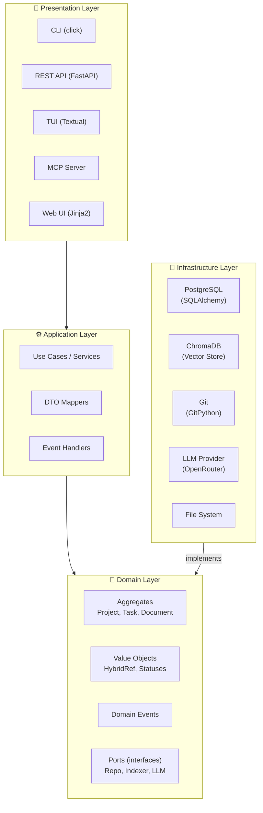

# 🏛️ Архитектура: COD-DOC (LEGACY)

> ⚠️ **DEPRECATED.** Этот файл — устаревший L0/L1-обзор для агентского Snowball-протокола.
> Актуальный источник истины: [`docs/system/ARCHITECTURE.md`](../docs/system/ARCHITECTURE.md).
> При расхождении приоритет у canonical. Этот файл сохранён только для совместимости
> со старыми ссылками из context_refs задач.

> 📊 Meta: `{"version": "0.3", "last_updated": "2026-05-07", "layer": "arch", "context_depth": "L1", "status": "legacy-overview", "canonical_source": "docs/system/ARCHITECTURE.md"}`

## 1. Overview

COD-DOC (Context Orchestrator for Documentation) — автономный агент управления документацией, построенный на многоуровневой модульной архитектуре с инверсией зависимостей (DIP).

**Направление зависимостей:** `Presentation → Application → Domain ← Infrastructure`

Domain Layer — ядро системы, не зависит ни от одного внешнего слоя. Все взаимодействия с инфраструктурой инвертированы через интерфейсы-порты.



---

## 2. Слои

### 2.1 Presentation Layer

**Назначение:** приём внешних команд, сериализация ответов.

| Компонент | Технология | Назначение |
|-----------|------------|------------|
| CLI | `click` | Командная строка: `cod-doc`, `cod-doc-mcp` |
| REST API | `FastAPI` + `uvicorn` | HTTP API для Web UI и внешних интеграций |
| TUI | `Textual` | Терминальный интерфейс для интерактивной работы |
| MCP Server | `mcp` | Model Context Protocol — интеграция с Claude, VS Code Copilot и др. |
| Web UI | `Jinja2` + HTML/CSS/JS | Браузерный дашборд управления проектами |

**Правила слоя:**
- Не содержит бизнес-логики
- Вызывает Application Services через DTO
- Все эндпоинты типизированы (Pydantic-схемы)

---

### 2.2 Application Layer

**Назначение:** координация use-case'ов, оркестрация доменных объектов.

| Компонент | Описание |
|-----------|----------|
| Use Cases | `CreateProject`, `QueueTask`, `ExecuteTask`, `IndexDocument`, `ArchiveProject` |
| DTO Mappers | Преобразование доменных моделей ↔ Pydantic DTO |
| Event Handlers | Реакция на доменные события: `on_task_completed`, `on_document_stale` |

**Правила слоя:**
- Не содержит доменной логики (только делегирует Domain)
- Не работает напрямую с БД/файлами (только через порты)
- DTO — плоские структуры данных без поведения

---

### 2.3 Domain Layer

**Назначение:** чистая бизнес-логика, независимая от инфраструктуры.

| Компонент | Описание |
|-----------|----------|
| **Aggregates** | `Project`, `Task`, `Document` (см. 📁 /models/domain.md) |
| **Value Objects** | `HybridRef`, `ProjectStatus`, `TaskStatus`, `DocStatus` |
| **Domain Events** | `ProjectCreated`, `TaskQueued`, `TaskStarted`, `TaskCompleted`, `TaskFailed`, `DocumentIndexed`, `DocumentBecameStale`, `ProjectArchived` |
| **Ports (interfaces)** | `ProjectRepository`, `TaskRepository`, `DocumentRepository`, `VectorIndexer`, `LLMProvider`, `GitProvider` |

**Правила слоя:**
- Ноль внешних зависимостей (no `import fastapi`, no `import sqlalchemy`)
- Все внешние вызовы — через абстрактные порты
- Бизнес-инварианты проверяются внутри агрегатов
- Никаких I/O операций внутри доменных методов

---

### 2.4 Infrastructure Layer

**Назначение:** реализация портов, работа с внешними системами.

| Компонент | Технология | Реализует порт |
|-----------|------------|----------------|
| SQL Repositories | `SQLAlchemy 2.0` + `alembic` | `ProjectRepository`, `TaskRepository`, `DocumentRepository` |
| Vector Store | `ChromaDB` | `VectorIndexer` |
| LLM Client | `openai` (OpenRouter API) | `LLMProvider` |
| Git Adapter | `GitPython` | `GitProvider` |
| File System | `Path` (stdlib) | `FileSystem` (внутренний порт) |
| Background Agent | `asyncio` | `AgentScheduler` (внутренний порт) |

**Правила слоя:**
- Единственный слой, имеющий право на I/O
- Реализует интерфейсы, определённые в Domain
- Подключается через DI (Dependency Injection)

---

## 3. Архитектурные решения (ADR)

> **Источник правды переехал.** ADR живут в БД как first-class сущность
> (см. [capability adr-system](../docs/system/capabilities/adr-system.md))
> с автонумерацией, supersede-цепочкой и Web-UI редактором.
> Канонический список: `/p/<slug>/adr` в Web UI; markdown-проекция —
> `docs/adr/ADR-NNN.md` (генерируется `cod-doc adr export`).
> Таблицы ниже остаются как **bootstrap-источник** для одноразовой
> миграции через [`adr_migrator.py`](../cod_doc/services/adr_migrator.py)
> при инициализации нового проекта. Любые правки делать **в Web UI / CLI**,
> не здесь.

### ADR-001: Многослойная архитектура с DIP

| Поле | Значение |
|------|----------|
| **Статус** | ✅ Принято |
| **Дата** | 2026-04-05 |
| **Контекст** | Агент должен работать с разными LLM-провайдерами, базами данных и файловыми системами, при этом бизнес-логика не должна зависеть от конкретных реализаций |
| **Решение** | Классическая 4-слойная архитектура: Presentation → Application → Domain ← Infrastructure. Domain определяет порты, Infrastructure их реализует |
| **Альтернативы** | Clean Architecture (избыточно), вертикальные срезы (размывает границы) |
| **Последствия** | + Изолированная бизнес-логика, тестируемость, заменяемость инфраструктуры. − Больше boilerplate-кода для портов и DI |

### ADR-002: Python 3.11+ с FastAPI

| Поле | Значение |
|------|----------|
| **Статус** | ✅ Принято |
| **Дата** | 2026-04-05 |
| **Контекст** | Нужен асинхронный веб-сервер с OpenAPI-документацией и стабильная экосистема для AI/ML |
| **Решение** | FastAPI + Pydantic v2 + SQLAlchemy 2.0 (async). Минимальная версия Python — 3.11 (поддержка `tomllib`, улучшенный asyncio) |
| **Альтернативы** | Django Ninja, Litestar |
| **Последствия** | + Автодокументация API, нативная асинхронность. − Привязка к экосистеме Pydantic/SQLAlchemy |

### ADR-003: ChromaDB как векторное хранилище

| Поле | Значение |
|------|----------|
| **Статус** | ✅ Принято |
| **Дата** | 2026-04-05 |
| **Контекст** | Документы нужно индексировать для семантического поиска зависимостей. Требуется локальное решение без внешних сервисов |
| **Решение** | ChromaDB в embedded-режиме. Опциональный бэкенд — `sentence-transformers` для локальных эмбеддингов (без OpenAI) |
| **Альтернативы** | Pinecone (SaaS-зависимость), FAISS (только индексация, нет метаданных) |
| **Последствия** | + Полностью локально, простой API. − Embedded-режим не масштабируется горизонтально |

### ADR-004: Snowball Protocol для загрузки контекста

| Поле | Значение |
|------|----------|
| **Статус** | ✅ Принято |
| **Дата** | 2026-04-05 |
| **Контекст** | ИИ-агент должен минимизировать потребление токенов, загружая только необходимый контекст |
| **Решение** | Трёхуровневый протокол: L0 (MASTER.md), L1 (+целевой файл), L2 (+зависимости). Гибридные ссылки с хэшами для проверки целостности |
| **Альтернативы** | Полная загрузка всего репозитория, RAG-only подход |
| **Последствия** | + Экономия токенов, fail-fast при расхождении хэшей. − Требует дисциплины при обновлении хэшей |

### ADR-005: Хранение данных — PostgreSQL

| Поле | Значение |
|------|----------|
| **Статус** | ✅ Принято |
| **Дата** | 2026-04-05 |
| **Контекст** | Проекты, задачи и метаданные документов требуют реляционного хранения с транзакциями и миграциями |
| **Решение** | PostgreSQL через SQLAlchemy 2.0 (async) + Alembic для миграций. ULID как первичные ключи |
| **Альтернативы** | SQLite (не подходит для продакшена), MongoDB (нет строгих схем) |
| **Последствия** | + ACID, миграции. − Требует PostgreSQL в Docker |

---

## 4. Нефункциональные требования

### 4.1 Производительность

| Метрика | Целевое значение |
|---------|------------------|
| Время ответа API (p95) | < 200ms |
| Индексация документа (~10KB) | < 500ms |
| Snowball L0→L1 загрузка | < 50ms |
| Параллельные задачи | До 5 одновременных |

### 4.2 Масштабируемость

| Аспект | Стратегия |
|--------|-----------|
| Горизонтальная | Stateless API + общая БД (несколько реплик API за балансировщиком) |
| Очередь задач | PostgreSQL `SELECT ... FOR UPDATE SKIP LOCKED` как очередь (без Redis на старте) |
| Векторный поиск | ChromaDB embedded — один инстанс на реплику |

### 4.3 Отказоустойчивость

| Сценарий | Поведение |
|----------|-----------|
| Потеря соединения с БД | Retry (exponential backoff, 3 попытки), затем перевод задачи в `failed` |
| LLM Provider недоступен | Retry с другим провайдером (fallback-ключи), graceful degradation |
| Файл не найден (BROKEN) | Статус `🔴 BROKEN`, задача останавливается с ask_human |
| Хэш не совпадает (STALE) | Статус `🔴 STALE`, контент не используется до синхронизации |

### 4.4 Безопасность

| Аспект | Решение |
|--------|---------|
| API ключи | Только через `.env` / env vars, никогда в коде |
| Доступ к репозиториям | Только локальный файловый доступ, git clone по HTTPS |
| API аутентификация | API key в заголовке `X-COD-DOC-API-Key` |
| Изоляция проектов | Каждый проект в своей директории `/projects/<ulid>` |

### 4.5 Наблюдаемость

| Инструмент | Назначение |
|------------|------------|
| Docker HEALTHCHECK | `curl /api/health` каждые 30s |
| Structured logging | JSON-логи в stdout |
| Task lifecycle | Статусы задач (`pending → in_progress → completed/failed`) |

---

## 5. Контракты между слоями

### 5.1 Application → Domain (порты)

```python
# domain/ports.py

class ProjectRepository(ABC):
    async def get(self, project_id: ULID) -> Project | None: ...
    async def save(self, project: Project) -> None: ...
    async def list_active(self) -> list[Project]: ...

class TaskRepository(ABC):
    async def get_next_pending(self, project_id: ULID) -> Task | None: ...
    async def save(self, task: Task) -> None: ...

class DocumentRepository(ABC):
    async def get_by_path(self, project_id: ULID, path: str) -> Document | None: ...
    async def save(self, document: Document) -> None: ...
    async def find_stale(self, project_id: ULID) -> list[Document]: ...

class VectorIndexer(ABC):
    async def index(self, document: Document) -> None: ...
    async def search(self, project_id: ULID, query: str, n: int = 5) -> list[Document]: ...

class LLMProvider(ABC):
    async def complete(self, system_prompt: str, user_prompt: str) -> str: ...
```

### 5.2 Presentation → Application (DTO)

```python
# app/dto.py

class ProjectCreateRequest(BaseModel):
    name: str
    repo_path: str

class TaskCreateRequest(BaseModel):
    project_id: str
    title: str
    description: str = ""
    priority: int = Field(default=5, ge=1, le=10)
    context_refs: list[str] = Field(default_factory=list)

class DocumentResponse(BaseModel):
    id: str
    path: str
    sha256: str
    doc_status: str
    indexed_at: datetime
```

---

## 6. Структура пакетов

```text
cod_doc/
├── api/                # Presentation: REST API (FastAPI)
│   ├── routes.py
│   ├── deps.py
│   └── web/
├── cli/                # Presentation: CLI (click)
├── tui/                # Presentation: TUI (Textual)
├── mcp/                # Presentation: MCP Server
├── app/                # Application: Use Cases, DTO, Event Handlers
├── domain/             # Domain: Aggregates, VO, Events, Ports
├── infra/              # Infrastructure: SQLAlchemy, ChromaDB, Git, LLM
├── templates/          # Jinja2 templates (Web UI)
└── static/             # CSS/JS assets (Web UI)
```

---

## 7. Технологический стек (сводка)

| Категория | Технология | Версия |
|-----------|------------|--------|
| Язык | Python | 3.11+ |
| Веб-фреймворк | FastAPI | 0.115+ |
| ASGI-сервер | Uvicorn | 0.30+ |
| СУБД | PostgreSQL (SQLAlchemy 2.0) | async |
| Миграции | Alembic | 1.13+ |
| Векторное хранилище | ChromaDB | 0.5+ |
| LLM-провайдер | OpenRouter (OpenAI SDK) | 1.50+ |
| TUI | Textual | 0.80+ |
| MCP | mcp | 1.0+ |
| Валидация | Pydantic | 2.0+ |
| Линтер | Ruff | 0.8+ |
| Типизация | Mypy (strict) | 1.11+ |
| Тестирование | Pytest + pytest-asyncio | 8.0+ |
| Контейнеризация | Docker (python:3.12-slim) | — |
| CI/CD | GitHub Actions | — |
| Registry | GitHub Container Registry (GHCR) | — |
