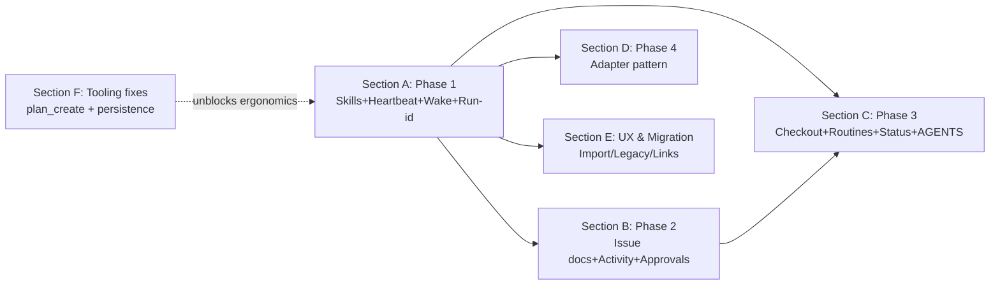

# Documentation Consolidation — Cycle 3 (Phase 2-4 + UX + Tooling)

> **Purpose.** Complete the mapping of all 15 RFCs from `/proposals/` into
> a structured backlog: 11 stories + 26 tasks + Section F with tooling
> fixes based on the results of Cycle 2.

## 1. TL;DR

- 11 new stories: **US-009..US-019** (one per proposal 05-15).
- 26 new tasks distributed across 5 plan sections (B/C/D/E/F).
- Section F (Tooling fixes) opened for G1-G3 — the API gaps discovered in Cycle 2
  that block the RFC backlog.
- Plan total: **43** tasks (17 Phase 1 + 6 Phase 2 + 7 Phase 3 + 3 Phase 4
  + 7 UX + 3 Tooling).

## 2. Cycle-3 deliverables

| # | Deliverable | File/action | Status |
|---|------------|----------------|--------|
| D1 | Cycle-3 audit-report | `docs/system/audit/2026-05-07-doc-consolidation-cycle-3.md` | ✅ this file |
| D2 | Section B/C/D/E/F in DB plan | direct PlanSectionRepository × 5 | ✅ |
| D3 | Stories US-009..US-019 (11 items) | `story_create` × 11 | ✅ |
| D4 | DB tasks PCA-100..PCA-422 (23) + PCA-901..903 (3) = 26 | `task_create` × 26 | ✅ |
| D5 | Execution-plan markdown with full Section B-F | `Edit` | ✅ |

## 3. Story map (Cycle 3)

| Story | Status | Prop | Section | Tasks |
|-------|--------|------|---------|-------|
| US-009 | accepted | 05 | B | PCA-100, PCA-101 |
| US-010 | accepted | 06 | C | PCA-200, PCA-201 |
| US-011 | accepted | 07 | C | PCA-210, PCA-211 |
| US-012 | accepted | 08 | C | PCA-220, PCA-221 |
| US-013 | accepted | 09 | B | PCA-110, PCA-111 |
| US-014 | draft | 10 | D | PCA-300, PCA-301, PCA-302 |
| US-015 | accepted | 11 | C | PCA-230 |
| US-016 | accepted | 12 | B | PCA-120, PCA-121 |
| US-017 | accepted | 13 | E | PCA-400, PCA-401 |
| US-018 | accepted | 14 | E | PCA-410, PCA-411 |
| US-019 | accepted | 15 | E | PCA-420, PCA-421, PCA-422 |

US-014 (Adapter pattern) is intentionally left as `draft` — high risk,
requires a separate RFC discussion; `accepted` for the other 10.

## 4. Tooling fixes (Section F)

| Task | Gap | Priority | Description |
|------|-----|----------|-------------|
| PCA-901 | G1 | high | plan_create / plan_section_create MCP tools |
| PCA-902 | G2 | critical | task_create persists blocked_by as dependency edges |
| PCA-903 | G3 | high | task_create persists story_id and affects_files |

PCA-902 — `critical` because it blocks the basic use-cases plan_ready /
plan_audit / critical_path. Until the fix is closed, the backlog can only be
kept descriptive (a markdown table in the plan).

## 5. Plan health

```
plan_progress(paperclip-adoption-task-plan)
→ total: 43, done: 0, in_progress: 0, remaining: 43
→ A: 17, B: 6, C: 7, D: 3, E: 7, F: 3
plan_audit
→ issues_total: 0 (but critical_path_length=1 due to G2 — does not reflect
  the real depth of dependencies)
```

## 6. Cross-section dependencies



Strict edges (via `blocked_by` in DB tasks, given fix G2):
- PCA-101 ← PCA-100 (task_doc tool ← migration)
- PCA-111 ← PCA-110, PCA-031 (activity emitter ← migration + run_id)
- PCA-121 ← PCA-120, PCA-022 (approval ← migration + WakeContext)
- PCA-200 ← PCA-220 (checkout depends on the 7-state taxonomy)
- PCA-201 ← PCA-200
- PCA-211 ← PCA-210, PCA-022 (scheduler ← Routine entity + WakeContext)
- PCA-221 ← PCA-220
- PCA-301 ← PCA-300; PCA-302 ← PCA-301
- PCA-401 ← PCA-400; PCA-411 ← PCA-410; PCA-422 ← PCA-421

## 7. Acceptance for cycle 3

- [x] All 15 proposals have ≥1 story.
- [x] All 11 new stories are linked to 1+ (plan) task, statuses
      `accepted` (for active ones) or `draft` (for US-014 Adapter).
- [x] Sections B/C/D/E/F are created in the DB plan + populated.
- [x] Section F records G1/G2/G3 as actionable tasks with priorities.
- [x] The execution-plan markdown reflects the full picture (43 tasks,
      6 sections, dep-graph).

## 8. Out of cycle (handed off)

- **Cycle 4:** link integrity — `link_verify` across all active docs;
  dedup of the garbage doc-record `arch/arch/architecture`; normalization of
  doc-keys (`MASTER` → `MASTER_root`?); reindex; hash sync.
- **Cycle 5:** final close-out audit; update the memory with the template
  "cycle-N → audit-report". Possibly — extract a new feedback memory:
  "when there is no MCP API for a bootstrap operation, open an F-section in the same
  plan, not a separate roadmap".
