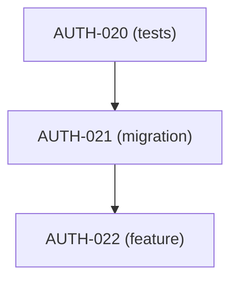

# Capability — Plan Management

> Ведение execution-plan как живой сущности: пересчёт Progress Overview, Next Batch, Dependency Graph, completed-log — всё автоматически.

## 1. Чем занимается `PlanService`

- Создание и переименование планов.
- Пересчёт секционных и плановых totals.
- Генерация/обновление Progress Overview, Next Batch, Dependency Graph.
- Ведение completed-tasks log.
- Статус плана (derived).
- Импорт / экспорт markdown-проекций плана.

## 2. Операции

| Операция | Сервис |
|----------|--------|
| Создать план | `PlanService.create` |
| Добавить секцию | `PlanService.add_section` |
| Переиспользовать секцию (move to split) | `PlanService.split_inline_to_section_files` |
| Пересчитать | `PlanService.recalc` |
| Получить ready-tasks | `PlanService.ready(plan, max_tasks)` |
| Экспорт | `PlanService.export(plan)` |
| Закрыть план | `PlanService.close` (когда все задачи done) |

## 3. Progress Overview — generated artifact

Таблица в parent-plan документе генерируется запросом к `plan_totals`. Ручная правка перезапишется при следующем export.

Формат совпадает с Restate §2.3:

```markdown
| Section | File | Total | Done | Remaining | Status |
|:--------|:-----|------:|-----:|----------:|:-------|
| A: Test Coverage | [section-a](tasks/section-a.md) | 5 | 5 | 0 | ✅ done |
| B: Profile       | [section-b](tasks/section-b.md) | 4 | 2 | 2 | 🔄 in-progress |
| **TOTAL**        |                                  | **9** | **7** | **2** | |
```

Иконки `✅`, `🔄`, `❌`, `⏳` — из `section_totals.status`-деривата:

- `tasks_done == tasks_total` → ✅
- `tasks_done > 0` → 🔄
- `tasks_done == 0` & no open blocker → ❌
- есть blocker через `dependency` — ⏳ `(blocked by X)`.

## 4. Next Batch

Top-N из `ready_tasks`, упорядочено по `priority desc`, `created asc`.

Пример ответа `PlanService.ready("M1-auth-module", max_tasks=5)`:

```json
{
  "plan": "M1-auth-module",
  "readyCount": 7,
  "shownCount": 5,
  "truncated": true,
  "tasks": [
    {"id":"AUTH-025","title":"Implement: account deactivation flow","section":"C","priority":"high"},
    {"id":"AUTH-026","title":"Implement: token rotation hardening","section":"C","priority":"high"},
    ...
  ]
}
```

Поля `readyCount/shownCount/truncated` — наследие Restate `tools/task-plan-ecosystem.md §6.2.2` (там эта история уже отрефакторена в рабочий контракт, не ломаем).

## 5. Статус плана (derived)

| Условие | Статус |
|---------|--------|
| Все задачи `pending` | `pending` |
| ≥ 1 `in-progress` либо смешанное | `in-progress` |
| Все `done` | `done` |

Автоматически в `plan_totals` view. В body parent-plan статус рендерится как «Plan Status: …».

## 6. Completed-tasks log

- Создаётся автоматически при переходе первой задачи в `done`, **если** план ≥ 10 задач.
- Обновляется при каждом `complete`.
- Содержит table + optional Implementation Details (markdown-секция, генерируется по tag `#implementation-note` на revision).

## 7. Dependency Graph

Реконструируется по `dependency`-таблице:



Правила рендера:

- Node: `<ID> (<type-short>)`, coloring по статусу (optional, через Mermaid classDef).
- Обязателен при ≥ 15 задач (правило Restate).
- Cross-plan зависимости видны — node префиксится module-id.

Команда `cod-doc plan graph --plan M1-auth-module --format mermaid|dot|json`.

## 8. Аудит плана

`cod-doc plan audit [--plan <scope>]` проверяет:

- Progress Overview ↔ db:`plan_totals` не расходятся (не должны, т. к. генерится).
- Нет задач со `status=done`, у которых есть `pending` `depends_on` → error.
- Нет циклов в зависимостях.
- Нет «сиротских» секций без задач.
- `last_updated` плана соответствует `max(task.last_updated)`.
- completed-log есть при ≥ 20 задачах.

Строгий режим `--strict` выходит ненулевым кодом — подходит для CI.

## 9. Поддержка inline ↔ split переходов

```bash
cod-doc plan convert --plan M2-dev-module --format split
# создаёт tasks/section-*.md, удаляет inline-секции из parent-plan
# → файлы выдерживают 400-строчный лимит Restate
```

Обратный переход поддерживается, но не рекомендуется (Restate §7.2: «переход от inline к split — одностороннее изменение»).

## 10. MCP-поверхность

| Tool | Операция |
|------|----------|
| `plan.list` | Список планов с progress |
| `plan.ready` | Ready tasks |
| `plan.audit` | Валидация |
| `plan.graph` | Граф зависимостей |
| `plan.next_batch` | Синтетический список: ready × priority × предпочтения агента |

Цель — избавить агент от чтения parent-plan файла при рутинных запросах.

## 11. UI (TUI/веб)

- TUI-дашборд `cod-doc dashboard` уже есть у cod-doc; адаптируется под новую модель.
- Дополнительные виджеты: «Next Batch», «Stale plans», «Broken dependencies».
- Web-UI (REST + SPA) — опционально; REST-эндпоинты уже обеспечивают всё нужное.

## 12. Работа с несколькими планами

В отличие от Restate, где каждый план — независимый markdown, здесь все планы — один набор task-ов в БД. Возможные запросы:

- «Покажи все ready-tasks по всем планам» → `task.ready(scope=project)`.
- «Критический путь по всему проекту» → `task.critical_path(scope=project)`.
- «Список задач, от которых зависит AUTH-025» → `task.dependency_chain(AUTH-025, direction=forward)`.

Реализовано одним SQL-запросом с recursive CTE.
