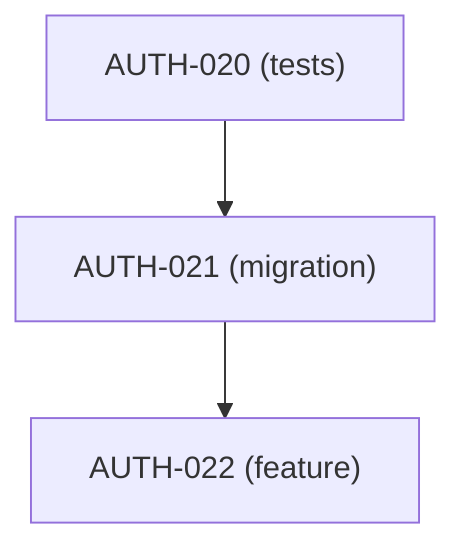

# Capability — Plan Management

> Maintaining an execution-plan as a living entity: recomputing Progress Overview, Next Batch, Dependency Graph, completed-log — all automatically.

## 1. What `PlanService` does

- Creating and renaming plans.
- Recomputing section and plan totals.
- Generating/updating Progress Overview, Next Batch, Dependency Graph.
- Maintaining the completed-tasks log.
- Plan status (derived).
- Importing / exporting plan markdown-projections.

## 2. Operations

| Operation | Service |
|----------|--------|
| Create a plan | `PlanService.create` |
| Add a section | `PlanService.add_section` |
| Reuse a section (move to split) | `PlanService.split_inline_to_section_files` |
| Recompute | `PlanService.recalc` |
| Get ready-tasks | `PlanService.ready(plan, max_tasks)` |
| Export | `PlanService.export(plan)` |
| Close a plan | `PlanService.close` (when all tasks are done) |

## 3. Progress Overview — generated artifact

A table in the parent-plan document generated by a query to `plan_totals`. Manual edits are overwritten on the next export.

The format matches Restate §2.3:

```markdown
| Section | File | Total | Done | Remaining | Status |
|:--------|:-----|------:|-----:|----------:|:-------|
| A: Test Coverage | [section-a](tasks/section-a.md) | 5 | 5 | 0 | ✅ done |
| B: Profile       | [section-b](tasks/section-b.md) | 4 | 2 | 2 | 🔄 in-progress |
| **TOTAL**        |                                  | **9** | **7** | **2** | |
```

The icons `✅`, `🔄`, `❌`, `⏳` — from the `section_totals.status`-derivative:

- `tasks_done == tasks_total` → ✅
- `tasks_done > 0` → 🔄
- `tasks_done == 0` & no open blocker → ❌
- there is a blocker via `dependency` — ⏳ `(blocked by X)`.

## 4. Next Batch

Top-N from `ready_tasks`, ordered by `priority desc`, `created asc`.

Example response of `PlanService.ready("M1-auth-module", max_tasks=5)`:

```json
{
  "plan": "M1-auth-module",
  "readyCount": 7,
  "shownCount": 5,
  "truncated": true,
  "tasks": [
    {"id":"AUTH-025","title":"Implement: account deactivation flow","section":"C","priority":"high"},
    {"id":"AUTH-026","title":"Implement: token rotation hardening","section":"C","priority":"high"},
    ...
  ]
}
```

The `readyCount/shownCount/truncated` fields — a Restate `tools/task-plan-ecosystem.md §6.2.2` legacy (where this story was already refactored into a working contract, do not break it).

## 5. Plan status (derived)

| Condition | Status |
|---------|--------|
| All tasks `pending` | `pending` |
| ≥ 1 `in-progress` or mixed | `in-progress` |
| All `done` | `done` |

Automatically in the `plan_totals` view. In the parent-plan body the status is rendered as "Plan Status: …".

## 6. Completed-tasks log

- Created automatically on the first task transition to `done`, **if** the plan has ≥ 10 tasks.
- Updated on every `complete`.
- Contains a table + optional Implementation Details (a markdown-section, generated by the `#implementation-note` tag on a revision).

## 7. Dependency Graph

Reconstructed from the `dependency`-table:


```mermaid
graph TD
  AUTH_020["AUTH-020 (tests)"]
  AUTH_021["AUTH-021 (migration)"]
  AUTH_022["AUTH-022 (feature)"]
  AUTH_020 --> AUTH_021
  AUTH_021 --> AUTH_022
```

Render rules:

- Node: `<ID> (<type-short>)`, coloring by status (optional, via Mermaid classDef).
- Mandatory for ≥ 15 tasks (Restate rule).
- Cross-plan dependencies are visible — the node is prefixed with the module-id.

The command `cod-doc plan graph --plan M1-auth-module --format mermaid|dot|json`.

## 8. Plan audit

`cod-doc plan audit [--plan <scope>]` checks:

- Progress Overview ↔ db:`plan_totals` do not diverge (they should not, since it is generated).
- No tasks with `status=done` that have a `pending` `depends_on` → error.
- No cycles in dependencies.
- No "orphan" sections without tasks.
- The plan `last_updated` matches `max(task.last_updated)`.
- A completed-log exists for ≥ 20 tasks.

The strict mode `--strict` exits with a non-zero code — suitable for CI.

## 9. Support for inline ↔ split transitions

```bash
cod-doc plan convert --plan M2-dev-module --format split
# creates tasks/section-*.md, removes inline-sections from the parent-plan
# → files meet the Restate 400-line limit
```

The reverse transition is supported, but not recommended (Restate §7.2: "the transition from inline to split is a one-way change").

## 10. MCP surface

| Tool | Operation |
|------|----------|
| `plan.list` | Plan list with progress |
| `plan.ready` | Ready tasks |
| `plan.audit` | Validation |
| `plan.graph` | Dependency graph |
| `plan.next_batch` | Synthetic list: ready × priority × agent preference |

The goal — relieve the agent from reading the parent-plan file on routine queries.

## 11. UI (TUI/web)

- The TUI-dashboard `cod-doc dashboard` already exists in cod-doc; adapted to the new model.
- Additional widgets: "Next Batch", "Stale plans", "Broken dependencies".
- Web-UI (REST + SPA) — optional; the REST-endpoints already provide everything needed.

## 12. Working with multiple plans

Unlike Restate, where each plan is an independent markdown, here all plans are one set of tasks in the DB. Possible queries:

- "Show all ready-tasks across all plans" → `task.ready(scope=project)`.
- "Critical path across the whole project" → `task.critical_path(scope=project)`.
- "List of tasks that AUTH-025 depends on" → `task.dependency_chain(AUTH-025, direction=forward)`.

Implemented with a single SQL query with a recursive CTE.
