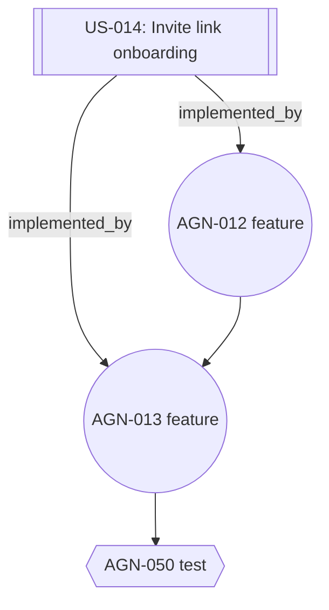

# Capability — User Stories & Dependency Graph

> User stories как first-class сущности; граф зависимостей — между задачами, историями и модулями.

## 1. Проблема ручного подхода

В Restate: `Docs/obsidian/User Stories.md` — один огромный файл (~50K). Связь «какая задача реализует историю US-014» живёт только в голове автора. Связь «какие истории затрагивает модуль M1» — мучительный grep. При рефакторинге — частичный дрейф.

COD-DOC:

- Каждая story = запись в `user_story`.
- Связи с задачами/документами/модулями — в `story_link`.
- Acceptance criteria — отдельные записи, с флагом «met».
- Всё ↔ всё — SQL-запросом.

## 2. Структура user story

```yaml
---
type: user-story
status: accepted
owner: product
story_id: US-014
persona: Agency Owner
priority: high
tags: [agency, onboarding]
---

## Narrative
As an **Agency Owner**, I want to onboard my team via invite link, so that I don't have to
manually register each agent.

## Acceptance Criteria

- [ ] Invite link expires in 7 days.
- [ ] Revoked invite cannot be used.
- [ ] Used invite increments `Agency.seats_used`.

## Linked implementations
- Module: [[doc:modules/M10-agencies/overview]]
- Plan: [[doc:plans/M10-agencies/M10-agencies-task-plan]]
- Tasks:
  - [[task:AGN-012]] — invite issuance
  - [[task:AGN-013]] — expiration check
```

## 3. Операции

| Операция | Сервис |
|----------|--------|
| Создать историю | `StoryService.create` |
| Добавить acceptance-критерий | `StoryService.add_criterion` |
| Отметить критерий met/unmet | `StoryService.update_criterion` |
| Связать с задачей/документом/модулем | `StoryService.link` |
| Список покрытых историей задач | `StoryService.tasks(story_id)` |
| Список историй, касающихся модуля | `StoryService.by_module(module_id)` |
| Статус покрытия (derived) | `StoryService.coverage(story_id)` |

## 4. Покрытие (derived)

Статус истории выводится из связей:

- `accepted` — история утверждена продуктом, но не имеет `implemented_by` задач.
- `in-progress` — ≥ 1 задача в `in-progress` или `done`.
- `delivered` — все `implemented_by` задачи `done` **и** все `acceptance` met.
- `deferred` — story snooze; не фигурирует в ready списках.
- `draft` — черновик, не готов к разработке.

Автоматический расчёт `PlanService.recalc_story_coverage()` — дергается на каждое изменение task или criterion.

## 5. Граф зависимостей — общая модель

COD-DOC поддерживает **два вида рёбер**:

### 5.1 Task → Task (`dependency.kind=blocks`)

Основной граф, как в Restate. Используется для Progress Overview, Next Batch, critical path.

### 5.2 Story → X (`story_link`)

- `implemented_by` → Task
- `specified_in`  → Document (module-spec / section)
- `owned_by`      → Module
- `relates_to`    → Story
- `blocked_by`    → Story

Позволяет строить «двойной граф»: история → задачи → модули.

## 6. Запросы к графу

Команды:

```bash
cod-doc graph forward AUTH-025
  # -> все задачи, которые нужно сделать ДО AUTH-025

cod-doc graph reverse AUTH-020
  # -> что разблокируется, когда AUTH-020 станет done

cod-doc graph critical-path --plan M1-auth-module
  # -> самая длинная цепочка блокеров

cod-doc graph story US-014
  # -> история + её tasks + их цепочки blocks, всё дерево

cod-doc graph module M10-agencies
  # -> все истории, связанные с модулем; все задачи, связанные с историями;
  #    все задачи, связанные с планом модуля напрямую
```

## 7. SQL-основа

Прямое отражение БД:

```sql
-- Forward dependency chain
WITH RECURSIVE chain(row_id, depth) AS (
  SELECT row_id, 0 FROM task WHERE task_id = :start
  UNION ALL
  SELECT d.to_task_id, chain.depth + 1
  FROM dependency d
  JOIN chain ON chain.row_id = d.from_task_id
)
SELECT t.task_id, t.title, t.status, chain.depth
FROM chain
JOIN task t ON t.row_id = chain.row_id
ORDER BY chain.depth;
```

Аналогично reverse-chain / critical path (longest path DAG).

## 8. Visualization

- **Mermaid** — для проекций в markdown (план, story).
- **DOT (Graphviz)** — для внешних инструментов.
- **JSON** — для веб-UI / других клиентов.

Пример Mermaid для story:



## 9. Story-driven планирование

Сервис `PlanService.propose_tasks_for_story(story_id)`:

- Смотрит acceptance criteria.
- Предлагает LLM-сгенерированные draft-задачи (`type=feature|test`) с привязкой к модулю/плану.
- Автор/агент принимает — задачи создаются через `TaskService.bulk_create`.

Это не «магия» — это оркестратор, который использует уже существующие сервисы. Но это заменяет ручной процесс «прочитал US, придумал 5 задач, вписал в план».

## 10. Traceability-отчёт

`cod-doc report traceability`:

- Список stories со статусом покрытия.
- Список модулей с количеством stories/tasks.
- Недоставленные acceptance criteria.
- Stories, потерявшие связи (`implemented_by` задача удалена).

## 11. Интеграция с другими capability

- **Task creation**: при создании задачи можно сразу указать `--story US-014`.
- **Doc evolution**: при rename story — все input-ссылки обновляются.
- **Context retrieval**: L1 ответа по модулю включает ≤ 3 stories; L2 — их acceptance critetria.
- **Plan management**: Next Batch внутри плана можно фильтровать по `--story US-014`.

## 12. Что не делаем

- Не превращаем story в тикет Plane/Jira — это задача `plane-sync` интеграции, отдельный capability (вне пакета).
- Не считаем «story points» — приоритезация только через `priority` (крит/хай/мед/лоу).
- Не генерируем story автоматически — слишком рискованно; продуктная валидация остаётся человеческой.
