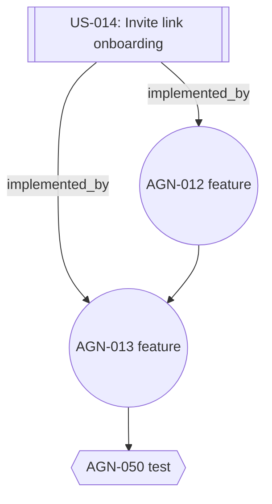

# Capability — User Stories & Dependency Graph

> User stories as first-class entities; the dependency graph — between tasks, stories and modules.

## 1. The problem with the manual approach

In Restate: `Docs/obsidian/User Stories.md` — one huge file (~50K). The link "which task implements the US-014 story" lives only in the author's head. The link "which stories module M1 touches" — a painful grep. On refactoring — partial drift.

COD-DOC:

- Each story = a record in `user_story`.
- Links to tasks/documents/modules — in `story_link`.
- Acceptance criteria — separate records, with a "met" flag.
- Everything ↔ everything — via a SQL query.

## 2. The user story structure

```yaml
---
type: user-story
status: accepted
owner: product
story_id: US-014
persona: Agency Owner
priority: high
tags: [agency, onboarding]
---

## Narrative
As an **Agency Owner**, I want to onboard my team via invite link, so that I don't have to
manually register each agent.

## Acceptance Criteria

- [ ] Invite link expires in 7 days.
- [ ] Revoked invite cannot be used.
- [ ] Used invite increments `Agency.seats_used`.

## Linked implementations
- Module: [[doc:modules/M10-agencies/overview]]
- Plan: [[doc:plans/M10-agencies/M10-agencies-task-plan]]
- Tasks:
  - [[task:AGN-012]] — invite issuance
  - [[task:AGN-013]] — expiration check
```

## 3. Operations

| Operation | Service |
|----------|--------|
| Create a story | `StoryService.create` |
| Add an acceptance criterion | `StoryService.add_criterion` |
| Mark a criterion met/unmet | `StoryService.update_criterion` |
| Link to a task/document/module | `StoryService.link` |
| List tasks covered by a story | `StoryService.tasks(story_id)` |
| List stories touching a module | `StoryService.by_module(module_id)` |
| Coverage status (derived) | `StoryService.coverage(story_id)` |

## 4. Coverage (derived)

The story status is derived from the links:

- `accepted` — the story is approved by the product, but has no `implemented_by` tasks.
- `in-progress` — ≥ 1 task in `in-progress` or `done`.
- `delivered` — all `implemented_by` tasks are `done` **and** all `acceptance` are met.
- `deferred` — the story is snoozed; does not appear in ready lists.
- `draft` — a draft, not ready for development.

Automatic computation `PlanService.recalc_story_coverage()` — triggered on every task or criterion change.

## 5. The dependency graph — the shared model

COD-DOC supports **two kinds of edges**:

### 5.1 Task → Task (`dependency.kind=blocks`)

The main graph, as in Restate. Used for Progress Overview, Next Batch, critical path.

### 5.2 Story → X (`story_link`)

- `implemented_by` → Task
- `specified_in`  → Document (module-spec / section)
- `owned_by`      → Module
- `relates_to`    → Story
- `blocked_by`    → Story

Allows building a "double graph": story → tasks → modules.

## 6. Graph queries

Commands:

```bash
cod-doc graph forward AUTH-025
  # -> all tasks that must be done BEFORE AUTH-025

cod-doc graph reverse AUTH-020
  # -> what gets unblocked when AUTH-020 becomes done

cod-doc graph critical-path --plan M1-auth-module
  # -> the longest chain of blockers

cod-doc graph story US-014
  # -> the story + its tasks + their blocks chains, the whole tree

cod-doc graph module M10-agencies
  # -> all stories linked to the module; all tasks linked to the stories;
  #    all tasks linked to the module's plan directly
```

## 7. SQL basis

A direct reflection of the DB:

```sql
-- Forward dependency chain
WITH RECURSIVE chain(row_id, depth) AS (
  SELECT row_id, 0 FROM task WHERE task_id = :start
  UNION ALL
  SELECT d.to_task_id, chain.depth + 1
  FROM dependency d
  JOIN chain ON chain.row_id = d.from_task_id
)
SELECT t.task_id, t.title, t.status, chain.depth
FROM chain
JOIN task t ON t.row_id = chain.row_id
ORDER BY chain.depth;
```

Similarly reverse-chain / critical path (longest path DAG).

## 8. Visualization

- **Mermaid** — for projections in markdown (plan, story).
- **DOT (Graphviz)** — for external tools.
- **JSON** — for the web-UI / other clients.

Example Mermaid for a story:


```mermaid
graph TD
  US_014[[US-014: Invite link onboarding]]
  AGN_012((AGN-012 feature))
  AGN_013((AGN-013 feature))
  AGN_050{{AGN-050 test}}

  US_014 -->|implemented_by| AGN_012
  US_014 -->|implemented_by| AGN_013
  AGN_012 --> AGN_013
  AGN_013 --> AGN_050
```

## 9. Story-driven planning

The `PlanService.propose_tasks_for_story(story_id)` service:

- Looks at the acceptance criteria.
- Proposes LLM-generated draft-tasks (`type=feature|test`) tied to a module/plan.
- The author/agent accepts — the tasks are created via `TaskService.bulk_create`.

This is not "magic" — it is an orchestrator that uses already-existing services. But it replaces the manual process "read the US, come up with 5 tasks, write them into the plan".

## 10. Traceability report

`cod-doc report traceability`:

- A list of stories with coverage status.
- A list of modules with the number of stories/tasks.
- Undelivered acceptance criteria.
- Stories that lost links (`implemented_by` task deleted).

## 11. Integration with other capabilities

- **Task creation**: when creating a task you can immediately specify `--story US-014`.
- **Doc evolution**: on story rename — all input-links are updated.
- **Context retrieval**: an L1 response for a module includes ≤ 3 stories; L2 — their acceptance criteria.
- **Plan management**: Next Batch within a plan can be filtered by `--story US-014`.

## 12. What we do not do

- We do not turn a story into a Plane/Jira ticket — that is the job of the `plane-sync` integration, a separate capability (outside the package).
- We do not count "story points" — prioritization is only via `priority` (crit/high/med/low).
- We do not auto-generate stories — too risky; product validation stays human.
