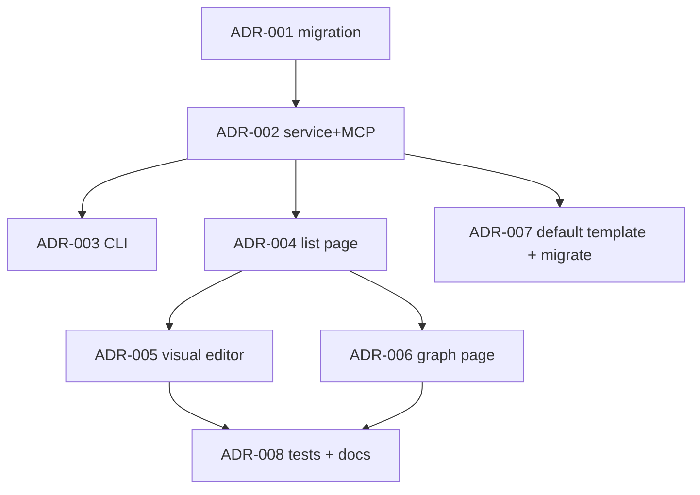

# ADR System — Execution Plan

> Реализация capability «ADR Documents» (см. [capabilities/adr-system.md](../capabilities/adr-system.md)).
> ADR — first-class сущность в БД, MCP-API, CLI, Web UI с визуальным
> редактором и Mermaid-графом supersede-цепочек.

## Navigation

- [Capability spec](../capabilities/adr-system.md)
- [System MASTER](../MASTER.md)

## Progress Overview

| Section | Title | Tasks | Status |
|:--------|:------|------:|:-------|
| A | Domain & MCP | 3 | ✅ done |
| B | Web UI (visual) | 3 | ✅ done |
| C | Templates & Migration | 2 | ✅ done |
| **TOTAL** | | **8** | ✅ done |

> **Status reconciliation 2026-06-05** (см. [ROADMAP](ROADMAP.md)): код подтверждает 8/8 done — миграция `20260515_0018_adr_tables.py`, `services/adr_service.py` (+ immutability/deprecate), 9 MCP-тулов `adr_*`, CLI `cod_doc/cli/adr/`, web-страницы `api/web/pages/adr.py` (list/new/show/graph). БД: ADR-001..008 = done.

## Dependency Graph



## Acceptance per section

- **Section A** — `adr` таблица + `AdrService` + 7 MCP-тулов работают;
  автонумерация без коллизий; supersede-цепочка cycle-проверяется.
- **Section B** — три Web-страницы (`/p/<slug>/adr`, `/adr/new`, `/adr/<id>`,
  `/adr/graph`) рендерят список, форму, детальный view, граф; Mermaid live-preview.
- **Section C** — default ADR-шаблон в `templates/`; миграция 5 ADR из
  `arch/architecture.md §5` в БД с supersede-цепочкой.

---

## Section A: Domain & MCP

### ADR-001 — Migration: adr + adr_diagram + adr_supersedes + adr_task tables

```yaml
id: ADR-001
title: "Migration: adr + adr_diagram + adr_supersedes + adr_task"
section: A-Domain-MCP
status: pending
depends_on: []
type: migration
priority: high
affects_files:
  - cod_doc/infra/migrations/versions/20260508_xxxx_adr_tables.py
  - cod_doc/infra/models.py
  - cod_doc/domain/entities.py
```

Таблицы: `adr` (id auto ADR-NNN, project_id FK, status enum, context/decision/consequences TEXT, decided_by, decided_at, superseded_by FK NULL); `adr_diagram` (adr_id FK, position, mermaid_source, caption); `adr_supersedes` (from FK, to FK, reason, kind='supersedes'); `adr_task` (adr_id FK, task_id FK).

**Acceptance:** миграция up/down; автонумерация ADR-NNN per project через `MAX(id)` подсчёт + lock; smoke-CRUD; supersede-DAG-проверка вынесена в service-слой.

### ADR-002 — Implement: AdrService + MCP tools

```yaml
id: ADR-002
title: "Implement: AdrService + 7 MCP tools (adr_*)"
section: A-Domain-MCP
status: pending
depends_on: [ADR-001]
type: feature
priority: high
affects_files:
  - cod_doc/services/adr_service.py
  - cod_doc/mcp/tools/adr_tools.py
  - cod_doc/agent/tool_defs.py
```

Сервис: `create / get / list / update / supersede / deprecate / add_diagram / link_task / graph`. Каждая мутация пишет revision с `entity_kind=ADR`. supersede-cycle detection (DFS) перед update. autonumber через section_repo-pattern с проверкой UNIQUE.

**Acceptance:** 7 MCP-тулов в `tool_defs.py`; cycle-detection rejects `ADR-A supersedes ADR-B; ADR-B supersedes ADR-A`; 15+ unit tests.

### ADR-003 — Implement: CLI commands (cod-doc adr ...)

```yaml
id: ADR-003
title: "Implement: cod-doc adr new/list/show/supersede/graph"
section: A-Domain-MCP
status: pending
depends_on: [ADR-002]
type: feature
priority: medium
affects_files:
  - cod_doc/cli/adr.py
  - cod_doc/cli/__init__.py
```

CLI-команды через click: `new` (с `--context-file/--decision-file/--consequences-file`), `list --status`, `show ADR-NNN`, `supersede OLD NEW --reason`, `graph --format mermaid|json`.

**Acceptance:** все 5 команд работают; help-тексты; integration-тест на end-to-end (создать ADR → list → show → supersede → graph).

---

## Section B: Web UI (visual)

### ADR-004 — Implement: /p/<slug>/adr list page with status badges

```yaml
id: ADR-004
title: "Implement: web ADR list page (/p/<slug>/adr) with status badges + filters"
section: B-Web-UI
status: pending
depends_on: [ADR-002]
type: feature
priority: medium
affects_files:
  - cod_doc/api/web/pages/adr.py
  - cod_doc/templates/web/project/adr_list.html
  - cod_doc/api/web/routes.py
```

Список ADR с цветовыми badge (PROPOSED/ACCEPTED/DEPRECATED/SUPERSEDED), фильтры (status, год), сортировка по decided_at DESC. Пагинация 50/page. Карточка показывает supersedes/superseded_by chips.

**Acceptance:** страница рендерится за <100ms на 100 ADR; HTMX-фильтры без full-reload.

### ADR-005 — Implement: /adr/new visual editor + /adr/<id> detail page

```yaml
id: ADR-005
title: "Implement: visual ADR editor + detail page with Mermaid live-preview"
section: B-Web-UI
status: pending
depends_on: [ADR-004]
type: feature
priority: medium
affects_files:
  - cod_doc/api/web/pages/adr.py
  - cod_doc/templates/web/project/adr_new.html
  - cod_doc/templates/web/project/adr_show.html
  - cod_doc/static/js/adr_editor.js
```

Форма с textarea-блоками (Context/Decision/Consequences) + markdown preview сбоку. Mermaid-блоки добавляются кнопкой «+ Diagram», live-preview через клиентский mermaid.js (уже используется для plan-graphs). Supersedes — multi-select из ACCEPTED-ADR (HTMX combobox). Detail-страница рендерит markdown через server-side renderer (см. [`api/web/markdown.py`](../../../cod_doc/api/web/markdown.py)) + Mermaid через клиентский lib.

**Acceptance:** создание ADR через UI без CLI/MCP; Mermaid-preview обновляется при печати; supersede-форма не позволяет выбрать самого себя или создать цикл.

### ADR-006 — Implement: /adr/graph supersede-chain visualization

```yaml
id: ADR-006
title: "Implement: /p/<slug>/adr/graph — full supersede DAG (Mermaid)"
section: B-Web-UI
status: pending
depends_on: [ADR-004]
type: feature
priority: low
affects_files:
  - cod_doc/api/web/pages/adr.py
  - cod_doc/templates/web/project/adr_graph.html
  - cod_doc/services/adr_service.py
```

Серверный рендер `adr_graph(format='mermaid')` → клиентский Mermaid.js → SVG с кликабельными узлами (анкоры на /adr/<id>). Цвета по статусу (как в badges). При больших DAG — фильтр «только последняя версия в каждой цепочке».

**Acceptance:** граф из 50+ ADR рендерится <1s; узел с кликом ведёт на детальную; статусы цветово отделены.

---

## Section C: Templates & Migration

### ADR-007 — Default ADR template + migrate existing 5 ADR from arch/architecture.md

```yaml
id: ADR-007
title: "Add: default ADR-шаблон + миграция 5 ADR из arch/architecture.md §5"
section: C-Templates-Migration
status: pending
depends_on: [ADR-002]
type: migration
priority: medium
affects_files:
  - templates/adr_default.md.j2
  - cod_doc/services/adr_migrator.py
  - tests/services/test_adr_migrator.py
```

Шаблон `templates/adr_default.md.j2` (Title/Status/Context/Decision/Consequences). Скрипт-разовка `adr_migrator.py` парсит `arch/architecture.md §5 ADR` (5 решений) → создаёт ADR-001..ADR-005 в БД через `AdrService.create`, статус `ACCEPTED`, `decided_by='COD-DOC Orchestrator'`, `decided_at=2026-04-05`.

**Acceptance:** 5 ADR в БД после миграции; arch/architecture.md §5 заменён на ссылку «См. /p/<slug>/adr»; idempotency — повторный запуск не дублирует.

### ADR-008 — Tests + HANDBOOK section

```yaml
id: ADR-008
title: "Tests: end-to-end ADR flow + HANDBOOK section"
section: C-Templates-Migration
status: pending
depends_on: [ADR-005, ADR-006]
type: test
priority: medium
affects_files:
  - tests/services/test_adr_service.py
  - tests/api/web/test_adr_pages.py
  - docs/HANDBOOK.md
```

End-to-end: create ADR → supersede → graph. Web-тесты через Playwright (как в существующих web-тестах). HANDBOOK section «ADR — как принимать архитектурные решения» с примером flow.

**Acceptance:** 25+ tests суммарно (unit + integration + web); HANDBOOK обновлён; suite зелёный.
