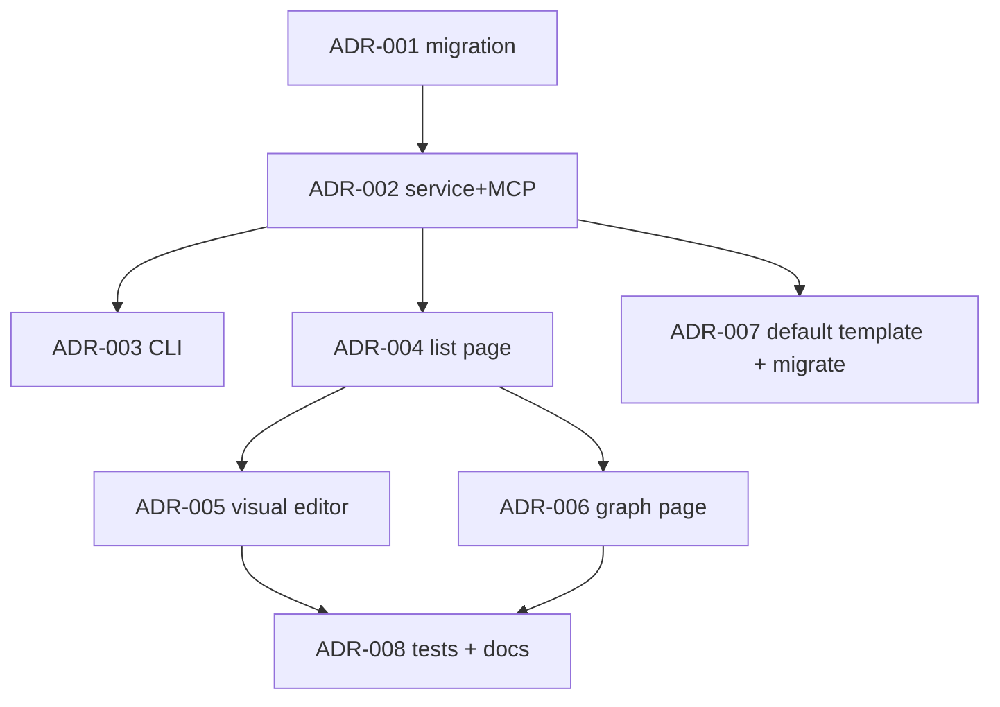

# ADR System — Execution Plan

> Implementation of the "ADR Documents" capability (see [capabilities/adr-system.md](../capabilities/adr-system.md)).
> An ADR is a first-class entity in the DB, MCP API, CLI, and Web UI with a
> visual editor and a Mermaid graph of supersede chains.

## Navigation

- [Capability spec](../capabilities/adr-system.md)
- [System MASTER](../MASTER.md)

## Progress Overview

| Section | Title | Tasks | Status |
|:--------|:------|------:|:-------|
| A | Domain & MCP | 3 | ✅ done |
| B | Web UI (visual) | 3 | ✅ done |
| C | Templates & Migration | 2 | ✅ done |
| **TOTAL** | | **8** | ✅ done |

> **Status reconciliation 2026-06-05** (see [ROADMAP](ROADMAP.md)): the code confirms 8/8 done — migration `20260515_0018_adr_tables.py`, `services/adr_service.py` (+ immutability/deprecate), 9 MCP tools `adr_*`, CLI `cod_doc/cli/adr/`, web pages `api/web/pages/adr.py` (list/new/show/graph). DB: ADR-001..008 = done.

## Dependency Graph



## Acceptance per section

- **Section A** — the `adr` table + `AdrService` + 7 MCP tools work;
  autonumbering without collisions; the supersede chain is cycle-checked.
- **Section B** — three web pages (`/p/<slug>/adr`, `/adr/new`, `/adr/<id>`,
  `/adr/graph`) render the list, form, detail view, graph; Mermaid live-preview.
- **Section C** — a default ADR template in `templates/`; migration of 5
  ADRs from `arch/architecture.md §5` into the DB with a supersede chain.

---

## Section A: Domain & MCP

### ADR-001 — Migration: adr + adr_diagram + adr_supersedes + adr_task tables

```yaml
id: ADR-001
title: "Migration: adr + adr_diagram + adr_supersedes + adr_task"
section: A-Domain-MCP
status: pending
depends_on: []
type: migration
priority: high
affects_files:
  - cod_doc/infra/migrations/versions/20260508_xxxx_adr_tables.py
  - cod_doc/infra/models.py
  - cod_doc/domain/entities.py
```

Tables: `adr` (id auto ADR-NNN, project_id FK, status enum, context/decision/consequences TEXT, decided_by, decided_at, superseded_by FK NULL); `adr_diagram` (adr_id FK, position, mermaid_source, caption); `adr_supersedes` (from FK, to FK, reason, kind='supersedes'); `adr_task` (adr_id FK, task_id FK).

**Acceptance:** migration up/down; ADR-NNN autonumbering per project via `MAX(id)` count + lock; smoke-CRUD; supersede-DAG check moved to the service layer.

### ADR-002 — Implement: AdrService + MCP tools

```yaml
id: ADR-002
title: "Implement: AdrService + 7 MCP tools (adr_*)"
section: A-Domain-MCP
status: pending
depends_on: [ADR-001]
type: feature
priority: high
affects_files:
  - cod_doc/services/adr_service.py
  - cod_doc/mcp/tools/adr_tools.py
  - cod_doc/agent/tool_defs.py
```

Service: `create / get / list / update / supersede / deprecate / add_diagram / link_task / graph`. Each mutation writes a revision with `entity_kind=ADR`. supersede-cycle detection (DFS) before update. Autonumber via the section_repo pattern with a UNIQUE check.

**Acceptance:** 7 MCP tools in `tool_defs.py`; cycle-detection rejects `ADR-A supersedes ADR-B; ADR-B supersedes ADR-A`; 15+ unit tests.

### ADR-003 — Implement: CLI commands (cod-doc adr ...)

```yaml
id: ADR-003
title: "Implement: cod-doc adr new/list/show/supersede/graph"
section: A-Domain-MCP
status: pending
depends_on: [ADR-002]
type: feature
priority: medium
affects_files:
  - cod_doc/cli/adr.py
  - cod_doc/cli/__init__.py
```

CLI commands via click: `new` (with `--context-file/--decision-file/--consequences-file`), `list --status`, `show ADR-NNN`, `supersede OLD NEW --reason`, `graph --format mermaid|json`.

**Acceptance:** all 5 commands work; help texts; an integration test for end-to-end (create ADR → list → show → supersede → graph).

---

## Section B: Web UI (visual)

### ADR-004 — Implement: /p/<slug>/adr list page with status badges

```yaml
id: ADR-004
title: "Implement: web ADR list page (/p/<slug>/adr) with status badges + filters"
section: B-Web-UI
status: pending
depends_on: [ADR-002]
type: feature
priority: medium
affects_files:
  - cod_doc/api/web/pages/adr.py
  - cod_doc/templates/web/project/adr_list.html
  - cod_doc/api/web/routes.py
```

ADR list with color badges (PROPOSED/ACCEPTED/DEPRECATED/SUPERSEDED), filters (status, year), sort by decided_at DESC. Pagination 50/page. The card shows supersedes/superseded_by chips.

**Acceptance:** the page renders in <100ms on 100 ADRs; HTMX filters without a full reload.

### ADR-005 — Implement: /adr/new visual editor + /adr/<id> detail page

```yaml
id: ADR-005
title: "Implement: visual ADR editor + detail page with Mermaid live-preview"
section: B-Web-UI
status: pending
depends_on: [ADR-004]
type: feature
priority: medium
affects_files:
  - cod_doc/api/web/pages/adr.py
  - cod_doc/templates/web/project/adr_new.html
  - cod_doc/templates/web/project/adr_show.html
  - cod_doc/static/js/adr_editor.js
```

A form with textarea blocks (Context/Decision/Consequences) + a markdown preview on the side. Mermaid blocks are added with a "+ Diagram" button, live-preview via the client-side mermaid.js (already used for plan-graphs). Supersedes — a multi-select from ACCEPTED ADRs (HTMX combobox). The detail page renders markdown via a server-side renderer (see [`api/web/markdown.py`](../../../cod_doc/api/web/markdown.py)) + Mermaid via the client-side lib.

**Acceptance:** creating an ADR via the UI without CLI/MCP; the Mermaid preview updates while typing; the supersede form does not allow selecting itself or creating a cycle.

### ADR-006 — Implement: /adr/graph supersede-chain visualization

```yaml
id: ADR-006
title: "Implement: /p/<slug>/adr/graph — full supersede DAG (Mermaid)"
section: B-Web-UI
status: pending
depends_on: [ADR-004]
type: feature
priority: low
affects_files:
  - cod_doc/api/web/pages/adr.py
  - cod_doc/templates/web/project/adr_graph.html
  - cod_doc/services/adr_service.py
```

Server-side render `adr_graph(format='mermaid')` → client-side Mermaid.js → SVG with clickable nodes (anchors to /adr/<id>). Colors by status (as in badges). For large DAGs — a filter "only the latest version in each chain".

**Acceptance:** a graph of 50+ ADRs renders in <1s; a clicked node leads to the detail page; statuses are color-separated.

---

## Section C: Templates & Migration

### ADR-007 — Default ADR template + migrate existing 5 ADR from arch/architecture.md

```yaml
id: ADR-007
title: "Add: default ADR template + migrate 5 ADR from arch/architecture.md §5"
section: C-Templates-Migration
status: pending
depends_on: [ADR-002]
type: migration
priority: medium
affects_files:
  - templates/adr_default.md.j2
  - cod_doc/services/adr_migrator.py
  - tests/services/test_adr_migrator.py
```

Template `templates/adr_default.md.j2` (Title/Status/Context/Decision/Consequences). A one-off script `adr_migrator.py` parses `arch/architecture.md §5 ADR` (5 decisions) → creates ADR-001..ADR-005 in the DB via `AdrService.create`, status `ACCEPTED`, `decided_by='COD-DOC Orchestrator'`, `decided_at=2026-04-05`.

**Acceptance:** 5 ADRs in the DB after the migration; arch/architecture.md §5 replaced with a link "See /p/<slug>/adr"; idempotency — a repeat run does not duplicate.

### ADR-008 — Tests + HANDBOOK section

```yaml
id: ADR-008
title: "Tests: end-to-end ADR flow + HANDBOOK section"
section: C-Templates-Migration
status: pending
depends_on: [ADR-005, ADR-006]
type: test
priority: medium
affects_files:
  - tests/services/test_adr_service.py
  - tests/api/web/test_adr_pages.py
  - docs/HANDBOOK.md
```

End-to-end: create ADR → supersede → graph. Web tests via Playwright (as in the existing web tests). HANDBOOK section "ADR — how to make architectural decisions" with an example flow.

**Acceptance:** 25+ tests total (unit + integration + web); HANDBOOK updated; suite green.
