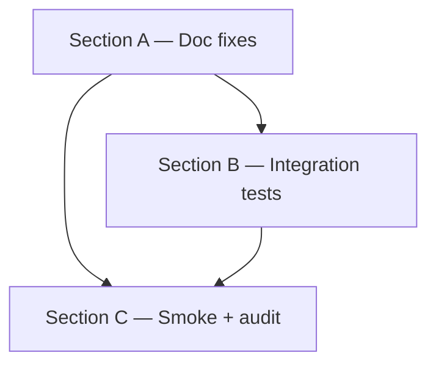

# Agent Tools Completion — Execution Plan

> Закрытие P0-1 из [self-improvement audit](../../audit/2026-06-04-self-improvement-compared.md):
> 5 из 6 cycle-5 agent-profile тулов помечены в `agent_tools.py` как «stubs»,
> хотя их bodies **уже реализованы** в `services/agent_service.py`. Реальный
> scope: убрать misleading docstring, дописать недостающие integration-тесты
> через `mcp.call_tool`, закрыть regression-risk в F2-аудите.

## Navigation

- [System MASTER](../MASTER.md)
- [Self-improvement audit](../../audit/2026-06-04-self-improvement-compared.md) — P0-1
- [Task-plan standard](../../standards/task-plan.md)

## Gap Analysis Summary

**Что показала повторная проверка кода (2026-06-04, miniMax-m3):**

| Что | Реальность | Заблуждение из self-improvement audit |
|---|---|---|
| `agent_service.pick` | Реализован, 530+ строк, idempotency + F2 fix | "Bodies not implemented" — неверно |
| `agent_service.get/report/complete/release` | Реализованы, 238-498 строки | То же |
| `agent_tools.py:115-118` | Stale docstring «Bodies will be implemented in their respective tasks» | Вводит в заблуждение |
| `tests/services/test_agent_pick.py` | 176 строк, 5 кейсов (high-prio, blocked, idempotent, empty, F2 stale-lock) | OK |
| `tests/services/test_agent_workflow.py` | 80+ строк, кейсы для get/report/complete/release | OK |
| `tests/services/test_agent_profile_contract.py` | AGT-012 freeze contract | OK |
| `tests/test_agent_profile.py` | AGT-001/002 tools/list, profile filter | OK |
| **End-to-end через `mcp.call_tool`** | **0 тестов** для всех 6 тулов | Лакуна |
| `AGENTS.md` / docs | Не упомянуто, что agent-tools уже functional | Drift в документации |

**Итог:** основная работа — **verification & docstring fix**, не реализация. Scope P0-1 уменьшается с 2-3 дней до 0.5-1 дня. Но **integration-test** через `mcp.call_tool` остаётся **must-do** (нет end-to-end покрытия в принципе).

## Progress Overview

| Section | Tasks | Status |
|:--------|------:|:-------|
| A: Docstring + AGENTS.md accuracy | 3 | 🟡 pending |
| B: Integration tests via mcp.call_tool | 4 | 🟡 pending |
| C: Manual smoke-test + audit | 2 | 🟡 pending |
| **TOTAL** | **9** | 🟡 pending |

## Dependency Graph



## Next Batch (готовые к старту)

### Section A — Docstring + AGENTS.md accuracy

#### AGN-001 — Docs: update stale docstring in agent_tools.py:115-118
**Type:** docs · **Priority:** high · **Depends on:** —

**Acceptance:**
- Заменить «Bodies will be implemented in their respective tasks» на честное описание: «Bodies are implemented in `cod_doc.services.agent_service.{pick,get,report,complete,release}`; this module is the MCP-thin-wrapper layer that opens a session, resolves the project, and delegates».
- Сохранить numbering (AGT-003..AGT-007) и ссылку на proposal 20.
- Diff показывает: 1-3 строки изменены, ничего другого не тронуто.

**Affected files:** `cod_doc/mcp/tools/agent_tools.py` (lines 115-118).

#### AGN-002 — Docs: update AGENTS.md cycle-5 section
**Type:** docs · **Priority:** medium · **Depends on:** —

**Acceptance:**
- Найти в `AGENTS.md` упоминание «cycle-5: 6-tool agent profile» (line 7-8).
- Убрать или скорректировать формулировку, которая может быть прочитана как «in progress, not yet implemented». Актуально: «cycle-5: 6-tool agent profile. Implementation is in `services/agent_service.py`; MCP wrappers in `mcp/tools/agent_tools.py`. See proposals 16/20 for downstream usage».
- Никаких других правок в `AGENTS.md`.

**Affected files:** `AGENTS.md` (lines 7-13).

#### AGN-003 — Docs: add Section to paperclip-adoption-task-plan referencing AGN-001/002
**Type:** docs · **Priority:** low · **Depends on:** AGN-001, AGN-002

**Acceptance:**
- В `docs/system/roadmap/paperclip-adoption-task-plan.md` добавить строку в Progress Overview (или новую мини-секцию) о docstring/AGENTS.md drift fix.
- 1-2 строки, ссылка на AGN-001/002.

**Affected files:** `docs/system/roadmap/paperclip-adoption-task-plan.md`.

### Section B — Integration tests via `mcp.call_tool`

#### AGN-010 — Test + Implement: `tests/integration/test_agent_profile_mcp.py` skeleton
**Type:** test · **Priority:** critical · **Depends on:** —

**Acceptance:**
- Создать `tests/integration/test_agent_profile_mcp.py`.
- Импортировать `mcp` from `cod_doc.mcp.server` (как в `tests/test_agent_profile.py:11-16`).
- Reuse существующую фикстуру `engine_with_schema` (из `tests/services/conftest.py`).
- Создать **минимальную** фикстуру `_register_test_project` — seed project + plan + section, чтобы `agent_pick` мог что-то вернуть.
- Параметризовать профиль: `apply_profile("agent")` в `setup_method`.
- Smoke: вызвать `mcp.call_tool("agent_capabilities", {})` → не падает, возвращает dict с ключами `server_version`, `profile`, `skills`, `task_status_canonical`.

**Affected files:** `tests/integration/test_agent_profile_mcp.py` (new, ~60 lines).

#### AGN-011 — Test: end-to-end `agent_pick` через `mcp.call_tool`
**Type:** test · **Priority:** critical · **Depends on:** AGN-010

**Acceptance:**
- В том же файле добавить `test_mcp_agent_pick_returns_task_card`:
  1. Seed 1 ready task в `engine_with_schema`.
  2. `apply_profile("agent")` (чтобы `agent_pick` зарегистрирован).
  3. `result = await mcp.call_tool("agent_pick", {"project": "test", "agent_id": "test-agent"})`.
  4. Assert: `result["task"]` is not None, `task_id` matches seeded, `status == "in-progress"`.
  5. Cleanup: `apply_profile("full")` в teardown.

**Affected files:** `tests/integration/test_agent_profile_mcp.py`.

#### AGN-012 — Test: end-to-end `agent_complete` → `agent_release` через `mcp.call_tool`
**Type:** test · **Priority:** critical · **Depends on:** AGN-011

**Acceptance:**
- `test_mcp_agent_complete_releases_lock`:
  1. Seed task, call `agent_pick` (task → in_progress, locked).
  2. `agent_complete` с `commit_sha="abc123"`, `summary="done"`.
  3. Assert: `result["ok"] is True`, `result["status"] == "done"`.
  4. Verify в БД: `task.status == "done"`, `task.checked_out_by is None`.
- `test_mcp_agent_release_returns_to_todo`:
  1. Seed, pick, release с `reason="too complex"`.
  2. Assert: `result["ok"] is True`, task в `todo`, lock released.

**Affected files:** `tests/integration/test_agent_profile_mcp.py`.

#### AGN-013 — Test: `agent_get`, `agent_report` через `mcp.call_tool`
**Type:** test · **Priority:** high · **Depends on:** AGN-011

**Acceptance:**
- `test_mcp_agent_get_unknown_what_returns_legal_list` — call `agent_get` с `what="weird"`, assert `found=False`, `legal_what` содержит `"full_doc_body"`.
- `test_mcp_agent_report_progress_emits_event` — call `agent_report(kind="progress", message="halfway")`, assert `ok=True`. **Note:** event-emission verification требует `event_bus.subscribe` setup — если сложно, опускаем, ограничиваемся `ok=True`.

**Affected files:** `tests/integration/test_agent_profile_mcp.py`.

### Section C — Manual smoke + audit

#### AGN-020 — Docs: audit-report 2026-06-04-agent-tools-completion.md
**Type:** docs · **Priority:** medium · **Depends on:** AGN-010..AGN-013

**Acceptance:**
- Создать `docs/system/audit/2026-06-04-agent-tools-completion.md` по формату [task-plan § Audit cadence](../../standards/task-plan.md).
- TL;DR: «cycle-5 agent profile is fully functional, but had misleading docstring and no end-to-end MCP-level tests. Fixed: docstring (AGN-001), AGENTS.md (AGN-002), 4 integration tests (AGN-010..013). P0-1 closed».
- Deliverables / Findings / Acceptance / Next step — по standard.

**Affected files:** `docs/system/audit/2026-06-04-agent-tools-completion.md` (new).

#### AGN-021 — Test: manual smoke через `cod-doc-mcp --profile agent`
**Type:** e2e-test · **Priority:** low · **Depends on:** AGN-013, AGN-020

**Acceptance:**
- Запустить `cod-doc-mcp --profile agent` в background.
- Через MCP client (например, `mcp.client.session.ClientSession`) вызвать все 6 тулов.
- Проверить, что `tools/list` возвращает ровно 6 имён из `AGENT_TOOLS` frozenset.
- Скриншот / лог в audit-report.
- Это **manual** шаг, не автоматизированный CI-тест.

**Affected files:** (none, just verification log в AGN-020).

## Verifikation (после завершения)

```bash
# Узкие тесты
.venv/bin/python -m pytest tests/integration/test_agent_profile_mcp.py -v --tb=short
.venv/bin/python -m pytest tests/services/test_agent_pick.py tests/services/test_agent_workflow.py tests/services/test_agent_profile_contract.py -v --tb=short
.venv/bin/python -m pytest tests/test_agent_profile.py -v --tb=short

# Линт/типы (быстро)
.venv/bin/python -m ruff check cod_doc/mcp/tools/agent_tools.py AGENTS.md
.venv/bin/python -m mypy cod_doc/mcp/tools/agent_tools.py

# Manual smoke
cod-doc-mcp --profile agent  # в отдельном терминале
```

Все зелёные → P0-1 closed, можно переходить к P0-2 (legacy removal).

## Альтернативы, не выбранные

- **Полная пере-имплементация AGT-003..007** — отвергнута: код уже работает, тесты есть, scope был бы overengineering.
- **Refactor `agent_tools.py` в один файл с `agent_service.py`** — отвергнута: layer separation (services ↔ mcp) — это сознательный архитектурный выбор, ломать его ради «компактности» неправильно.
- **Добавить async-обёртки** — `mcp.call_tool` уже async, нет смысла дублировать.
