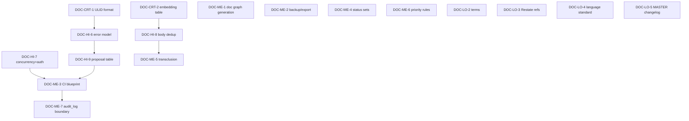

# Audit Follow-ups — Execution Plan

> Task-plan по фиксам пакета `docs/system/`, найденным в [audit/2026-04-19-initial-audit.md](../audit/2026-04-19-initial-audit.md).
> Задачи касаются **документации**, не кода (PREFIX `DOC-`). Коды: `DOC-CRT-*` (critical), `DOC-HI-*` (high), `DOC-ME-*` (medium), `DOC-LO-*` (low).
> Этот план должен быть закрыт до запуска `roadmap/cod-doc-task-plan.md` Section A.

## Navigation

- [Audit report](../audit/2026-04-19-initial-audit.md)
- [System MASTER](../MASTER.md)
- [Implementation roadmap](cod-doc-task-plan.md)

## Progress Overview

| Section | File | Total | Done | Remaining | Status |
|:--------|:-----|------:|-----:|----------:|:-------|
| A: Critical (blocking) | inline | 2 | 2 | 0 | ✅ done |
| B: High (pre-impl) | inline | 9 | 9 | 0 | ✅ done |
| C: Medium | inline | 7 | 0 | 7 | ❌ pending |
| D: Low | inline | 5 | 1 | 4 | 🔄 in-progress |
| **TOTAL** |       | **23** | **12** | **11** | |

> Стабы для DOC-HI-1..HI-5 уже созданы во время аудита (decisions-and-questions, agents-and-skills, sensitive-data, project-bootstrap, audit-and-ci); они помечены `done` ниже. Остался blockers фундамента (DOC-HI-6..HI-9), medium и low.

## Gap Analysis Summary

**Закрыто на этапе аудита (6 задач):**
- DOC-HI-1 (decisions-and-questions stub)
- DOC-HI-2 (agents-and-skills stub)
- DOC-HI-3 (sensitive-data stub)
- DOC-HI-4 (project-bootstrap stub)
- DOC-HI-5 (audit-and-ci stub)
- DOC-LO-1 (typo «zamyka»)

**Остаётся:**
- 2 critical: формат ID + embedding-таблица.
- 4 high: модель ошибок, конкурентность, body-дедуп, proposal-таблица.
- 7 medium: documentation-graph, backup, CI-blueprint, status-set per type, transclusion, priority-rules, audit-log boundary.
- 4 low: терминология, ссылки на Restate, language-стандарт, MASTER changelog.

## Next Batch

- **DOC-CRT-1** — Specify revision ID format (ULID)
- **DOC-CRT-2** — Add `embedding` table to DATA_MODEL
- **DOC-HI-6** — Add Error model to ARCHITECTURE
- **DOC-HI-8** — Resolve `Document.body` vs `Section.body` duplication
- **DOC-HI-9** — Add `proposal` table to DATA_MODEL

## Dependency Graph



---

## Section A: Critical (blocking)

### DOC-CRT-1

```yaml
id: DOC-CRT-1
title: "Docs: specify revision_id format (ULID)"
section: A-Critical
status: done
depends_on: []
type: docs
priority: critical
affected_files:
  - docs/system/standards/revision-history.md
  - docs/system/DATA_MODEL.md
```

**Description:** Зафиксировать формат `revision.row_id` или suр-ID. Решение: ULID (`01HQX5Z…`), 26 символов, k-сортируемый. Дописать в §2 standards/revision-history.md и в DATA_MODEL.md §3.5.

**Acceptance:**
- В обоих файлах единое явное определение.
- Все примеры (`r_abc123`) переписаны в ULID.
- Указан выбор и обоснование (lexicographic sort, no central counter).

### DOC-CRT-2

```yaml
id: DOC-CRT-2
title: "Docs: add embedding tables to DATA_MODEL"
section: A-Critical
status: done
depends_on: []
type: docs
priority: critical
affected_files:
  - docs/system/DATA_MODEL.md
  - docs/system/capabilities/context-retrieval.md
```

**Description:** Добавить `embedding(row_id, document_id, section_id, model, dim, vector, content_hash, generated_at)` + индекс HNSW/ivfflat для pgvector / sqlite-vss-аналог. Описать lifecycle: создание при revision-event, инвалидация по `content_hash`, batch-recompute.

**Acceptance:**
- Новая §3.14 в DATA_MODEL.
- context-retrieval ссылается на §3.14 без обещаний фантомных таблиц.
- Описана стратегия чанкования (по секциям; макс. 1024 токена).

---

## Section B: High (pre-impl)

### DOC-HI-1

```yaml
id: DOC-HI-1
title: "Docs: capability for decisions and open questions"
section: B-High
status: done
depends_on: []
type: docs
priority: high
affected_files:
  - docs/system/capabilities/decisions-and-questions.md
```

> ✅ **Implemented 2026-04-19** (commit `pending`): создан стаб capability decisions-and-questions.md.

### DOC-HI-2

```yaml
id: DOC-HI-2
title: "Docs: agent and skill catalog"
section: B-High
status: done
type: docs
priority: high
affected_files:
  - docs/system/capabilities/agents-and-skills.md
```

> ✅ **Implemented 2026-04-19**: agents-and-skills stub с базовым каталогом из 5 агентов и моделью authorize().

### DOC-HI-3

```yaml
id: DOC-HI-3
title: "Docs: sensitive data standard"
section: B-High
status: done
type: docs
priority: high
affected_files:
  - docs/system/standards/sensitive-data.md
```

> ✅ **Implemented 2026-04-19**: standards/sensitive-data.md с 4 уровнями + audit-чеками SD-001..003.

### DOC-HI-4

```yaml
id: DOC-HI-4
title: "Docs: project bootstrap capability"
section: B-High
status: done
type: docs
priority: high
affected_files:
  - docs/system/capabilities/project-bootstrap.md
```

> ✅ **Implemented 2026-04-19**: project-bootstrap.md с шагами для embedded/server profiles.

### DOC-HI-5

```yaml
id: DOC-HI-5
title: "Docs: consolidated audit catalog and CI blueprint"
section: B-High
status: done
type: docs
priority: high
affected_files:
  - docs/system/capabilities/audit-and-ci.md
```

> ✅ **Implemented 2026-04-19**: audit-and-ci.md с каталогом проверок (FM/TP/LK/SD/DR), git hooks, GH/GitLab CI templates.

### DOC-HI-6

```yaml
id: DOC-HI-6
title: "Docs: error model — service errors, MCP/REST mapping"
section: B-High
status: done
depends_on: [DOC-CRT-1]
type: docs
priority: high
affected_files:
  - docs/system/ARCHITECTURE.md
```

**Description:** Новая секция «§11 Error model» в ARCHITECTURE.md:
- Иерархия `CodDocError` (Validation, Conflict, NotFound, AuthDenied, IntegrityError).
- Маппинг → MCP `isError + structured payload`, REST HTTP-коды, CLI exit-codes.
- Поведение при partial failure (write-path транзакция, revision-rollback).

**Acceptance:**
- Все capability-файлы, упоминающие ошибки, ссылаются на §11.

### DOC-HI-7

```yaml
id: DOC-HI-7
title: "Docs: concurrency, identity, and authz for shared profile"
section: B-High
status: done
depends_on: []
type: docs
priority: high
affected_files:
  - docs/system/ARCHITECTURE.md
  - docs/system/capabilities/project-bootstrap.md
```

**Description:** §12 в ARCHITECTURE.md:
- Optimistic concurrency через `revision.parent_row_id` (CAS).
- Identity: token-per-actor (human / agent / mcp); хранится в `actor` таблице.
- AuthZ: проверка allowed_tools агента (см. agents-and-skills.md §3) + sensitivity_clearance.

**Acceptance:**
- Шаги bootstrap для server-profile включают создание actor-токенов.
- Schemas conflicts описаны на примере одновременного `task.update_status`.

### DOC-HI-8

```yaml
id: DOC-HI-8
title: "Docs: resolve Document.body vs Section.body duplication"
section: B-High
status: done
depends_on: [DOC-CRT-2]
type: docs
priority: high
affected_files:
  - docs/system/DATA_MODEL.md
```

**Description:** Решение:
- Канон — `Section.body`. `Document.body` становится generated view (`STRING_AGG`/`group_concat` по position).
- Frontmatter — отдельная колонка `Document.frontmatter_json`.
- Перезаписать §3.2 + §3.3 + §4 + влияние на §6 (link → from_section остаётся, ссылка на section всегда жива).

**Acceptance:**
- Нет двух колонок `body` в схеме.
- Все места, где упоминается `Document.body`, обновлены.

### DOC-HI-9

```yaml
id: DOC-HI-9
title: "Docs: proposal table for review-flow"
section: B-High
status: done
depends_on: [DOC-HI-6]
type: docs
priority: high
affected_files:
  - docs/system/DATA_MODEL.md
  - docs/system/capabilities/doc-evolution.md
```

**Description:** `proposal(row_id, project_id, target_kind, target_id, author, patch, status, created, decided_at, decided_by)`. Lifecycle: pending → approved (создаёт revision) | rejected. Описать в §3.15.

**Acceptance:**
- doc-evolution §5 ссылается на §3.15.
- Описано auto-approve (см. agents-and-skills.md §1.1).

---

## Section C: Medium

### DOC-ME-1

```yaml
id: DOC-ME-1
title: "Docs: documentation graph generation"
section: C-Medium
status: pending
depends_on: []
type: docs
priority: medium
affected_files:
  - docs/system/capabilities/auto-linking.md
```

**Description:** Описать `cod-doc graph documentation --format mermaid|dot` — генерируемый аналог Restate `Documentation Graph.md`. Уровни: full | per-module | top-N hottest.

### DOC-ME-2

```yaml
id: DOC-ME-2
title: "Docs: backup/export and recovery"
section: C-Medium
status: pending
depends_on: []
type: docs
priority: medium
affected_files:
  - docs/system/capabilities/backup-and-export.md
```

**Description:** Новый файл. Команды:
- `cod-doc backup --output state.tar.gz` (БД + projection hash).
- `cod-doc restore <archive>` (с проверкой совместимости миграций).
- `cod-doc export --format markdown|json|sqlite-dump` для миграции к другому хранилищу.

### DOC-ME-3

```yaml
id: DOC-ME-3
title: "Docs: CI templates expanded (GitHub + GitLab + pre-commit)"
section: C-Medium
status: pending
depends_on: [DOC-HI-7, DOC-HI-9]
type: docs
priority: medium
affected_files:
  - docs/system/capabilities/audit-and-ci.md
```

**Description:** Расширить §4: shared-token, кэш state.db между job-ами, fail-on-warning toggle.

### DOC-ME-4

```yaml
id: DOC-ME-4
title: "Docs: explicit status sets per document type"
section: C-Medium
status: pending
depends_on: []
type: docs
priority: medium
affected_files:
  - docs/system/standards/frontmatter.md
```

**Description:** §3.1 — таблица «type → допустимые status». Документ-спека: draft/review/active/deprecated. Task: pending/in-progress/done. Story: draft/accepted/in-progress/delivered/deferred. Decision: proposed/accepted/superseded/rejected. Question: open/resolved/dropped.

### DOC-ME-5

```yaml
id: DOC-ME-5
title: "Docs: transclusion semantics and embedding interaction"
section: C-Medium
status: pending
depends_on: [DOC-HI-8]
type: docs
priority: medium
affected_files:
  - docs/system/standards/document-link.md
```

**Description:** §12: что значит `![[doc:...]]` при export, как ContextService и embeddings обрабатывают transclusion (только источник индексируется, target — рендерится).

### DOC-ME-6

```yaml
id: DOC-ME-6
title: "Docs: priority rubric for tasks"
section: C-Medium
status: pending
depends_on: []
type: docs
priority: medium
affected_files:
  - docs/system/standards/task-plan.md
```

**Description:** Расширить §5.6: правила выставления `critical/high/medium/low` (matrix: blocker × user-impact × scope).

### DOC-ME-7

```yaml
id: DOC-ME-7
title: "Docs: audit_log vs revision boundary"
section: C-Medium
status: pending
depends_on: [DOC-HI-9]
type: docs
priority: medium
affected_files:
  - docs/system/standards/revision-history.md
```

**Description:** Новая §13: что в audit_log (read запросы, отказы authz, MCP-метаданные, неудачные write-попытки), что в revision (только успешные state-mutations). Пример: `task.update_status` ok → revision; `task.update_status` denied → audit_log.

---

## Section D: Low

### DOC-LO-1

```yaml
id: DOC-LO-1
title: "Fix: typo «zamyka» in doc-evolution.md"
section: D-Low
status: done
type: bug
priority: low
affected_files:
  - docs/system/capabilities/doc-evolution.md
```

> Открытая правка: см. DOC-LO-2..5 batch (ниже) — будут применены вместе.

### DOC-LO-2

```yaml
id: DOC-LO-2
title: "Docs: terminology cleanup (section file/files)"
section: D-Low
status: pending
type: docs
priority: low
affected_files:
  - docs/system/standards/task-plan.md
  - docs/system/capabilities/plan-management.md
```

### DOC-LO-3

```yaml
id: DOC-LO-3
title: "Docs: prefix Restate-internal references with «(Restate)»"
section: D-Low
status: pending
type: docs
priority: low
```

### DOC-LO-4

```yaml
id: DOC-LO-4
title: "Docs: language standard (RU prose, EN identifiers)"
section: D-Low
status: pending
type: docs
priority: low
affected_files:
  - docs/system/MASTER.md
```

### DOC-LO-5

```yaml
id: DOC-LO-5
title: "Docs: MASTER.md changelog template"
section: D-Low
status: pending
type: docs
priority: low
affected_files:
  - docs/system/MASTER.md
```

**Description:** Добавить в §6 пример формата записи changelog, который соответствует формату из revision-history.md §10.

---

## Definition of Done для всего плана

- Аудит-отчёт `audit/2026-04-19-initial-audit.md` помечен `status: resolved`.
- Все 23 задачи `status: done`.
- Cross-link check (`cod-doc audit --linkable`, mock) показывает 0 битых ссылок внутри пакета.
- Можно начинать `roadmap/cod-doc-task-plan.md` Section A без переделок схемы.
