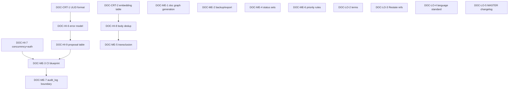

# Audit Follow-ups — Execution Plan

> A task plan for fixes to the `docs/system/` package, found in [audit/2026-04-19-initial-audit.md](../audit/2026-04-19-initial-audit.md).
> The tasks concern **documentation**, not code (PREFIX `DOC-`). Codes: `DOC-CRT-*` (critical), `DOC-HI-*` (high), `DOC-ME-*` (medium), `DOC-LO-*` (low).
> This plan must be closed before starting `roadmap/cod-doc-task-plan.md` Section A.

## Navigation

- [Audit report](../audit/2026-04-19-initial-audit.md)
- [System MASTER](../MASTER.md)
- [Implementation roadmap](cod-doc-task-plan.md)

## Progress Overview

| Section | File | Total | Done | Remaining | Status |
|:--------|:-----|------:|-----:|----------:|:-------|
| A: Critical (blocking) | inline | 2 | 2 | 0 | ✅ done |
| B: High (pre-impl) | inline | 9 | 9 | 0 | ✅ done |
| C: Medium | inline | 7 | 7 | 0 | ✅ done |
| D: Low | inline | 5 | 5 | 0 | ✅ done |
| **TOTAL** |       | **23** | **23** | **0** | ✅ done |

> Stubs for DOC-HI-1..HI-5 were already created during the audit (decisions-and-questions, agents-and-skills, sensitive-data, project-bootstrap, audit-and-ci); they are marked `done` below.
>
> **STB-021 closure 2026-06-08** (see [ROADMAP](ROADMAP.md)): the remaining
> 10 tasks are closed. Standards/conventions (existing concepts): DOC-ME-5 transclusion
> (document-link §12), DOC-ME-6 priority rubric (task-plan §5.1), DOC-ME-7
> audit_log↔revision (revision-history §13), DOC-LO-2 terminology, DOC-LO-3
> Restate-prefix, DOC-LO-4 language standard, DOC-LO-5 changelog template
> (MASTER §6/§7). Capability specs for **not yet implemented** commands are marked
> 🟡 planned: DOC-ME-1 documentation graph (auto-linking §5.1), DOC-ME-2
> backup-and-export (a new file). DOC-ME-3 CI patterns (audit-and-ci §4.4) —
> the real configuration.

## Gap Analysis Summary

**Closed at the audit stage (6 tasks):**
- DOC-HI-1 (decisions-and-questions stub)
- DOC-HI-2 (agents-and-skills stub)
- DOC-HI-3 (sensitive-data stub)
- DOC-HI-4 (project-bootstrap stub)
- DOC-HI-5 (audit-and-ci stub)
- DOC-LO-1 (typo "zamyka")

**Remains:**
- 2 critical: ID format + embedding table.
- 4 high: error model, concurrency, body dedup, proposal table.
- 7 medium: documentation-graph, backup, CI-blueprint, status set per type, transclusion, priority-rules, audit-log boundary.
- 4 low: terminology, Restate references, language standard, MASTER changelog.

## Next Batch

- **DOC-CRT-1** — Specify revision ID format (ULID)
- **DOC-CRT-2** — Add `embedding` table to DATA_MODEL
- **DOC-HI-6** — Add Error model to ARCHITECTURE
- **DOC-HI-8** — Resolve `Document.body` vs `Section.body` duplication
- **DOC-HI-9** — Add `proposal` table to DATA_MODEL

## Dependency Graph


```mermaid
graph TD
  DOC_CRT_1[DOC-CRT-1 ULID format]
  DOC_CRT_2[DOC-CRT-2 embedding table]
  DOC_HI_6[DOC-HI-6 error model]
  DOC_HI_7[DOC-HI-7 concurrency+auth]
  DOC_HI_8[DOC-HI-8 body dedup]
  DOC_HI_9[DOC-HI-9 proposal table]
  DOC_ME_1[DOC-ME-1 doc graph generation]
  DOC_ME_2[DOC-ME-2 backup/export]
  DOC_ME_3[DOC-ME-3 CI blueprint]
  DOC_ME_4[DOC-ME-4 status sets]
  DOC_ME_5[DOC-ME-5 transclusion]
  DOC_ME_6[DOC-ME-6 priority rules]
  DOC_ME_7[DOC-ME-7 audit_log boundary]
  DOC_LO_2[DOC-LO-2 terms]
  DOC_LO_3[DOC-LO-3 Restate refs]
  DOC_LO_4[DOC-LO-4 language standard]
  DOC_LO_5[DOC-LO-5 MASTER changelog]

  DOC_CRT_1 --> DOC_HI_6
  DOC_CRT_2 --> DOC_HI_8
  DOC_HI_6 --> DOC_HI_9
  DOC_HI_7 --> DOC_ME_3
  DOC_HI_8 --> DOC_ME_5
  DOC_HI_9 --> DOC_ME_3
  DOC_ME_3 --> DOC_ME_7
```

---

## Section A: Critical (blocking)

### DOC-CRT-1

```yaml
id: DOC-CRT-1
title: "Docs: specify revision_id format (ULID)"
section: A-Critical
status: done
depends_on: []
type: docs
priority: critical
affected_files:
  - docs/system/standards/revision-history.md
  - docs/system/DATA_MODEL.md
```

**Description:** Fix the format of `revision.row_id` or a sub-ID. Decision: ULID (`01HQX5Z…`), 26 characters, k-sortable. Add to §2 of standards/revision-history.md and to DATA_MODEL.md §3.5.

**Acceptance:**
- A single explicit definition in both files.
- All examples (`r_abc123`) are rewritten as ULID.
- The choice and rationale are stated (lexicographic sort, no central counter).

### DOC-CRT-2

```yaml
id: DOC-CRT-2
title: "Docs: add embedding tables to DATA_MODEL"
section: A-Critical
status: done
depends_on: []
type: docs
priority: critical
affected_files:
  - docs/system/DATA_MODEL.md
  - docs/system/capabilities/context-retrieval.md
```

**Description:** Add `embedding(row_id, document_id, section_id, model, dim, vector, content_hash, generated_at)` + an HNSW/ivfflat index for pgvector / a sqlite-vss analog. Describe the lifecycle: creation on a revision-event, invalidation by `content_hash`, batch-recompute.

**Acceptance:**
- A new §3.14 in DATA_MODEL.
- context-retrieval references §3.14 without promising phantom tables.
- The chunking strategy is described (by section; max 1024 tokens).

---

## Section B: High (pre-impl)

### DOC-HI-1

```yaml
id: DOC-HI-1
title: "Docs: capability for decisions and open questions"
section: B-High
status: done
depends_on: []
type: docs
priority: high
affected_files:
  - docs/system/capabilities/decisions-and-questions.md
```

> ✅ **Implemented 2026-04-19** (commit `pending`): a stub capability decisions-and-questions.md is created.

### DOC-HI-2

```yaml
id: DOC-HI-2
title: "Docs: agent and skill catalog"
section: B-High
status: done
type: docs
priority: high
affected_files:
  - docs/system/capabilities/agents-and-skills.md
```

> ✅ **Implemented 2026-04-19**: an agents-and-skills stub with a basic catalog of 5 agents and an authorize() model.

### DOC-HI-3

```yaml
id: DOC-HI-3
title: "Docs: sensitive data standard"
section: B-High
status: done
type: docs
priority: high
affected_files:
  - docs/system/standards/sensitive-data.md
```

> ✅ **Implemented 2026-04-19**: standards/sensitive-data.md with 4 levels + audit checks SD-001..003.

### DOC-HI-4

```yaml
id: DOC-HI-4
title: "Docs: project bootstrap capability"
section: B-High
status: done
type: docs
priority: high
affected_files:
  - docs/system/capabilities/project-bootstrap.md
```

> ✅ **Implemented 2026-04-19**: project-bootstrap.md with steps for embedded/server profiles.

### DOC-HI-5

```yaml
id: DOC-HI-5
title: "Docs: consolidated audit catalog and CI blueprint"
section: B-High
status: done
type: docs
priority: high
affected_files:
  - docs/system/capabilities/audit-and-ci.md
```

> ✅ **Implemented 2026-04-19**: audit-and-ci.md with a catalog of checks (FM/TP/LK/SD/DR), git hooks, GH/GitLab CI templates.

### DOC-HI-6

```yaml
id: DOC-HI-6
title: "Docs: error model — service errors, MCP/REST mapping"
section: B-High
status: done
depends_on: [DOC-CRT-1]
type: docs
priority: high
affected_files:
  - docs/system/ARCHITECTURE.md
```

**Description:** A new section "§11 Error model" in ARCHITECTURE.md:
- A `CodDocError` hierarchy (Validation, Conflict, NotFound, AuthDenied, IntegrityError).
- A mapping → MCP `isError + structured payload`, REST HTTP codes, CLI exit codes.
- Behavior on partial failure (write-path transaction, revision-rollback).

**Acceptance:**
- All capability files that mention errors reference §11.

### DOC-HI-7

```yaml
id: DOC-HI-7
title: "Docs: concurrency, identity, and authz for shared profile"
section: B-High
status: done
depends_on: []
type: docs
priority: high
affected_files:
  - docs/system/ARCHITECTURE.md
  - docs/system/capabilities/project-bootstrap.md
```

**Description:** §12 in ARCHITECTURE.md:
- Optimistic concurrency via `revision.parent_row_id` (CAS).
- Identity: a token per actor (human / agent / mcp); stored in the `actor` table.
- AuthZ: checking the agent's allowed_tools (see agents-and-skills.md §3) + sensitivity_clearance.

**Acceptance:**
- Bootstrap steps for the server-profile include creating actor tokens.
- Schema conflicts are described on the example of a concurrent `task.update_status`.

### DOC-HI-8

```yaml
id: DOC-HI-8
title: "Docs: resolve Document.body vs Section.body duplication"
section: B-High
status: done
depends_on: [DOC-CRT-2]
type: docs
priority: high
affected_files:
  - docs/system/DATA_MODEL.md
```

**Description:** Decision:
- The canonical is `Section.body`. `Document.body` becomes a generated view (`STRING_AGG`/`group_concat` by position).
- Frontmatter — a separate column `Document.frontmatter_json`.
- Rewrite §3.2 + §3.3 + §4 + the impact on §6 (link → from_section remains, a reference to a section is always alive).

**Acceptance:**
- No two `body` columns in the schema.
- All places that mention `Document.body` are updated.

### DOC-HI-9

```yaml
id: DOC-HI-9
title: "Docs: proposal table for review-flow"
section: B-High
status: done
depends_on: [DOC-HI-6]
type: docs
priority: high
affected_files:
  - docs/system/DATA_MODEL.md
  - docs/system/capabilities/doc-evolution.md
```

**Description:** `proposal(row_id, project_id, target_kind, target_id, author, patch, status, created, decided_at, decided_by)`. Lifecycle: pending → approved (creates a revision) | rejected. Describe in §3.15.

**Acceptance:**
- doc-evolution §5 references §3.15.
- Auto-approve is described (see agents-and-skills.md §1.1).

---

## Section C: Medium

### DOC-ME-1

```yaml
id: DOC-ME-1
title: "Docs: documentation graph generation"
section: C-Medium
status: done
depends_on: []
type: docs
priority: medium
affected_files:
  - docs/system/capabilities/auto-linking.md
```

**Description:** Describe `cod-doc graph documentation --format mermaid|dot` — a generated analog of Restate `Documentation Graph.md`. Levels: full | per-module | top-N hottest.

### DOC-ME-2

```yaml
id: DOC-ME-2
title: "Docs: backup/export and recovery"
section: C-Medium
status: done
depends_on: []
type: docs
priority: medium
affected_files:
  - docs/system/capabilities/backup-and-export.md
```

**Description:** A new file. Commands:
- `cod-doc backup --output state.tar.gz` (DB + projection hash).
- `cod-doc restore <archive>` (with a migration compatibility check).
- `cod-doc export --format markdown|json|sqlite-dump` for migration to another store.

### DOC-ME-3

```yaml
id: DOC-ME-3
title: "Docs: CI templates expanded (GitHub + GitLab + pre-commit)"
section: C-Medium
status: done
depends_on: [DOC-HI-7, DOC-HI-9]
type: docs
priority: medium
affected_files:
  - docs/system/capabilities/audit-and-ci.md
```

**Description:** Expand §4: shared-token, state.db cache between jobs, a fail-on-warning toggle.

### DOC-ME-4

```yaml
id: DOC-ME-4
title: "Docs: explicit status sets per document type"
section: C-Medium
status: done
depends_on: []
type: docs
priority: medium
affected_files:
  - docs/system/standards/frontmatter.md
```

**Description:** §3.1 — a table "type → allowed status". Document spec: draft/review/active/deprecated. Task: pending/in-progress/done. Story: draft/accepted/in-progress/delivered/deferred. Decision: proposed/accepted/superseded/rejected. Question: open/resolved/dropped.

> ✅ **Implemented 2026-04-28:** Added §2a "Allowed `status` by `type`" in [standards/frontmatter.md](../standards/frontmatter.md) — an explicit table for all 11 types, including `audit-report` (active/resolved/superseded). Added codes `FM-006` (incompatible type/status pair) and `FM-007` (reserved for sensitivity). Refined §7 — `source_of_truth` as a nested dict for execution-plan and its interaction with FM-003.

### DOC-ME-5

```yaml
id: DOC-ME-5
title: "Docs: transclusion semantics and embedding interaction"
section: C-Medium
status: done
depends_on: [DOC-HI-8]
type: docs
priority: medium
affected_files:
  - docs/system/standards/document-link.md
```

**Description:** §12: what `![[doc:...]]` means on export, how ContextService and embeddings handle transclusion (only the source is indexed, the target is rendered).

### DOC-ME-6

```yaml
id: DOC-ME-6
title: "Docs: priority rubric for tasks"
section: C-Medium
status: done
depends_on: []
type: docs
priority: medium
affected_files:
  - docs/system/standards/task-plan.md
```

**Description:** Expand §5.6: rules for setting `critical/high/medium/low` (matrix: blocker × user-impact × scope).

### DOC-ME-7

```yaml
id: DOC-ME-7
title: "Docs: audit_log vs revision boundary"
section: C-Medium
status: done
depends_on: [DOC-HI-9]
type: docs
priority: medium
affected_files:
  - docs/system/standards/revision-history.md
```

**Description:** A new §13: what goes into audit_log (read requests, authz denials, MCP metadata, failed write attempts), what goes into revision (only successful state-mutations). Example: `task.update_status` ok → revision; `task.update_status` denied → audit_log.

---

## Section D: Low

### DOC-LO-1

```yaml
id: DOC-LO-1
title: "Fix: typo «zamyka» in doc-evolution.md"
section: D-Low
status: done
type: bug
priority: low
affected_files:
  - docs/system/capabilities/doc-evolution.md
```

> An open edit: see DOC-LO-2..5 batch (below) — will be applied together.

### DOC-LO-2

```yaml
id: DOC-LO-2
title: "Docs: terminology cleanup (section file/files)"
section: D-Low
status: done
type: docs
priority: low
affected_files:
  - docs/system/standards/task-plan.md
  - docs/system/capabilities/plan-management.md
```

### DOC-LO-3

```yaml
id: DOC-LO-3
title: "Docs: prefix Restate-internal references with «(Restate)»"
section: D-Low
status: done
type: docs
priority: low
```

### DOC-LO-4

```yaml
id: DOC-LO-4
title: "Docs: language standard (RU prose, EN identifiers)"
section: D-Low
status: done
type: docs
priority: low
affected_files:
  - docs/system/MASTER.md
```

### DOC-LO-5

```yaml
id: DOC-LO-5
title: "Docs: MASTER.md changelog template"
section: D-Low
status: done
type: docs
priority: low
affected_files:
  - docs/system/MASTER.md
```

**Description:** Add to §6 an example of a changelog entry format that matches the format from revision-history.md §10.

---

## Definition of Done for the whole plan

- The audit report `audit/2026-04-19-initial-audit.md` is marked `status: resolved`.
- All 23 tasks are `status: done`.
- A cross-link check (`cod-doc audit --linkable`, mock) shows 0 broken links inside the package.
- `roadmap/cod-doc-task-plan.md` Section A can start without rework of the schema.
