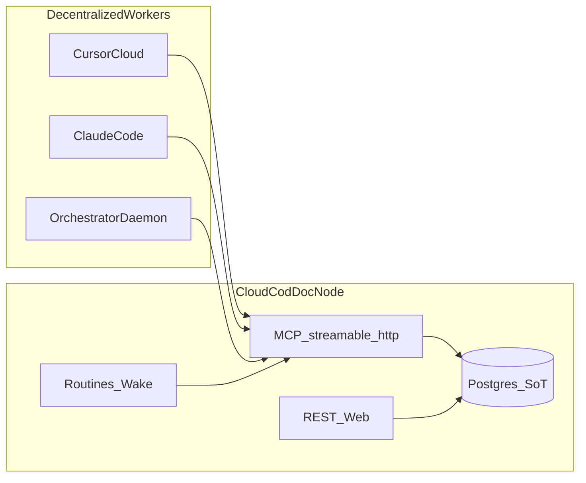

# Cloud Agent Plane — Kickoff Brief (2026-07-29)

> **Purpose.** Entry point for the COD-DOC transition to a cloud
> documentation control plane, where AI fully maintains documentation
> through the service, and agents operate as decentralized workers.
>
> **Not source of truth.** The canonical document is [cloud-agent-plane-task-plan.md](cloud-agent-plane-task-plan.md)
> and the capability [cloud-agent-plane.md](../capabilities/cloud-agent-plane.md).

## 1. TL;DR

- **What:** Turn COD-DOC into a cloud node (Postgres + remote MCP +
  Bearer identity), extend the agent profile with document writes
  (`agent_apply`), and decouple mutations from the local `root_path`.
- **Why:** Cycle-5 delivered a task-centric 6-tool surface, but the agent
  is still "local": stdio, no MCP patch, no enforced auth, projection
  requires FS. Without this, AI cannot maintain docs "through the service
  only" from Cursor Cloud / remote Claude.
- **Not doing:** multi-tenant SaaS, P2P federation of nodes.
- **Scope:** 4 sections CAP-A..CAP-D, ~18 tasks (see plan).

## 2. Target picture

## 3. State as of 2026-07-29

| Element | State |
|---------|-------|
| Agent profile 6 tools | ✅ cycle-5 |
| Atomic checkout / idempotent pick | ✅ |
| `streamable-http` transport | ✅ present, binds 127.0.0.1, no auth |
| Postgres dialect in migrations | ✅ code; ❌ CI run (IMPL-A-ME-2) |
| docker-compose + Postgres | ❌ compose without postgres, host paths |
| MCP `doc_patch_section` | ❌ service exists, MCP does not |
| `agent_apply` (doc writes in agent profile) | ❌ |
| Bearer → actor | ❌ ARCHITECTURE §12 spec |
| Pure-DB mode without root_path | ❌ |

## 4. First tick (for the next session)

1. Read the capability
   [`cloud-agent-plane.md`](../capabilities/cloud-agent-plane.md) §1–3.
2. Pick **CAP-001** (Postgres CI smoke) — no prerequisite, unblocks the
   server/cloud profile.
3. In parallel, you can prepare CAP-010 (MCP `doc_patch_section`) — closes
   the doc-evolution ↔ MCP gap before `agent_apply` arrives.

## 5. Acceptance for Phase 1 (foundation + doc write path)

- [ ] `alembic upgrade head` + pytest marker `pg` are green in CI.
- [ ] `docker compose` brings up `postgres` + `cod-doc` without host-specific
      volume paths in the repository.
- [ ] MCP tool `doc_patch_section` persists body + revision + activity.
- [ ] A remote client to `streamable-http` with a Bearer token completes
      pick → patch → complete on a single project in Postgres.

## 6. Risks

| Risk | Mitigation |
|------|------------|
| Agent profile bloats with CRUD | One composite `agent_apply`, do not pull in all of `doc_*` |
| Auth breaks local stdio DX | `COD_DOC_AUTH=optional` default for embedded; `required` only for cloud |
| Projection/git users wait for files | Export-job + handbook recipe; SoT is explicitly the DB |
| Scope creep into SaaS | Non-goals are fixed in capability §7 and RFC 23 |
