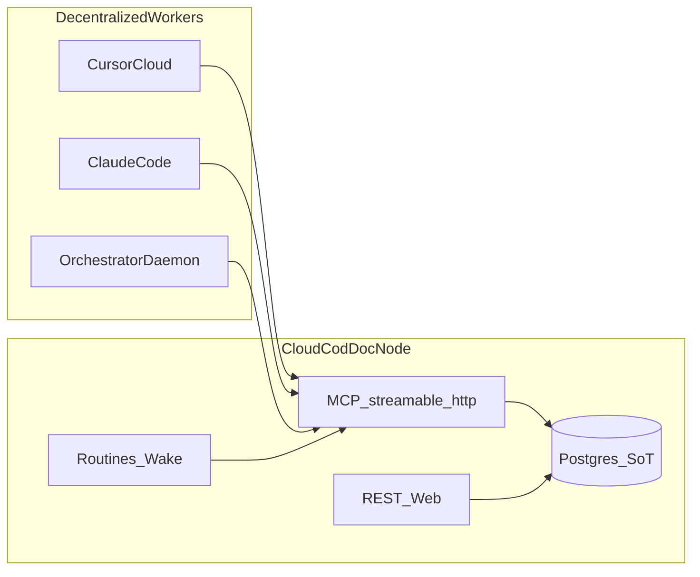

# Cloud Agent Plane — Kickoff Brief (2026-07-29)

> **Назначение.** Точка входа в переход COD-DOC к облачному
> documentation control plane, где ИИ полностью ведёт документацию
> через сервис, а агенты работают как децентрализованные воркеры.
>
> **Не source of truth.** Канон — [cloud-agent-plane-task-plan.md](cloud-agent-plane-task-plan.md)
> и capability [cloud-agent-plane.md](../capabilities/cloud-agent-plane.md).

## 1. TL;DR

- **Что:** Сделать COD-DOC облачным узлом (Postgres + remote MCP +
  Bearer identity), расширить agent-профиль записью документов
  (`agent_apply`), отвязать мутации от локального `root_path`.
- **Почему:** Cycle-5 дал task-centric 6-tool surface, но агент всё ещё
  «локальный»: stdio, нет MCP patch, нет enforced auth, projection
  требует FS. Без этого ИИ не может вести docs «только через сервис»
  из Cursor Cloud / удалённого Claude.
- **Не делаем:** multi-tenant SaaS, P2P-федерацию узлов.
- **Объём:** 4 секции CAP-A..CAP-D, ~18 задач (см. plan).

## 2. Целевая картинка

## 3. Состояние на 2026-07-29

| Элемент | Состояние |
|---------|-----------|
| Agent profile 6 tools | ✅ cycle-5 |
| Atomic checkout / idempotent pick | ✅ |
| `streamable-http` transport | ✅ есть, bind 127.0.0.1, без auth |
| Postgres dialect в миграциях | ✅ код; ❌ CI-прогон (IMPL-A-ME-2) |
| docker-compose + Postgres | ❌ compose без postgres, host paths |
| MCP `doc_patch_section` | ❌ сервис есть, MCP нет |
| `agent_apply` (doc writes в agent profile) | ❌ |
| Bearer → actor | ❌ спека ARCHITECTURE §12 |
| Pure-DB mode без root_path | ❌ |

## 4. Первый tick (для следующего сеанса)

1. Прочитать capability
   [`cloud-agent-plane.md`](../capabilities/cloud-agent-plane.md) §1–3.
2. Взять **CAP-001** (Postgres CI smoke) — нет prerequisite, разблокирует
   server/cloud профиль.
3. Параллельно можно готовить CAP-010 (MCP `doc_patch_section`) — закрывает
   gap doc-evolution ↔ MCP до появления `agent_apply`.

## 5. Acceptance for Phase 1 (foundation + doc write path)

- [ ] `alembic upgrade head` + pytest-маркер `pg` зелёные в CI.
- [ ] `docker compose` поднимает `postgres` + `cod-doc` без host-specific
      volume paths в репозитории.
- [ ] MCP tool `doc_patch_section` персистит body + revision + activity.
- [ ] Remote client к `streamable-http` с Bearer проходит
      pick → patch → complete на одном проекте в Postgres.

## 6. Риски

| Риск | Митигация |
|------|-----------|
| Agent profile раздувается CRUD'ом | Один композитный `agent_apply`, не протаскивать весь `doc_*` |
| Auth ломает local stdio DX | `COD_DOC_AUTH=optional` default для embedded; `required` только cloud |
| Projection/git пользователи ждут файлы | Export-job + handbook рецепт; SoT явно БД |
| Scope creep в SaaS | Non-goals зафиксированы в capability §7 и RFC 16 |
