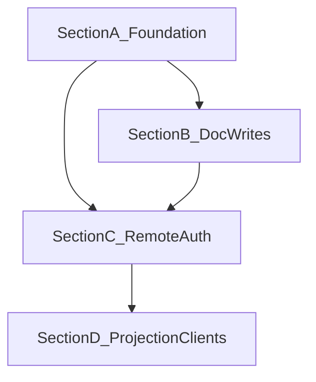

# Cloud Agent Plane — Execution Plan

> Канонический беклог перехода к облачному documentation control plane:
> ИИ ведёт документацию полностью через COD-DOC; агенты —
> децентрализованные remote-воркеры; SoT — Postgres.

## Navigation

- [Kickoff](cloud-agent-plane-kickoff-2026-07-29.md)
- [Capability](../capabilities/cloud-agent-plane.md)
- [RFC 23](../../../proposals/23-cloud-decentralized-agent-plane.md)

## Progress Overview

| Section | Theme | Tasks | Status |
|:--------|:------|------:|:-------|
| A | Cloud-ready data & compose | CAP-001..CAP-005 | 🟡 pending |
| B | Doc write path + agent_apply | CAP-010..CAP-014 | 🟡 pending |
| C | Remote MCP auth & multi-agent | CAP-020..CAP-024 | 🟡 pending |
| D | Projection optional + client recipes | CAP-030..CAP-033 | 🟡 pending |
| **TOTAL** | | **18** | 🟡 pending |

## Dependency Graph

## Acceptance per section

- **A** — Postgres CI зелёный; compose стек `postgres`+`cod-doc`;
  `COD_DOC_DB_URL` server path задокументирован; нет обязательных
  developer host paths в `docker-compose.yml`.
- **B** — MCP умеет патчить документы; agent profile пишет docs через
  `agent_apply` под checkout; activity/run_id на мутациях.
- **C** — streamable-http + Bearer enforced в cloud; два агента
  корректно разделяют checkout; audit deny.
- **D** — cloud node работает без обязательного `root_path` mirror;
  handbook/mcp-integration содержат remote client recipes.

---

## Section A — Cloud-ready foundation

### CAP-001 — Postgres migration + pytest smoke in CI
**Priority:** high  
**Deps:** none  
**Description:** Закрыть IMPL-A-ME-2: job/marker `pg` (testcontainers
или service container), `alembic upgrade head` + subset infra/service
tests на Postgres.  
**Acceptance:** CI краснеет при поломке Postgres DDL/views.

### CAP-002 — docker-compose: postgres service + env template
**Priority:** high  
**Deps:** CAP-001  
**Description:** Добавить сервис `postgres` в
[`docker-compose.yml`](../../../docker-compose.yml); `COD_DOC_DB_URL`;
убрать/параметризовать host-specific binds (`/Users/dakh/...`);
`.env.example` с cloud/server переменными.  
**Acceptance:** `docker compose up` на чистой машине поднимает health
API против Postgres.

### CAP-003 — entrypoint migrates server DB once
**Priority:** medium  
**Deps:** CAP-002  
**Description:** [`entrypoint.sh`](../../../entrypoint.sh) при
`COD_DOC_DB_URL=postgres://…` делает один `alembic upgrade head` на
shared DB (не per-project sqlite paths).  
**Acceptance:** холодный старт контейнера применяет миграции; повторный
старт идемпотентен.

### CAP-004 — Document `cloud` deploy profile in ARCHITECTURE
**Priority:** medium  
**Deps:** CAP-002  
**Description:** Обновить ARCHITECTURE §8 таблицей embedded/server/cloud
(см. capability §4); handbook §3 ссылается на compose+Postgres.  
**Acceptance:** L0 docs согласованы с capability.

### CAP-005 — Shared engine/session for server mode MCP
**Priority:** high  
**Deps:** CAP-001  
**Description:** [`_db.session_factory`](../../../cod_doc/mcp/tools/_db.py)
в server/cloud режиме резолвит проект по slug в **общей** БД, а не
`resolve_db_url(entry.path)` → sqlite-per-project.  
**Acceptance:** два MCP-клиента к одному URL видят одни tasks/docs.

---

## Section B — Full doc lifecycle for agents

### CAP-010 — MCP `doc_patch_section` (+ activity)
**Priority:** high  
**Deps:** none (можно параллельно с A)  
**Description:** Экспонировать `DocService.patch_section` как MCP tool
в standard/full; emit activity; optimistic lock через
`base_revision_id`. Закрывает gap
[doc-evolution §4.2](../capabilities/doc-evolution.md).  
**Acceptance:** тест MCP round-trip; body+revision+activity в БД.

### CAP-011 — MCP coverage for create/rename used by agents
**Priority:** medium  
**Deps:** CAP-010  
**Description:** Проверить/дотянуть `doc_create` / `doc_rename` (уже
есть) на persist + activity; добавить недостающие section ops
(`doc_add_section`) если нужны для agent_apply.  
**Acceptance:** agent может создать doc и секцию без CLI.

### CAP-012 — `agent_apply` composite tool
**Priority:** high  
**Deps:** CAP-010, CAP-005  
**Description:** Новый тул в agent profile:
`agent_apply(project, task_id, agent_id, ops: list[op])` где op ∈
`patch_section | add_section | create_doc | rename_doc | …`.
Требует активного checkout тем же `agent_id`. Одна транзакция,
один `run_id`.  
**Acceptance:** contract tests как у `agent_pick`; profile list = 7
tools (или 6 с заменой — зафиксировать в RFC: **7 = +apply**).

### CAP-013 — Orchestrator skill: docs only via agent_apply
**Priority:** medium  
**Deps:** CAP-012  
**Description:** Обновить
[`cod_doc/skills/orchestrator/SKILL.md`](../../../cod_doc/skills/orchestrator/SKILL.md):
запрет писать markdown SoT на диск; обязательный `agent_apply` для
doc mutations; remote MCP notes.  
**Acceptance:** skill matcher/docs согласованы; тест на текст skill
optional.

### CAP-014 — agent_complete verifies doc ops when task requires
**Priority:** low  
**Deps:** CAP-012  
**Description:** Если у задачи есть acceptance «docs updated» /
affected docs — complete проверяет наличие revision от этого run_id
(advisory → later enforce).  
**Acceptance:** documented warn-mode; тест на advisory signal.

---

## Section C — Remote MCP, auth, multi-agent

### CAP-020 — Bearer auth middleware for MCP HTTP + REST
**Priority:** high  
**Deps:** CAP-005  
**Description:** Реализовать ARCHITECTURE §12: таблица/использование
`actor.token_hash`; `COD_DOC_AUTH=required|optional`; stdio остаётся
implicit local actor.  
**Acceptance:** HTTP без токена → 401; с токеном → actor.handle в
revision.author.

### CAP-021 — Harden streamable-http bind + TLS recipe
**Priority:** medium  
**Deps:** CAP-020  
**Description:** Default cloud bind `0.0.0.0` только за proxy;
документировать Caddy/nginx TLS termination; запретить plaintext
auth over public net в handbook warnings.  
**Acceptance:** mcp-integration § remote обновлён.

### CAP-022 — Project-scoped tokens + tool allowlists
**Priority:** medium  
**Deps:** CAP-020  
**Description:** Токен ограничен `project_id` (+ optional
allowed_tools). Agent token не видит admin CRUD.  
**Acceptance:** token project A не читает/пишет project B.

### CAP-023 — Multi-agent concurrency soak test
**Priority:** medium  
**Deps:** CAP-012, CAP-020  
**Description:** Два клиента параллельно `agent_pick` / `agent_apply`
на общем Postgres; проверить locks, idempotent replay, no lost
updates (optimistic lock).  
**Acceptance:** pytest integration в CI (pg).

### CAP-024 — Wake/routines on cloud node (hook)
**Priority:** low  
**Deps:** CAP-021  
**Description:** Убедиться, что routines/wake (paperclip Section C)
живут в daemon рядом с cloud node и будят remote-compatible run
(structured WakeContext). Не реализовывать весь proposal 07 здесь —
только cloud hosting hook + doc.  
**Acceptance:** roadmap cross-link; no regression local daemon.

---

## Section D — Optional projection & client recipes

### CAP-030 — Server mode without mandatory root_path I/O
**Priority:** high  
**Deps:** CAP-005, CAP-012  
**Description:** Мутации doc body не требуют существования
`root_path` на диске. `root_path` nullable или sentinel для cloud
projects; export — явную операцию.  
**Acceptance:** e2e тест: project без FS mirror, patch+get body OK.

### CAP-031 — Optional projection export job
**Priority:** medium  
**Deps:** CAP-030  
**Description:** Batch/on-demand export в volume или
`s3://`/`file://` URI; не часть agent hot path.  
**Acceptance:** CLI/MCP `doc_export` / `project_export` работает
против cloud project.

### CAP-032 — Client recipes: Cursor Cloud, Claude, local IDE
**Priority:** medium  
**Deps:** CAP-021  
**Description:** Обновить [`docs/mcp-integration.md`](../../../docs/mcp-integration.md)
и handbook: JSON для `url: https://…/mcp` + Bearer; agent profile
default; пример цикла pick → apply → complete.  
**Acceptance:** copy-paste рецепты проходят review checklist.

### CAP-033 — Audit report after Section C/D
**Priority:** low  
**Deps:** CAP-023, CAP-030, CAP-032  
**Description:** `docs/system/audit/<date>-cloud-agent-plane.md` —
TL;DR, deliverables, findings, next (SaaS still out of scope).  
**Acceptance:** audit file linked from system MASTER changelog.

---

## Out of scope (explicit)

- Multi-company / billing / org-chart (paperclip non-goals).
- Multi-master federation between COD-DOC nodes.
- Replacing Chroma/OpenRouter embeddings with pgvector in this plan
  (track separately under observability if needed).

## Suggested implementation order

1. CAP-001, CAP-010 (parallel)
2. CAP-002 → CAP-003 → CAP-005
3. CAP-011 → CAP-012 → CAP-013
4. CAP-020 → CAP-021 → CAP-022 → CAP-023
5. CAP-030 → CAP-031 → CAP-032 → CAP-033
