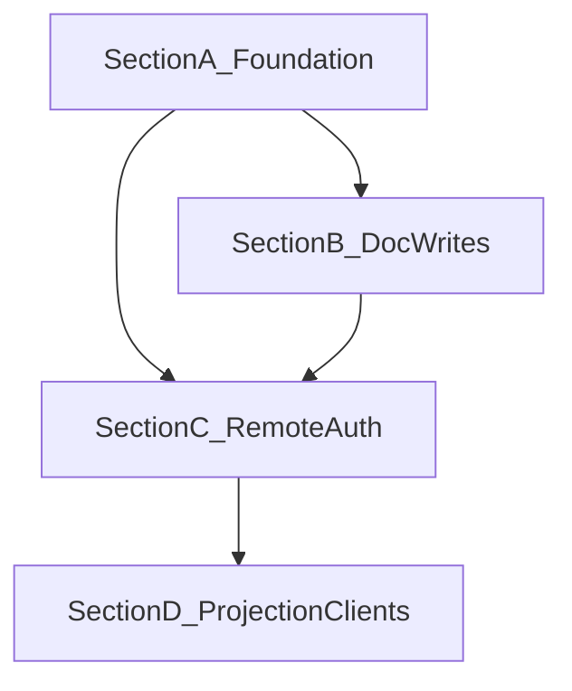

# Cloud Agent Plane — Execution Plan

> The canonical backlog of the transition to a cloud documentation
> control plane: AI maintains documentation entirely through COD-DOC;
> agents are decentralized remote workers; SoT — Postgres.

## Navigation

- [Kickoff](cloud-agent-plane-kickoff-2026-07-29.md)
- [Capability](../capabilities/cloud-agent-plane.md)
- [RFC 23](../../../proposals/23-cloud-decentralized-agent-plane.md)

## Progress Overview

| Section | Theme | Tasks | Status |
|:--------|:------|------:|:-------|
| A | Cloud-ready data & compose | CAP-001..CAP-005 | 🟡 pending |
| B | Doc write path + agent_apply | CAP-010..CAP-014 | 🟡 pending |
| C | Remote MCP auth & multi-agent | CAP-020..CAP-024 | 🟡 pending |
| D | Projection optional + client recipes | CAP-030..CAP-033 | 🟡 pending |
| **TOTAL** | | **18** | 🟡 pending |

## Dependency Graph

## Acceptance per section

- **A** — Postgres CI is green; a compose stack `postgres`+`cod-doc`;
  the `COD_DOC_DB_URL` server path is documented; no mandatory
  developer host paths in `docker-compose.yml`.
- **B** — MCP can patch documents; the agent profile writes docs via
  `agent_apply` under checkout; activity/run_id on mutations.
- **C** — streamable-http + Bearer enforced in the cloud; two agents
  correctly share checkout; audit deny.
- **D** — the cloud node works without a mandatory `root_path` mirror;
  handbook/mcp-integration contain remote client recipes.

---

## Section A — Cloud-ready foundation

### CAP-001 — Postgres migration + pytest smoke in CI
**Priority:** high  
**Deps:** none  
**Description:** Close IMPL-A-ME-2: a job/marker `pg` (testcontainers
or a service container), `alembic upgrade head` + a subset of
infra/service tests on Postgres.  
**Acceptance:** CI goes red when Postgres DDL/views break.

### CAP-002 — docker-compose: postgres service + env template
**Priority:** high  
**Deps:** CAP-001  
**Description:** Add a `postgres` service to
[`docker-compose.yml`](../../../docker-compose.yml); `COD_DOC_DB_URL`;
remove/parameterize host-specific binds (`/Users/dakh/...`);
`.env.example` with cloud/server variables.  
**Acceptance:** `docker compose up` on a clean machine brings up the
health API against Postgres.

### CAP-003 — entrypoint migrates server DB once
**Priority:** medium  
**Deps:** CAP-002  
**Description:** [`entrypoint.sh`](../../../entrypoint.sh) with
`COD_DOC_DB_URL=postgres://…` runs a single `alembic upgrade head` on
the shared DB (not per-project sqlite paths).  
**Acceptance:** a cold start of the container applies migrations; a
repeat start is idempotent.

### CAP-004 — Document `cloud` deploy profile in ARCHITECTURE
**Priority:** medium  
**Deps:** CAP-002  
**Description:** Update ARCHITECTURE §8 with an embedded/server/cloud
table (see capability §4); handbook §3 links to compose+Postgres.  
**Acceptance:** L0 docs are aligned with the capability.

### CAP-005 — Shared engine/session for server mode MCP
**Priority:** high  
**Deps:** CAP-001  
**Description:** [`_db.session_factory`](../../../cod_doc/mcp/tools/_db.py)
in server/cloud mode resolves the project by slug in a **shared** DB,
not `resolve_db_url(entry.path)` → sqlite-per-project.  
**Acceptance:** two MCP clients to the same URL see the same tasks/docs.

---

## Section B — Full doc lifecycle for agents

### CAP-010 — MCP `doc_patch_section` (+ activity)
**Priority:** high  
**Deps:** none (can be parallel with A)  
**Description:** Expose `DocService.patch_section` as an MCP tool in
standard/full; emit activity; optimistic lock via
`base_revision_id`. Closes the gap
[doc-evolution §4.2](../capabilities/doc-evolution.md).  
**Acceptance:** an MCP round-trip test; body+revision+activity in the DB.

### CAP-011 — MCP coverage for create/rename used by agents
**Priority:** medium  
**Deps:** CAP-010  
**Description:** Verify/extend `doc_create` / `doc_rename` (already
present) for persist + activity; add missing section ops
(`doc_add_section`) if needed for agent_apply.  
**Acceptance:** an agent can create a doc and a section without CLI.

### CAP-012 — `agent_apply` composite tool
**Priority:** high  
**Deps:** CAP-010, CAP-005  
**Description:** A new tool in the agent profile:
`agent_apply(project, task_id, agent_id, ops: list[op])` where op ∈
`patch_section | add_section | create_doc | rename_doc | …`.
Requires an active checkout by the same `agent_id`. One transaction,
one `run_id`.  
**Acceptance:** contract tests like `agent_pick`; profile list = 7
tools (or 6 with a replacement — fix in RFC: **7 = +apply**).

### CAP-013 — Orchestrator skill: docs only via agent_apply
**Priority:** medium  
**Deps:** CAP-012  
**Description:** Update
[`cod_doc/skills/orchestrator/SKILL.md`](../../../cod_doc/skills/orchestrator/SKILL.md):
forbid writing markdown SoT to disk; mandatory `agent_apply` for
doc mutations; remote MCP notes.  
**Acceptance:** skill matcher/docs are aligned; a test on the skill
text is optional.

### CAP-014 — agent_complete verifies doc ops when task requires
**Priority:** low  
**Deps:** CAP-012  
**Description:** If the task has an acceptance "docs updated" /
affected docs — complete checks for a revision from this run_id
(advisory → later enforce).  
**Acceptance:** a documented warn-mode; a test for the advisory signal.

---

## Section C — Remote MCP, auth, multi-agent

### CAP-020 — Bearer auth middleware for MCP HTTP + REST
**Priority:** high  
**Deps:** CAP-005  
**Description:** Implement ARCHITECTURE §12: a table/use of
`actor.token_hash`; `COD_DOC_AUTH=required|optional`; stdio stays an
implicit local actor.  
**Acceptance:** HTTP without a token → 401; with a token →
actor.handle in revision.author.

### CAP-021 — Harden streamable-http bind + TLS recipe
**Priority:** medium  
**Deps:** CAP-020  
**Description:** Default cloud bind `0.0.0.0` only behind a proxy;
document Caddy/nginx TLS termination; forbid plaintext
auth over a public net in handbook warnings.  
**Acceptance:** mcp-integration § remote updated.

### CAP-022 — Project-scoped tokens + tool allowlists
**Priority:** medium  
**Deps:** CAP-020  
**Description:** A token is scoped to `project_id` (+ optional
allowed_tools). An agent token does not see admin CRUD.  
**Acceptance:** a token for project A cannot read/write project B.

### CAP-023 — Multi-agent concurrency soak test
**Priority:** medium  
**Deps:** CAP-012, CAP-020  
**Description:** Two clients in parallel `agent_pick` / `agent_apply`
on a shared Postgres; check locks, idempotent replay, no lost
updates (optimistic lock).  
**Acceptance:** a pytest integration in CI (pg).

### CAP-024 — Wake/routines on cloud node (hook)
**Priority:** low  
**Deps:** CAP-021  
**Description:** Make sure routines/wake (paperclip Section C)
live in a daemon next to the cloud node and wake a remote-compatible
run (structured WakeContext). Do not implement all of proposal 07 here
— only the cloud hosting hook + doc.  
**Acceptance:** a roadmap cross-link; no regression of the local daemon.

---

## Section D — Optional projection & client recipes

### CAP-030 — Server mode without mandatory root_path I/O
**Priority:** high  
**Deps:** CAP-005, CAP-012  
**Description:** Mutations of doc body do not require a `root_path` to
exist on disk. `root_path` nullable or a sentinel for cloud
projects; export — an explicit operation.  
**Acceptance:** an e2e test: a project without an FS mirror, patch+get
body OK.

### CAP-031 — Optional projection export job
**Priority:** medium  
**Deps:** CAP-030  
**Description:** A batch/on-demand export to a volume or
`s3://`/`file://` URI; not part of the agent hot path.  
**Acceptance:** CLI/MCP `doc_export` / `project_export` works against
a cloud project.

### CAP-032 — Client recipes: Cursor Cloud, Claude, local IDE
**Priority:** medium  
**Deps:** CAP-021  
**Description:** Update [`docs/mcp-integration.md`](../../../docs/mcp-integration.md)
and the handbook: JSON for `url: https://…/mcp` + Bearer; agent profile
default; an example pick → apply → complete cycle.  
**Acceptance:** copy-paste recipes pass the review checklist.

### CAP-033 — Audit report after Section C/D
**Priority:** low  
**Deps:** CAP-023, CAP-030, CAP-032  
**Description:** `docs/system/audit/<date>-cloud-agent-plane.md` —
TL;DR, deliverables, findings, next (SaaS still out of scope).  
**Acceptance:** the audit file is linked from the system MASTER changelog.

---

## Out of scope (explicit)

- Multi-company / billing / org-chart (paperclip non-goals).
- Multi-master federation between COD-DOC nodes.
- Replacing Chroma/OpenRouter embeddings with pgvector in this plan
  (track separately under observability if needed).

## Suggested implementation order

1. CAP-001, CAP-010 (parallel)
2. CAP-002 → CAP-003 → CAP-005
3. CAP-011 → CAP-012 → CAP-013
4. CAP-020 → CAP-021 → CAP-022 → CAP-023
5. CAP-030 → CAP-031 → CAP-032 → CAP-033
