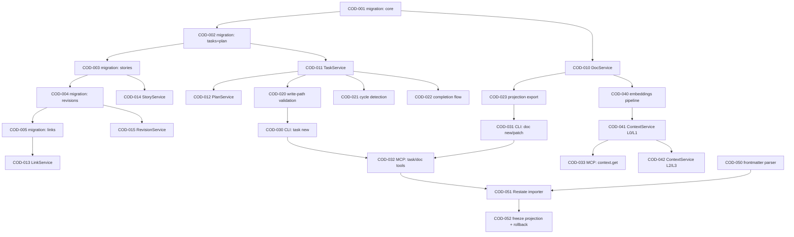

# COD-DOC — Bootstrap Execution Plan

> Dogfood нового стандарта. План внедрения COD-DOC разбит на секции и задачи согласно [standards/task-plan.md](../standards/task-plan.md).
> Источник истины — БД (после того, как этап A будет готов). До тех пор — этот markdown.

## Navigation

- [System MASTER](../MASTER.md)
- [Vision](../VISION.md)
- [Architecture](../ARCHITECTURE.md)
- [Data Model](../DATA_MODEL.md)

## Progress Overview

| Section | File | Total | Done | Remaining | Status |
|:--------|:-----|------:|-----:|----------:|:-------|
| A: Data Core | inline | 5 | 0 | 5 | ❌ pending |
| B: Services | inline | 6 | 0 | 6 | ❌ pending |
| C: Write Paths | inline | 4 | 0 | 4 | ❌ pending |
| D: MCP & CLI | inline | 4 | 0 | 4 | ❌ pending |
| E: Retrieval | inline | 3 | 0 | 3 | ❌ pending |
| F: Migration | inline | 3 | 0 | 3 | ❌ pending |
| **TOTAL**   |        | **25** | **0** | **25** | |

## Gap Analysis Summary

### Уже есть в cod-doc

- Проектный каркас (`cod_doc/core/project.py`), базовая модель Task, wizard, TUI.
- MCP-сервер-заготовка (`cod_doc/mcp/server.py`).
- REST API caркас (`cod_doc/api/`).
- Агент (`cod_doc/agent/orchestrator.py`).
- Templates `MASTER.md.j2`.

### Чего нет

- БД-схема из [DATA_MODEL.md](../DATA_MODEL.md).
- Сервисный слой (Doc/Plan/Task/Link/Story/Revision/Context).
- Валидация формата task-plan.
- Автолинковка, section-парсинг, embeddings.
- CLI/MCP-тулы целевого пакета.
- Импортёр Restate.

## Next Batch

Dependency-unblocked tasks ready for implementation:

- **COD-001** — Migration: Alembic + BaseRepository + схема из DATA_MODEL (Project, Document, Section)
- **COD-010** — Test + Implement: DocService.create/get/patch_section
- **COD-050** — Test: frontmatter parser (все обязательные поля, error paths)

## Dependency Graph



---

## Section A: Data Core

### COD-001

```yaml
id: COD-001
title: "Migration: core tables (project, document, section, link)"
section: A-Data-Core
status: pending
depends_on: []
type: migration
priority: critical
affected_files:
  - cod_doc/infra/migrations/0001_core.py
  - cod_doc/infra/db.py
```

**Description:** Поднять SQLAlchemy + Alembic. Создать таблицы `project`, `document`, `section`, `link` согласно [DATA_MODEL.md §3](../DATA_MODEL.md). Поддержать оба диалекта (SQLite/Postgres) — различие только в типах JSON.

**Acceptance:**
- `alembic upgrade head` проходит на чистом SQLite и на чистом Postgres.
- Базовые CRUD-операции через репозиторий (insert/select/update) покрыты smoke-тестами.

### COD-002

```yaml
id: COD-002
title: "Migration: plan + plan_section + task + dependency + affected_file"
section: A-Data-Core
status: pending
depends_on: [COD-001]
type: migration
priority: critical
affected_files:
  - cod_doc/infra/migrations/0002_tasks.py
```

**Description:** Таблицы из [DATA_MODEL.md §3.6-3.9](../DATA_MODEL.md). Вьюхи `section_totals`, `plan_totals`, `ready_tasks`.

**Acceptance:** миграция проходит; view возвращают корректные агрегаты на ручном seed.

### COD-003

```yaml
id: COD-003
title: "Migration: user_story + story_acceptance + story_link + module"
section: A-Data-Core
status: pending
depends_on: [COD-002]
type: migration
priority: high
affected_files:
  - cod_doc/infra/migrations/0003_stories.py
```

**Description:** Stories и Modules из [DATA_MODEL.md §3.10-3.11](../DATA_MODEL.md).

### COD-004

```yaml
id: COD-004
title: "Migration: revision + audit_log"
section: A-Data-Core
status: pending
depends_on: [COD-003]
type: migration
priority: critical
affected_files:
  - cod_doc/infra/migrations/0004_revisions.py
```

**Description:** Revisions append-only, с индексами для `cod-doc log`. AuditLog для всех write-path вызовов.

### COD-005

```yaml
id: COD-005
title: "Migration: link (parsed) + tag"
section: A-Data-Core
status: pending
depends_on: [COD-004]
type: migration
priority: high
```

**Description:** Таблицы `tag`, связующие таблицы; финальная проверка индексов.

---

## Section B: Services

### COD-010

```yaml
id: COD-010
title: "Test + Implement: DocService.create/get/patch_section/rename"
section: B-Services
status: pending
depends_on: [COD-001]
type: feature
priority: critical
affected_files:
  - cod_doc/services/doc_service.py
  - cod_doc/services/tests/test_doc_service.py
```

**Description:** Создание, чтение, патч секции, rename. Patch → unified diff → `revision`. Rename → cascade update ссылок (пока заготовка; реальный cascade — в COD-013).

**Acceptance:**
- `cod-doc doc new --type guide --title "Hello"` создаёт запись + skeleton.
- `cod-doc doc patch ... --section X` пишет revision.
- Тесты: создание/патч/rename; проверка frontmatter валидации.

### COD-011

```yaml
id: COD-011
title: "Test + Implement: TaskService (create/update_status/complete)"
section: B-Services
status: pending
depends_on: [COD-002]
type: feature
priority: critical
affected_files:
  - cod_doc/services/task_service.py
  - cod_doc/services/tests/test_task_service.py
```

**Description:** Создание задачи с валидацией формата, генерация id в пределах section-range, update status, complete (с проверкой depends_on). Пишет revision.

### COD-012

```yaml
id: COD-012
title: "Test + Implement: PlanService (recalc, ready, audit, export)"
section: B-Services
status: pending
depends_on: [COD-011]
type: feature
priority: high
```

**Description:** Derived статусы секции/плана. `ready()` через view. `audit()` — проверка циклов, drift. `export()` — регенерация Progress Overview/Next Batch/Dependency Graph в markdown.

### COD-013

```yaml
id: COD-013
title: "Test + Implement: LinkService (parse/resolve/verify/rename-cascade)"
section: B-Services
status: pending
depends_on: [COD-005]
type: feature
priority: high
```

**Description:** Парсер ссылок (remark + regex), резолвер, кэш, верификация, cascade при rename документа.

### COD-014

```yaml
id: COD-014
title: "Test + Implement: StoryService (CRUD, link, coverage)"
section: B-Services
status: pending
depends_on: [COD-003, COD-011]
type: feature
priority: medium
```

### COD-015

```yaml
id: COD-015
title: "Test + Implement: RevisionService (write, list, revert)"
section: B-Services
status: pending
depends_on: [COD-004]
type: feature
priority: high
```

**Description:** append-only запись, получение истории сущности, revert (через обратный сервисный вызов).

---

## Section C: Write Paths

### COD-020

```yaml
id: COD-020
title: "Implement: write-path validation (frontmatter + task-plan rules)"
section: C-Write-Paths
status: pending
depends_on: [COD-011]
type: feature
priority: critical
```

**Description:** Централизованный модуль валидации, используемый DocService и TaskService. Правила из [standards/frontmatter.md](../standards/frontmatter.md) и [standards/task-plan.md](../standards/task-plan.md).

### COD-021

```yaml
id: COD-021
title: "Implement: cycle detection + critical path (recursive CTE)"
section: C-Write-Paths
status: pending
depends_on: [COD-011]
type: feature
priority: high
```

### COD-022

```yaml
id: COD-022
title: "Implement: completion flow (depends_on gate + log + projection)"
section: C-Write-Paths
status: pending
depends_on: [COD-011, COD-015]
type: feature
priority: high
```

### COD-023

```yaml
id: COD-023
title: "Implement: projection export/import (hash-based detection)"
section: C-Write-Paths
status: pending
depends_on: [COD-010]
type: feature
priority: high
```

---

## Section D: MCP & CLI

### COD-030

```yaml
id: COD-030
title: "Implement: CLI — task/plan/story commands"
section: D-MCP-CLI
status: pending
depends_on: [COD-020]
type: feature
priority: high
affected_files:
  - cod_doc/cli/task.py
  - cod_doc/cli/plan.py
  - cod_doc/cli/story.py
```

### COD-031

```yaml
id: COD-031
title: "Implement: CLI — doc/link/revision commands"
section: D-MCP-CLI
status: pending
depends_on: [COD-023, COD-013]
type: feature
priority: high
```

### COD-032

```yaml
id: COD-032
title: "Implement: MCP tools (doc.*, task.*, plan.*, story.*, link.*, revision.*)"
section: D-MCP-CLI
status: pending
depends_on: [COD-030, COD-031]
type: feature
priority: critical
affected_files:
  - cod_doc/mcp/server.py
  - cod_doc/mcp/tools/
```

### COD-033

```yaml
id: COD-033
title: "Implement: MCP tool context.get (+ ContextService)"
section: D-MCP-CLI
status: pending
depends_on: [COD-041]
type: feature
priority: critical
```

---

## Section E: Retrieval

### COD-040

```yaml
id: COD-040
title: "Implement: embeddings pipeline (sqlite-vss / pgvector)"
section: E-Retrieval
status: pending
depends_on: [COD-010]
type: feature
priority: medium
```

### COD-041

```yaml
id: COD-041
title: "Implement: ContextService L0/L1"
section: E-Retrieval
status: pending
depends_on: [COD-040]
type: feature
priority: high
```

### COD-042

```yaml
id: COD-042
title: "Implement: ContextService L2/L3 + semantic search"
section: E-Retrieval
status: pending
depends_on: [COD-041]
type: feature
priority: medium
```

---

## Section F: Migration

### COD-050

```yaml
id: COD-050
title: "Test: frontmatter/task-plan parser (property-based)"
section: F-Migration
status: pending
depends_on: []
type: test
priority: critical
```

### COD-051

```yaml
id: COD-051
title: "Implement: Restate importer (docs/plans/stories/links/git-history)"
section: F-Migration
status: pending
depends_on: [COD-032, COD-050]
type: feature
priority: high
affected_files:
  - cod_doc/importers/restate.py
```

### COD-052

```yaml
id: COD-052
title: "Implement: projection freeze + accept flow"
section: F-Migration
status: pending
depends_on: [COD-023, COD-051]
type: feature
priority: high
```
