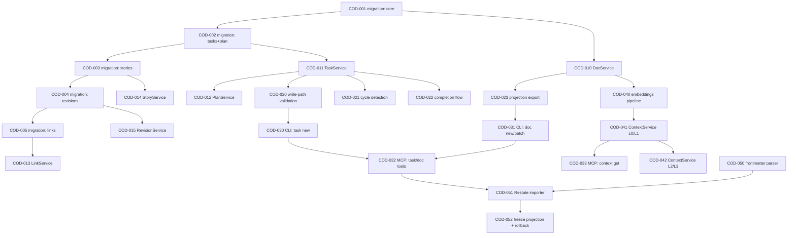

# COD-DOC — Bootstrap Execution Plan

> Dogfooding the new standard. The COD-DOC rollout plan is split into sections and tasks per [standards/task-plan.md](../standards/task-plan.md).
> The source of truth is the DB (after stage A is ready). Until then — this markdown.

## Navigation

- [System MASTER](../MASTER.md)
- [Vision](../VISION.md)
- [Architecture](../ARCHITECTURE.md)
- [Data Model](../DATA_MODEL.md)

## Progress Overview

| Section | File | Total | Done | Remaining | Status |
|:--------|:-----|------:|-----:|----------:|:-------|
| A: Data Core | inline | 5 | 5 | 0 | ✅ done |
| B: Services | inline | 6 | 6 | 0 | ✅ done |
| C: Write Paths | inline | 4 | 4 | 0 | ✅ done |
| D: MCP & CLI | inline | 4 | 4 | 0 | ✅ done |
| E: Retrieval | inline | 4 | 2 | 2 | 🔄 in-progress |
| F: Migration | inline | 3 | 2 | 1 | 🔄 in-progress |
| G: Hardening & DevX | inline | 5 | 5 | 0 | ✅ done |
| **TOTAL**   |        | **31** | **28** | **3** | |

> **Status reconciliation 2026-06-05** (see [ROADMAP](ROADMAP.md)): reconciliation with the code corrected the stale accounting. **Closed in code, previously hung as pending:** COD-033 (`context_tools.py` + `context_service.py` L0/L1), COD-040 (FTS5 search), COD-041 (ContextService L0/L1). **Actually remain open** → tracked in the plan `stabilization-2026-06`: COD-042/043 (ContextService L2/L3 semantics — currently stubs, A1-4). COD-051 (Restate importer) — the code exists and works (`services/restate_importer.py`), marked done.
>
> **STB-014 closure 2026-06-14:** COD-052 (freeze + accept flow) closed. The service layer
> (`plan_service.freeze_projection`, `doc_service.accept`) already existed; the missing
> user-facing surface was added: MCP tools `plan_freeze` / `doc_accept` (catalog
> 101→103) and CLI `cod-doc plan freeze` / `cod-doc doc accept`. Document rollback is
> already covered by `revision_revert`.

## Gap Analysis Summary

### Already in cod-doc

- Project scaffold (`cod_doc/core/project.py`), the basic Task model, wizard, TUI.
- An MCP server stub (`cod_doc/mcp/server.py`).
- A REST API scaffold (`cod_doc/api/`).
- The agent (`cod_doc/agent/orchestrator.py`).
- Templates `MASTER.md.j2`.

### What is missing

- The DB schema from [DATA_MODEL.md](../DATA_MODEL.md).
- The service layer (Doc/Plan/Task/Link/Story/Revision/Context).
- Task-plan format validation.
- Auto-linking, section parsing, embeddings.
- CLI/MCP tools of the target package.
- The Restate importer.

## Next Batch

Sections A–D (except COD-033) and COD-040 are closed. CLI + MCP tools + the embeddings pipeline are ready — the system is ready for dogfooding (tasks are stored in the DB). Remaining tasks: ContextService, Restate importer, freeze-flow.

- **COD-041** — Implement: ContextService L0/L1 — unblocks COD-033 (MCP context.get) and COD-042
- **COD-033** — Implement: MCP tool context.get — depends on COD-041
- **COD-050** — Test: frontmatter/task-plan parser (property-based) — no dependencies, in parallel
- **COD-051** — Implement: Restate importer — depends on COD-032 + COD-050; needed for a bulk transfer of markdown task-plans into the DB
- **COD-052** — Implement: projection freeze + accept flow — depends on COD-023 + COD-051
- **COD-042, COD-043** — ContextService L2/L3 + local torch backend — lowered priority

## Dependency Graph


```mermaid
graph TD
  COD_001[COD-001 migration: core]
  COD_002[COD-002 migration: tasks+plan]
  COD_003[COD-003 migration: stories]
  COD_004[COD-004 migration: revisions]
  COD_005[COD-005 migration: links]

  COD_010[COD-010 DocService]
  COD_011[COD-011 TaskService]
  COD_012[COD-012 PlanService]
  COD_013[COD-013 LinkService]
  COD_014[COD-014 StoryService]
  COD_015[COD-015 RevisionService]

  COD_020[COD-020 write-path validation]
  COD_021[COD-021 cycle detection]
  COD_022[COD-022 completion flow]
  COD_023[COD-023 projection export]

  COD_030[COD-030 CLI: task new]
  COD_031[COD-031 CLI: doc new/patch]
  COD_032[COD-032 MCP: task/doc tools]
  COD_033[COD-033 MCP: context.get]

  COD_040[COD-040 embeddings pipeline]
  COD_041[COD-041 ContextService L0/L1]
  COD_042[COD-042 ContextService L2/L3]

  COD_050[COD-050 frontmatter parser]
  COD_051[COD-051 Restate importer]
  COD_052[COD-052 freeze projection + rollback]

  COD_001 --> COD_002
  COD_002 --> COD_003
  COD_003 --> COD_004
  COD_004 --> COD_005

  COD_001 --> COD_010
  COD_002 --> COD_011
  COD_011 --> COD_012
  COD_005 --> COD_013
  COD_003 --> COD_014
  COD_004 --> COD_015

  COD_011 --> COD_020
  COD_011 --> COD_021
  COD_011 --> COD_022
  COD_010 --> COD_023

  COD_020 --> COD_030
  COD_023 --> COD_031
  COD_030 --> COD_032
  COD_031 --> COD_032
  COD_041 --> COD_033

  COD_010 --> COD_040
  COD_040 --> COD_041
  COD_041 --> COD_042

  COD_050 --> COD_051
  COD_032 --> COD_051
  COD_051 --> COD_052
```

---

## Section A: Data Core

### COD-001

```yaml
id: COD-001
title: "Migration: core tables (project, document, section, link)"
section: A-Data-Core
status: done
depends_on: []
type: migration
priority: critical
affected_files:
  - cod_doc/infra/migrations/0001_core.py
  - cod_doc/infra/db.py
```

**Description:** Bring up SQLAlchemy + Alembic. Create the tables `project`, `document`, `section`, `link` per [DATA_MODEL.md §3](../DATA_MODEL.md). Support both dialects (SQLite/Postgres) — the difference is only in JSON types.

**Acceptance:**
- `alembic upgrade head` passes on a clean SQLite and on a clean Postgres.
- Basic CRUD operations through the repository (insert/select/update) are covered by smoke tests.

> ✅ **Implemented 2026-04-19** (commit `pending`): SQLAlchemy 2.0 + Alembic, schema §3.1-§3.4 (project/document/section/link with sensitivity, content_hash, preamble), repositories Project/Document/Section, smoke tests `tests/infra/test_db_smoke.py` — 5/5 passed. Postgres check deferred until actual deployment; SQL-dialect-neutral code.

### COD-002

```yaml
id: COD-002
title: "Migration: plan + plan_section + task + dependency + affected_file"
section: A-Data-Core
status: done
depends_on: [COD-001]
type: migration
priority: critical
affected_files:
  - cod_doc/infra/migrations/versions/20260425_0002_tasks.py
  - cod_doc/infra/models.py
  - cod_doc/domain/entities.py
  - tests/infra/test_tasks_migration.py
```

**Description:** Tables from [DATA_MODEL.md §3.6-3.9](../DATA_MODEL.md). Views `section_totals`, `plan_totals`, `ready_tasks`.

**Acceptance:** the migration passes; the views return correct aggregates on a manual seed.

> ✅ **Implemented 2026-04-25** (commit `pending`): tables plan/plan_section/task/dependency/affected_file (§3.6-3.9), views `section_totals` / `plan_totals` / `ready_tasks` (§4.1-§4.3) — `ready_tasks` filters only by `kind='blocks'`. ORM models (`PlanModel`, `PlanSectionModel`, `TaskModel`, `DependencyModel`, `AffectedFileModel`) and domain dataclasses + enums. Smoke tests `tests/infra/test_tasks_migration.py` — 6/6 passed; the overall suite — 11/11.

### COD-003

```yaml
id: COD-003
title: "Migration: user_story + story_acceptance + story_link + module"
section: A-Data-Core
status: done
depends_on: [COD-002]
type: migration
priority: high
affected_files:
  - cod_doc/infra/migrations/versions/20260425_0003_stories.py
  - cod_doc/infra/models.py
  - cod_doc/domain/entities.py
  - tests/infra/test_stories_migration.py
```

**Description:** Stories and Modules from [DATA_MODEL.md §3.10-3.11](../DATA_MODEL.md).

> ✅ **Implemented 2026-04-25** (commit `pending`): tables user_story, story_acceptance, story_link, module, module_dependency, module_code (§3.10-3.11). Unique indexes: `user_story.story_id` and `module.module_id` — globally (§6); `module_dependency(from, to)` — without duplicates. Cascade delete from `user_story` to `story_acceptance` / `story_link`. ORM models + domain dataclasses + enums (`UserStoryStatus`, `StoryLinkKind`, `StoryRelation`, `ModuleStatus`, `ModuleCodeKind`). Smoke tests `tests/infra/test_stories_migration.py` — 7/7 passed; the overall suite — 18/18.

### COD-004

```yaml
id: COD-004
title: "Migration: revision + audit_log"
section: A-Data-Core
status: done
depends_on: [COD-003]
type: migration
priority: critical
affected_files:
  - cod_doc/infra/migrations/versions/20260425_0004_revisions.py
  - cod_doc/infra/models.py
  - cod_doc/domain/entities.py
  - tests/infra/test_revisions_migration.py
```

**Description:** Revisions append-only, with indexes for `cod-doc log`. AuditLog for all write-path calls.

> ✅ **Implemented 2026-04-25** (commit `pending`): tables `revision` (§3.5) with unique `revision_id` (ULID, 26 chars) and indexes `ix_revision_entity` (entity_kind, entity_id, at) / `ix_revision_parent` for chain-walk; `audit_log` (§3.13) with `payload_json` (JSON column) and indexes `ix_audit_action`, `ix_audit_actor` for filtering by action/time and actor/time. CASCADE from project. ORM models + domain dataclasses + enums (`EntityKind`, `AuditSurface`). Smoke tests `tests/infra/test_revisions_migration.py` — 5/5 (chain through `parent_revision_id`, ULID uniqueness, JSON round-trip, cascade); the overall suite — 23/23.

### COD-005

```yaml
id: COD-005
title: "Migration: link (parsed) + tag"
section: A-Data-Core
status: done
depends_on: [COD-004]
type: migration
priority: high
affected_files:
  - cod_doc/infra/migrations/versions/20260425_0005_links_tags.py
  - cod_doc/infra/models.py
  - cod_doc/domain/entities.py
  - tests/infra/test_tags_migration.py
```

**Description:** Tables `tag`, junction tables; a final check of indexes.

> ✅ **Implemented 2026-04-25** (commit `pending`): tables `tag` (uniq `(project_id, name)`), `document_tag`, `task_tag`, `story_tag` (§3.12) — junction tables with a composite PK and CASCADE on both sides. Replaced the full-column `ix_link_unresolved` with the partial `ix_link_broken WHERE resolved = 0` (§3.4) — the hot read-path "broken-links" stays cheap as the resolved share grows. ORM models + `Tag` dataclass. Smoke tests `tests/infra/test_tags_migration.py` — 6/6 (schema, partial-index presence+condition, uniqueness per project, attach-to-doc/task/story, duplicate via PK, cascade-delete of a tag); the overall suite — 29/29. **Section A (Data Core) closed.**

---

## Section B: Services

### COD-010

```yaml
id: COD-010
title: "Test + Implement: DocService.create/get/patch_section/rename"
section: B-Services
status: done
depends_on: [COD-001, COD-015]
type: feature
priority: critical
affected_files:
  - cod_doc/services/doc_service.py
  - tests/services/test_doc_service.py
```

**Description:** Create, read, patch section, rename. Patch → unified diff → `revision`. Rename → cascade update of links (a stub for now; the real cascade — in COD-013).

**Acceptance:**
- `cod-doc doc new --type guide --title "Hello"` creates a record + skeleton.
- `cod-doc doc patch ... --section X` writes a revision.
- Tests: create/patch/rename; check frontmatter validation.

> ✅ **Implemented 2026-04-25** (commit `pending`): a functional API `create / get / get_sections / render_body / add_section / patch_section / rename`. Each mutation writes a revision: `create`/`rename` → `entity_kind=DOCUMENT`, `add_section`/`patch_section` → `entity_kind=SECTION` (DATA_MODEL §3.5 "Section.body — the carrier"). `render_body` reads through the view `document_body` (§4.3a). `patch_section` — no-op on an identical body; forwards `expected_parent_revision_id` to RevisionService for optimistic concurrency. `rename` writes a JSON-patch diff `{op, from, to}`; cascade-update of incoming links stayed a stub comment — the real cascade is in COD-013. Custom exceptions `DocumentNotFoundError` / `SectionNotFoundError`. Frontmatter validation remains with COD-020. Tests — 15/15 (create+revision+UNIQUE+sections+render+patch path/no-op/conflict+rename path/no-op/unknown). The overall suite — 61/61.

> The dependency is extended with `COD-015`: DocService uses RevisionService to write a revision; formally not a blocker in the original graph, but in fact COD-015 was done before COD-010, and the DocService API relies on `rev.write` / `rev.list_for_entity`.

### COD-011

```yaml
id: COD-011
title: "Test + Implement: TaskService (create/update_status/complete)"
section: B-Services
status: done
depends_on: [COD-002, COD-015]
type: feature
priority: critical
affected_files:
  - cod_doc/infra/repositories/task_repo.py
  - cod_doc/services/task_service.py
  - tests/services/test_task_service.py
```

**Description:** Create a task with format validation, generate an id within the section-range, update status, complete (with a depends_on check). Writes a revision.

> ✅ **Implemented 2026-04-25** (commit `pending`): `TaskRepository` (get_by_task_id, list_for_plan), `task_service.py` — `create` (TaskStatus.PENDING, auto-ID `{prefix}-NNN` by max in the plan, optional affected_files), `update_status` (no-op on the same status), `complete` (checks all `kind='blocks'` dependencies → `TaskBlockedError`; ignores `relates`; forwards `expected_parent_revision_id`), `get`, `list_for_plan`. All mutations write JSON-patch revisions through RevisionService. Tests — 14/14 (create+auto-id+affected-files+revision, update-status/no-op/unknown, complete/blocked/unblocked-after-dep/relates-ignored/conflict). The overall suite — 126/126.

### COD-012

```yaml
id: COD-012
title: "Test + Implement: PlanService (recalc, ready, audit, export)"
section: B-Services
status: done
depends_on: [COD-011]
type: feature
priority: high
affected_files:
  - cod_doc/services/plan_service.py
  - cod_doc/infra/repositories/plan_repo.py
  - cod_doc/infra/repositories/__init__.py
  - tests/services/test_plan_service.py
```

**Description:** Derived statuses of section/plan. `ready()` through a view. `audit()` — cycle and drift check. `export()` — regeneration of Progress Overview/Next Batch/Dependency Graph in markdown.

> ✅ **Implemented 2026-04-28** (commit `pending`): a pure read-side service (without revisions). `recalc(plan_id)` reads `section_totals` + `plan_totals` (§4.1-§4.2), returns `PlanProgress` with `DerivedStatus` (`empty`/`pending`/`in-progress`/`done`) per-section and rolled up to the plan — rule: `total==0`→empty, `done==total`→done, otherwise `in-progress` if there is progress, `pending` otherwise. `ready(plan_id, *, limit=None)` filters the view `ready_tasks` by plan, sorts by priority (`critical < high < medium < low`) then by `task_id` for stability. `audit(plan_id)` — an iterative DFS cycle detector only over `kind='blocks'` (canonicalize cycles by min-element, duplicates cut off), drift-check `done_with_unfinished_blocks` catches tasks marked done with open blocking deps (e.g., after a manual `update_status` bypassing `complete()`). `export(plan_id)` renders three markdown projections: Progress Overview (markdown table), Next Batch (top-N ready by priority), Dependency Graph (Mermaid `graph TD`, edges blocker→blocked, node ID — `task_id` with `-`→`_`). `PlanRepository` + `PlanSectionRepository` added under the common template. Tests — 18/18 (recalc empty/partial/done/unknown; ready visibility/scope/priority/limit; audit clean/cycle/non-blocks-ignored/drift; export PO+NB+Mermaid+empty); the overall suite — 147/147.

### COD-013

```yaml
id: COD-013
title: "Test + Implement: LinkService (parse/resolve/verify/rename-cascade)"
section: B-Services
status: done
depends_on: [COD-005, COD-010]
type: feature
priority: high
affected_files:
  - cod_doc/services/link_service.py
  - cod_doc/services/doc_service.py
  - cod_doc/infra/repositories/link_repo.py
  - cod_doc/infra/repositories/__init__.py
  - tests/services/test_link_service.py
```

**Description:** Link parser (regex), resolver, verification, cascade on document rename.

> ✅ **Implemented 2026-04-28** (commit `pending`): pipeline `parse → sync_section → resolve → verify` + `rename_cascade`. Full coverage of the forms from [standards/document-link.md §1](../standards/document-link.md): canonical `[[doc:KEY]]`, section `[[doc:KEY#anchor]]`, task `[[task:ID]]`, story `[[story:ID]]`, wiki `[[Title]]` (exact match only; fuzzy deferred), markdown relative `[label](../path.md)` with anchor form, bare URL and markdown URL. The parser is clean: regex-based, skips fenced code blocks (replaces with whitespace of equal length — preserves offsets), sorts the output by position in body. `sync_section` transactionally replaces link-rows for a section; `resolve_section` auto-syncs if there are no rows; `resolve` does not stamp `to_doc_key` if the target is not found (for CANONICAL/MARKDOWN), but does stamp for a SECTION-ref with a broken anchor — the cascade relies on `to_doc_key` for lookup. `verify_section` returns `VerifyReport(ok/broken/skipped)` — URL is skipped (no network on the write-path, §7), the rest is re-resolved and stamps `last_checked`/`broken_reason`. `rename_cascade(project_id, old, new, author)` transactionally UPDATEs `link.to_doc_key` + rewrites `link.raw` + rewrites section bodies (only canonical refs `[[doc:OLD…]]`, markdown-paths are not touched — too fragile without a path mapping) + writes a SECTION revision per changed section through DocService.patch_section. Returns `RenameCascadeReport(updated_links, rewritten_sections)`. **DocService.rename now auto-calls `rename_cascade` (cascade_links=True default)** — closed the debt from COD-010 ([doc_service.py:265-330](../../../cod_doc/services/doc_service.py)). Tests — 26/26 (parse: 11 scenarios, sync: 2, resolve: 7, verify: 2, rename_cascade: 4); the overall suite — 177/177.

> The dependency is extended with `COD-010`: the cascade-rewrite uses `DocService.patch_section` to write SECTION revisions for every changed body. The cycle is avoided by a local import of link_service inside `DocService.rename`.

### COD-014

```yaml
id: COD-014
title: "Test + Implement: StoryService (CRUD, link, coverage)"
section: B-Services
status: done
depends_on: [COD-003, COD-011, COD-015]
type: feature
priority: medium
affected_files:
  - cod_doc/services/story_service.py
  - cod_doc/infra/repositories/story_repo.py
  - cod_doc/infra/repositories/__init__.py
  - tests/services/test_story_service.py
```

> ✅ **Implemented 2026-04-28** (commit `pending`): a functional API `create / get / list_for_project / list_acceptance / list_links / list_tasks / update_status / add_criterion / set_criterion_met / link / coverage` (see [cod_doc/services/story_service.py](../../../cod_doc/services/story_service.py)). All mutations write JSON-patch revisions with `entity_kind=STORY` ([standards/revision-history.md](../standards/revision-history.md): `op` ∈ `create / status / add_criterion / criterion_met / link`). `update_status` — optimistic concurrency via `expected_parent_revision_id` (as in TaskService.complete). `add_criterion` auto-computes `position = max + 1`. `link(to_kind, to_ref, relation)` — hard-error on a broken reference (target task/document/module is absent in the project; per [document-link.md §4](../standards/document-link.md)) + idempotent dedup on the edge `(story, kind, ref, relation)` — a repeat call returns the existing row without a new revision. `list_tasks` filters only `relation=implemented_by` (per [user-stories-graph.md §5.2](../capabilities/user-stories-graph.md)). `coverage(story_id)` returns `StoryCoverage` with a derived `CoverageStatus` (`draft|accepted|in-progress|delivered|deferred`, a separate enum from the persisted `UserStoryStatus` — DELIVERED is not in the DB enum): DRAFT/DEFERRED — pinned (taken from `user_story.status`); DELIVERED requires `tasks_total>0 AND all done AND all acceptance met`; IN_PROGRESS — at least one in-progress/done; otherwise ACCEPTED. Returns the breakdown `tasks_total/done/in_progress` + `acceptance_total/met`. `StoryRepository` + `StoryAcceptanceRepository` + `StoryLinkRepository` under the common template. Custom exceptions: `StoryNotFoundError`, `StoryAlreadyExistsError`, `AcceptanceNotFoundError`, `BrokenLinkError`. Tests — 22/22 (CRUD: 5, update_status: 3, criteria: 3, link: 4, list_tasks: 1, coverage: 6); the overall suite — 208/208. **Section B (Services) closed.**

> The dependency is extended with `COD-015`: each mutation writes a revision through RevisionService (as DocService/TaskService). Formally not in the original graph — added for accuracy.

### COD-015

```yaml
id: COD-015
title: "Test + Implement: RevisionService (write, list, revert)"
section: B-Services
status: done
depends_on: [COD-004]
type: feature
priority: high
affected_files:
  - cod_doc/services/__init__.py
  - cod_doc/services/revision_service.py
  - tests/services/__init__.py
  - tests/services/test_revision_service.py
```

**Description:** append-only write, get entity history, revert (through a reverse service call).

> ✅ **Implemented 2026-04-25** (commit `pending`): `cod_doc/services/revision_service.py` — a functional API: `write(session, *, project_id, entity_kind, entity_id, author, diff, ...)` (auto-fills ULID + chains via `parent_revision_id`), `list_for_entity(session, entity_kind, entity_id)` (oldest→newest), `RevisionConflictError` on `expected_parent_revision_id` mismatch (DATA_MODEL §3.5 optimistic concurrency). `revert` is intentionally a stub — a dispatcher over entity services, COD-022. Tests — 9/9 passed (write/chain/list/filter/expected-parent match/mismatch/explicit-None variants/revert NotImplementedError); the overall suite — 46/46.

---

## Section C: Write Paths

### COD-020

```yaml
id: COD-020
title: "Implement: write-path validation (frontmatter + task-plan rules)"
section: C-Write-Paths
status: done
depends_on: [COD-011]
type: feature
priority: critical
affected_files:
  - cod_doc/services/validation.py
  - cod_doc/services/task_service.py
  - cod_doc/services/story_service.py
  - cod_doc/services/doc_service.py
  - tests/services/test_validation.py
  - tests/services/test_doc_service.py
```

**Description:** A centralized validation module used by DocService and TaskService. Rules from [standards/frontmatter.md](../standards/frontmatter.md) and [standards/task-plan.md](../standards/task-plan.md).

> ✅ **Implemented 2026-04-28** (commits `426b33a` + follow-up): `cod_doc/services/validation.py` — a single source of truth for the rules of `task-plan.md` and `frontmatter.md`. Two validation levels: structural (`validate_*` → `ValidationError`, gates the write-path in all services) and advisory (`audit_*` → `list[ValidationIssue]` without raise — for the future `cod-doc audit` and CI). Wired into `TaskService.create` (TP-001/TP-002/TP-005), `StoryService.create` (US-001), `DocService.create` (FM-002, FM-003 are escalated from `audit_frontmatter` to `ValidationError`; FM-004/FM-005 stay advisory). Tests — `test_validation.py` (advisory level, ~27 cases) + write-path negative cases in `test_doc_service.py` (FM-002/FM-003). Uncovered rules (TP-006…TP-011 — section-level cross-checks; FM-006 sensitivity — after the Sensitive-Data task) are explicitly advisory. The overall suite — 326/326 + 3 new tests.

### COD-021

```yaml
id: COD-021
title: "Implement: cycle detection + critical path (recursive CTE)"
section: C-Write-Paths
status: done
depends_on: [COD-011, COD-012]
type: feature
priority: high
affected_files:
  - cod_doc/services/plan_service.py
  - tests/services/test_graph_service.py
```

> ✅ **Implemented 2026-04-28** (commit `pending`): extended `plan_service.py` with three graph functions implementing [user-stories-graph.md §6](../capabilities/user-stories-graph.md). `forward_chain(session, task_id) → list[ChainEntry]` — a recursive CTE, starts from task_id, follows `from→to` edges (prerequisite direction), returns all transitive blockers in depth order. `reverse_chain(session, task_id) → list[ChainEntry]` — a CTE in the reverse direction (`to→from`), returns dependent tasks that get unblocked. `critical_path(session, plan_id) → CriticalPathResult` — a depth-CTE computes the max chain depth for each task of the plan, Python backtracking reconstructs the path from source to sink greedily (picks the predecessor with `depth-1`; on a tie — alphabetically). Returns `CriticalPathResult(task_ids, chain: list[ChainEntry], length)`. `PlanAuditReport` is extended with the field `critical_path_length` — `audit()` now calls `critical_path()` and includes it in the report. A new exception `TaskNotFoundInPlanError` for an unknown task_id in chain functions. Added dataclasses `ChainEntry`, `CriticalPathResult` in `plan_service.py`. Tests — 17/17 (forward: 6 scenarios, reverse: 4, critical_path: 7 — empty/single/linear/diamond/parallel/status-meta/unknown-plan); the overall suite — 288/288.

### COD-022

```yaml
id: COD-022
title: "Implement: completion flow (depends_on gate + log + projection)"
section: C-Write-Paths
status: done
depends_on: [COD-011, COD-015]
type: feature
priority: high
affected_files:
  - cod_doc/services/revision_service.py
  - cod_doc/services/task_service.py
  - tests/services/test_completion_flow.py
  - tests/services/test_revision_service.py
```

> ✅ **Implemented 2026-04-28** (commit `pending`): two deliverables. (1) **RevisionService.revert dispatch** — `revert(session, revision_id, *, author)` replaced the former stub: dispatches by `entity_kind` + `op` from the diff payload: `TASK op=status` → `TaskService.update_status(old_status)`; `TASK op=complete` → `update_status(old_status)` (restores the pre-done state); `SECTION` (unified diff) → `_restore_original_from_unified(diff)` + `DocService.patch_section` — a custom parser splits the unified-diff by the last `@@ ... @@` marker and extracts the `-`-lines (original) from the content section, working around a storage-format bug where `lineterm=""` + `"".join()` does not add `\n` after header lines; `DOCUMENT op=rename` → `DocService.rename(old_doc_key, old_path)`. Unsupported entity_kind/op → `RevertNotSupportedError(NotImplementedError)`. Each revert creates a new revision (history is append-only). (2) **Plan staleness signal** — `TaskService.complete()` now updates `plan.last_updated = now` in the same transaction as the task completion — a signal for the future projection system (COD-023) that the export is stale. Tests — 9/9 (revert: TASK status, TASK complete, TASK unsupported-op, SECTION patch, SECTION writes-new-revision, DOCUMENT rename, unsupported entity_kind; plan staleness: 2). `test_revert_not_yet_implemented` is replaced by `test_revert_raises_lookup_for_unknown_revision_id`. The overall suite — 297/297.

### COD-023

```yaml
id: COD-023
title: "Implement: projection export/import (hash-based detection)"
section: C-Write-Paths
status: done
depends_on: [COD-010]
type: feature
priority: high
affected_files:
  - cod_doc/services/projection_service.py
  - tests/services/test_projection_service.py
```

> ✅ **Implemented 2026-04-28** (commit `pending`): `cod_doc/services/projection_service.py` — pipeline `render_markdown → export_document → detect_drift → import_document` (see [ARCHITECTURE.md §4.2](../ARCHITECTURE.md)). `render_markdown(session, document_id)` — a pure function: renders YAML frontmatter (type/status/sensitivity/source_of_truth/owner/title + extra from frontmatter_json, but does NOT include reserved fields `projection_hash`/`doc_key`/`revision`) + body from the view `document_body`. `export_document(session, document_id, *, root_path, force=False)` — writes `root_path/document.path`, updates `document.projection_hash = SHA256(content)`. Idempotent: if projection_hash already matches the current DB content — skip (`written=False`), if `force=True` — overwrites unconditionally. Creates parent directories. Returns `ExportResult(document_id, path, written, content_hash)`. `detect_drift(session, document_id, *, root_path)` — compares `projection_hash` (last export), SHA256(current DB content), SHA256(file on disk) → `DriftStatus` ∈ `IN_SYNC | STALE_EXPORT | EDITED_IN_PLACE | MISSING`. `import_document(session, project_id, file_path, *, author, root_path)` — reads the file, hash matches → no-op; hash differs → parse YAML frontmatter → apply type/status/owner/sensitivity/source_of_truth through ORM. Full section-body import — COD-051 (Restate importer). Key decision: `projection_hash` is NOT part of the rendered markdown (reserved field), otherwise a circular hash dependency arises. Tests — 15/15 (render: 3, export: 5, detect_drift: 4, import: 3); the overall suite — 312/312. **Section C (Write Paths) closed.**

---

## Section D: MCP & CLI

### COD-030

```yaml
id: COD-030
title: "Implement: CLI — task/plan/story commands"
section: D-MCP-CLI
status: done
depends_on: [COD-020]
type: feature
priority: high
affected_files:
  - cod_doc/cli/task.py
  - cod_doc/cli/plan.py
  - cod_doc/cli/story.py
```

> ✅ **Implemented:** `cod_doc/cli/task.py` (385 loc) — commands `list`, `show`, `create`, `status`, `complete`; `cod_doc/cli/plan.py` (428 loc); `cod_doc/cli/story.py` (489 loc). All commands work through a DB session (`_make_session`), accept `--project` and `--json` flags.

### COD-031

```yaml
id: COD-031
title: "Implement: CLI — doc/link/revision commands"
section: D-MCP-CLI
status: done
depends_on: [COD-023, COD-013]
type: feature
priority: high
affected_files:
  - cod_doc/cli/doc.py
  - cod_doc/cli/link.py
  - cod_doc/cli/revision.py
```

> ✅ **Implemented:** `cod_doc/cli/doc.py` (519 loc), `cod_doc/cli/link.py` (248 loc), `cod_doc/cli/revision.py` (315 loc). The `cod-doc audit --sensitivity` CLI flag is included in cmd_audit.py (deliverable of COD-025).

### COD-032

```yaml
id: COD-032
title: "Implement: MCP tools (doc.*, task.*, plan.*, story.*, link.*, revision.*)"
section: D-MCP-CLI
status: done
depends_on: [COD-030, COD-031]
type: feature
priority: critical
affected_files:
  - cod_doc/mcp/server.py
  - cod_doc/mcp/tools/
```

> ✅ **Implemented:** `cod_doc/mcp/tools/` — `task_tools.py` (`task.list`, `task.get`, `task.create`, `task.update_status`, `task.complete`), `doc_tools.py`, `plan_tools.py`, `story_tools.py`, `link_tools.py`, `revision_tools.py`. Each module registers tools via `register(mcp: FastMCP)` — called from `mcp/server.py`.

### COD-033

```yaml
id: COD-033
title: "Implement: MCP tool context.get (+ ContextService)"
section: D-MCP-CLI
status: pending
depends_on: [COD-041]
type: feature
priority: critical
```

---

## Section E: Retrieval

### COD-040

```yaml
id: COD-040
title: "Implement: embeddings pipeline (sqlite-vss / pgvector)"
section: E-Retrieval
status: done
depends_on: [COD-010]
type: feature
priority: medium
affected_files:
  - cod_doc/core/reindex.py
```

> ✅ **Implemented:** `cod_doc/core/reindex.py` (165 loc) — `reindex_project(root, cfg)` (indexes the project's markdown files into ChromaDB via the OpenRouter `/embeddings` endpoint, model `text-embedding-ada-002`) and `search_documents(query, collection, n)`. The backend is configured through `Config` (`api_key`, `embedding_model`). Actually uses ChromaDB, not sqlite-vss/pgvector — a local store without a Postgres dependency.

### COD-041

```yaml
id: COD-041
title: "Implement: ContextService L0/L1"
section: E-Retrieval
status: pending
depends_on: [COD-040]
type: feature
priority: high
```

### COD-042

```yaml
id: COD-042
title: "Implement: ContextService L2/L3 + semantic search"
section: E-Retrieval
status: pending
depends_on: [COD-041]
type: feature
priority: medium
```

### COD-043

```yaml
id: COD-043
title: "Switch embeddings to local torch (CPU-only) backend"
section: E-Retrieval
status: pending
depends_on: [COD-042]
type: feature
priority: low
```

**Context.** At the bootstrap stage embeddings were moved to OpenRouter (an OpenAI-compatible `/embeddings`, model `openai/text-embedding-ada-002`) — this removed ~2 GB of CUDA/torch dependencies from the Docker build and lifted the deployment blocker. The decision is temporary: an external provider means (a) paid traffic for every reindex, (b) a network dependency for offline scenarios, (c) leakage of document content outward.

**What to do.**
- Bring back `sentence-transformers` (or an alternative: `fastembed`, `infinity`) as an optional extra `[embeddings-local]` in `pyproject.toml`.
- In `Dockerfile` (or a separate `Dockerfile.local`) install CPU-only torch from `https://download.pytorch.org/whl/cpu` so as not to pull NVIDIA packages.
- Make the backend choice configurable: `Config.embedding_backend = "openrouter" | "local"`, keep the default as `openrouter`.
- In `core/reindex.get_collection()` switch between `OpenAIEmbeddingFunction` and `SentenceTransformerEmbeddingFunction` by config.
- Document the migration: changing the backend changes the dimension (ada-002 = 1536, MiniLM-L6-v2 = 384) → a ChromaDB wipe and a full reindex are needed.

**Definition of done.**
- `pip install cod-doc[embeddings-local]` installs CPU-only torch without CUDA packages.
- With `embedding_backend=local` reindex/search work offline, without network requests.
- README/docs describe the trade-offs (cost vs offline vs privacy) and the switching steps.

---

## Section F: Migration

### COD-050

```yaml
id: COD-050
title: "Test: frontmatter/task-plan parser (property-based)"
section: F-Migration
status: pending
depends_on: []
type: test
priority: critical
```

### COD-051

```yaml
id: COD-051
title: "Implement: Restate importer (docs/plans/stories/links/git-history)"
section: F-Migration
status: pending
depends_on: [COD-032, COD-050]
type: feature
priority: high
affected_files:
  - cod_doc/importers/restate.py
```

### COD-052

```yaml
id: COD-052
title: "Implement: projection freeze + accept flow"
section: F-Migration
status: done
depends_on: [COD-023, COD-051]
type: feature
priority: high
```

## Section G: Hardening & DevX

> Created 2026-04-28 based on [audit/2026-04-28-section-c-capabilities.md](../audit/2026-04-28-section-c-capabilities.md). Covers the wrapping (CI, sensitive-data, TUI tests) and pinpoint follow-ups on the implemented services.

### COD-014a

```yaml
id: COD-014a
title: "Implement: rename markdown-relative cascade with path mapping"
section: G-Hardening
status: done
depends_on: [COD-013]
type: feature
priority: medium
affected_files:
  - cod_doc/services/link_service.py
  - cod_doc/services/doc_service.py
  - tests/services/test_link_service.py
```

**Description:** In COD-013 `rename_cascade` intentionally skips markdown-relative links (`[label](../path.md)`) — too fragile without a path mapping. Subtask: build a path mapping `{old_path → new_path}` on document rename, pass it to LinkService, rewrite markdown-relative refs with the same diff-flow as canonical refs. Tests: rename M1-auth/overview → M1-auth/spec, check that incoming `[overview](../M1-auth/overview.md)` are updated, plus idempotency on a repeat rename. Acceptance: 4+ tests, the overall suite green.

> ✅ **Implemented 2026-05-01:** `rename_cascade` accepts `path_map: dict[str, str] | None`. New helpers: `_resolve_md_href` (resolves `[label](rel.md)` against the source document catalog via `posixpath.normpath`, skips URLs/anchors-only), `_make_relative_href`, `_rewrite_markdown_relative_refs`. Candidate sections are extended: when `path_map` is present, pull in all sections with `LinkKind` ∈ {MARKDOWN, SECTION} (the markdown-resolver `parse()` loses `../` prefixes and does not give a reliable `to_doc_key` for nested folders — see the inline comment). `link.raw` for markdown-rows is rewritten by the same helper so that re-resolve is stable. `DocService.rename` builds `{old_path: target_path}` when `new_path` differs, and cascades even on a no-op doc_key (path-only rename). 6 new tests in `test_link_service.py` (markdown-rewrite via path_map, path-only rename, anchor preservation, idempotency, URL/anchor skip, end-to-end DocService.rename). Suite 357/357 green.

### COD-024

```yaml
id: COD-024
title: "Implement: CI workflow (pytest + mypy + ruff)"
section: G-Hardening
status: done
depends_on: []
type: feature
priority: high
affected_files:
  - .github/workflows/ci.yml
  - docs/system/capabilities/audit-and-ci.md
```

**Description:** A GitHub Actions workflow for PR checks. Jobs: `pytest` (full suite, sqlite by default + an optional postgres-matrix), `mypy --strict cod_doc tests`, `ruff check cod_doc tests`. Trigger: `pull_request`, `push: main`. Cache: `.venv/` + `.mypy_cache/`. Acceptance: the workflow is green on the current `main`; a PR without green CI is blocked by branch-protection (documentation — README instructions). Source of rules: [capabilities/audit-and-ci.md §3-4](../capabilities/audit-and-ci.md). After closure — `cod-doc audit --strict --staged` (pre-commit) goes as a separate task as part of COD-031.

> ✅ **Implemented 2026-04-28:** [.github/workflows/ci.yml](../../../.github/workflows/ci.yml) — three jobs:
> - **pytest** (matrix `python-version: ['3.11', '3.12']`) — blocking; installs `pip install -e '.[dev]'`, runs `pytest -q`. On the current `main` 329/329 green.
> - **ruff** (advisory, `continue-on-error: true`) — `ruff check` + `ruff format --check`. On the current code there is pre-existing debt (407 lint + 59 format), tracked by **COD-024a**. Visible in PR statuses, does not block.
> - **mypy** (advisory, `continue-on-error: true`) — `mypy cod_doc` in strict mode. On the current code 101 errors in 28 files (mostly generic-type-args in API/agent/tui), tracked by **COD-024a**.
>
> The concurrency group cancels superseded runs. The pip cache — via `cache-dependency-path: pyproject.toml`. When COD-024a closes, `continue-on-error` is removed and both linters become blocking (a single yaml edit).
>
> The pre-commit hook (`cod-doc audit --strict --staged`) — a separate task in COD-031.

### COD-024a

```yaml
id: COD-024a
title: "Refactor: clean ruff/mypy debt (lift advisory CI gates to blocking)"
section: G-Hardening
status: done
depends_on: [COD-024]
type: refactor
priority: medium
affected_files:
  - cod_doc/api/routes.py
  - cod_doc/api/webhooks.py
  - cod_doc/agent/orchestrator.py
  - cod_doc/tui/screens/*.py
  - cod_doc/mcp/server.py
  - tests/test_orchestrator.py
  - .github/workflows/ci.yml
```

**Description:** Pre-existing technical debt from COD-024:

- **ruff**: 407 lint errors (179 auto-fixable via `ruff check --fix`); 59 files need `ruff format`. Main categories — `E501` long lines, `RUF001` ambiguous Cyrillic chars in tests, `B`/`SIM` reformulations.
- **mypy strict**: 101 errors in 28 files. Main categories:
  - `[type-arg]` Missing type arguments for generic type "dict" / "Screen" / "App" — massively in `api/routes.py`, `api/webhooks.py`, `agent/orchestrator.py`, `tui/screens/*`.
  - `[call-overload]` openai SDK overload mismatch in orchestrator (needs the arguments updated to the new `AsyncCompletions.create` signature).
  - `[call-arg]` FastMCP API mismatch in `mcp/server.py:528` and `cli/cmd_serve.py:43` (kwargs `host/port/stateless_http` not accepted — the mcp version updated).
  - `[arg-type]` `transport` literal: the current `str` needs to move to `Literal['stdio', 'sse', 'streamable-http']`.

**Acceptance:**
- `ruff check cod_doc tests` zero errors.
- `ruff format --check cod_doc tests` zero diffs.
- `mypy cod_doc` zero errors (strict).
- In `.github/workflows/ci.yml` the `continue-on-error` is removed for the `ruff` and `mypy` jobs.

**Strategy:** do it in batches by layer (api → agent → tui → mcp/cli → tests). Auto-fixes (`ruff check --fix`, `ruff format`) — a separate commit for transparent review.

> ✅ **Implemented 2026-05-01:** debt cleared — `ruff check` zero, `ruff format --check` zero diffs (117 files), `mypy cod_doc` zero (87 files, strict). The CI mypy job is moved to blocking (`continue-on-error` removed). Key edits:
> - `cod_doc/agent/orchestrator.py` — `# type: ignore[call-overload,misc]` on two `chat.completions.create` (OpenAI SDK overloads vs bare-dict messages); the filter `tc.type == "function"` for the tool_call union; `cast` import.
> - `cod_doc/cli/cmd_serve.py` + `cod_doc/mcp/server.py` — `host/port/stateless_http` moved to `mcp.settings`; `transport` narrowed to literals.
> - `cod_doc/tui/{app,screens/*}.py` — `BINDINGS: ClassVar[list[BindingType]]` (covariant), renamed `_StepBar._render` → `_refresh_label` (override conflict with `Static._render`).
> - `cod_doc/core/{project,reindex}.py`, `cod_doc/agent/tools.py`, `cod_doc/api/{routes,webhooks}.py` — bare `dict` → `dict[str, Any]`; `cast(dict[str, Any], …)` for JSON parsing.
> - `cod_doc/agent/retry.py`, `cod_doc/api/server.py` — `collections.abc` imports in `TYPE_CHECKING` (TC003).
> - `tests/test_orchestrator.py` — mock `tc.type = "function"` (maintenance for the new filter).
> - 73 files formatted with `ruff format`; suite 351/351 green.

### COD-025

```yaml
id: COD-025
title: "Implement: Sensitive-data infrastructure (scanner + redaction + clearance)"
section: G-Hardening
status: done
depends_on: [COD-020]
type: feature
priority: high
affected_files:
  - cod_doc/services/sensitivity_scanner.py
  - cod_doc/services/validation.py
  - cod_doc/services/projection_service.py
  - tests/services/test_sensitivity.py
```

**Description:** Implementation of [standards/sensitive-data.md](../standards/sensitive-data.md). Contains:

1. **SD-001 SensitivityScanner** — regex + entropy-detector for secrets (API keys, JWT, private keys); a PII sample check (name+email+phone within a window). Returns `list[SensitivityFinding]`. Wired in advisory into `audit_*` (does not block the write-path, to avoid false positives).
2. **SD-002 Redaction in projections** — `ProjectionService.export(audience='public')` masks fields per the rules in the standard.
3. **SD-003 Clearance filtering of context** — `ContextService.get(actor, …)` filters documents by `actor.sensitivity_clearance` ≥ `document.sensitivity`. The field `agent_definition.sensitivity_clearance` (migration 0007 — added here as a preview, the full table — in Section D).
4. **FM-007** is activated in `validation.audit_frontmatter` — a warning when `sensitivity` is missing for `module-spec/architecture/standard`.
5. CLI flag `cod-doc audit --sensitivity` (pre-commit hook) — implemented together with COD-031.

Acceptance: 15+ tests; SensitivityScanner detects ≥4 secret patterns; redaction is reproducible; the clearance filter is covered by an integration test.

> ✅ **Implemented 2026-05-01:** 36 tests in `tests/services/test_sensitivity.py`. Delivered components:
> - **SD-001 SensitivityScanner** — `cod_doc/services/sensitivity_scanner.py`: 5 high-confidence patterns (`aws_access_key`, `github_pat`, `slack_token`, `pem_private_key`, `jwt_token`), a generic high-entropy heuristic with a threshold of 4.5 bits/char and a cap of 25/document, a PII window of 80 chars (email+phone). Snippets are partially masked (`prefix…suffix`); line numbers are 1-based.
> - **SD-001 advisory** — `validation.audit_sensitivity(body, declared_sensitivity)` wraps the scanner: high-confidence secrets in public/internal → `severity=error`, in confidential/restricted → warning; PII is always a warning. Does not raise — follows the write-path-validation pattern (see memory `validation_pattern.md`).
> - **SD-002 Redaction** — `ProjectionService.render_markdown(audience=...)` and `export_document(audience=...)`. Audience tiers: public<internal<confidential<restricted. When the audience does not reach — the body is replaced with `> [content redacted: <level> — see DB]`. The frontmatter is preserved, so the consumer sees the reason. An audience-specific export does NOT update `projection_hash` — the canonical drift detection is not broken.
> - **SD-003 Clearance helper** — `sensitivity_scanner.clearance_meets(actor, doc)`: a pure helper, a single source of truth for the future ContextService/audit/redaction. Unknown clearance → public (most restrictive). The `ContextService` itself and the migration `agent_definition.sensitivity_clearance` are deferred to Section D (the `agent_definition` table does not exist yet) — `clearance_meets` is used as a ready API.
> - **FM-007** — `audit_frontmatter` warning when `sensitivity` is missing for `module-spec`/`architecture`/`standard`.
>
> The overall suite is locked: 393/393 green, ruff/mypy strict zero.

**Deferred to next sections:**
- `cod-doc audit --sensitivity` CLI flag — as part of COD-031 (CLI audit).
- Migration `0007_agent_clearance.py` + ContextService gating — Section D / E (depends on the `agent_definition` schema).

### COD-026

```yaml
id: COD-026
title: "Test: TUI smoke tests (textual.pilot)"
section: G-Hardening
status: done
depends_on: []
type: test
priority: low
affected_files:
  - tests/tui/__init__.py
  - tests/tui/test_app_boot.py
  - tests/tui/test_screens.py
  - cod_doc/tui/screens/wizard.py
```

**Description:** Minimal smoke coverage of the TUI (`cod_doc/tui/`). Uses `textual.pilot.Pilot` (shipped with `textual`). Scenarios:

- App boots and shows `WizardScreen` if the project is not initialized.
- With `.cod-doc/` present, shows `DashboardScreen` with a task list.
- `AgentRunScreen` opens on a ready-task selection; `Button.Pressed` handlers do not crash.

Acceptance: 5+ tests; does not need a DB (mock via a fixture). We do not cover visual regressions — only routing and no-exceptions.

> ✅ **Implemented 2026-05-01:** 9 smoke tests in `tests/tui/`:
> - `test_app_boot.py` (3) — wizard on an unconfigured Config, dashboard when api_key is present, the `q`-binding triggers app exit.
> - `test_screens.py` (6) — every screen (`WizardScreen`, `DashboardScreen`, `AgentRunScreen`, `AddProjectDialog`, `AddTaskDialog`) mounts without exceptions; the `r`-binding on an empty dashboard does not crash.
> - Uses `App.run_test()` + `Pilot.pause()`. `_ScreenHost` — a minimal host App for an isolated test of a single screen. `Config` is created with a tmp `cod_doc_home` so the tests do not touch the real `~/.cod-doc/`.
>
> **Bug surfaced and fixed:** WizardScreen used `id=f"model-{model_id}"` where `model_id` is `anthropic/claude-sonnet-4-6` (contains `/` and `.`). Textual complained `BadIdentifier` on mount. Added a `_model_widget_id()` helper that replaces `/` and `.` with `_`. Without smoke tests the bug would have lived until a user ran the wizard.
>
> Suite 402/402 green, ruff/mypy strict zero.
