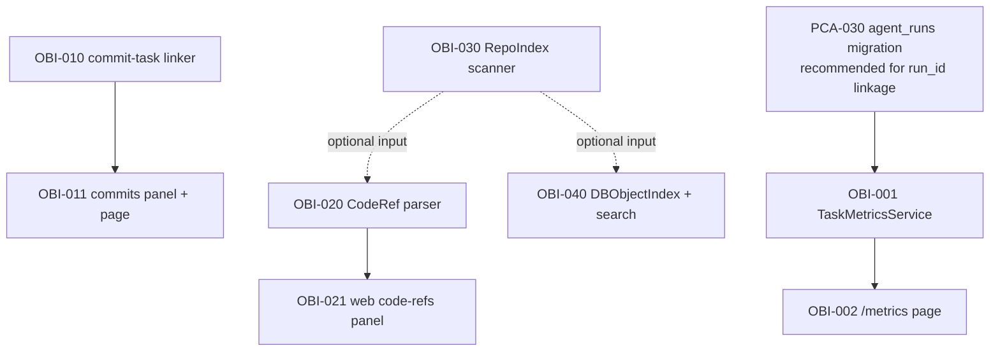

# Observability & Indexing — Execution Plan (опционально)

> Реализация capability [observability-and-indexing](../capabilities/observability-and-indexing.md).
> **Помечено опциональным**: эти задачи не блокируют Phase 1
> paperclip-adoption и могут запускаться независимо. Каждая стори
> доставляет самостоятельную ценность.

## Navigation

- [Capability spec](../capabilities/observability-and-indexing.md)
- [System MASTER](../MASTER.md)
- [Paperclip Adoption plan](paperclip-adoption-task-plan.md)

## Progress Overview

| Section | Story | Title | Tasks | Status |
|:--------|:------|:------|------:|:-------|
| A | US-021 | Метрики и скорость выполнения задач | 2 | 🟡 pending |
| B | US-022 | Тесная интеграция коммитов | 2 | 🟡 pending |
| C | US-023 | Связывание исходного кода с задачами/документами | 2 | 🟡 pending |
| D | US-024 | Индексирование файловой базы репозитория | 1 | 🟡 pending |
| E | US-025 | Индексирование объектной базы проекта | 1 | 🟡 pending |
| **TOTAL** | | | **8** | 🟡 pending |

## Dependency Graph



## Acceptance per section

- **A** — `task.complete` записывает TaskMetric; `/metrics` отображает p50/p95
  и cost-aggregations.
- **B** — commit-task linkage парсится из commit-message regex + `git log`
  batch-import; страница задачи показывает recent commits.
- **C** — markdown parser распознаёт `[label](src/file.py)` как code-ref;
  страница задачи имеет панель «Code refs».
- **D** — `cod-doc reindex --files` строит RepoIndex (.gitignore-aware,
  symbols/imports для python).
- **E** — `cod-doc search "phrase"` возвращает ранжированные результаты
  (docs + tasks + stories + ADR + revisions).

---

## Section A: Metrics

### OBI-001 — Implement: TaskMetricsService + recorder hook in task.complete

```yaml
id: OBI-001
title: "Implement: TaskMetricsService + record on task.complete"
section: A-Metrics
status: pending
depends_on: []
type: feature
priority: medium
story_id: US-021
affects_files:
  - cod_doc/services/metrics_service.py
  - cod_doc/services/task_service.py
  - cod_doc/infra/migrations/versions/2026XX_task_metrics.py
  - tests/services/test_metrics_service.py
```

`task_metric` table + writer hook in `task.complete()`. Captures duration
(completed_at − created or last in-progress timestamp), run_id (PCA-030
when available), iterations (from agent loop), llm_calls/tokens/cost (from
`trace_call` table if connected).

**Acceptance:** при `task.complete` создаётся ровно одна запись TaskMetric;
агрегаты `metrics.aggregate(by='priority'|'type'|'section')` возвращают
p50/p95/p99 + total_count + sum_cost_usd; 8+ tests.

### OBI-002 — Implement: /p/<slug>/metrics page

```yaml
id: OBI-002
title: "Implement: web /p/<slug>/metrics page (sparkline + percentiles)"
section: A-Metrics
status: pending
depends_on: [OBI-001]
type: feature
priority: medium
story_id: US-021
affects_files:
  - cod_doc/api/web/pages/metrics.py
  - cod_doc/templates/web/project/metrics_dashboard.html
```

Страница с фильтрами (since/until/by_section). Sparkline через клиентский
Mermaid. Cost-aggregations с конвертацией в USD (если model-pricing есть в
config).

**Acceptance:** страница рендерит метрики за последние 7/30/90 дней;
HTMX-фильтры обновляют без full-reload; 4+ web-tests.

---

## Section B: Commits

### OBI-010 — Implement: commit_task_linker + git-log batch import

```yaml
id: OBI-010
title: "Implement: commit_task_linker (regex parser + batch git-log import)"
section: B-Commits
status: pending
depends_on: []
type: feature
priority: medium
story_id: US-022
affects_files:
  - cod_doc/services/commit_link_service.py
  - cod_doc/infra/migrations/versions/2026XX_commit_links.py
  - cod_doc/services/task_service.py
  - tests/services/test_commit_link_service.py
```

`commit_link` table + service. Regex для распознавания task_ids в commit
messages (`PCA-001`, `COD-042`, `ADR-005`). При `task.complete(commit_sha)`
авто-извлекаются `affected_paths` через `git diff --name-only`. Batch-импорт
`git log` для исторических коммитов: `commit_link_service.import_history(
since='2026-04-01')`.

**Acceptance:** unit-tests на regex + batch import + автоматическую запись
из `task.complete`; 10+ tests.

### OBI-011 — Implement: commits panel on task page + /commits index

```yaml
id: OBI-011
title: "Implement: web commits panel on task page + /p/<slug>/commits index"
section: B-Commits
status: pending
depends_on: [OBI-010]
type: feature
priority: medium
story_id: US-022
affects_files:
  - cod_doc/api/web/pages/tasks.py
  - cod_doc/api/web/pages/commits.py
  - cod_doc/templates/web/project/commits_list.html
  - cod_doc/templates/web/project/_frag/commits_panel.html
```

На `/p/<slug>/tasks/<id>` — панель «Recent commits» с group-by by-day.
`/p/<slug>/commits` — full-text + filter (author / task / month).

**Acceptance:** обе страницы рендерятся за <100ms на 500 commits; кликабельные
SHA → внешний git host (если configured) или `git show`-фрагмент.

---

## Section C: Code-refs

### OBI-020 — Implement: code-ref parser (markdown + affects_files)

```yaml
id: OBI-020
title: "Implement: parse [symbol](src/path.py) markdown refs as CodeRef"
section: C-Code-Refs
status: pending
depends_on: []
type: feature
priority: medium
story_id: US-023
affects_files:
  - cod_doc/services/link_service/parser.py
  - cod_doc/services/link_service/resolver.py
  - cod_doc/infra/migrations/versions/2026XX_code_refs.py
  - tests/services/test_code_ref_parser.py
```

Расширение `link_service.parser` — распознавать `[label](src/path.py)`
(или `.ts`, `.js` и т.п. — расширения из `cod_doc/services/code_extensions.py`)
как `LinkKind.CODE`. Resolver проверяет существование файла, опционально
парсит anchor `#symbol_name`. Запись в `code_ref` table при `link_service.sync_section`.

**Acceptance:** парсер distinguishes code от markdown; resolver fail-fast при
несуществующем файле; 12+ tests.

### OBI-021 — Implement: web code-refs panel on task/doc pages

```yaml
id: OBI-021
title: "Implement: web code-refs panel on task and document pages"
section: C-Code-Refs
status: pending
depends_on: [OBI-020]
type: feature
priority: low
story_id: US-023
affects_files:
  - cod_doc/api/web/pages/tasks.py
  - cod_doc/api/web/pages/docs.py
  - cod_doc/templates/web/project/_frag/code_refs_panel.html
```

Панель «Code refs» на странице задачи и документа. Кликабельные `path:line`
ведут на `/p/<slug>/repo/<path>` (нужна US-024) либо external git host.

**Acceptance:** панель показывает affects_files + parsed code-refs; на
hover — preview первых 20 строк файла.

---

## Section D: Repo Index

### OBI-030 — Implement: RepoIndex scanner + cod-doc reindex --files

```yaml
id: OBI-030
title: "Implement: RepoIndex (file/symbols/imports) + reindex CLI"
section: D-Repo-Index
status: pending
depends_on: []
type: feature
priority: low
story_id: US-024
affects_files:
  - cod_doc/services/repo_index_service.py
  - cod_doc/cli/cmd_reindex.py
  - cod_doc/infra/migrations/versions/2026XX_repo_index.py
  - tests/services/test_repo_index.py
```

Сканер репозитория — `os.walk` с `.gitignore`-aware фильтром
(`pathspec` lib). Извлекает symbols/imports для Python (через `ast`); для
других языков — только metadata (path/sha/lang/size). Пишет в `repo_index`
table. CLI: `cod-doc reindex --files`.

**Acceptance:** runtime ≤ 5s на 1000 files; gitignore-respect; symbols/imports
для python; 8+ tests.

---

## Section E: DB Object Index

### OBI-040 — Implement: DBObjectIndex (FTS5) + cod-doc search

```yaml
id: OBI-040
title: "Implement: DBObjectIndex via SQLite FTS5 + unified search CLI/web"
section: E-DB-Object-Index
status: pending
depends_on: []
type: feature
priority: low
story_id: US-025
affects_files:
  - cod_doc/services/search_service.py
  - cod_doc/infra/migrations/versions/2026XX_fts5_index.py
  - cod_doc/cli/cmd_search.py
  - cod_doc/api/web/pages/search.py
  - tests/services/test_search_service.py
```

Виртуальная FTS5 таблица — индексирует doc body, task description/acceptance,
story narrative, ADR fields, revision diff snippets. Триггеры sync на mutate.
CLI: `cod-doc search "phrase" [--scope=docs|tasks|stories|all]`. Web:
`/p/<slug>/search?q=...`.

**Acceptance:** запрос возвращает ранжированные результаты ≤ 200ms на типовом
проекте; результаты группируются по scope; 10+ tests.
