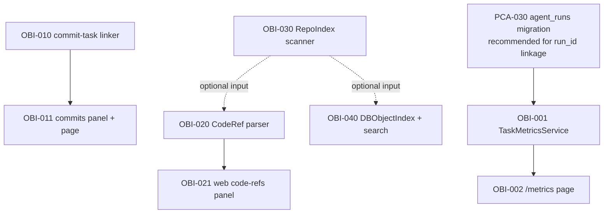

# Observability & Indexing — Execution Plan (optional)

> Implementation of the capability [observability-and-indexing](../capabilities/observability-and-indexing.md).
> **Marked optional**: these tasks do not block Phase 1 of
> paperclip-adoption and can be run independently. Each story
> delivers standalone value.

## Navigation

- [Capability spec](../capabilities/observability-and-indexing.md)
- [System MASTER](../MASTER.md)
- [Paperclip Adoption plan](paperclip-adoption-task-plan.md)

## Progress Overview

| Section | Story | Title | Tasks | Status |
|:--------|:------|:------|------:|:-------|
| A | US-021 | Task metrics and execution speed | 2 | ✅ done |
| B | US-022 | Tight commit integration | 2 | ✅ done |
| C | US-023 | Linking source code to tasks/documents | 2 | ✅ done |
| D | US-024 | Indexing the repository file base | 1 | ✅ done |
| E | US-025 | Indexing the project object base | 1 | ✅ done |
| **TOTAL** | | | **8** | ✅ done |

> **Status reconciliation 2026-06-05** (see [ROADMAP](ROADMAP.md)): the code confirms 8/8 done — `metrics_service.py` + web `/metrics`, `commit_link_service.py` + web `/commits`, code-refs (`api/web/pages/code_refs.py`), `repo_index_service.py` (repo_file/repo_symbol), `search_service.py` FTS5 (`db_search_idx*`). DB: OBI-001..008 = done.

## Dependency Graph



## Acceptance per section

- **A** — `task.complete` records a TaskMetric; `/metrics` shows p50/p95
  and cost aggregations.
- **B** — commit-task linkage is parsed from commit-message regex + a `git log`
  batch import; the task page shows recent commits.
- **C** — the markdown parser recognizes `[label](src/file.py)` as a code-ref;
  the task page has a "Code refs" panel.
- **D** — `cod-doc reindex --files` builds a RepoIndex (.gitignore-aware,
  symbols/imports for python).
- **E** — `cod-doc search "phrase"` returns ranked results
  (docs + tasks + stories + ADR + revisions).

---

## Section A: Metrics

### OBI-001 — Implement: TaskMetricsService + recorder hook in task.complete

```yaml
id: OBI-001
title: "Implement: TaskMetricsService + record on task.complete"
section: A-Metrics
status: pending
depends_on: []
type: feature
priority: medium
story_id: US-021
affects_files:
  - cod_doc/services/metrics_service.py
  - cod_doc/services/task_service.py
  - cod_doc/infra/migrations/versions/2026XX_task_metrics.py
  - tests/services/test_metrics_service.py
```

`task_metric` table + a writer hook in `task.complete()`. Captures duration
(completed_at − created or last in-progress timestamp), run_id (PCA-030
when available), iterations (from the agent loop), llm_calls/tokens/cost (from
the `trace_call` table if connected).

**Acceptance:** on `task.complete` exactly one TaskMetric row is created;
aggregates `metrics.aggregate(by='priority'|'type'|'section')` return
p50/p95/p99 + total_count + sum_cost_usd; 8+ tests.

### OBI-002 — Implement: /p/<slug>/metrics page

```yaml
id: OBI-002
title: "Implement: web /p/<slug>/metrics page (sparkline + percentiles)"
section: A-Metrics
status: pending
depends_on: [OBI-001]
type: feature
priority: medium
story_id: US-021
affects_files:
  - cod_doc/api/web/pages/metrics.py
  - cod_doc/templates/web/project/metrics_dashboard.html
```

A page with filters (since/until/by_section). Sparkline via client-side
Mermaid. Cost aggregations with a USD conversion (if model pricing is in
config).

**Acceptance:** the page renders metrics for the last 7/30/90 days;
HTMX filters update without a full reload; 4+ web tests.

---

## Section B: Commits

### OBI-010 — Implement: commit_task_linker + git-log batch import

```yaml
id: OBI-010
title: "Implement: commit_task_linker (regex parser + batch git-log import)"
section: B-Commits
status: pending
depends_on: []
type: feature
priority: medium
story_id: US-022
affects_files:
  - cod_doc/services/commit_link_service.py
  - cod_doc/infra/migrations/versions/2026XX_commit_links.py
  - cod_doc/services/task_service.py
  - tests/services/test_commit_link_service.py
```

`commit_link` table + service. A regex to recognize task_ids in commit
messages (`PCA-001`, `COD-042`, `ADR-005`). On `task.complete(commit_sha)`
`affected_paths` are auto-extracted via `git diff --name-only`. A batch
import of `git log` for historical commits:
`commit_link_service.import_history(since='2026-04-01')`.

**Acceptance:** unit tests for regex + batch import + automatic recording
from `task.complete`; 10+ tests.

### OBI-011 — Implement: commits panel on task page + /commits index

```yaml
id: OBI-011
title: "Implement: web commits panel on task page + /p/<slug>/commits index"
section: B-Commits
status: pending
depends_on: [OBI-010]
type: feature
priority: medium
story_id: US-022
affects_files:
  - cod_doc/api/web/pages/tasks.py
  - cod_doc/api/web/pages/commits.py
  - cod_doc/templates/web/project/commits_list.html
  - cod_doc/templates/web/project/_frag/commits_panel.html
```

On `/p/<slug>/tasks/<id>` — a "Recent commits" panel grouped by day.
`/p/<slug>/commits` — full-text + filter (author / task / month).

**Acceptance:** both pages render in <100ms on 500 commits; clickable
SHA → external git host (if configured) or a `git show` fragment.

---

## Section C: Code-refs

### OBI-020 — Implement: code-ref parser (markdown + affects_files)

```yaml
id: OBI-020
title: "Implement: parse [symbol](src/path.py) markdown refs as CodeRef"
section: C-Code-Refs
status: pending
depends_on: []
type: feature
priority: medium
story_id: US-023
affects_files:
  - cod_doc/services/link_service/parser.py
  - cod_doc/services/link_service/resolver.py
  - cod_doc/infra/migrations/versions/2026XX_code_refs.py
  - tests/services/test_code_ref_parser.py
```

Extend `link_service.parser` — recognize `[label](src/path.py)`
(or `.ts`, `.js`, etc. — extensions from `cod_doc/services/code_extensions.py`)
as `LinkKind.CODE`. The resolver checks the file exists, optionally parses
the `#symbol_name` anchor. Write to the `code_ref` table on
`link_service.sync_section`.

**Acceptance:** the parser distinguishes code from markdown; the resolver
is fail-fast on a non-existent file; 12+ tests.

### OBI-021 — Implement: web code-refs panel on task/doc pages

```yaml
id: OBI-021
title: "Implement: web code-refs panel on task and document pages"
section: C-Code-Refs
status: pending
depends_on: [OBI-020]
type: feature
priority: low
story_id: US-023
affects_files:
  - cod_doc/api/web/pages/tasks.py
  - cod_doc/api/web/pages/docs.py
  - cod_doc/templates/web/project/_frag/code_refs_panel.html
```

A "Code refs" panel on the task and document pages. Clickable `path:line`
lead to `/p/<slug>/repo/<path>` (needs US-024) or an external git host.

**Acceptance:** the panel shows affects_files + parsed code-refs; on
hover — a preview of the first 20 lines of the file.

---

## Section D: Repo Index

### OBI-030 — Implement: RepoIndex scanner + cod-doc reindex --files

```yaml
id: OBI-030
title: "Implement: RepoIndex (file/symbols/imports) + reindex CLI"
section: D-Repo-Index
status: pending
depends_on: []
type: feature
priority: low
story_id: US-024
affects_files:
  - cod_doc/services/repo_index_service.py
  - cod_doc/cli/cmd_reindex.py
  - cod_doc/infra/migrations/versions/2026XX_repo_index.py
  - tests/services/test_repo_index.py
```

A repository scanner — `os.walk` with a `.gitignore`-aware filter
(`pathspec` lib). Extracts symbols/imports for Python (via `ast`); for
other languages — only metadata (path/sha/lang/size). Writes to the
`repo_index` table. CLI: `cod-doc reindex --files`.

**Acceptance:** runtime ≤ 5s on 1000 files; gitignore-respected;
symbols/imports for python; 8+ tests.

---

## Section E: DB Object Index

### OBI-040 — Implement: DBObjectIndex (FTS5) + cod-doc search

```yaml
id: OBI-040
title: "Implement: DBObjectIndex via SQLite FTS5 + unified search CLI/web"
section: E-DB-Object-Index
status: pending
depends_on: []
type: feature
priority: low
story_id: US-025
affects_files:
  - cod_doc/services/search_service.py
  - cod_doc/infra/migrations/versions/2026XX_fts5_index.py
  - cod_doc/cli/cmd_search.py
  - cod_doc/api/web/pages/search.py
  - tests/services/test_search_service.py
```

A virtual FTS5 table — indexes doc body, task description/acceptance,
story narrative, ADR fields, revision diff snippets. Triggers sync on
mutate. CLI: `cod-doc search "phrase" [--scope=docs|tasks|stories|all]`. Web:
`/p/<slug>/search?q=...`.

**Acceptance:** a query returns ranked results in ≤ 200ms on a typical
project; results are grouped by scope; 10+ tests.
