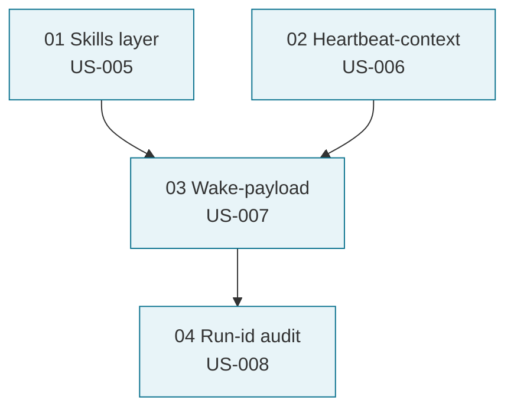

# Paperclip Adoption — Kickoff Brief (2026-05-07)

> **Назначение.** Точка входа в работу по адаптации паттернов
> [paperclipai/paperclip](https://github.com/paperclipai/paperclip) для cod-doc.
> Контекст, состояние, первый tick, критерии готовности, команды.
>
> **Не source of truth.** Канонический документ — execution-plan
> [paperclip-adoption-task-plan.md](paperclip-adoption-task-plan.md). Этот файл
> живёт до закрытия Phase 1, после чего архивируется.

## 1. TL;DR

- **Что:** Привести четыре «прямых заимствования» из paperclip — Skills layer,
  Heartbeat-context, Wake-payload, Run-id audit — в исполняемый беклог.
- **Почему сейчас:** консолидационный цикл 2026-05-07 (см. [Cycle 1
  audit](../audit/2026-05-07-doc-consolidation-cycle-1.md)) выявил, что 15 RFC
  лежат в `/proposals/` без структурированного беклога; 58 done-задач в БД,
  но 0 pending.
- **Объём:** 4 stories (US-005..US-008), Section A в плане,
  17 задач PCA-001..PCA-034.
- **Риск:** низкий. Все 4 предложения помечены paperclip-индексом как
  «🎯 Прямое заимствование, риск низкий».

## 2. Дерево предложений Phase 1



Минимально-разумный порядок: 01 → (02 параллельно) → 03 → 04.

## 3. Состояние на 2026-05-07

| Элемент | Состояние |
|---------|-----------|
| RFC написаны | ✅ proposals/01-04 (2026-05-06) |
| Stories заведены | ⏳ создаются в этом цикле (US-005..US-008) |
| Section A плана | ⏳ создаётся в этом цикле |
| Tasks (PCA-001..PCA-034) | ⏳ создаются в этом цикле |
| Реализация | ❌ pending |

## 4. Первый tick (для следующего сеанса)

1. Прочитать [`proposals/01-skills-layer.md`](../../../proposals/01-skills-layer.md) и
   `cod_doc/agent/prompts.py:3` (текущий монолитный SYSTEM_PROMPT).
2. Открыть `plan_ready(plan_scope='paperclip-adoption-task-plan')` —
   первая ready-задача в зависимостях должна быть **PCA-001** (нет prerequisite).
3. Запустить через `task.complete` обычный flow.

## 5. Acceptance for Phase 1

- [ ] Все 4 stories US-005..US-008 имеют ≥1 task.
- [ ] `cod_doc/skills/` существует, разрезание SYSTEM_PROMPT не повышает
      строк в `prompts.py` (тонкий сборщик).
- [ ] `task_heartbeat_context` MCP-tool работает; orchestrator зовёт его
      раньше `get_master`, если есть текущая task_id.
- [ ] `WakeContext` инжектится как первое user-message; для wake_reason ∈
      {task_assigned, doc_drift, approval_resolved} `get_master` не вызывается.
- [ ] `agent_runs` таблица наполняется; `run_get(run_id)` возвращает все
      мутации одного прогона.

## 6. Команды

```bash
# Plan navigation
codex-doc plan ready --plan paperclip-adoption-task-plan
codex-doc plan progress --plan paperclip-adoption-task-plan

# Run a task end-to-end (after PCA-001/002 land):
codex-doc agent run --task PCA-003

# After Phase 1 closes:
# →  audit-report 2026-XX-XX-paperclip-phase-1.md (memory-pattern: закрытая фаза → audit-report)
```
