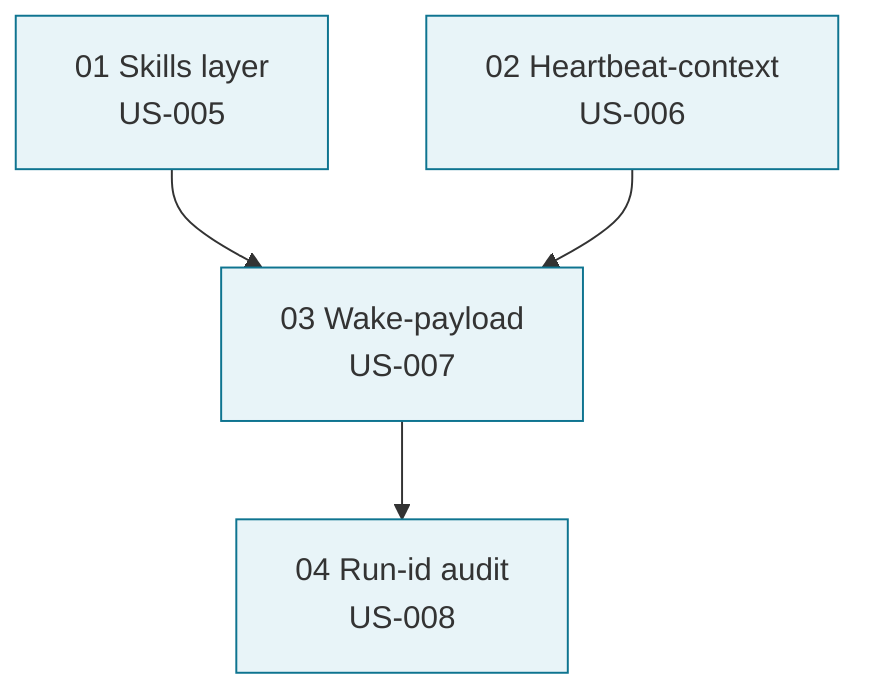

# Paperclip Adoption — Kickoff Brief (2026-05-07)

> **Purpose.** Entry point for the work on adapting the patterns of
> [paperclipai/paperclip](https://github.com/paperclipai/paperclip) for cod-doc.
> Context, state, first tick, readiness criteria, commands.
>
> **Not source of truth.** The canonical document is the execution plan
> [paperclip-adoption-task-plan.md](paperclip-adoption-task-plan.md). This file
> lives until Phase 1 closes, after which it is archived.

## 1. TL;DR

- **What:** Bring four "direct borrowings" from paperclip — Skills layer,
  Heartbeat-context, Wake-payload, Run-id audit — into an executable backlog.
- **Why now:** the consolidation cycle of 2026-05-07 (see [Cycle 1
  audit](../audit/2026-05-07-doc-consolidation-cycle-1.md)) revealed that 15 RFCs
  sit in `/proposals/` without a structured backlog; 58 done tasks in the DB,
  but 0 pending.
- **Scope:** 4 stories (US-005..US-008), Section A in the plan,
  17 tasks PCA-001..PCA-034.
- **Risk:** low. All 4 proposals are tagged with a paperclip index as
  "🎯 Direct borrowing, low risk".

## 2. Phase 1 proposal tree



Reasonable minimal order: 01 → (02 in parallel) → 03 → 04.

## 3. State as of 2026-05-07

| Element | State |
|---------|-------|
| RFCs written | ✅ proposals/01-04 (2026-05-06) |
| Stories created | ⏳ created in this cycle (US-005..US-008) |
| Section A of the plan | ⏳ created in this cycle |
| Tasks (PCA-001..PCA-034) | ⏳ created in this cycle |
| Implementation | ❌ pending |

## 4. First tick (for the next session)

1. Read [`proposals/01-skills-layer.md`](../../../proposals/01-skills-layer.md) and
   `cod_doc/agent/prompts.py:3` (the current monolithic SYSTEM_PROMPT).
2. Open `plan_ready(plan_scope='paperclip-adoption-task-plan')` —
   the first ready task in the dependency graph should be **PCA-001** (no prerequisite).
3. Run the usual flow via `task.complete`.

## 5. Acceptance for Phase 1

- [ ] All 4 stories US-005..US-008 have ≥1 task.
- [ ] `cod_doc/skills/` exists; splitting SYSTEM_PROMPT does not increase
      lines in `prompts.py` (thin assembler).
- [ ] `task_heartbeat_context` MCP-tool works; the orchestrator calls it
      before `get_master` if there is a current task_id.
- [ ] `WakeContext` is injected as the first user-message; for wake_reason ∈
      {task_assigned, doc_drift, approval_resolved} `get_master` is not called.
- [ ] The `agent_runs` table is populated; `run_get(run_id)` returns all
      mutations of a single run.

## 6. Commands

```bash
# Plan navigation
codex-doc plan ready --plan paperclip-adoption-task-plan
codex-doc plan progress --plan paperclip-adoption-task-plan

# Run a task end-to-end (after PCA-001/002 land):
codex-doc agent run --task PCA-003

# After Phase 1 closes:
# →  audit-report 2026-XX-XX-paperclip-phase-1.md (memory-pattern: closed phase → audit-report)
```
