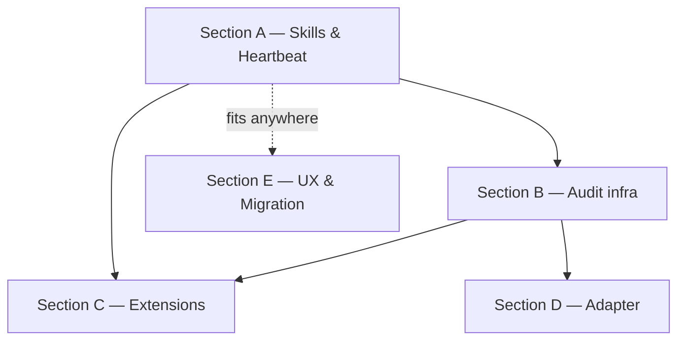

# Paperclip Adoption — Execution Plan

> Канонический беклог по 15 RFC из `/proposals/`. Делит работу на 5 секций,
> отображающих фазы из [proposals/README.md](../../../proposals/README.md):
> Phase 1 (быстрые победы), Phase 2 (структурный аудит), Phase 3 (расширения),
> Phase 4 (по необходимости), Phase 5 (UX и миграция, не имеет phase-номера в
> README, но включает unscoped proposals 13/14/15).

## Navigation

- [Kickoff brief — Phase 1](paperclip-adoption-kickoff-2026-05-07.md)
- [System MASTER](../MASTER.md)
- [Proposals catalog](../../../proposals/README.md)

## Progress Overview

| Section | Phase | Proposals | Stories | Tasks | Status |
|:--------|:------|:----------|:--------|------:|:-------|
| A | 1 — Skills & Heartbeat | 01, 02, 03, 04 | US-005..US-008 | 17 | 🟡 pending |
| B | 2 — Audit infra | 05, 09, 12 | US-009, US-013, US-016 | 6 | 🟡 pending |
| C | 3 — Extensions | 06, 07, 08, 11 | US-010..US-012, US-015 | 7 | 🟡 pending |
| D | 4 — Adapter | 10 | US-014 | 3 | 🟡 pending |
| E | UX & Migration | 13, 14, 15 | US-017..US-019 | 7 | 🟡 pending |
| F | Tooling fixes (cycle-2 gaps) | — | — (internal) | 3 | 🟡 pending |
| H | Agent tools completion (cycle-5 cleanup) | 16, 20 | — (AGN-001..003, 010..013, 020..021) | 9 | 🟡 pending |
| **TOTAL** | | 15 | 15 | **52** | 🟡 pending |

> Cycle 2 наполнил Section A (PCA-001..PCA-034). Cycle 3 (2026-05-07) расширил
> план Sections B/C/D/E (Phase 2-4 + UX) и добавил Section F с tooling-фиксами
> по результатам cycle-2 audit (G1-G3). Section H добавлен 2026-06-04 после
> [self-improvement audit](../audit/2026-06-04-self-improvement-compared.md):
> cycle-5 agent profile функционален, но нужны docstring-фикс и integration tests.
> План — [agent-tools-completion-task-plan.md](agent-tools-completion-task-plan.md).

## Dependency Graph



## Acceptance per section

- **Section A** — закрыта, когда orchestrator грузит skills из каталога,
  `task_heartbeat_context` существует и используется первым на heartbeat,
  `WakeContext` инжектится, `run_id` фиксируется в БД.
- **Section B** — закрыта, когда `issue_doc` (pinned plan/acceptance/verification),
  `activity_log` (timeline поверх revisions) и `approval` сущности живут в БД
  и UI.
- **Section C** — закрыта, когда atomic checkout снимает race в UI/CLI/MCP,
  `routine` сущность исполняет drift/links/hashes по cron, status taxonomy
  расширена `in_review`, появился `AGENTS.md`.
- **Section D** — закрыта, когда LLM-провайдер можно переключить через
  config (Claude/OpenRouter/local) без переписи orchestrator.
- **Section E** — закрыта, когда импорт из Restate (proposal 14) и редизайн
  ссылок (proposal 15) реализованы.

---

## Section A: Phase 1 — Skills & Heartbeat

### A.1 Skills layer (proposal 01 → US-005)

#### PCA-001 — Implement: skills/ directory + orchestrator base skill

```yaml
id: PCA-001
title: "Implement: cod_doc/skills/ directory + orchestrator base skill"
section: A-Skills-Heartbeat
status: pending
depends_on: []
type: feature
priority: high
story_id: US-005
affects_files:
  - cod_doc/skills/orchestrator/SKILL.md
  - cod_doc/skills/orchestrator/references/hybrid-refs.md
  - cod_doc/skills/orchestrator/references/self-check.md
  - cod_doc/agent/prompts.py
```

**Description:** Создать каталог `cod_doc/skills/orchestrator/` с базовым
`SKILL.md` (heartbeat-протокол + index скиллов) и references (hybrid-refs,
self-check). Извлечь из `prompts.py:3` минимальное ядро. Старый
`SYSTEM_PROMPT` оставить тонким сборщиком: подгружает orchestrator/SKILL.md +
динамически добавляет триггерные скиллы (PCA-002).

**Acceptance:** `cod_doc/skills/orchestrator/SKILL.md` существует с YAML-
frontmatter `name`/`description`; `prompts.py` ≤ 50 строк (или собирает
динамически); тесты orchestrator проходят без регрессий.

#### PCA-002 — Implement: skill matcher + dynamic injection

```yaml
id: PCA-002
title: "Implement: select_skills(task) keyword matcher + injection"
section: A-Skills-Heartbeat
status: pending
depends_on: [PCA-001]
type: feature
priority: high
story_id: US-005
affects_files:
  - cod_doc/agent/skill_matcher.py
  - cod_doc/agent/orchestrator.py
  - cod_doc/skills/validation/SKILL.md
  - cod_doc/skills/audit-cadence/SKILL.md
  - cod_doc/skills/drift-handling/SKILL.md
  - cod_doc/skills/plan-to-tasks/SKILL.md
  - cod_doc/skills/doc-style/SKILL.md
```

**Description:** Реализовать функцию `select_skills(task: Task) -> list[Path]`
с keyword-matching по `task.title + task.description + task.kind` против
`description` каждого скилла. Перед каждым LLM-вызовом — собирать system из
orchestrator/SKILL.md + triggered. Создать 5 нон-базовых скиллов (см. proposal 01).

**Acceptance:** unit-тесты на 5+ задач с разными keyword-сценариями; нет
утечек скиллов между LLM-вызовами; общий suite зелёный.

#### PCA-003 — Implement: skill_list / skill_get MCP tools

```yaml
id: PCA-003
title: "Implement: skill_list / skill_get MCP tools"
section: A-Skills-Heartbeat
status: pending
depends_on: [PCA-001]
type: feature
priority: medium
story_id: US-005
affects_files:
  - cod_doc/mcp/tools/skill_tools.py
  - cod_doc/agent/tool_defs.py
```

**Description:** MCP-тулы для самого агента (и внешних клиентов) посмотреть
каталог скиллов и взять конкретный. `skill_list()` → `[{name, description,
path}]`; `skill_get(name)` → полный markdown.

**Acceptance:** оба тула зарегистрированы в `tool_defs.py`; интеграционный
тест поднимает MCP, вызывает `skill_list`, парсит ответ.

#### PCA-004 — Test: skill activation matrix

```yaml
id: PCA-004
title: "Test: skill activation per task category (negative + positive)"
section: A-Skills-Heartbeat
status: pending
depends_on: [PCA-002]
type: test
priority: medium
story_id: US-005
affects_files:
  - tests/agent/test_skill_matcher.py
```

**Description:** Тест-матрица: каждый из 6 скиллов матчится на 1+ позитивный
кейс и не матчится на 1+ негативный (например, `audit-cadence` не подгружается
для feature-задачи без аудитной семантики).

**Acceptance:** 12+ тест-кейсов; pytest зелёный.

### A.2 Heartbeat-context (proposal 02 → US-006)

#### PCA-010 — Implement: task_heartbeat_context MCP tool

```yaml
id: PCA-010
title: "Implement: task_heartbeat_context MCP tool (composition)"
section: A-Skills-Heartbeat
status: pending
depends_on: []
type: feature
priority: critical
story_id: US-006
affects_files:
  - cod_doc/mcp/tools/task_tools.py
  - cod_doc/services/heartbeat_service.py
```

**Description:** MCP-tool `task_heartbeat_context(task_id, since_revision_id?)`.
Возвращает компактный JSON: task (id/status/title/blocked_by/linked_docs),
ancestry (story/project), linked_docs_summary (ref/section/sha/status БЕЗ
полных тел), recent_changes (если задан `since_revision_id`),
active_skills_hint, next_action_guess. Реализовать как композицию `task_get`
+ `revision_list`-since + `link_list` без новой персистентности.

**Acceptance:** размер ответа ≤ 4 KB на типовом heartbeat; нет полных
markdown-тел; интеграционный тест с разными `since_revision_id`.

#### PCA-011 — Refactor: orchestrator prefer heartbeat over get_master

```yaml
id: PCA-011
title: "Refactor: orchestrator зовёт task_heartbeat_context раньше get_master"
section: A-Skills-Heartbeat
status: pending
depends_on: [PCA-010]
type: refactor
priority: high
story_id: US-006
affects_files:
  - cod_doc/agent/orchestrator.py
  - cod_doc/agent/tool_defs.py
  - cod_doc/skills/orchestrator/SKILL.md
```

**Description:** Если у запуска есть `task_id` — вызывать
`task_heartbeat_context` первым; `get_master` оставлять как fallback для
cold-start (нет конкретной задачи). Прописать это правило в
`orchestrator/SKILL.md`.

**Acceptance:** на heartbeat'ах с `task_id` `get_master` не вызывается
(unit-тест на orchestrator); cold-start продолжает работать.

#### PCA-012 — Test: heartbeat-context payload + cursor

```yaml
id: PCA-012
title: "Test: heartbeat-context payload shape + cursor semantics"
section: A-Skills-Heartbeat
status: pending
depends_on: [PCA-010]
type: test
priority: high
story_id: US-006
affects_files:
  - tests/services/test_heartbeat_service.py
  - tests/mcp/test_task_heartbeat_context.py
```

**Description:** Payload-shape тесты (все ключи, типы, размер ≤ 4 KB),
cursor-семантика (передаём `since_revision_id` → получаем только дельту).

**Acceptance:** 6+ тест-кейсов, suite зелёный.

### A.3 Wake-payload (proposal 03 → US-007)

#### PCA-020 — Implement: WakeContext + WakeReason

```yaml
id: PCA-020
title: "Implement: WakeContext dataclass + WakeReason enum"
section: A-Skills-Heartbeat
status: pending
depends_on: []
type: feature
priority: high
story_id: US-007
affects_files:
  - cod_doc/agent/wake_context.py
```

**Description:** Dataclass `WakeContext(reason, task_id, triggering_doc_ref,
triggering_revision_id, payload, skills_to_preload, assembled_at)`.
`WakeReason` enum: `cold_start | task_assigned | doc_drift |
approval_resolved | manual`. Жёсткий size-limit на `payload` (например, 4 KB).

**Acceptance:** validate-методы; unit-тесты на конструктор и size-cap.

#### PCA-021 — Implement: build_wake_context()

```yaml
id: PCA-021
title: "Implement: build_wake_context(task_id?, doc_ref?, ...) builder"
section: A-Skills-Heartbeat
status: pending
depends_on: [PCA-010, PCA-020]
type: feature
priority: high
story_id: US-007
affects_files:
  - cod_doc/agent/wake_context.py
```

**Description:** Builder, переиспользует `task_heartbeat_context` (PCA-010)
для `payload` если задан `task_id`. Для `doc_drift` — кладёт срез по доку
+ список зависимых задач. Для cold_start — `payload={}`,
`skills_to_preload=['orchestrator']`.

**Acceptance:** 5 unit-тестов покрывают каждый WakeReason.

#### PCA-022 — Refactor: Orchestrator.run accepts WakeContext

```yaml
id: PCA-022
title: "Refactor: Orchestrator.run accepts WakeContext, injects as first user-message"
section: A-Skills-Heartbeat
status: pending
depends_on: [PCA-021]
type: refactor
priority: critical
story_id: US-007
affects_files:
  - cod_doc/agent/orchestrator.py
  - cod_doc/skills/orchestrator/SKILL.md
```

**Description:** Сигнатура `Orchestrator.run` теперь принимает
`wake: WakeContext`. Первое сообщение в conversation — структурированный
блок `WAKE PAYLOAD ...`. Скилл-правило в `orchestrator/SKILL.md`: «если есть
WAKE PAYLOAD — действуй по нему, MASTER.md не читать (для scoped wake)».

**Acceptance:** для wake_reason ∈ {task_assigned, doc_drift,
approval_resolved} `get_master` не вызывается на первом round-trip.

#### PCA-023 — Update: run_agent_once accepts trigger params

```yaml
id: PCA-023
title: "Update: run_agent_once MCP tool accepts trigger params"
section: A-Skills-Heartbeat
status: pending
depends_on: [PCA-022]
type: refactor
priority: medium
story_id: US-007
affects_files:
  - cod_doc/mcp/tools/agent_tools.py
```

**Description:** MCP-tool `run_agent_once(project, task_id?,
triggering_doc_ref?, wake_reason?)`. Внутри собирает `WakeContext` и зовёт
`Orchestrator.run`.

**Acceptance:** integration-тест: вызов `run_agent_once` с `task_id` →
агент завершает задачу, не читая MASTER.md.

#### PCA-024 — Test: scoped fast-path

```yaml
id: PCA-024
title: "Test: scoped fast-path skips get_master"
section: A-Skills-Heartbeat
status: pending
depends_on: [PCA-022]
type: test
priority: high
story_id: US-007
affects_files:
  - tests/agent/test_wake_context.py
  - tests/agent/test_orchestrator_wake.py
```

**Description:** Покрыть 4 сценария: cold_start (читает MASTER), task_assigned
(не читает), doc_drift (читает только триггер-док), approval_resolved (читает
только approval). Замокать `get_master` и проверить число вызовов.

**Acceptance:** 4+ тестов, suite зелёный.

### A.4 Run-id audit (proposal 04 → US-008)

#### PCA-030 — Migration: agent_runs table + run_id column

```yaml
id: PCA-030
title: "Migration: agent_runs table + run_id column on revision/audit_log"
section: A-Skills-Heartbeat
status: pending
depends_on: []
type: migration
priority: high
story_id: US-008
affects_files:
  - cod_doc/infra/migrations/versions/20260507_xxxx_agent_runs.py
  - cod_doc/infra/models.py
  - cod_doc/domain/entities.py
```

**Description:** Таблица `agent_runs (run_id PK, started_at, finished_at,
wake_reason, triggering_task_id, triggering_doc_ref, llm_calls,
llm_tokens_in, llm_tokens_out, status, summary)`. Колонка `run_id` (NULL)
на `revision` и `audit_log`. UUID7 для сортируемости.

**Acceptance:** миграция вверх и вниз; smoke-тест на CRUD.

#### PCA-031 — Implement: contextvar run_id propagation

```yaml
id: PCA-031
title: "Implement: contextvar run_id propagation in ToolExecutor"
section: A-Skills-Heartbeat
status: pending
depends_on: [PCA-030]
type: feature
priority: high
story_id: US-008
affects_files:
  - cod_doc/agent/tools.py
  - cod_doc/agent/orchestrator.py
  - cod_doc/services/revision_service.py
  - cod_doc/services/audit_service.py
```

**Description:** Orchestrator при старте генерирует `run_id` (UUID7). Через
`contextvar` (или явный аргумент в ToolExecutor) пробрасывается во все
мутирующие сервисы. RevisionService.write и audit_log пишут `run_id`.

**Acceptance:** integration-тест: один прогон → все 3+ мутаций имеют
один и тот же `run_id`.

#### PCA-032 — Implement: run_list / run_get MCP tools

```yaml
id: PCA-032
title: "Implement: run_list / run_get MCP tools"
section: A-Skills-Heartbeat
status: pending
depends_on: [PCA-031]
type: feature
priority: high
story_id: US-008
affects_files:
  - cod_doc/mcp/tools/run_tools.py
  - cod_doc/agent/tool_defs.py
```

**Description:** `run_list(since?, limit?, status?)` — недавние прогоны.
`run_get(run_id)` — все мутации этого прогона: doc revisions, task status
changes, master updates.

**Acceptance:** оба тула зарегистрированы; integration-тест перебирает
прогон агента, проверяет полноту `run_get`.

#### PCA-033 — Implement: run_revert (read-only first)

```yaml
id: PCA-033
title: "Implement: run_revert(run_id, dry_run=true) — read-only audit"
section: A-Skills-Heartbeat
status: pending
depends_on: [PCA-032]
type: feature
priority: medium
story_id: US-008
affects_files:
  - cod_doc/services/run_service.py
  - cod_doc/mcp/tools/run_tools.py
```

**Description:** `run_revert(run_id, dry_run=True)` сначала только перечисляет
обратные операции (через `revision_revert dry-run`), не выполняя их.
Конфликты (последующий прогон затронул те же артефакты) подсвечивает явно.
Реальный revert — отдельная задача в Cycle 3+.

**Acceptance:** dry_run возвращает `[(operation, result, conflicts)]`; пишет
revision при реальном revert (тест в Section B).

#### PCA-034 — Test: run_id linkage across mutations

```yaml
id: PCA-034
title: "Test: run_id linkage across mutations + run_get integration"
section: A-Skills-Heartbeat
status: pending
depends_on: [PCA-031, PCA-032]
type: test
priority: high
story_id: US-008
affects_files:
  - tests/services/test_run_service.py
  - tests/mcp/test_run_tools.py
```

**Description:** End-to-end: запустить агента с моком LLM, который делает
3 мутации (doc_create, task_complete, update_master_hashes) — проверить,
что `run_get` возвращает все три, а `revision`-таблица содержит одинаковый
`run_id`.

**Acceptance:** 5+ тестов; suite зелёный.

---

## Section B: Phase 2 — Audit infra

| Task | Story | Type | Title |
|------|-------|------|-------|
| PCA-100 | US-009 | migration | task_document table (task-bound docs with revisions) |
| PCA-101 | US-009 | feature | task_doc_* MCP tools + service (blocked_by PCA-100) |
| PCA-110 | US-013 | migration | activity_events table (append-only timeline) |
| PCA-111 | US-013 | feature | ActivityEmitter + activity_list MCP (blocked_by PCA-110, PCA-031) |
| PCA-120 | US-016 | migration | approval table + indexes |
| PCA-121 | US-016 | feature | approval_request / approval_resolve + auto-status + wake (blocked_by PCA-120, PCA-022) |

## Section C: Phase 3 — Extensions

| Task | Story | Type | Title |
|------|-------|------|-------|
| PCA-200 | US-010 | feature | task_checkout / task_release MCP tools + lock fields (blocked_by PCA-220) |
| PCA-201 | US-010 | refactor | write-tools require active checkout (blocked_by PCA-200) |
| PCA-210 | US-011 | migration | Routine entity (cron triggers) |
| PCA-211 | US-011 | feature | scheduler runner + on_finding policy + routine_* MCP (blocked_by PCA-210, PCA-022) |
| PCA-220 | US-012 | migration | TaskStatus 7-state taxonomy + transitions |
| PCA-221 | US-012 | feature | status transition rules + skill enforcement (blocked_by PCA-220) |
| PCA-230 | US-015 | docs | AGENTS.md root + PR-template (Definition of Done) |

## Section D: Phase 4 — Adapter

| Task | Story | Type | Title |
|------|-------|------|-------|
| PCA-300 | US-014 | feature | Design: LLMAdapter Protocol + AdapterCapabilities |
| PCA-301 | US-014 | feature | openai_compat + claude_native adapters (blocked_by PCA-300) |
| PCA-302 | US-014 | feature | AdapterRegistry + adapters.json plugin loader (blocked_by PCA-301) |

## Section E: UX & Migration

| Task | Story | Type | Title |
|------|-------|------|-------|
| PCA-400 | US-017 | feature | folder manifest scanner + diff API |
| PCA-401 | US-017 | feature | web batch import UI (blocked_by PCA-400) |
| PCA-410 | US-018 | feature | web button + dry-run diff for legacy YAML migration |
| PCA-411 | US-018 | refactor | deprecate legacy MCP tools (blocked_by PCA-410) |
| PCA-420 | US-019 | bug | ordered list rendering in markdown.py |
| PCA-421 | US-019 | feature | link_service backfill on imports + bulk-rename + URL handling |
| PCA-422 | US-019 | feature | semantic_backfill for plain-markdown imported docs (blocked_by PCA-421) |

## Section F: Tooling fixes (cycle-2 gaps)

> Заведена в Cycle 3 (2026-05-07) для закрытия API-gap'ов из
> [cycle-2 audit](../audit/2026-05-07-doc-consolidation-cycle-2.md §3).
> Без этих фиксов любая работа с RFC-беклогом полагается на прямой Python-доступ
> к БД для plan/section bootstrap, и blocked_by/story_id/affects_files не
> прорастают в граф зависимостей.

| Task | Type | Priority | Title |
|------|------|----------|-------|
| PCA-901 | feature | high | plan_create / plan_section_create MCP tools (gap G1) |
| PCA-902 | bug | critical | task_create persists blocked_by as dependency edges (gap G2) |
| PCA-903 | bug | high | task_create persists story_id and affects_files (gap G3) |
