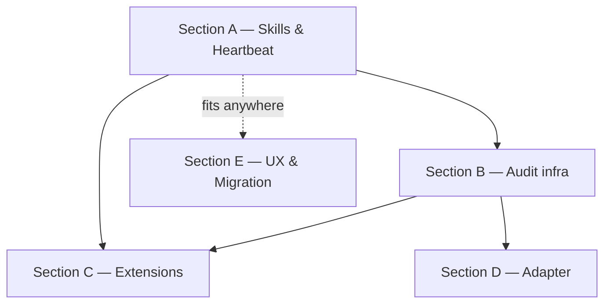

# Paperclip Adoption — Execution Plan

> The canonical backlog over 15 RFCs from `/proposals/`. Splits the work
> into 5 sections reflecting the phases from [proposals/README.md](../../../proposals/README.md):
> Phase 1 (quick wins), Phase 2 (structural audit), Phase 3 (extensions),
> Phase 4 (as needed), Phase 5 (UX and migration, has no phase number in
> the README, but includes the unscoped proposals 13/14/15).

## Navigation

- [Kickoff brief — Phase 1](paperclip-adoption-kickoff-2026-05-07.md)
- [System MASTER](../MASTER.md)
- [Proposals catalog](../../../proposals/README.md)

## Progress Overview

| Section | Phase | Proposals | Stories | Tasks | Status |
|:--------|:------|:----------|:--------|------:|:-------|
| A | 1 — Skills & Heartbeat | 01, 02, 03, 04 | US-005..US-008 | 17 | 🟡 pending |
| B | 2 — Audit infra | 05, 09, 12 | US-009, US-013, US-016 | 6 | 🟡 pending |
| C | 3 — Extensions | 06, 07, 08, 11 | US-010..US-012, US-015 | 7 | 🟡 pending |
| D | 4 — Adapter | 10 | US-014 | 3 | 🟡 pending |
| E | UX & Migration | 13, 14, 15 | US-017..US-019 | 7 | 🟡 pending |
| F | Tooling fixes (cycle-2 gaps) | — | — (internal) | 3 | 🟡 pending |
| H | Agent tools completion (cycle-5 cleanup) | 16, 20 | — (AGN-001..003, 010..013, 020..021) | 9 | 🟡 pending |
| **TOTAL** | | 15 | 15 | **52** | ✅ done |

> **Status reconciliation 2026-06-05** (see [ROADMAP](ROADMAP.md)): "🟡 pending" is a stale draft. DB: PCA = 82 done, 2 cancelled (PCA-935 hide-legacy, PCA-947 activity_subscribe). Reconciliation with the code confirmed that all 15 RFC patterns (01–15) are implemented and wired. **Exception — Section H** (agent-tools docstring + integration tests): the AGT code is done, but the residual work is tracked separately in [agent-tools-completion-task-plan.md](agent-tools-completion-task-plan.md) and in the plan `stabilization-2026-06` (ROADMAP, A0-1).

> Cycle 2 filled Section A (PCA-001..PCA-034). Cycle 3 (2026-05-07) expanded
> the plan with Sections B/C/D/E (Phase 2-4 + UX) and added Section F with
> tooling fixes from the cycle-2 audit (G1-G3). Section H was added 2026-06-04
> after the [self-improvement audit](../audit/2026-06-04-self-improvement-compared.md):
> the cycle-5 agent profile is functional, but needs a docstring fix and integration tests.
> The plan — [agent-tools-completion-task-plan.md](agent-tools-completion-task-plan.md).

## Dependency Graph



## Acceptance per section

- **Section A** — closed when the orchestrator loads skills from a catalog,
  `task_heartbeat_context` exists and is used first on a heartbeat,
  `WakeContext` is injected, `run_id` is recorded in the DB.
- **Section B** — closed when `issue_doc` (pinned plan/acceptance/verification),
  `activity_log` (a timeline over revisions) and `approval` entities live in
  the DB and UI.
- **Section C** — closed when atomic checkout removes the race in UI/CLI/MCP,
  the `routine` entity runs drift/links/hashes on cron, the status taxonomy
  is extended with `in_review`, `AGENTS.md` appears.
- **Section D** — closed when the LLM provider can be switched via
  config (Claude/OpenRouter/local) without rewriting the orchestrator.
- **Section E** — closed when the import from Restate (proposal 14) and the
  link redesign (proposal 15) are implemented.

---

## Section A: Phase 1 — Skills & Heartbeat

### A.1 Skills layer (proposal 01 → US-005)

#### PCA-001 — Implement: skills/ directory + orchestrator base skill

```yaml
id: PCA-001
title: "Implement: cod_doc/skills/ directory + orchestrator base skill"
section: A-Skills-Heartbeat
status: pending
depends_on: []
type: feature
priority: high
story_id: US-005
affects_files:
  - cod_doc/skills/orchestrator/SKILL.md
  - cod_doc/skills/orchestrator/references/hybrid-refs.md
  - cod_doc/skills/orchestrator/references/self-check.md
  - cod_doc/agent/prompts.py
```

**Description:** Create the catalog `cod_doc/skills/orchestrator/` with a
base `SKILL.md` (heartbeat protocol + skill index) and references
(hybrid-refs, self-check). Extract the minimal core from `prompts.py:3`.
Keep the old `SYSTEM_PROMPT` as a thin assembler: loads
orchestrator/SKILL.md + dynamically adds trigger skills (PCA-002).

**Acceptance:** `cod_doc/skills/orchestrator/SKILL.md` exists with YAML
frontmatter `name`/`description`; `prompts.py` ≤ 50 lines (or assembles
dynamically); orchestrator tests pass without regressions.

#### PCA-002 — Implement: skill matcher + dynamic injection

```yaml
id: PCA-002
title: "Implement: select_skills(task) keyword matcher + injection"
section: A-Skills-Heartbeat
status: pending
depends_on: [PCA-001]
type: feature
priority: high
story_id: US-005
affects_files:
  - cod_doc/agent/skill_matcher.py
  - cod_doc/agent/orchestrator.py
  - cod_doc/skills/validation/SKILL.md
  - cod_doc/skills/audit-cadence/SKILL.md
  - cod_doc/skills/drift-handling/SKILL.md
  - cod_doc/skills/plan-to-tasks/SKILL.md
  - cod_doc/skills/doc-style/SKILL.md
```

**Description:** Implement the function
`select_skills(task: Task) -> list[Path]` with keyword-matching over
`task.title + task.description + task.kind` against the `description` of
each skill. Before each LLM call — assemble the system from
orchestrator/SKILL.md + triggered. Create 5 non-base skills (see proposal 01).

**Acceptance:** unit tests on 5+ tasks with different keyword scenarios; no
skill leaks between LLM calls; the overall suite is green.

#### PCA-003 — Implement: skill_list / skill_get MCP tools

```yaml
id: PCA-003
title: "Implement: skill_list / skill_get MCP tools"
section: A-Skills-Heartbeat
status: pending
depends_on: [PCA-001]
type: feature
priority: medium
story_id: US-005
affects_files:
  - cod_doc/mcp/tools/skill_tools.py
  - cod_doc/agent/tool_defs.py
```

**Description:** MCP tools for the agent itself (and external clients) to
view the skill catalog and fetch a specific one. `skill_list()` →
`[{name, description, path}]`; `skill_get(name)` → the full markdown.

**Acceptance:** both tools are registered in `tool_defs.py`; an integration
test brings up MCP, calls `skill_list`, parses the response.

#### PCA-004 — Test: skill activation matrix

```yaml
id: PCA-004
title: "Test: skill activation per task category (negative + positive)"
section: A-Skills-Heartbeat
status: pending
depends_on: [PCA-002]
type: test
priority: medium
story_id: US-005
affects_files:
  - tests/agent/test_skill_matcher.py
```

**Description:** A test matrix: each of the 6 skills matches 1+ positive
case and does not match 1+ negative case (e.g., `audit-cadence` is not
loaded for a feature task without audit semantics).

**Acceptance:** 12+ test cases; pytest green.

### A.2 Heartbeat-context (proposal 02 → US-006)

#### PCA-010 — Implement: task_heartbeat_context MCP tool

```yaml
id: PCA-010
title: "Implement: task_heartbeat_context MCP tool (composition)"
section: A-Skills-Heartbeat
status: pending
depends_on: []
type: feature
priority: critical
story_id: US-006
affects_files:
  - cod_doc/mcp/tools/task_tools.py
  - cod_doc/services/heartbeat_service.py
```

**Description:** MCP tool `task_heartbeat_context(task_id, since_revision_id?)`.
Returns a compact JSON: task (id/status/title/blocked_by/linked_docs),
ancestry (story/project), linked_docs_summary (ref/section/sha/status
WITHOUT full bodies), recent_changes (if `since_revision_id` is given),
active_skills_hint, next_action_guess. Implement as a composition of
`task_get` + `revision_list`-since + `link_list` without new persistence.

**Acceptance:** response size ≤ 4 KB on a typical heartbeat; no full
markdown bodies; an integration test with different `since_revision_id`.

#### PCA-011 — Refactor: orchestrator prefer heartbeat over get_master

```yaml
id: PCA-011
title: "Refactor: orchestrator calls task_heartbeat_context before get_master"
section: A-Skills-Heartbeat
status: pending
depends_on: [PCA-010]
type: refactor
priority: high
story_id: US-006
affects_files:
  - cod_doc/agent/orchestrator.py
  - cod_doc/agent/tool_defs.py
  - cod_doc/skills/orchestrator/SKILL.md
```

**Description:** If the run has a `task_id` — call `task_heartbeat_context`
first; keep `get_master` as a fallback for cold-start (no specific task).
Write this rule into `orchestrator/SKILL.md`.

**Acceptance:** on heartbeats with `task_id` `get_master` is not called
(a unit test on the orchestrator); cold-start still works.

#### PCA-012 — Test: heartbeat-context payload + cursor

```yaml
id: PCA-012
title: "Test: heartbeat-context payload shape + cursor semantics"
section: A-Skills-Heartbeat
status: pending
depends_on: [PCA-010]
type: test
priority: high
story_id: US-006
affects_files:
  - tests/services/test_heartbeat_service.py
  - tests/mcp/test_task_heartbeat_context.py
```

**Description:** Payload-shape tests (all keys, types, size ≤ 4 KB),
cursor semantics (pass `since_revision_id` → get only the delta).

**Acceptance:** 6+ test cases, suite green.

### A.3 Wake-payload (proposal 03 → US-007)

#### PCA-020 — Implement: WakeContext + WakeReason

```yaml
id: PCA-020
title: "Implement: WakeContext dataclass + WakeReason enum"
section: A-Skills-Heartbeat
status: pending
depends_on: []
type: feature
priority: high
story_id: US-007
affects_files:
  - cod_doc/agent/wake_context.py
```

**Description:** Dataclass `WakeContext(reason, task_id, triggering_doc_ref,
triggering_revision_id, payload, skills_to_preload, assembled_at)`.
`WakeReason` enum: `cold_start | task_assigned | doc_drift |
approval_resolved | manual`. A hard size-limit on `payload` (e.g., 4 KB).

**Acceptance:** validate methods; unit tests on the constructor and size-cap.

#### PCA-021 — Implement: build_wake_context()

```yaml
id: PCA-021
title: "Implement: build_wake_context(task_id?, doc_ref?, ...) builder"
section: A-Skills-Heartbeat
status: pending
depends_on: [PCA-010, PCA-020]
type: feature
priority: high
story_id: US-007
affects_files:
  - cod_doc/agent/wake_context.py
```

**Description:** A builder that reuses `task_heartbeat_context` (PCA-010)
for `payload` if `task_id` is given. For `doc_drift` — puts a slice over
the doc + a list of dependent tasks. For cold_start — `payload={}`,
`skills_to_preload=['orchestrator']`.

**Acceptance:** 5 unit tests cover each WakeReason.

#### PCA-022 — Refactor: Orchestrator.run accepts WakeContext

```yaml
id: PCA-022
title: "Refactor: Orchestrator.run accepts WakeContext, injects as first user-message"
section: A-Skills-Heartbeat
status: pending
depends_on: [PCA-021]
type: refactor
priority: critical
story_id: US-007
affects_files:
  - cod_doc/agent/orchestrator.py
  - cod_doc/skills/orchestrator/SKILL.md
```

**Description:** The signature of `Orchestrator.run` now takes
`wake: WakeContext`. The first message in the conversation is a structured
block `WAKE PAYLOAD ...`. Skill rule in `orchestrator/SKILL.md`: "if there
is a WAKE PAYLOAD — act on it, do not read MASTER.md (for scoped wake)".

**Acceptance:** for wake_reason ∈ {task_assigned, doc_drift,
approval_resolved} `get_master` is not called on the first round-trip.

#### PCA-023 — Update: run_agent_once accepts trigger params

```yaml
id: PCA-023
title: "Update: run_agent_once MCP tool accepts trigger params"
section: A-Skills-Heartbeat
status: pending
depends_on: [PCA-022]
type: refactor
priority: medium
story_id: US-007
affects_files:
  - cod_doc/mcp/tools/agent_tools.py
```

**Description:** MCP tool `run_agent_once(project, task_id?,
triggering_doc_ref?, wake_reason?)`. Inside, it assembles a `WakeContext`
and calls `Orchestrator.run`.

**Acceptance:** an integration test: calling `run_agent_once` with
`task_id` → the agent completes the task without reading MASTER.md.

#### PCA-024 — Test: scoped fast-path

```yaml
id: PCA-024
title: "Test: scoped fast-path skips get_master"
section: A-Skills-Heartbeat
status: pending
depends_on: [PCA-022]
type: test
priority: high
story_id: US-007
affects_files:
  - tests/agent/test_wake_context.py
  - tests/agent/test_orchestrator_wake.py
```

**Description:** Cover 4 scenarios: cold_start (reads MASTER), task_assigned
(does not read), doc_drift (reads only the trigger doc), approval_resolved
(reads only the approval). Mock `get_master` and check the call count.

**Acceptance:** 4+ tests, suite green.

### A.4 Run-id audit (proposal 04 → US-008)

#### PCA-030 — Migration: agent_runs table + run_id column

```yaml
id: PCA-030
title: "Migration: agent_runs table + run_id column on revision/audit_log"
section: A-Skills-Heartbeat
status: pending
depends_on: []
type: migration
priority: high
story_id: US-008
affects_files:
  - cod_doc/infra/migrations/versions/20260507_xxxx_agent_runs.py
  - cod_doc/infra/models.py
  - cod_doc/domain/entities.py
```

**Description:** Table `agent_runs (run_id PK, started_at, finished_at,
wake_reason, triggering_task_id, triggering_doc_ref, llm_calls,
llm_tokens_in, llm_tokens_out, status, summary)`. Column `run_id` (NULL)
on `revision` and `audit_log`. UUID7 for sortability.

**Acceptance:** migration up and down; a smoke test on CRUD.

#### PCA-031 — Implement: contextvar run_id propagation

```yaml
id: PCA-031
title: "Implement: contextvar run_id propagation in ToolExecutor"
section: A-Skills-Heartbeat
status: pending
depends_on: [PCA-030]
type: feature
priority: high
story_id: US-008
affects_files:
  - cod_doc/agent/tools.py
  - cod_doc/agent/orchestrator.py
  - cod_doc/services/revision_service.py
  - cod_doc/services/audit_service.py
```

**Description:** The orchestrator generates a `run_id` (UUID7) at start.
Through a `contextvar` (or an explicit argument in ToolExecutor) it is
propagated into all mutating services. RevisionService.write and
audit_log write `run_id`.

**Acceptance:** an integration test: one run → all 3+ mutations have the
same `run_id`.

#### PCA-032 — Implement: run_list / run_get MCP tools

```yaml
id: PCA-032
title: "Implement: run_list / run_get MCP tools"
section: A-Skills-Heartbeat
status: pending
depends_on: [PCA-031]
type: feature
priority: high
story_id: US-008
affects_files:
  - cod_doc/mcp/tools/run_tools.py
  - cod_doc/agent/tool_defs.py
```

**Description:** `run_list(since?, limit?, status?)` — recent runs.
`run_get(run_id)` — all mutations of this run: doc revisions, task status
changes, master updates.

**Acceptance:** both tools are registered; an integration test walks an
agent run, checks the completeness of `run_get`.

#### PCA-033 — Implement: run_revert (read-only first)

```yaml
id: PCA-033
title: "Implement: run_revert(run_id, dry_run=true) — read-only audit"
section: A-Skills-Heartbeat
status: pending
depends_on: [PCA-032]
type: feature
priority: medium
story_id: US-008
affects_files:
  - cod_doc/services/run_service.py
  - cod_doc/mcp/tools/run_tools.py
```

**Description:** `run_revert(run_id, dry_run=True)` first only lists the
reverse operations (via `revision_revert dry-run`), without executing
them. Conflicts (a subsequent run touched the same artifacts) are
highlighted explicitly. A real revert — a separate task in Cycle 3+.

**Acceptance:** dry_run returns `[(operation, result, conflicts)]`;
writes a revision on a real revert (test in Section B).

#### PCA-034 — Test: run_id linkage across mutations

```yaml
id: PCA-034
title: "Test: run_id linkage across mutations + run_get integration"
section: A-Skills-Heartbeat
status: pending
depends_on: [PCA-031, PCA-032]
type: test
priority: high
story_id: US-008
affects_files:
  - tests/services/test_run_service.py
  - tests/mcp/test_run_tools.py
```

**Description:** End-to-end: run an agent with an LLM mock that makes 3
mutations (doc_create, task_complete, update_master_hashes) — check that
`run_get` returns all three, and the `revision` table contains the same
`run_id`.

**Acceptance:** 5+ tests; suite green.

---

## Section B: Phase 2 — Audit infra

| Task | Story | Type | Title |
|------|-------|------|-------|
| PCA-100 | US-009 | migration | task_document table (task-bound docs with revisions) |
| PCA-101 | US-009 | feature | task_doc_* MCP tools + service (blocked_by PCA-100) |
| PCA-110 | US-013 | migration | activity_events table (append-only timeline) |
| PCA-111 | US-013 | feature | ActivityEmitter + activity_list MCP (blocked_by PCA-110, PCA-031) |
| PCA-120 | US-016 | migration | approval table + indexes |
| PCA-121 | US-016 | feature | approval_request / approval_resolve + auto-status + wake (blocked_by PCA-120, PCA-022) |

## Section C: Phase 3 — Extensions

| Task | Story | Type | Title |
|------|-------|------|-------|
| PCA-200 | US-010 | feature | task_checkout / task_release MCP tools + lock fields (blocked_by PCA-220) |
| PCA-201 | US-010 | refactor | write-tools require active checkout (blocked_by PCA-200) |
| PCA-210 | US-011 | migration | Routine entity (cron triggers) |
| PCA-211 | US-011 | feature | scheduler runner + on_finding policy + routine_* MCP (blocked_by PCA-210, PCA-022) |
| PCA-220 | US-012 | migration | TaskStatus 7-state taxonomy + transitions |
| PCA-221 | US-012 | feature | status transition rules + skill enforcement (blocked_by PCA-220) |
| PCA-230 | US-015 | docs | AGENTS.md root + PR-template (Definition of Done) |

## Section D: Phase 4 — Adapter

| Task | Story | Type | Title |
|------|-------|------|-------|
| PCA-300 | US-014 | feature | Design: LLMAdapter Protocol + AdapterCapabilities |
| PCA-301 | US-014 | feature | openai_compat + claude_native adapters (blocked_by PCA-300) |
| PCA-302 | US-014 | feature | AdapterRegistry + adapters.json plugin loader (blocked_by PCA-301) |

## Section E: UX & Migration

| Task | Story | Type | Title |
|------|-------|------|-------|
| PCA-400 | US-017 | feature | folder manifest scanner + diff API |
| PCA-401 | US-017 | feature | web batch import UI (blocked_by PCA-400) |
| PCA-410 | US-018 | feature | web button + dry-run diff for legacy YAML migration |
| PCA-411 | US-018 | refactor | deprecate legacy MCP tools (blocked_by PCA-410) |
| PCA-420 | US-019 | bug | ordered list rendering in markdown.py |
| PCA-421 | US-019 | feature | link_service backfill on imports + bulk-rename + URL handling |
| PCA-422 | US-019 | feature | semantic_backfill for plain-markdown imported docs (blocked_by PCA-421) |

## Section F: Tooling fixes (cycle-2 gaps)

> Created in Cycle 3 (2026-05-07) to close the API gaps from
> [cycle-2 audit §3](../audit/2026-05-07-doc-consolidation-cycle-2.md).
> Without these fixes, any work with the RFC backlog relies on direct
> Python access to the DB for plan/section bootstrap, and
> blocked_by/story_id/affects_files do not propagate into the dependency graph.

| Task | Type | Priority | Title |
|------|------|----------|-------|
| PCA-901 | feature | high | plan_create / plan_section_create MCP tools (gap G1) |
| PCA-902 | bug | critical | task_create persists blocked_by as dependency edges (gap G2) |
| PCA-903 | bug | high | task_create persists story_id and affects_files (gap G3) |
