# Task Dependency Graph

> Объединённый граф всех задач: COD (bootstrap) + WEB (frontend).
> Зелёный = done, серый = pending/in-progress.
> Источник истины — планы выполнения; этот файл генерируется вручную при обновлении планов.
>
> 🧭 **Верхний индекс приоритетов — [ROADMAP.md](ROADMAP.md)** (треки A/B, ground-truth статусы).
> Этот граф датирован 2026-05-01 и охватывает только COD/WEB; актуальный бэклог см. в ROADMAP.

## Summary

| Plan | Total | Done | Pending |
|:-----|------:|-----:|--------:|
| COD (bootstrap) | 31 | 16 | 15 |
| WEB (frontend) | 13 | 5 | 8 |
| **TOTAL** | **44** | **21** | **23** |

## Graph

```mermaid
graph TD
  %% ─────────────── Section A: Data Core ───────────────
  subgraph A["Section A · Data Core ✅"]
    COD001["COD-001\ncore tables"]
    COD002["COD-002\nplan + task"]
    COD003["COD-003\nstories"]
    COD004["COD-004\nrevisions"]
    COD005["COD-005\nlinks + tags"]
  end

  %% ─────────────── Section B: Services ───────────────
  subgraph B["Section B · Services ✅"]
    COD015["COD-015\nRevisionService"]
    COD010["COD-010\nDocService"]
    COD011["COD-011\nTaskService"]
    COD012["COD-012\nPlanService"]
    COD013["COD-013\nLinkService"]
    COD014["COD-014\nStoryService"]
  end

  %% ─────────────── Section C: Write Paths ───────────────
  subgraph C["Section C · Write Paths ✅"]
    COD020["COD-020\nvalidation"]
    COD021["COD-021\ncycle detection"]
    COD022["COD-022\ncompletion flow"]
    COD023["COD-023\nprojection export"]
  end

  %% ─────────────── Section D: MCP & CLI ───────────────
  subgraph D["Section D · MCP & CLI ❌"]
    COD030["COD-030\nCLI: task/plan/story"]
    COD031["COD-031\nCLI: doc/link/revision"]
    COD032["COD-032\nMCP tools"]
    COD033["COD-033\nMCP context.get"]
  end

  %% ─────────────── Section E: Retrieval ───────────────
  subgraph E["Section E · Retrieval ❌"]
    COD040["COD-040\nembeddings pipeline"]
    COD041["COD-041\nContextService L0/L1"]
    COD042["COD-042\nContextService L2/L3"]
    COD043["COD-043\nlocal torch backend"]
  end

  %% ─────────────── Section F: Migration ───────────────
  subgraph F["Section F · Migration ❌"]
    COD050["COD-050\nfrontmatter parser tests"]
    COD051["COD-051\nRestate importer"]
    COD052["COD-052\nprojection freeze"]
  end

  %% ─────────────── Section G: Hardening & DevX ───────────────
  subgraph G["Section G · Hardening 🔄"]
    COD024["COD-024\nCI workflow ✅"]
    COD024a["COD-024a\nruff/mypy debt"]
    COD025["COD-025\nSensitive-data infra"]
    COD026["COD-026\nTUI smoke tests"]
    COD014a["COD-014a\nmarkdown cascade"]
  end

  %% ─────────────── WEB Section A: Scaffold ───────────────
  subgraph WA["WEB · Section A · Scaffold ✅"]
    WEB001["WEB-001\nweb scaffold"]
    WEB002["WEB-002\nproject page"]
    WEB003["WEB-003\ndocs view"]
  end

  %% ─────────────── WEB Section B: Read Views ───────────────
  subgraph WB["WEB · Section B · Read Views 🔄"]
    WEB004["WEB-004\nplan view"]
    WEB010["WEB-010\ntasks list ✅"]
    WEB020["WEB-020\nsettings page"]
    WEB021["WEB-021\nrevisions log"]
  end

  %% ─────────────── WEB Section C: Write Paths ───────────────
  subgraph WC["WEB · Section C · Write Paths 🔄"]
    WEB011["WEB-011\nHTMX task status ✅"]
    WEB012["WEB-012\nHTMX section patch"]
    WEB022["WEB-022\nalert/error model"]
  end

  %% ─────────────── WEB Section D: Live Ops ───────────────
  subgraph WD["WEB · Section D · Live Ops ❌"]
    WEB030["WEB-030\nSSE run console"]
    WEB031["WEB-031\nimport stream"]
  end

  %% ─────────────── WEB Section E: Arch Hygiene ───────────────
  subgraph WE["WEB · Section E · Arch Hygiene ❌"]
    WEB040["WEB-040\nremove infra bypass"]
  end

  %% ═══════════════ COD EDGES ═══════════════
  COD001 --> COD002 --> COD003 --> COD004 --> COD005
  COD004 --> COD015

  COD001 --> COD010
  COD015 --> COD010

  COD002 --> COD011
  COD015 --> COD011

  COD011 --> COD012

  COD005 --> COD013
  COD010 --> COD013

  COD003 --> COD014
  COD011 --> COD014
  COD015 --> COD014

  COD011 --> COD020
  COD011 --> COD021
  COD012 --> COD021
  COD011 --> COD022
  COD015 --> COD022
  COD010 --> COD023

  COD020 --> COD030
  COD023 --> COD031
  COD013 --> COD031
  COD030 --> COD032
  COD031 --> COD032
  COD041 --> COD033

  COD010 --> COD040
  COD040 --> COD041
  COD041 --> COD042
  COD042 --> COD043

  COD050 --> COD051
  COD032 --> COD051
  COD023 --> COD052
  COD051 --> COD052

  COD024 --> COD024a
  COD020 --> COD025
  COD013 --> COD014a

  %% ═══════════════ WEB EDGES ═══════════════
  WEB001 --> WEB002
  WEB002 --> WEB003
  WEB002 --> WEB004
  WEB002 --> WEB010
  WEB002 --> WEB020
  WEB002 --> WEB021
  WEB002 --> WEB030
  WEB010 --> WEB011
  WEB003 --> WEB012
  WEB011 --> WEB022
  WEB012 --> WEB022
  WEB030 --> WEB031
  WEB002 --> WEB040
  WEB003 --> WEB040
  WEB010 --> WEB040
  WEB011 --> WEB040

  %% ═══════════════ STYLES ═══════════════
  classDef done fill:#16a34a,color:#fff,stroke:#15803d
  classDef pending fill:#64748b,color:#fff,stroke:#475569

  class COD001,COD002,COD003,COD004,COD005 done
  class COD010,COD011,COD012,COD013,COD014,COD015 done
  class COD020,COD021,COD022,COD023 done
  class COD024 done
  class COD030,COD031,COD032,COD033 pending
  class COD040,COD041,COD042,COD043 pending
  class COD050,COD051,COD052 pending
  class COD014a,COD024a,COD025,COD026 pending
  class WEB001,WEB002,WEB003,WEB010,WEB011 done
  class WEB004,WEB020,WEB021,WEB012,WEB022 pending
  class WEB030,WEB031,WEB040 pending
```

## Critical paths

**К COD-032 (MCP tools):** COD-020 → COD-030 → COD-032 ← COD-031 ← COD-023 / COD-013

**К COD-033 (MCP context.get):** COD-010 → COD-040 → COD-041 → COD-033

**К COD-052 (projection freeze):** COD-032 → COD-051 → COD-052 ← COD-023

**К WEB-040 (arch hygiene):** WEB-002 + WEB-003 + WEB-010 + WEB-011 → WEB-040
