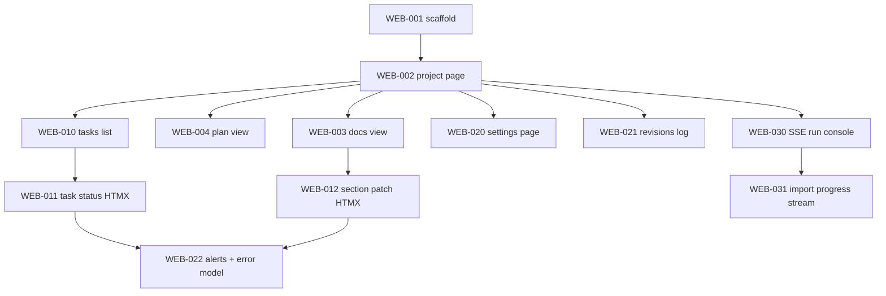

# Web Frontend — Execution Plan

> Server-rendered Web UI поверх FastAPI + Jinja + HTMX. Capability: [capabilities/web-frontend.md](../capabilities/web-frontend.md).
> Источник истины — БД и сервисы; web-страницы — ещё одна Presentation-поверхность наравне с CLI/TUI/MCP.

## Navigation

- [System MASTER](../MASTER.md)
- [Architecture](../ARCHITECTURE.md)
- [Capability: Web Frontend](../capabilities/web-frontend.md)
- [Bootstrap plan (ядро)](cod-doc-task-plan.md)

## Progress Overview

| Section | File | Total | Done | Remaining | Status |
|:--------|:-----|------:|-----:|----------:|:-------|
| A: Scaffold | inline | 3 | 1 | 2 | 🔄 in-progress |
| B: Read views | inline | 4 | 0 | 4 | ❌ pending |
| C: Write paths | inline | 3 | 0 | 3 | ❌ pending |
| D: Live ops | inline | 2 | 0 | 2 | ❌ pending |
| **TOTAL** |  | **12** | **1** | **11** | |

## Gap Analysis Summary

### Уже есть

- FastAPI-сервер с lifespan и DI (`cod_doc/api/server.py`).
- JSON-API на `/api/*` (projects/tasks/master/config/run/webhooks/ws).
- Сервисы Doc/Task/Plan/Revision (COD-010..012, COD-015 done).
- Jinja2 в зависимостях; шаблон `MASTER.md.j2` уже использует Jinja.

### Чего нет

- Jinja-инфраструктуры для Web (templates env, base layout, фильтры).
- StaticFiles mount.
- HTMX/Mermaid вендорных файлов.
- Web-роутера и страниц.
- HTMX-фрагментов для inline-редактирования.
- SSE-стрима для long-running операций (есть только WS).

## Next Batch

- **WEB-001** — Test + Implement: scaffold (templates env, base layout, static mount, index page, smoke-тест).
- **WEB-002** — Implement: project detail page (stats + MASTER preview + tabs nav).
- **WEB-003** — Implement: documents list + show (через DocService).
- **WEB-010** — Implement: tasks list + filter (через TaskService).
- **WEB-011** — Implement: HTMX inline status update.

## Dependency Graph



---

## Section A: Scaffold

### WEB-001

```yaml
id: WEB-001
title: "Test + Implement: web router scaffold (templates env, static, base layout, index page)"
section: A-Scaffold
status: done
depends_on: []
type: feature
priority: critical
affected_files:
  - cod_doc/api/web/__init__.py
  - cod_doc/api/web/templates_env.py
  - cod_doc/api/web/pages.py
  - cod_doc/api/server.py
  - cod_doc/templates/web/base.html
  - cod_doc/templates/web/index.html
  - cod_doc/static/app.css
  - tests/api/test_web_scaffold.py
```

**Description:** Поднять Jinja-окружение, смонтировать `/static`, добавить web-роутер в `server.py`, отдать `GET /` со списком проектов. HTMX и Mermaid пока не подключаем — только базовый layout. Никаких новых deps.

**Acceptance:**
- `GET /` возвращает 200 и HTML, содержащий имя каждого зарегистрированного проекта.
- `GET /static/app.css` возвращает 200 с `content-type: text/css`.
- Smoke-тест в `tests/api/test_web_scaffold.py`.

> ✅ **Implemented 2026-04-28** (commit `pending`): web-роутер `cod_doc.api.web` с `pages.py` (`GET /` → список проектов через `Config.list_projects()` + `Project.stats()`), Jinja2-окружение в `templates_env.py`, базовый layout `templates/web/base.html` + `index.html`, статика `cod_doc/static/app.css` (~60 строк raw CSS), монтирование в `server.py` (`/static` через StaticFiles, web-роутер последним). Тесты — 4/4 (рендер списка, warning при unconfigured, пустой список, отдача `/static/app.css`); общий suite — 177/177. Изоляция config через `tests/api/conftest.py` (monkeypatch `CONFIG_DIR`/`CONFIG_FILE`) — чтобы тесты не писали в `~/.cod-doc/config.yaml`. HTMX/Mermaid не подключены — это в WEB-002+.

### WEB-002

```yaml
id: WEB-002
title: "Implement: project detail page (stats + MASTER preview + tabs nav)"
section: A-Scaffold
status: pending
depends_on: [WEB-001]
type: feature
priority: high
```

**Description:** `GET /p/{slug}` — основной дашборд проекта. Карточка stats, превью MASTER.md (первые 80 строк или первая секция), навигация на табы Docs / Tasks / Plan / Revisions / Settings. Использует существующие helper-ы `get_project` / `Project.stats` / `Project.read_master`.

**Acceptance:**
- 200 на seed-проекте; 404 на несуществующем slug.
- Все табы — обычные `<a href>`, без JS.

### WEB-003

```yaml
id: WEB-003
title: "Implement: documents list + show (DocService)"
section: A-Scaffold
status: pending
depends_on: [WEB-002]
type: feature
priority: high
```

**Description:** `GET /p/{slug}/docs` — список документов проекта (через `DocService` или `DocumentRepository.list_for_project`). `GET /p/{slug}/docs/{doc_key:path}` — render через `DocService.render_body` + список секций сбоку.

---

## Section B: Read views

### WEB-004

```yaml
id: WEB-004
title: "Implement: plan view (Progress Overview + Next Batch + Mermaid)"
section: B-Read-Views
status: pending
depends_on: [WEB-002]
type: feature
priority: high
```

**Description:** `GET /p/{slug}/plans/{plan_id}`. Использует `PlanService.recalc / ready / export`. Mermaid-граф рендерится клиентским скриптом (`/static/mermaid.min.js`).

### WEB-010

```yaml
id: WEB-010
title: "Implement: tasks list + filter"
section: B-Read-Views
status: pending
depends_on: [WEB-002]
type: feature
priority: high
```

**Description:** `GET /p/{slug}/tasks?plan=&status=`. Таблица: id / title / section / status / priority. Без HTMX в этой задаче — только read.

### WEB-020

```yaml
id: WEB-020
title: "Implement: settings page (config view + form save)"
section: B-Read-Views
status: pending
depends_on: [WEB-001]
type: feature
priority: medium
```

**Description:** `GET/POST /settings` — read/write `Config` через `ConfigUpdate`-аналогичную модель. API-ключ маскируется при отображении.

### WEB-021

```yaml
id: WEB-021
title: "Implement: revisions log"
section: B-Read-Views
status: pending
depends_on: [WEB-002]
type: feature
priority: medium
```

**Description:** `GET /p/{slug}/revisions?entity_kind=&entity_id=` — список ревизий через `RevisionService.list_for_entity`. Diff-render — pre-formatted JSON-patch на этом этапе (без визуального diff-виджета).

---

## Section C: Write paths

### WEB-011

```yaml
id: WEB-011
title: "Implement: HTMX inline task status update"
section: C-Write-Paths
status: pending
depends_on: [WEB-010]
type: feature
priority: high
affected_files:
  - cod_doc/api/web/fragments.py
  - cod_doc/templates/web/_frag/task_row.html
```

**Description:** `<select hx-post="/p/{slug}/tasks/{task_id}/status">` → возвращает обновлённый `<tr>` для swap. Ошибки сервиса (`TaskNotFoundError`, conflict) → красный inline-маркер.

### WEB-012

```yaml
id: WEB-012
title: "Implement: HTMX inline section patch"
section: C-Write-Paths
status: pending
depends_on: [WEB-003]
type: feature
priority: high
```

**Description:** Inline-edit body секции через `<textarea>` + `hx-post`. Optimistic concurrency через скрытый `expected_parent_revision_id`.

### WEB-022

```yaml
id: WEB-022
title: "Implement: alert/error model (HTMX target #alerts)"
section: C-Write-Paths
status: pending
depends_on: [WEB-011, WEB-012]
type: feature
priority: medium
```

**Description:** Единый формат ошибок для web-роутера: `WebError` exception → middleware → render `_frag/alert.html` в `#alerts` (HTMX `hx-swap-oob`). Покрывает NotFound / Validation / Conflict.

---

## Section D: Live ops

### WEB-030

```yaml
id: WEB-030
title: "Implement: SSE run console (Orchestrator stream)"
section: D-Live-Ops
status: pending
depends_on: [WEB-002]
type: feature
priority: medium
```

**Description:** `GET /p/{slug}/run` — страница с консолью; `GET /p/{slug}/run/stream` — `text/event-stream`, итерирующий `Orchestrator.run_autonomous`. HTMX SSE-extension подписывает `<div>` на стрим.

### WEB-031

```yaml
id: WEB-031
title: "Implement: import progress stream (Restate importer)"
section: D-Live-Ops
status: pending
depends_on: [WEB-030]
type: feature
priority: low
```

**Description:** Тот же SSE-механизм для `cod-doc import restate` (после COD-051).
