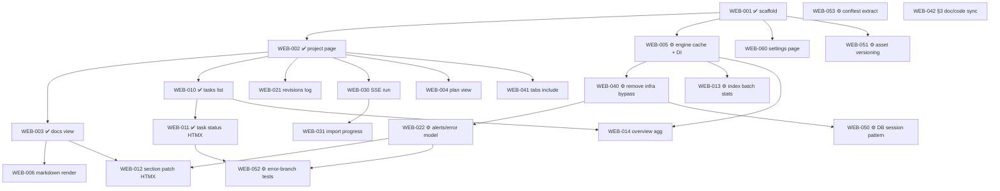

# Web Frontend — Execution Plan

> Server-rendered Web UI поверх FastAPI + Jinja + HTMX. Capability: [capabilities/web-frontend.md](../capabilities/web-frontend.md).
> Источник истины — БД и сервисы; web-страницы — ещё одна Presentation-поверхность наравне с CLI/TUI/MCP.

## Navigation

- [System MASTER](../MASTER.md)
- [Architecture](../ARCHITECTURE.md)
- [Capability: Web Frontend](../capabilities/web-frontend.md)
- [Bootstrap plan (ядро)](cod-doc-task-plan.md)
- **[Kickoff brief 2026-05-02](web-frontend-kickoff-2026-05-02.md)** — точка входа на Section F
- [Audit-отчёт 2026-05-02 (Web)](../audit/2026-05-02-section-web-frontend.md)

## Progress Overview

| Section | File | Total | Done | Remaining | Status |
|:--------|:-----|------:|-----:|----------:|:-------|
| A: Scaffold | inline | 3 | 3 | 0 | ✅ done |
| B: Read views | inline | 6 | 6 | 0 | ✅ done (WEB-010, 006, 014, 021, 004, 060) |
| C: Write paths | inline | 3 | 2 | 1 | 🔄 in-progress (WEB-011, WEB-022 ✅) |
| D: Live ops | inline | 2 | 0 | 2 | ❌ pending |
| E: Architecture Hygiene | inline | 3 | 2 | 1 | 🔄 in-progress (WEB-040, 041 ✅; 042 pending) |
| F: Hardening (NEW 2026-05-02) | inline | 6 | 2 | 4 | 🔄 in-progress (WEB-005, 013 ✅; 050..053 pending) |
| F-tail: Polish from checkpoint | inline | 3 | 3 | 0 | ✅ done (WEB-013b, 022b, 054) |
| **TOTAL** |  | **26** | **18** | **8** | |

> **Изменено 2026-05-02** на основе [audit-отчёта](../audit/2026-05-02-section-web-frontend.md):
> добавлены 10 задач (WEB-005, 006, 013, 014, 041, 042, 050..053, 060), приоритет
> WEB-022 поднят с `medium` до `high`, приоритет WEB-040 — с `medium` до `high`.

## Gap Analysis Summary

### Уже есть

- FastAPI-сервер с lifespan и DI (`cod_doc/api/server.py`).
- JSON-API на `/api/*` (projects/tasks/master/config/run/webhooks/ws).
- Сервисы Doc/Task/Plan/Revision (COD-010..012, COD-015 done).
- Jinja2 в зависимостях; шаблон `MASTER.md.j2` уже использует Jinja.

### Чего нет

- Jinja-инфраструктуры для Web (templates env, base layout, фильтры).
- StaticFiles mount.
- HTMX/Mermaid вендорных файлов.
- Web-роутера и страниц.
- HTMX-фрагментов для inline-редактирования.
- SSE-стрима для long-running операций (есть только WS).

## Next Batch (после аудита 2026-05-02)

Порядок продиктован зависимостями: сначала HARDENING (WEB-005 → WEB-040 → WEB-022),
затем читалки (WEB-004/021/041), потом write-path (WEB-012/014).

1. **WEB-005** — Engine cache + `get_project_db` DI helper в `cod_doc.api.deps`.
   *Разблокирует:* WEB-040, WEB-013, любую новую страницу с DB.
2. **WEB-040** — удалить `db_resolver.py`, перевести на DI из WEB-005, добавить ban-rule.
3. **WEB-022** — alert/error model (`#alerts` HTMX target, `_frag/alert.html`).
4. **WEB-041** — `_layout/project_tabs.html` include + `disabled`-табы.
5. **WEB-013** — Index batch stats (закрывает N+1 на `GET /`).
6. **WEB-004** — Plan view (Progress Overview + Mermaid).
7. **WEB-021** — Revisions log.
8. **WEB-014** — Overview agg + `task complete` POST.
9. **WEB-012** — HTMX section patch (depends WEB-022, WEB-040).
10. **WEB-006** — Markdown rendering для doc body.

«Хвост» (LO): WEB-051 (asset versioning), WEB-052 (error-branch tests),
WEB-053 (conftest cleanup), WEB-042 (capability §3/§4 keep-in-sync helper).

## Dependency Graph (post-audit 2026-05-02)


```mermaid
graph TD
  %% Section A — done
  WEB_001[WEB-001 ✅ scaffold]
  WEB_002[WEB-002 ✅ project page]
  WEB_003[WEB-003 ✅ docs view]
  WEB_010[WEB-010 ✅ tasks list]
  WEB_011[WEB-011 ✅ task status HTMX]

  %% Section F — Hardening (NEW)
  WEB_005[WEB-005 ⚙ engine cache + DI]
  WEB_013[WEB-013 ⚙ index batch stats]
  WEB_040[WEB-040 ⚙ remove infra bypass]
  WEB_022[WEB-022 ⚙ alerts/error model]
  WEB_050[WEB-050 ⚙ DB session pattern]
  WEB_051[WEB-051 ⚙ asset versioning]
  WEB_052[WEB-052 ⚙ error-branch tests]
  WEB_053[WEB-053 ⚙ conftest extract]

  %% Section B — Read views
  WEB_004[WEB-004 plan view]
  WEB_006[WEB-006 markdown render]
  WEB_014[WEB-014 overview agg]
  WEB_021[WEB-021 revisions log]
  WEB_060[WEB-060 settings page]

  %% Section C — Write paths
  WEB_012[WEB-012 section patch HTMX]

  %% Section D — Live ops
  WEB_030[WEB-030 SSE run]
  WEB_031[WEB-031 import progress]

  %% Section E — Architecture Hygiene
  WEB_041[WEB-041 tabs include]
  WEB_042[WEB-042 §3 doc/code sync]

  %% Edges
  WEB_001 --> WEB_002 --> WEB_003
  WEB_002 --> WEB_010 --> WEB_011
  WEB_002 --> WEB_021
  WEB_002 --> WEB_030 --> WEB_031

  WEB_001 --> WEB_005
  WEB_005 --> WEB_040
  WEB_005 --> WEB_013
  WEB_005 --> WEB_014
  WEB_040 --> WEB_022
  WEB_040 --> WEB_050

  WEB_002 --> WEB_004
  WEB_002 --> WEB_041
  WEB_003 --> WEB_006
  WEB_003 --> WEB_012
  WEB_022 --> WEB_012
  WEB_010 --> WEB_014
  WEB_001 --> WEB_060

  WEB_001 --> WEB_051
  WEB_011 --> WEB_052
  WEB_022 --> WEB_052
```

---

## Section A: Scaffold

### WEB-001

```yaml
id: WEB-001
title: "Test + Implement: web router scaffold (templates env, static, base layout, index page)"
section: A-Scaffold
status: done
depends_on: []
type: feature
priority: critical
affected_files:
  - cod_doc/api/web/__init__.py
  - cod_doc/api/web/templates_env.py
  - cod_doc/api/web/pages.py
  - cod_doc/api/server.py
  - cod_doc/templates/web/base.html
  - cod_doc/templates/web/index.html
  - cod_doc/static/app.css
  - tests/api/test_web_scaffold.py
```

**Description:** Поднять Jinja-окружение, смонтировать `/static`, добавить web-роутер в `server.py`, отдать `GET /` со списком проектов. HTMX и Mermaid пока не подключаем — только базовый layout. Никаких новых deps.

**Acceptance:**
- `GET /` возвращает 200 и HTML, содержащий имя каждого зарегистрированного проекта.
- `GET /static/app.css` возвращает 200 с `content-type: text/css`.
- Smoke-тест в `tests/api/test_web_scaffold.py`.

> ✅ **Implemented 2026-04-28** (commit `pending`): web-роутер `cod_doc.api.web` с `pages.py` (`GET /` → список проектов через `Config.list_projects()` + `Project.stats()`), Jinja2-окружение в `templates_env.py`, базовый layout `templates/web/base.html` + `index.html`, статика `cod_doc/static/app.css` (~60 строк raw CSS), монтирование в `server.py` (`/static` через StaticFiles, web-роутер последним). Тесты — 4/4 (рендер списка, warning при unconfigured, пустой список, отдача `/static/app.css`); общий suite — 177/177. Изоляция config через `tests/api/conftest.py` (monkeypatch `CONFIG_DIR`/`CONFIG_FILE`) — чтобы тесты не писали в `~/.cod-doc/config.yaml`. HTMX/Mermaid не подключены — это в WEB-002+.

### WEB-002

```yaml
id: WEB-002
title: "Implement: project detail page (stats + MASTER preview + tabs nav)"
section: A-Scaffold
status: done
depends_on: [WEB-001]
type: feature
priority: high
affected_files:
  - cod_doc/api/web/pages.py
  - cod_doc/templates/web/project/show.html
  - cod_doc/static/app.css
  - tests/api/test_web_scaffold.py
```

**Description:** `GET /p/{slug}` — основной дашборд проекта. Карточка stats, превью MASTER.md (первые 80 строк или первая секция), навигация на табы Docs / Tasks / Plan / Revisions / Settings. Использует существующие helper-ы `get_project` / `Project.stats` / `Project.read_master`.

**Acceptance:**
- 200 на seed-проекте; 404 на несуществующем slug.
- Все табы — обычные `<a href>`, без JS.

> ✅ **Implemented 2026-04-28** (commit `pending`): `GET /p/{slug}` через существующий `get_project()` (404 на unknown name); `_preview()` режет MASTER.md по `MASTER_PREVIEW_LINES=80` с флагом `master_truncated` → ссылка «Открыть целиком» ведёт на `/p/{slug}/docs/{master_md}` (страница появится в WEB-003). Шаблон `project/show.html`: breadcrumb, табы (active=Overview, остальные — заглушки на будущие маршруты), 7 карточек stats, `<pre class="md-preview">` для preview. CSS расширен (`crumbs`, `tabs`, `cards`, `md-preview`). Тесты — 4 новых (рендер табов+stats+preview, 404, наличие md-preview block, truncation на 120-строчном master); общий suite — 181/181.

### WEB-003

```yaml
id: WEB-003
title: "Implement: documents list + show (DocService)"
section: A-Scaffold
status: done
depends_on: [WEB-002]
type: feature
priority: high
affected_files:
  - cod_doc/api/web/pages.py
  - cod_doc/api/web/db_resolver.py
  - cod_doc/services/doc_service.py
  - cod_doc/infra/repositories/document_repo.py
  - cod_doc/templates/web/project/docs_list.html
  - cod_doc/templates/web/project/doc_show.html
  - cod_doc/static/app.css
  - tests/api/test_web_docs.py
```

**Description:** `GET /p/{slug}/docs` — список документов проекта (через `DocService` или `DocumentRepository.list_for_project`). `GET /p/{slug}/docs/{doc_key:path}` — render через `DocService.render_body` + список секций сбоку.

> ✅ **Implemented 2026-04-28** (commit `pending`): добавлены `DocumentRepository.list_for_project(project_id)` и thin-wrapper `doc_service.list_for_project` (web-страницы используют только сервис). Bridge legacy↔DB живёт в `cod_doc/api/web/db_resolver.py:open_db_for_project(slug)` — context-manager: резолвит `Config`-проект → embedded sqlite в `<root>/.cod-doc/state.db` → `ProjectRepository.get_by_slug` (slug==`ProjectEntry.name`); возвращает `(None, None)` если БД нет, схема не накатана (`OperationalError` от первой query) или slug-mapping отсутствует. Это даёт graceful degrade для свежих проектов: страница рендерится с warning «DB-проект не инициализирован», без 500. `GET /p/{slug}/docs` — таблица doc_key/title/type/status/owner/last_updated. `GET /p/{slug}/docs/{doc_key:path}` — split-layout (sections nav + body): nav через `docs.get_sections`, body через `docs.render_body` (view `document_body`, §4.3a) с fallback на preamble; 404 при отсутствии БД или документа. CSS расширен (`doc-meta`, `split`, `sections-nav`, `lvl-N` indent). Тесты — 5 (рендер списка с seeded doc, warning без БД, doc show с секциями+body, 404 на missing doc, 404 без БД); общий suite — 208/208.

---

## Section B: Read views

### WEB-004

```yaml
id: WEB-004
title: "Implement: plan view (Progress Overview + Next Batch + Mermaid)"
section: B-Read-Views
status: done
depends_on: [WEB-002]
type: feature
priority: high
affected_files:
  - cod_doc/services/plan_service.py             # get_for_project guard
  - cod_doc/api/web/pages.py                      # plans_list + plan_show
  - cod_doc/templates/web/project/plans_list.html # NEW
  - cod_doc/templates/web/project/plan_show.html  # NEW
  - cod_doc/templates/web/_layout/project_tabs.html  # plans tab → ready
  - tests/api/test_web_plans.py                   # NEW (7 tests)
```

**Description:** `GET /p/{slug}/plans` — list of plans with progress; `GET
/p/{slug}/plans/{plan_id}` — detail с Progress Overview, Section progress,
Next Batch (ready) + complete-кнопка, Mermaid-граф (как `<pre>` на этом
этапе — interactive renderer ждёт ADR по `mermaid.min.js`).

**Acceptance:**
- ✅ `plan_service.get_for_project(session, project_id, plan_id)` — cross-project
  guard helper. Возвращает domain `Plan` или `None`. Web-handler 404-ит при
  `None` (не путает 404 unknown с 404 wrong-project).
- ✅ `plans_list` — таблица плана со статусом, done/total, progress-bar,
  last_updated. Пустой/no-DB → graceful warning.
- ✅ `plan_show` — header (scope/principle/status/percent), Section progress
  таблица, Next Batch блок с ✓-кнопкой completion (HTMX target),
  Dependency Graph как `<pre>` с mermaid syntax, `<details>` с raw export.
- ✅ Cross-project 404: plan from project A через slug B → 404 (test).
- ✅ Plans tab переведён в `ready=True` в `_layout/project_tabs.html`.
- ✅ 7 новых тестов; suite 115 web-tests; ruff/mypy clean.

> ✅ **Implemented 2026-05-02** (commit `pending`). Mermaid interactive
> rendering deferred: vendoring `mermaid.min.js` (~2.5 MB) — отдельный ADR.
> До тех пор pre-formatted syntax, который читается глазом и копируется
> в любой mermaid-renderer.

### WEB-010

```yaml
id: WEB-010
title: "Implement: tasks list + filter"
section: B-Read-Views
status: done
depends_on: [WEB-002]
type: feature
priority: high
affected_files:
  - cod_doc/api/web/pages.py
  - cod_doc/services/task_service.py
  - cod_doc/infra/repositories/task_repo.py
  - cod_doc/templates/web/project/tasks_list.html
  - cod_doc/static/app.css
  - tests/api/test_web_tasks.py
```

**Description:** `GET /p/{slug}/tasks?plan=&status=`. Таблица: id / title / section / status / priority. Без HTMX в этой задаче — только read.

> ✅ **Implemented 2026-04-28** (commit `pending`): добавлены `TaskRepository.list_for_project(project_id, *, status=None)` (project-wide select с optional `status`-where, order by `plan_id, section_id, task_id`) и thin-wrapper `task_service.list_for_project`. `GET /p/{slug}/tasks?status=` — таблица id/title/type/status/priority/plan_id/section_id, status-фильтр через нативный `<select onchange="form.submit()">` (работает и без JS — `<noscript>` показывает кнопку Apply). Невалидный status-параметр — fallback на «все», warning-баннер. Color-coded badges (`badge-pending` жёлтый, `badge-in-progress` синий, `badge-done` зелёный) + priority colors (critical красный, high оранжевый, low серый). Plan-фильтр-дропдаун отложен — требует listing-метода в PlanRepository, который пока не отлит в `main` (см. pre-existing untracked `plan_repo.py`); URL-параметр `?plan=...` зарезервирован для следующей итерации. Тесты — 6 (рендер, status filter on `done`, on `in-progress`, invalid status, missing DB, 404 на unknown project); общий suite — 318/318. **Section A (Scaffold) closed; Section B (Read views) — 1/4.**

### WEB-020 ~~superseded by WEB-060~~

```yaml
id: WEB-020
title: "Implement: settings page (config view + form save)"
section: B-Read-Views
status: superseded
superseded_by: WEB-060
depends_on: [WEB-001]
type: feature
priority: medium
```

**Description:** ~~`GET/POST /settings` — read/write `Config` через `ConfigUpdate`-аналогичную модель. API-ключ маскируется при отображении.~~

> **Superseded 2026-05-02:** перенумерована в **WEB-060** в рамках реорганизации
> Section B после аудита (см. конец плана). Спека и acceptance расширены.

### WEB-021

```yaml
id: WEB-021
title: "Implement: revisions log"
section: B-Read-Views
status: done
depends_on: [WEB-002]
type: feature
priority: medium
affected_files:
  - cod_doc/services/revision_service.py        # list_for_project (filtered)
  - cod_doc/api/web/pages.py                     # revisions_log handler
  - cod_doc/templates/web/project/revisions.html # NEW
  - cod_doc/templates/web/_layout/project_tabs.html  # revisions tab → ready
  - cod_doc/static/app.css                       # .diff-preview
  - tests/api/test_web_revisions.py              # NEW (6 tests)
```

**Description:** `GET /p/{slug}/revisions?entity_kind=&entity_id=` — список
ревизий проекта через `revision_service.list_for_project` (filtered).
Diff показывается одной первой строкой (truncated) — полноценный diff-render
будет в P-8 backlog idea при необходимости.

**Acceptance:**
- ✅ `revision_service.list_for_project(session, project_id, *, limit, entity_kind, entity_id)`
  — newest-first; поддерживает narrowing по kind/id. `list_recent_for_project`
  оставлен thin wrapper.
- ✅ `pages.revisions_log` handler с `?entity_kind` + `?entity_id` query.
  Невалидный kind → warning + fallback к «all».
- ✅ Шаблон `revisions.html` с filter-bar (kind dropdown + id input при
  выбранном kind) и таблицей (revision_id, entity, author, at, reason,
  diff first line).
- ✅ Revisions tab переведён в `ready=True` в `_layout/project_tabs.html`.
- ✅ 6 новых тестов: render seed history, filter by kind, filter by kind+id,
  invalid kind warning, db-absent warning, 404 unknown project. Также
  обновлены `test_web_tabs.py` / `test_web_scaffold.py` (Revisions больше
  не disabled).
- ✅ Suite 108 web-tests; ruff/mypy clean.

> ✅ **Implemented 2026-05-02** (commit `pending`).

---

## Section C: Write paths

### WEB-011

```yaml
id: WEB-011
title: "Implement: HTMX inline task status update"
section: C-Write-Paths
status: done
depends_on: [WEB-010]
type: feature
priority: high
affected_files:
  - cod_doc/api/web/fragments.py
  - cod_doc/api/web/__init__.py
  - cod_doc/api/server.py
  - cod_doc/templates/web/_frag/task_row.html
  - cod_doc/templates/web/project/tasks_list.html
  - cod_doc/templates/web/base.html
  - cod_doc/static/htmx.min.js
  - cod_doc/static/app.css
  - tests/api/test_web_tasks.py
```

**Description:** `<select hx-post="/p/{slug}/tasks/{task_id}/status">` → возвращает обновлённый `<tr>` для swap. Ошибки сервиса (`TaskNotFoundError`, conflict) → красный inline-маркер.

> ✅ **Implemented 2026-04-28** (commit `pending`): vendored `htmx.min.js` v2.0.4 (50 KB) → `cod_doc/static/`, подключён в `base.html` через `<script defer src="/static/htmx.min.js">`. Task-row выделен в фрагмент `_frag/task_row.html` (используется и в `tasks_list.html`, и в HTMX-ответе). Внутри row — `<form method="post" action="...">` с `<select hx-post hx-target="#task-{id}" hx-swap="outerHTML" hx-trigger="change">` + `<noscript>`-кнопка. Новый под-роутер `cod_doc.api.web.fragments` (отдельный от `pages` per capability §4): `POST /p/{slug}/tasks/{task_id}/status` принимает `Form(status)`, валидирует enum (400 на garbage), резолвит project через `open_db_for_project` (404 если БД нет / задача чужого проекта / unknown task_id), вызывает `task_service.update_status`, ловит `RevisionConflictError` / `IntegrityError` / `ValueError` → возвращает row с `row-error` span. HTMX-ответ (`HX-Request: true`) → row-фрагмент; обычный form-post → `303 See Other` на `/p/{slug}/tasks` (POST/Redirect/GET). CSS: `.row-status` inline-flex, `.row-error` красный, `.htmx-request select` opacity (loading). Тесты — 8 (HTMX success, form 303, no-op same status, 404 unknown task / unknown project / db absent, 400 invalid status, persistence через follow-up GET); общий suite — 326/326.

### WEB-012

```yaml
id: WEB-012
title: "Implement: HTMX inline section patch"
section: C-Write-Paths
status: pending
depends_on: [WEB-003]
type: feature
priority: high
```

**Description:** Inline-edit body секции через `<textarea>` + `hx-post`. Optimistic concurrency через скрытый `expected_parent_revision_id`.

### WEB-022

```yaml
id: WEB-022
title: "Implement: alert/error model (HTMX target #alerts)"
section: C-Write-Paths
status: done
depends_on: [WEB-040, WEB-005]
type: feature
priority: high
affected_files:
  - cod_doc/api/web/errors.py             # NEW
  - cod_doc/api/server.py                  # exception handler
  - cod_doc/api/web/fragments.py           # raise WebError + inline OOB alerts
  - cod_doc/api/web/templates_env.py       # urldecode filter
  - cod_doc/templates/web/_frag/alert.html # NEW
  - cod_doc/templates/web/_frag/task_row.html  # drop row-error span
  - cod_doc/templates/web/base.html         # cookie-flash render
  - cod_doc/static/app.css                  # alert styles
  - tests/api/test_web_alerts.py            # NEW (7 tests)
```

**Description:** Единый формат ошибок для web-роутера: `WebError` exception →
exception handler в `server.py` → render `_frag/alert.html` в `#alerts` через
HTMX `hx-swap-oob` либо cookie-flash + 303 на Referer для form-post клиентов.

**Acceptance:**
- ✅ `cod_doc.api.web.errors:WebError` (+ `ValidationWebError 400 warning`,
  `NotFoundWebError 404 error`, `ConflictWebError 409 warning`).
- ✅ Exception handler в `server.py` различает HTMX и form-post:
  - HTMX: возвращает alert-фрагмент с `hx-swap-oob="afterbegin:#alerts"` +
    `HX-Reswap: none` (главный target не подменяется).
  - Form-post: 303 на `Referer` (или `/`) + cookies `flash_severity` /
    `flash_message`. Cookies percent-encoded для latin-1 transport.
- ✅ `base.html` подхватывает flash-cookie на следующем full-page load и
  рендерит alert через `_frag/alert.html` (без OOB). Декодирование через
  Jinja-фильтр `urldecode`.
- ✅ Inline-alert path: `RevisionConflictError` / `IntegrityError` / `ValueError`
  во время `update_status` → возвращает `<tr>` с прежним статусом плюс
  отдельный OOB alert-фрагмент в одном HTMX-ответе.
- ✅ Удалён inline-стиль `row-error` (был на task_row): теперь все ошибки идут
  единым каналом через `#alerts`.
- ✅ 7 новых тестов: HTMX validation/not-found alerts, form-post cookie-flash,
  flash render на следующем GET, inline OOB alert на conflict, success-path
  без alert.

> ✅ **Implemented 2026-05-02** (commit `pending`): Suite 52 web-tests
> зелёные; mypy/ruff clean. Alert markup: `<div class="alert alert-{sev}"
> hx-swap-oob>` с CSS-сидом (error/warning/info, sticky-top). Закрывает
> SW-HI-4 в audit-отчёте 2026-05-02.

---

## Section D: Live ops

### WEB-030

```yaml
id: WEB-030
title: "Implement: SSE run console (Orchestrator stream)"
section: D-Live-Ops
status: pending
depends_on: [WEB-002]
type: feature
priority: medium
```

**Description:** `GET /p/{slug}/run` — страница с консолью; `GET /p/{slug}/run/stream` — `text/event-stream`, итерирующий `Orchestrator.run_autonomous`. HTMX SSE-extension подписывает `<div>` на стрим.

### WEB-031

```yaml
id: WEB-031
title: "Implement: import progress stream (Restate importer)"
section: D-Live-Ops
status: pending
depends_on: [WEB-030]
type: feature
priority: low
```

**Description:** Тот же SSE-механизм для `cod-doc import restate` (после COD-051).

---

## Section E: Architecture Hygiene

> Создан 2026-04-28 на основе аудита capability-layer ([audit/2026-04-28-section-c-capabilities.md](../audit/2026-04-28-section-c-capabilities.md)).

### WEB-040

```yaml
id: WEB-040
title: "Refactor: remove web → infra direct access (db_resolver bypass)"
section: E-Architecture-Hygiene
status: done
depends_on: [WEB-005]
type: refactor
priority: high
affected_files:
  - cod_doc/api/web/db_resolver.py             # удалён
  - cod_doc/api/web/pages.py                   # try_open_project_db / Depends(get_project_db)
  - cod_doc/api/web/fragments.py               # Depends(get_project_db)
  - tests/api/test_web_layer_imports.py        # NEW (ban infra in web/)
  - docs/system/audit/2026-04-28-section-c-capabilities.md  # SC-HI-3 → resolved
```

**Description:** [cod_doc/api/web/db_resolver.py](../../../cod_doc/api/web/db_resolver.py)
импортирует `cod_doc.infra.db.make_engine`, `make_session_factory` и
`cod_doc.infra.repositories.ProjectRepository` — нарушает
[capabilities/web-frontend.md §7](../capabilities/web-frontend.md). Замещается
DI-функцией `get_project_db(slug)` в `cod_doc.api.deps` поверх кэшированного
Engine из WEB-005.

> **Поднято с `medium` до `high` (2026-05-02, аудит SW-HI-1):** WEB-011 уже
> добавил второй call-site через `db_resolver`; чем больше write-path задач —
> тем больше зацепится за резолвер. Зависимости упрощены: вместо `[WEB-002, 003,
> 010, 011]` теперь `[WEB-005]` — нет смысла ждать всех читалок, надо ломать
> цикл сейчас.

**Acceptance:**
- ✅ `cod_doc/api/web/db_resolver.py` удалён.
- ✅ `cod_doc.api.deps:get_project_db` (strict, 404) и `try_open_project_db`
  (graceful) — обе уже на месте после WEB-005.
- ✅ `pages.py` / `fragments.py` импортируют только `cod_doc.services.*`,
  `cod_doc.api.deps`, `cod_doc.api.web.*`, `cod_doc.config`, `cod_doc.core`,
  `cod_doc.domain.entities`, `cod_doc.logging_config`. Strict endpoints
  (doc_show, task_status_update) используют `Depends(get_project_db)`;
  graceful list pages — `try_open_project_db`-context manager.
- ✅ Архитектурное правило закреплено двумя AST-тестами в
  `tests/api/test_web_layer_imports.py`: банит `cod_doc.infra.*` в `web/`
  и проверяет белый список `cod_doc.*` импортов. Этот подход выбран вместо
  ruff `banned-api`, потому что последний — codebase-wide, а наш scope
  per-directory: `cod_doc.api.deps` legitimately импортирует `infra`.
- ✅ 45 web-тестов зелёные (было 27 + 16 cache + 2 import-lint).
- ✅ Audit-отчёт `2026-04-28-section-c-capabilities.md` переведён в `resolved`
  (последняя его задача — SC-HI-3 — закрыта).

> ✅ **Implemented 2026-05-02** (commit `pending`): убраны последние 2 импорта
> `cod_doc.infra.*` из `cod_doc/api/web/` (`db_resolver.py:22-23` →
> делегирует через `deps.try_open_project_db`). Strict-pattern в fragments.py
> теперь идиоматичен FastAPI: `Depends(get_project_db)` отдаёт уже валидный
> `(session, project_db_id)` tuple, обработчик не пишет boilerplate-проверки.
> Lint-test ловит регрессию на новых файлах автоматически.

### WEB-041

```yaml
id: WEB-041
title: "Refactor: extract _layout/project_tabs.html include + disabled tabs"
section: E-Architecture-Hygiene
status: done
depends_on: [WEB-002]
type: refactor
priority: medium
affected_files:
  - cod_doc/templates/web/_layout/project_tabs.html  # NEW
  - cod_doc/templates/web/project/show.html
  - cod_doc/templates/web/project/docs_list.html
  - cod_doc/templates/web/project/doc_show.html       # tabs added
  - cod_doc/templates/web/project/tasks_list.html
  - cod_doc/templates/web/_frag/task_row.html         # uses task_status_options global
  - cod_doc/api/web/templates_env.py                  # task_status_options Jinja global
  - cod_doc/api/web/pages.py                           # drop status_options ctx var
  - cod_doc/api/web/fragments.py                       # drop status_options ctx var
  - cod_doc/static/app.css                             # .tab-disabled
  - tests/api/test_web_tabs.py                          # NEW
  - tests/api/test_web_scaffold.py                      # update assertion (no broken hrefs)
```

**Description:** Tab strip копипастился в 3 шаблонах, в `doc_show.html` он
отсутствовал (рассинхрон). Целевые табы `Plans`/`Revisions`/`Run` вели на
404 — пользователь видел «битый сайт» вместо «функция в работе» (SW-ME-1,
SW-ME-2 в аудите).

**Acceptance:**
- ✅ `_layout/project_tabs.html` — единственный источник таб-полосы. Принимает
  `slug` и `active` через ``; список вкладок описан inline.
- ✅ Готовые табы (`overview`, `docs`, `tasks`) рендерятся как `<a>`; pending
  (`plans`, `revisions`, `run`) — `<span class="tab-disabled" title="coming
  soon">{label}</span>`. Открыть `WEB-004/021/030` = поменять одно `False` на
  `True`.
- ✅ `doc_show.html` теперь имеет ту же таб-полосу (Docs active).
- ✅ `task_status_options` вынесен в Jinja-global через `templates_env.py`;
  `pages.py` и `fragments.py` больше не передают `status_options` в context.
- ✅ 4 новых теста в `tests/api/test_web_tabs.py` (overview/docs/tasks active
  + disabled tabs не имеют href). Старый ассерт в `test_project_show_renders`
  обновлён под новый контракт (broken-link → disabled span).
- ✅ Suite 56 web-tests зелёные; ruff/mypy clean.

> ✅ **Implemented 2026-05-02** (commit `pending`): закрывает SW-ME-1 / SW-ME-2 /
> SW-ME-6 в audit-отчёте 2026-05-02. Дальнейшие WEB-задачи на новые табы
> сводятся к флипу `ready=False → True` в include + написанию обработчика.

### WEB-042

```yaml
id: WEB-042
title: "Doc/code sync helper: capability §3 ↔ реальность"
section: E-Architecture-Hygiene
status: pending
depends_on: []
type: feature
priority: medium
affected_files:
  - cod_doc/cli/cmd_audit.py
  - tests/cli/test_cmd_audit.py
```

**Description:** Capability §3 в [web-frontend.md](../capabilities/web-frontend.md)
содержит таблицу маршрутов с колонкой Status (✅/🔄/❌) и Task. Сейчас
синхронизируется руками. Добавить `cod-doc audit --web-routes`: парсит
APIRouter (через FastAPI app routes) и сравнивает с таблицей в capability.

**Acceptance:**
- CLI команда возвращает diff (отсутствует в коде / отсутствует в доке).
- Прогоняется в CI как warning (не блокирует).
- 2 теста: расхождение детектируется + matched-set игнорируется.

---

## Section F: Hardening

> Создан 2026-05-02 на основе [audit/2026-05-02-section-web-frontend.md](../audit/2026-05-02-section-web-frontend.md).
> Задачи этой секции — фундамент для всех будущих write-path и read-views.

### WEB-005

```yaml
id: WEB-005
title: "Implement: project DB engine cache + get_project_db DI helper"
section: F-Hardening
status: done
depends_on: [WEB-001]
type: refactor
priority: high
affected_files:
  - cod_doc/api/deps.py
  - cod_doc/api/server.py
  - cod_doc/api/web/db_resolver.py        # стал тонким shim, удалится в WEB-040
  - tests/api/test_deps_engine_cache.py   # NEW
```

**Description:** Сейчас `open_db_for_project` создаёт `Engine + factory + session`
на каждый HTTP-запрос и `dispose()`-ит в finally. Стоимость — 5–15 ms на
локальном SSD, 50–200 ms на сетевой FS (SW-HI-2 в аудите).

**Acceptance:**
- ✅ `cod_doc.api.deps:get_engine_for_slug(slug) -> Engine | None` —
  TTL=5s + mtime-stat-on-stale; lock'ом защищён конкурентный доступ.
- ✅ `cod_doc.api.deps:get_project_db(slug) -> Iterator[tuple[Session, int]]` —
  yield-style FastAPI dependency; HTTPException(404), если БД нет / схема не накатана / project row отсутствует.
- ✅ `cod_doc.api.deps:try_open_project_db(slug)` — graceful context manager
  для list-страниц с warning; `(None, None)` если БД недоступна.
- ✅ `cod_doc.api.deps:dispose_all_engines()` вызывается в `app.lifespan` shutdown.
- ✅ `cod_doc/api/web/db_resolver.py:open_db_for_project` стал тонким shim
  поверх `try_open_project_db` (на удаление в WEB-040).
- ✅ Counter-based perf test: 100 lookups → `make_engine` вызывается ровно 1 раз.
- ✅ 16 новых тестов: cache hit/miss, mtime-инвалидация, deletion handling,
  TTL skips stat, dispose, FastAPI Depends интеграция, graceful + strict pathways.

> ✅ **Implemented 2026-05-02** (commit `pending`): Suite 418/418 ✅; ruff/mypy clean
> на тронутых файлах. Существующие 27 web-тестов продолжают работать без изменений
> (db_resolver-shim сохраняет прежний контракт). `_ENGINE_CACHE` лежит в
> `cod_doc.api.deps`; ключ — `Path` (точка-в-точку state.db file path), значение —
> `_CachedEngine(engine, mtime, last_check)`. Lock — `threading.Lock` (FastAPI
> запускает sync handlers в threadpool). На warm-path возвращаем тот же Engine
> instance; на холодную — создаём, на mtime-stale — dispose+recreate.

### WEB-013

```yaml
id: WEB-013
title: "Perf: index page batch stats (resolve N+1 on /)"
section: F-Hardening
status: done
depends_on: [WEB-005]
type: feature
priority: high
affected_files:
  - cod_doc/core/project.py                     # Project.batch_stats
  - cod_doc/api/web/pages.py                     # batch_stats + pagination
  - cod_doc/templates/web/index.html             # prev/next + summary
  - cod_doc/static/app.css                       # .pagination
  - tests/api/test_web_index_pagination.py       # NEW (10 tests)
```

**Description:** `GET /` для каждого проекта вызывал `Project.stats()` →
последовательный read из per-project YAML/state. На N проектах — N×I/O
(SW-HI-3 в аудите).

**Acceptance:**
- ✅ `Project.batch_stats(entries, max_workers=8)` — параллелит чтение через
  `concurrent.futures.ThreadPoolExecutor`. File I/O освобождает GIL, поэтому
  threads дают реальный спид-ап без перехода на async. Порядок результатов
  совпадает с порядком входов (тестируется).
- ✅ `pages.py:index()` использует `batch_stats`, ограничивает страницу через
  `?limit` (default 20, max 200) + `?offset` (clamped в [0, +∞)).
- ✅ Шаблон `index.html` рендерит `‹ Prev`/`Next ›` + summary `from–to of total`.
  Кнопки `disabled`-стиль когда конец/начало списка.
- ✅ Out-of-range offset → пустая страница, но prev-link жив.
- ✅ Invalid query params (`limit=0`, `offset=-5`) clamp без ошибки.
- ✅ Прогресс-индикатор / HTMX hx-trigger="load" перенесён в P-хвост backlog'а
  (нужен только для проектов в сотнях).
- ✅ 10 новых тестов; suite 66/66 web-tests.

> ✅ **Implemented 2026-05-02** (commit `pending`): закрывает SW-HI-3 в audit
> 2026-05-02. Threadpool — самый дешёвый путь без изменения signature
> handler'а на async; масштабируется до сотен проектов через `?limit` без
> необходимости отдельного worker-процесса.

### WEB-050

```yaml
id: WEB-050
title: "Convention: project_db_id flow через DI (предотвратить регрессию WEB-040)"
section: F-Hardening
status: pending
depends_on: [WEB-040]
type: refactor
priority: medium
affected_files:
  - cod_doc/api/deps.py
  - docs/system/capabilities/web-frontend.md
```

**Description:** После WEB-040 ввести структурный паттерн: каждая web-функция
объявляет `project_db: tuple[Session, int] = Depends(get_project_db)` и
никогда не имеет дела со slug→DB резолвом сама. Линт-правило (или явный
`mypy` plugin / custom ruff rule) ловит ручной импорт `open_db_for_project`-подобных
helper'ов.

**Acceptance:**
- Pattern зафиксирован в capability §7 как «единственно верный».
- Все существующие endpoints используют его.
- Документ-обзор «как добавить новую web-страницу» (раздел в capability §13).

### WEB-051

```yaml
id: WEB-051
title: "Static asset versioning (cache-bust by file hash)"
section: F-Hardening
status: pending
depends_on: [WEB-001]
type: feature
priority: low
affected_files:
  - cod_doc/api/web/templates_env.py
  - cod_doc/templates/web/base.html
```

**Description:** Vendored `htmx.min.js` и `app.css` ссылаются без версии. При
апгрейде htmx → старый файл из browser-кэша (SW-LO-1).

**Acceptance:**
- Jinja-функция `static('app.css')` возвращает `/static/app.css?v={short_hash}`.
- Hash вычисляется один раз при старте app и кэшируется.
- 1 тест: `static('app.css')` содержит `?v=...`.

### WEB-052

```yaml
id: WEB-052
title: "Tests: error-branch coverage (HTMX fragments + service errors)"
section: F-Hardening
status: pending
depends_on: [WEB-011, WEB-022]
type: test
priority: low
affected_files:
  - tests/api/test_web_tasks.py
  - tests/api/test_web_errors.py        # NEW
```

**Description:** Сейчас тесты на fragments покрывают только success path и
400/404. Не тестируются `RevisionConflictError`, `IntegrityError`, доменный
`ValueError` (SW-LO-2).

**Acceptance:**
- Тест: симулировать concurrent update task → conflict → `<span class="row-error">`.
- Тест: PostgreSQL FK violation (sqlite — IntegrityError сложнее, можно через
  monkeypatch сервиса).
- Тест: state-machine отказ от `task_service.update_status`.
- Тест: MASTER.md удалён вручную после init → страница рендерится без crash.

### WEB-053

```yaml
id: WEB-053
title: "Tests: hygiene — engine cache + _alembic_upgrade dedup"
section: F-Hardening
status: in-progress
depends_on: []
type: refactor
priority: medium
affected_files:
  - tests/api/conftest.py
  - tests/api/test_deps_engine_cache.py
  - tests/api/test_web_alerts.py
  - tests/api/test_web_docs.py
  - tests/api/test_web_tasks.py
```

**Description:** Две related test-fixture-проблемы:
1. **Engine-cache contamination.** После WEB-005 `_ENGINE_CACHE` живёт на
   уровне модуля. Только 2 из 6 web-test-файлов имели `dispose_all_engines`
   autouse fixture; остальные leakали engine-handle на удалённые `tmp_path`.
   (Поднято с `low` до `medium` в checkpoint-аудите 2026-05-02.)
2. **`_alembic_upgrade()` дубль** в `test_web_docs.py` / `test_web_tasks.py`
   (SW-LO-5).

**Acceptance:**
- ✅ `tests/api/conftest.py` имеет autouse `_isolated_engine_cache` fixture,
  которая `dispose_all_engines()` до и после каждого api-теста. Локальные
  autouse-fixtures из `test_deps_engine_cache.py` и `test_web_alerts.py`
  удалены как дубликаты.
- ❌ Перенести `_alembic_upgrade` в `conftest.py` как fixture
  `migrated_db_factory(tmp_path)`. (Pending — следующая итерация.)
- ❌ Все web-тесты используют новую fixture.

> 🔄 **Partial 2026-05-02:** часть 1 закрыта внутри checkpoint-аудита
> (commit `pending`); часть 2 остаётся pending.

---

## Section B: Read views (новые задачи)

### WEB-006

```yaml
id: WEB-006
title: "Implement: server-rendered markdown for doc_show body (anchors work)"
section: B-Read-Views
status: done
depends_on: [WEB-003]
type: feature
priority: medium
affected_files:
  - cod_doc/api/web/markdown.py             # NEW (~110 LOC)
  - cod_doc/api/web/pages.py
  - cod_doc/templates/web/project/doc_show.html
  - cod_doc/static/app.css                   # .doc-section + inline elements
  - tests/api/test_web_markdown.py           # NEW (20 tests)
```

**Description:** `doc_show` показывал body как raw markdown в одном `<pre>`.
Якоря `#data-model` в боковой нав-панели не работали (SW-ME-3).

**Acceptance:**
- ✅ Mini-renderer в `cod_doc/api/web/markdown.py` (paragraphs, fenced code,
  bullet lists; inline `code`/**bold**/*italic*/[link](url)). HTML escapes
  всех пользовательских данных. Markdown-active chars внутри `code`
  shielded entities, чтобы не попадали под bold/italic regex'ы.
- ✅ Каждая секция рендерится как `<section id="{anchor}" class="doc-section">
  <h{level}>{heading}</h{level}><div class="section-body">{html}</div></section>` —
  scroll-to-anchor работает.
- ✅ `?raw=1` возвращает старый `<pre class="md-preview">` режим. Toggle-link
  на странице переключает.
- ✅ 20 новых тестов: 15 unit для renderer'а (включая HTML-injection escape,
  shielding кода от вложенного markdown), 5 integration через TestClient
  (sections с anchor, inline markdown в preamble/body, raw-mode, toggle-link,
  no-html-smuggling).
- ✅ ADR-резюме (зафиксировано здесь): выбрали custom mini-renderer вместо
  `markdown-it-py` (~50 KB + transitive deps). Аргументы:
  1) capability §2 запрещает новые deps без явного обоснования;
  2) bodies секций короткие, mini-renderer покрывает их полностью;
  3) при росте featureset (tables, footnotes) — переоткрыть выбор.

> ✅ **Implemented 2026-05-02** (commit `pending`): закрывает SW-ME-3 в audit
> 2026-05-02. Suite 86 web-tests; ruff/mypy clean. Renderer ~110 LOC; полный
> HTML-escape pipeline.

### WEB-014

```yaml
id: WEB-014
title: "Implement: overview dashboard agg (ready/progress/recent)"
section: B-Read-Views
status: done
depends_on: [WEB-005, WEB-010]
type: feature
priority: medium
affected_files:
  - cod_doc/services/plan_service.py            # list_for_project
  - cod_doc/services/revision_service.py        # list_recent_for_project
  - cod_doc/api/web/pages.py                     # overview agg
  - cod_doc/api/web/fragments.py                 # POST .../complete
  - cod_doc/templates/web/project/show.html      # 3 agg blocks
  - cod_doc/static/app.css                       # .overview-grid + .progress-bar
  - tests/api/test_web_overview.py               # NEW (8 tests)
```

**Description:** Дашборд `/p/{slug}` показывал только KPI-карточки. Добавлены
3 агрегатных блока (ready / plan-progress / recent revisions) + HTMX-кнопка
✓ в блоке Ready (SW-ME-7).

**Acceptance:**
- ✅ `plan_service.list_for_project(session, project_id)` — все планы проекта.
- ✅ `revision_service.list_recent_for_project(session, project_id, limit=5)` —
  newest-first через `RevisionModel.project_id` (single index-supported query,
  без join chain).
- ✅ `pages.project_show` собирает: top-5 ready (across all plans, capped),
  per-plan progress (recalc → done/total + percent), top-5 revisions.
  Пустой/неинициализированный DB — graceful: блоки не рендерятся, выводится
  «Дашборд агрегата пуст».
- ✅ `POST /p/{slug}/tasks/{task_id}/complete` в `fragments.py` — единый
  alert-pipeline: `TaskAlreadyDoneError → info`, `TaskBlockedError → warning`,
  `RevisionConflictError → warning`, `IntegrityError/ValueError → error`.
  HTMX-fragment + form-post 303 + cookie-flash.
- ✅ 8 новых тестов: ready/progress/recent rendering, complete HTMX swap,
  complete form-post 303, already-done info-alert, unknown-task 404 alert,
  empty-DB placeholder.

> ✅ **Implemented 2026-05-02** (commit `pending`): закрывает SW-ME-7 в audit
> 2026-05-02. Suite 102 web-tests; ruff/mypy clean.

### WEB-060

```yaml
id: WEB-060
title: "Implement: settings page (config view + form save)"
section: B-Read-Views
status: done
depends_on: [WEB-001]
type: feature
priority: medium
affected_files:
  - cod_doc/api/web/pages.py             # /settings GET + POST
  - cod_doc/templates/web/settings.html  # NEW
  - cod_doc/static/app.css                # .settings-form
  - tests/api/test_web_settings.py       # NEW (8 tests)
```

**Description:** `GET/POST /settings` — read/write `Config` через простую
HTML-форму. Никакого JS не требуется.

**Acceptance:**
- ✅ `GET /settings` рендерит форму с текущими значениями (Base URL, Model,
  Max tokens, Embedding model, Max iterations, Agent interval, Auto-commit
  чекбокс). API-ключ показан masked (`…XXXX`), не в plaintext в HTML.
- ✅ `POST /settings` (form-encoded) сохраняет через `Config.save()`, redirects
  303 → `/settings`.
- ✅ **API-ключ semantics**: пустое поле = не менять; явный `-` = удалить;
  непустая строка = заменить. Поведение задокументировано в `<small>`-help
  возле поля. Это типичный web-UX для secret-полей: empty input не
  затирает существующий secret.
- ✅ Auto-commit чекбокс отсутствует в form-submit когда unchecked — handler
  это правильно интерпретирует как `False`.
- ✅ 8 тестов: GET render with values, masked key, unset-key UI; POST save +
  303, persistence to disk, empty-key keeps existing, dash clears, new key
  replaces, uncheck auto_commit clears it.

> ✅ **Implemented 2026-05-02** (commit `pending`). Test fixture использует
> `Config.save()` ДО создания TestClient'а: app lifespan вызывает
> `Config.load()` и затирает любой `set_config(cfg)`, поэтому
> in-memory cfg должен попасть на диск раньше, чем lifespan запустится.

> **Раньше WEB-020 (medium).** Перенумеровано в WEB-060 для группировки
> новых задач после аудита 2026-05-02.

> **WEB-020 deprecated** в пользу WEB-060.

---

## Section F — Sub-tickets surfaced by checkpoint (2026-05-02)

> Заведены при checkpoint-аудите batch-1 ([audit/2026-05-02-checkpoint-web-batch-1.md](../audit/2026-05-02-checkpoint-web-batch-1.md)).
> Не блокируют дальнейшие задачи; ждут своей очереди.

### WEB-013b

```yaml
id: WEB-013b
title: "Polish: clamp empty-page summary numerals on /"
section: F-Hardening
status: done
depends_on: [WEB-013]
type: bug
priority: low
```

**Description:** При `?offset >= total` на странице `/` summary показывал
`"N+1 – N of N"` (например, `"11–10 of 10"`).

**Acceptance:**
- ✅ В `pages.index()`: пустая страница → `showing_from = showing_to = 0`,
  читается как `"0–0 of N"`. Не-пустые страницы без изменений.
- ✅ 2 теста в `tests/api/test_web_polish.py`.

> ✅ **Implemented 2026-05-02** (commit `pending`): bundled с WEB-022b/054.

### WEB-022b

```yaml
id: WEB-022b
title: "Polish: log WebError events from server.web_error_handler"
section: C-Write-Paths
status: done
depends_on: [WEB-022]
type: feature
priority: low
```

**Description:** Exception-handler рендерил 4xx без логирования.

**Acceptance:**
- ✅ `logger.info("WebError %s %d severity=%s msg=%s", path, code, sev, msg)`.
  Уровень INFO — 4xx это не баг приложения, но видимость нужна для ops.
- ✅ 1 тест в `tests/api/test_web_polish.py` через `caplog`.

> ✅ **Implemented 2026-05-02** (commit `pending`): bundled с WEB-013b/054.

### WEB-053b

```yaml
id: WEB-053b
title: "Tests: consolidate tab-state expectations into a shared fixture"
section: F-Hardening
status: pending
depends_on: [WEB-041]
type: refactor
priority: low
```

**Description:** При флипе таба `ready=False → True` (как в WEB-021) приходится
обновлять ассерты в `test_web_tabs.py` + `test_web_scaffold.py`. Хочется одно
место.

**Acceptance:** общий fixture `expected_tabs_state()` в conftest или
parametrize-helper, чтобы изменение одной таблицы tabs запускало re-evaluation
ассертов автоматически.

### WEB-014b

```yaml
id: WEB-014b
title: "UX: task complete redirect respects Referer"
section: B-Read-Views
status: pending
depends_on: [WEB-014]
type: feature
priority: low
```

**Description:** `POST /tasks/{id}/complete` без HTMX редиректит на
`/p/{slug}` (overview), независимо от того, откуда пришёл запрос.
Form-post с tasks-list лучше возвращать на /tasks.

**Acceptance:** использовать `Referer` (как делает `web_error_handler`) или
hidden `next` form field. 1 тест: form-post с tasks-list возвращает на /tasks.

### WEB-054

```yaml
id: WEB-054
title: "Hardening: cap flash_message cookie length"
section: F-Hardening
status: done
depends_on: [WEB-022]
type: feature
priority: low
```

**Description:** `flash_message` cookie мог превысить ~4 KB browser-limit
после percent-encoding длинной message.

**Acceptance:**
- ✅ `truncate_for_cookie(msg, max_len=512)` в `cod_doc/api/web/errors.py`,
  обрезает до `max_len-1` + `…` (1-char ellipsis экономит percent-encoded
  байты vs `...`).
- ✅ Используется в `server.web_error_handler` и `fragments.task_status_update`.
- ✅ 4 теста (unit + integration) в `tests/api/test_web_polish.py`.

> ✅ **Implemented 2026-05-02** (commit `pending`): bundled с WEB-013b/022b.

---

## Backlog: Productivity Ideas (2026-05-02)

> **Не задачи.** Это backlog предложений по росту продуктивности фронта. У них
> нет id/status/acceptance — это «сырое» состояние, чтобы не терять идеи.
> Когда какая-то возьмётся в работу — переедет в Section B/C/E/F с
> формальным `WEB-XXX` и acceptance.
>
> Принцип отбора: каждая идея должна сократить путь от **«что я хочу
> понять/сделать»** до **«я это вижу/сделал»**, не нарушая non-goals §1
> (никакой SPA, никакого build pipeline, никакой дизайн-системы).

### P-1. URL state для фильтров и hash-share

`/p/demo/tasks?status=pending&priority=critical#row=AUTH-007` — копируешь URL,
делишься со коллегой, он видит ту же выборку и подсвеченную строку. Без JS
поддерживается через query-параметры (часть уже есть для `status`); hash —
прогрессивный enhancement через минимальный inline-script (≤20 строк).

**Закрывает:** «как мне быстро сослаться на конкретное состояние UI?»

**Стоимость:** ~30 LOC python + ~20 LOC inline JS.

### P-2. Keyboard navigation (vim-style)

`j/k` — следующая/предыдущая строка таблицы; `g`/`G` — прыжок в начало/конец;
`enter` — открыть; `s` — sort; `/` — focus search. Реализуется одним инлайн-скриптом
без deps (HTMX совместим), регистрируется только если документ имеет `<table data-keys>`.

**Закрывает:** «мышью в таблице из 200 строк больно».

**Стоимость:** ~60 LOC inline JS, no dep.

### P-3. Command palette (Cmd+K)

Открывается оверлей с input. Поиск по проектам/документам/задачам через
существующий API (`/api/search` если будет, иначе SSR из БД). Action-list:
«Перейти в …», «Создать задачу в …», «Изменить статус …». Без JS — fallback
на `/search?q=…` страницу.

**Закрывает:** разрыв «знаю что хочу — куда тыкать?» (особенно через 2-3 уровня
табов).

**Стоимость:** ~150 LOC python (search endpoint) + ~80 LOC inline JS.

**Зависит от:** WEB-013 (engine cache, иначе latency убьёт UX).

### P-4. Inline create (HTMX)

`+ New task` прямо над/под таблицей: один input + Enter → POST + HTMX swap новой
строки. То же для `+ New document`, `+ New plan section`.

**Закрывает:** «зачем мне переходить на отдельную страницу ради одной задачи».

**Стоимость:** ~40 LOC python + ~30 LOC HTML на каждую таблицу.

**Зависит от:** WEB-022 (alerts: ошибка validation должна где-то рендериться).

### P-5. Bulk operations

Checkbox-колонка + панель действий: «mark done», «assign owner», «move to plan».
Работает через `<form>` на не-HTMX и через HTMX `hx-post` на JS.

**Закрывает:** ручной obhod 20 одинаковых задач после import-а.

**Стоимость:** ~80 LOC, средняя сложность (нужно решить semantics для частичных
ошибок: «5 успешно, 2 conflict» — куда показывать).

### P-6. Live updates через SSE

`hx-ext="sse"` подключение на `tasks_list.html`. Когда CLI/MCP/agent меняет
задачу — браузер автоматически обновляет строку. Для multi-user работы и для
прогресса агента в фоне.

**Закрывает:** «изменил через CLI, переключился в браузер — стейл, F5».

**Стоимость:** ~120 LOC python (SSE pub/sub в memory) + ~10 LOC HTML.

**Зависит от:** WEB-030 (SSE-инфраструктура).

### P-7. Recent / Pinned

Sidebar-ленточка: «Recently viewed: AUTH-001, modules/M1/overview, …»;
«Pinned: …». Хранится в cookie или в `Config.web_state` (JSON в БД, не критично).

**Закрывает:** возврат в работу после паузы.

**Стоимость:** ~50 LOC.

### P-8. Diff view для ревизий

`GET /p/{slug}/revisions/{revision_id}` — серверный side-by-side diff через
`difflib.HtmlDiff` (stdlib, без deps). Параметры: full / unified / inline.

**Закрывает:** «что изменилось между rev_3 и rev_4» (сейчас — raw JSON-patch).

**Стоимость:** ~80 LOC python + ~40 LOC CSS.

**Зависит от:** WEB-021.

### P-9. Doc templates (quick-create)

`/p/{slug}/docs/new?type=module-spec` рендерит форму с pre-filled frontmatter
из шаблона `templates/doc-types/{type}.md.j2`. Заполняешь title/key/owner —
POST → `doc_service.create` + первая section.

**Закрывает:** копи-пастинг шапок документов из существующих.

**Стоимость:** ~70 LOC python + ~40 LOC HTML + 4-5 шаблонов.

### P-10. CLI hints в footer страницы

Внизу каждой view — серым: `≡ CLI: cod-doc task list --status=pending --slug=demo`.
Кликабельный — копирует в clipboard. Помогает учить CLI и переключаться.

**Закрывает:** discoverability CLI у пользователя, который начал с web.

**Стоимость:** ~10 LOC на view + ~5 LOC inline JS (`navigator.clipboard`).

### P-11. AI summary / next-task hint

Кнопка «🧠 Summarise this document» или «🧠 What should I do next on this plan?» —
вызывает `Orchestrator.run_oneshot(prompt=…, context=this_doc/plan)` и
рендерит ответ в expand-able блоке. Использует уже существующего агента —
не новая dep.

**Закрывает:** «у меня plan на 80 задач — что важнее?»

**Стоимость:** ~120 LOC python + UI; **аккуратно с ценой**: явно показать
оценку токенов до отправки.

**Зависит от:** WEB-022 (ошибки модели), WEB-030 (SSE-стрим ответа).

### P-12. Plan rebalancer (drag-n-drop секций)

В plan view — drag-n-drop задач между секциями. POST через HTMX с порядком.
Используется существующий `position` в `task` model. Без deps — HTML5 drag.

**Закрывает:** ручное переписывание position'ов в plan'е.

**Стоимость:** ~100 LOC inline JS + ~50 LOC python (batch reorder endpoint).

**Зависит от:** WEB-004.

### P-13. «Quick mode» для tasks_list (одна колонка, mobile)

Toggle `?compact=1` или sticky-cookie: одна колонка `id · title · status` без
фильтров и type-кружков. Полезно на узком экране и при чтении plan-а.

**Закрывает:** мобильные/узкие экраны.

**Стоимость:** ~30 LOC.

### P-14. Section anchor in URL (back-link to source)

После WEB-006: каждая section секции документа имеет «🔗»-ссылку, которая
кладёт в clipboard `[[doc:KEY#anchor]]` — каноническая ссылка для использования
в другом документе. Закрывает workflow «найти документ → скопировать ссылку
для вставки в task description».

**Зависит от:** WEB-006.

**Стоимость:** ~15 LOC.

### P-15. Auto-refresh stale state

`GET /p/{slug}` — если master file mtime изменился с последнего render-а
(сравнение с `If-Modified-Since`-подобным header'ом), показать banner
«MASTER изменился, кликни для обновления». Пассивная подсказка, не блокирует.

**Закрывает:** stale dashboards после внешних правок (git pull / другой
инструмент).

**Стоимость:** ~25 LOC.

### Приоритизация backlog'а

Если выбирать **3 идеи** для следующего спринта после Section F:
1. **P-2** (keyboard nav) — биггест ratio impact/effort, прокачивает UX везде.
2. **P-3** (command palette) — закрывает discoverability, разблокирует
   масштабирование числа документов/задач.
3. **P-10** (CLI hints) — обучает пользователя другому интерфейсу, мост между
   surface'ами (capability §1: «equal surfaces»).

**P-1, P-4, P-9, P-13, P-14** — дешёвые мелочи, можно вкручивать постепенно
вместе с другими задачами.

**P-6, P-11, P-12** — большие, требуют отдельного ADR (особенно P-11 —
билинг/токены).
