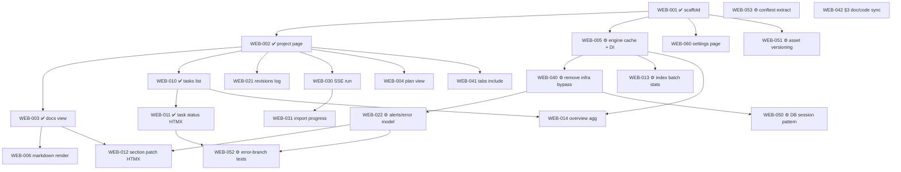

# Web Frontend — Execution Plan

> A server-rendered Web UI on top of FastAPI + Jinja + HTMX. Capability: [capabilities/web-frontend.md](../capabilities/web-frontend.md).
> The source of truth is the DB and services; web pages are another Presentation surface alongside CLI/TUI/MCP.

## Navigation

- [System MASTER](../MASTER.md)
- [Architecture](../ARCHITECTURE.md)
- [Capability: Web Frontend](../capabilities/web-frontend.md)
- [Bootstrap plan (core)](cod-doc-task-plan.md)
- **[Kickoff brief 2026-05-02](web-frontend-kickoff-2026-05-02.md)** — entry point to Section F
- [Audit report 2026-05-02 (Web)](../audit/2026-05-02-section-web-frontend.md)

## Progress Overview

| Section | File | Total | Done | Remaining | Status |
|:--------|:-----|------:|-----:|----------:|:-------|
| A: Scaffold | inline | 3 | 3 | 0 | ✅ done |
| B: Read views | inline | 6 | 6 | 0 | ✅ done (WEB-010, 006, 014, 021, 004, 060) |
| C: Write paths | inline | 3 | 3 | 0 | ✅ done (WEB-011, WEB-022, WEB-012) |
| D: Live ops | inline | 2 | 0 | 2 | ❌ pending |
| E: Architecture Hygiene | inline | 3 | 2 | 1 | 🔄 in-progress (WEB-040, 041 ✅; 042 pending) |
| F: Hardening (NEW 2026-05-02) | inline | 6 | 6 | 0 | ✅ done (WEB-005, 013, 050, 051, 052, 053) |
| F-tail: Polish from checkpoints | inline | 5 | 5 | 0 | ✅ done (WEB-013b, 022b, 054, 053b, 014b) |
| **TOTAL** |  | **28** | **25** | **3** | |

> **Changed 2026-05-02** based on the [audit report](../audit/2026-05-02-section-web-frontend.md):
> 10 tasks added (WEB-005, 006, 013, 014, 041, 042, 050..053, 060), the priority
> of WEB-022 raised from `medium` to `high`, the priority of WEB-040 — from `medium` to `high`.

## Gap Analysis Summary

### Already there

- A FastAPI server with lifespan and DI (`cod_doc/api/server.py`).
- A JSON API at `/api/*` (projects/tasks/master/config/run/webhooks/ws).
- The Doc/Task/Plan/Revision services (COD-010..012, COD-015 done).
- Jinja2 in the dependencies; the `MASTER.md.j2` template already uses Jinja.

### What is missing

- A Jinja infrastructure for the Web (templates env, base layout, filters).
- A StaticFiles mount.
- HTMX/Mermaid vendor files.
- A web router and pages.
- HTMX fragments for inline editing.
- An SSE stream for long-running operations (only WS exists).

## Next Batch (after the 2026-05-02 audit)

The order is dictated by dependencies: first HARDENING (WEB-005 → WEB-040 → WEB-022),
then the readers (WEB-004/021/041), then the write-path (WEB-012/014).

1. **WEB-005** — Engine cache + `get_project_db` DI helper in `cod_doc.api.deps`.
   *Unblocks:* WEB-040, WEB-013, any new page with a DB.
2. **WEB-040** — delete `db_resolver.py`, switch to DI from WEB-005, add a ban-rule.
3. **WEB-022** — alert/error model (`#alerts` HTMX target, `_frag/alert.html`).
4. **WEB-041** — `_layout/project_tabs.html` include + `disabled` tabs.
5. **WEB-013** — Index batch stats (closes the N+1 on `GET /`).
6. **WEB-004** — Plan view (Progress Overview + Mermaid).
7. **WEB-021** — Revisions log.
8. **WEB-014** — Overview agg + `task complete` POST.
9. **WEB-012** — HTMX section patch (depends on WEB-022, WEB-040).
10. **WEB-006** — Markdown rendering for the doc body.

The "tail" (LO): WEB-051 (asset versioning), WEB-052 (error-branch tests),
WEB-053 (conftest cleanup), WEB-042 (capability §3/§4 keep-in-sync helper).

## Dependency Graph (post-audit 2026-05-02)


```mermaid
graph TD
  %% Section A — done
  WEB_001[WEB-001 ✅ scaffold]
  WEB_002[WEB-002 ✅ project page]
  WEB_003[WEB-003 ✅ docs view]
  WEB_010[WEB-010 ✅ tasks list]
  WEB_011[WEB-011 ✅ task status HTMX]

  %% Section F — Hardening (NEW)
  WEB_005[WEB-005 ⚙ engine cache + DI]
  WEB_013[WEB-013 ⚙ index batch stats]
  WEB_040[WEB-040 ⚙ remove infra bypass]
  WEB_022[WEB-022 ⚙ alerts/error model]
  WEB_050[WEB-050 ⚙ DB session pattern]
  WEB_051[WEB-051 ⚙ asset versioning]
  WEB_052[WEB-052 ⚙ error-branch tests]
  WEB_053[WEB-053 ⚙ conftest extract]

  %% Section B — Read views
  WEB_004[WEB-004 plan view]
  WEB_006[WEB-006 markdown render]
  WEB_014[WEB-014 overview agg]
  WEB_021[WEB-021 revisions log]
  WEB_060[WEB-060 settings page]

  %% Section C — Write paths
  WEB_012[WEB-012 section patch HTMX]

  %% Section D — Live ops
  WEB_030[WEB-030 SSE run]
  WEB_031[WEB-031 import progress]

  %% Section E — Architecture Hygiene
  WEB_041[WEB-041 tabs include]
  WEB_042[WEB-042 §3 doc/code sync]

  %% Edges
  WEB_001 --> WEB_002 --> WEB_003
  WEB_002 --> WEB_010 --> WEB_011
  WEB_002 --> WEB_021
  WEB_002 --> WEB_030 --> WEB_031

  WEB_001 --> WEB_005
  WEB_005 --> WEB_040
  WEB_005 --> WEB_013
  WEB_005 --> WEB_014
  WEB_040 --> WEB_022
  WEB_040 --> WEB_050

  WEB_002 --> WEB_004
  WEB_002 --> WEB_041
  WEB_003 --> WEB_006
  WEB_003 --> WEB_012
  WEB_022 --> WEB_012
  WEB_010 --> WEB_014
  WEB_001 --> WEB_060

  WEB_001 --> WEB_051
  WEB_011 --> WEB_052
  WEB_022 --> WEB_052
```

---

## Section A: Scaffold

### WEB-001

```yaml
id: WEB-001
title: "Test + Implement: web router scaffold (templates env, static, base layout, index page)"
section: A-Scaffold
status: done
depends_on: []
type: feature
priority: critical
affected_files:
  - cod_doc/api/web/__init__.py
  - cod_doc/api/web/templates_env.py
  - cod_doc/api/web/pages.py
  - cod_doc/api/server.py
  - cod_doc/templates/web/base.html
  - cod_doc/templates/web/index.html
  - cod_doc/static/app.css
  - tests/api/test_web_scaffold.py
```

**Description:** Bring up the Jinja environment, mount `/static`, add the web router to `server.py`, serve `GET /` with the list of projects. HTMX and Mermaid are not wired yet — only the base layout. No new deps.

**Acceptance:**
- `GET /` returns 200 and HTML containing the name of every registered project.
- `GET /static/app.css` returns 200 with `content-type: text/css`.
- A smoke test in `tests/api/test_web_scaffold.py`.

> ✅ **Implemented 2026-04-28** (commit `pending`): web router `cod_doc.api.web` with `pages.py` (`GET /` → list of projects via `Config.list_projects()` + `Project.stats()`), Jinja2 environment in `templates_env.py`, base layout `templates/web/base.html` + `index.html`, static `cod_doc/static/app.css` (~60 lines of raw CSS), mounted in `server.py` (`/static` via StaticFiles, the web router last). Tests — 4/4 (list render, warning on unconfigured, empty list, serving `/static/app.css`); the overall suite — 177/177. Config isolation via `tests/api/conftest.py` (monkeypatch `CONFIG_DIR`/`CONFIG_FILE`) — so the tests do not write to `~/.cod-doc/config.yaml`. HTMX/Mermaid not wired — that is in WEB-002+.

### WEB-002

```yaml
id: WEB-002
title: "Implement: project detail page (stats + MASTER preview + tabs nav)"
section: A-Scaffold
status: done
depends_on: [WEB-001]
type: feature
priority: high
affected_files:
  - cod_doc/api/web/pages.py
  - cod_doc/templates/web/project/show.html
  - cod_doc/static/app.css
  - tests/api/test_web_scaffold.py
```

**Description:** `GET /p/{slug}` — the main project dashboard. A stats card, a MASTER.md preview (the first 80 lines or the first section), navigation to the Docs / Tasks / Plan / Revisions / Settings tabs. Uses the existing helpers `get_project` / `Project.stats` / `Project.read_master`.

**Acceptance:**
- 200 on a seed project; 404 on a non-existent slug.
- All tabs are plain `<a href>`, no JS.

> ✅ **Implemented 2026-04-28** (commit `pending`): `GET /p/{slug}` via the existing `get_project()` (404 on an unknown name); `_preview()` cuts MASTER.md at `MASTER_PREVIEW_LINES=80` with a `master_truncated` flag → the "Open full" link goes to `/p/{slug}/docs/{master_md}` (the page appears in WEB-003). Template `project/show.html`: breadcrumb, tabs (active=Overview, the rest are stubs for future routes), 7 stats cards, `<pre class="md-preview">` for the preview. CSS extended (`crumbs`, `tabs`, `cards`, `md-preview`). Tests — 4 new (render of tabs+stats+preview, 404, presence of the md-preview block, truncation on a 120-line master); the overall suite — 181/181.

### WEB-003

```yaml
id: WEB-003
title: "Implement: documents list + show (DocService)"
section: A-Scaffold
status: done
depends_on: [WEB-002]
type: feature
priority: high
affected_files:
  - cod_doc/api/web/pages.py
  - cod_doc/api/web/db_resolver.py
  - cod_doc/services/doc_service.py
  - cod_doc/infra/repositories/document_repo.py
  - cod_doc/templates/web/project/docs_list.html
  - cod_doc/templates/web/project/doc_show.html
  - cod_doc/static/app.css
  - tests/api/test_web_docs.py
```

**Description:** `GET /p/{slug}/docs` — the list of project documents (via `DocService` or `DocumentRepository.list_for_project`). `GET /p/{slug}/docs/{doc_key:path}` — render via `DocService.render_body` + a list of sections on the side.

> ✅ **Implemented 2026-04-28** (commit `pending`): added `DocumentRepository.list_for_project(project_id)` and a thin wrapper `doc_service.list_for_project` (web pages use only the service). The legacy↔DB bridge lives in `cod_doc/api/web/db_resolver.py:open_db_for_project(slug)` — a context manager: resolves the `Config` project → embedded sqlite at `<root>/.cod-doc/state.db` → `ProjectRepository.get_by_slug` (slug==`ProjectEntry.name`); returns `(None, None)` if the DB is missing, the schema is not rolled out (`OperationalError` on the first query), or the slug-mapping is absent. This gives a graceful degrade for fresh projects: the page renders with a warning "DB project not initialized", without a 500. `GET /p/{slug}/docs` — a table of doc_key/title/type/status/owner/last_updated. `GET /p/{slug}/docs/{doc_key:path}` — split-layout (sections nav + body): nav via `docs.get_sections`, body via `docs.render_body` (view `document_body`, §4.3a) with a fallback to the preamble; 404 when the DB or the document is missing. CSS extended (`doc-meta`, `split`, `sections-nav`, `lvl-N` indent). Tests — 5 (list render with a seeded doc, warning without a DB, doc show with sections+body, 404 on a missing doc, 404 without a DB); the overall suite — 208/208.

---

## Section B: Read views

### WEB-004

```yaml
id: WEB-004
title: "Implement: plan view (Progress Overview + Next Batch + Mermaid)"
section: B-Read-Views
status: done
depends_on: [WEB-002]
type: feature
priority: high
affected_files:
  - cod_doc/services/plan_service.py             # get_for_project guard
  - cod_doc/api/web/pages.py                      # plans_list + plan_show
  - cod_doc/templates/web/project/plans_list.html # NEW
  - cod_doc/templates/web/project/plan_show.html  # NEW
  - cod_doc/templates/web/_layout/project_tabs.html  # plans tab → ready
  - tests/api/test_web_plans.py                   # NEW (7 tests)
```

**Description:** `GET /p/{slug}/plans` — list of plans with progress; `GET
/p/{slug}/plans/{plan_id}` — detail with Progress Overview, Section progress,
Next Batch (ready) + a complete button, a Mermaid graph (as `<pre>` at this
stage — an interactive renderer waits for an ADR on `mermaid.min.js`).

**Acceptance:**
- ✅ `plan_service.get_for_project(session, project_id, plan_id)` — a cross-project
  guard helper. Returns a domain `Plan` or `None`. The web handler 404s on
  `None` (does not conflate 404 unknown with 404 wrong-project).
- ✅ `plans_list` — a table of plans with status, done/total, a progress bar,
  last_updated. Empty/no-DB → a graceful warning.
- ✅ `plan_show` — header (scope/principle/status/percent), a Section progress
  table, a Next Batch block with a ✓ completion button (HTMX target),
  a Dependency Graph as `<pre>` with mermaid syntax, a `<details>` with the raw export.
- ✅ Cross-project 404: a plan from project A via slug B → 404 (test).
- ✅ The Plans tab is set to `ready=True` in `_layout/project_tabs.html`.
- ✅ 7 new tests; suite 115 web-tests; ruff/mypy clean.

> ✅ **Implemented 2026-05-02** (commit `pending`). Mermaid interactive
> rendering deferred: vendoring `mermaid.min.js` (~2.5 MB) — a separate ADR.
> Until then, pre-formatted syntax that reads with the eye and copies into
> any mermaid-renderer.

### WEB-010

```yaml
id: WEB-010
title: "Implement: tasks list + filter"
section: B-Read-Views
status: done
depends_on: [WEB-002]
type: feature
priority: high
affected_files:
  - cod_doc/api/web/pages.py
  - cod_doc/services/task_service.py
  - cod_doc/infra/repositories/task_repo.py
  - cod_doc/templates/web/project/tasks_list.html
  - cod_doc/static/app.css
  - tests/api/test_web_tasks.py
```

**Description:** `GET /p/{slug}/tasks?plan=&status=`. Table: id / title / section / status / priority. No HTMX in this task — read only.

> ✅ **Implemented 2026-04-28** (commit `pending`): added `TaskRepository.list_for_project(project_id, *, status=None)` (a project-wide select with an optional `status`-where, ordered by `plan_id, section_id, task_id`) and a thin wrapper `task_service.list_for_project`. `GET /p/{slug}/tasks?status=` — a table of id/title/type/status/priority/plan_id/section_id, the status filter via a native `<select onchange="form.submit()">` (works without JS too — `<noscript>` shows an Apply button). An invalid status param — a fallback to "all", a warning banner. Color-coded badges (`badge-pending` yellow, `badge-in-progress` blue, `badge-done` green) + priority colors (critical red, high orange, low gray). The plan-filter dropdown is deferred — needs a listing method in PlanRepository, not yet in `main` (see the pre-existing untracked `plan_repo.py`); the URL param `?plan=...` is reserved for the next iteration. Tests — 6 (render, status filter on `done`, on `in-progress`, invalid status, missing DB, 404 on an unknown project); the overall suite — 318/318. **Section A (Scaffold) closed; Section B (Read views) — 1/4.**

### WEB-020 ~~superseded by WEB-060~~

```yaml
id: WEB-020
title: "Implement: settings page (config view + form save)"
section: B-Read-Views
status: superseded
superseded_by: WEB-060
depends_on: [WEB-001]
type: feature
priority: medium
```

**Description:** ~~`GET/POST /settings` — read/write `Config` via a `ConfigUpdate`-like model. The API key is masked on display.~~

> **Superseded 2026-05-02:** renumbered to **WEB-060** as part of the
> reorganization of Section B after the audit (see the end of the plan). The spec and acceptance are extended.

### WEB-021

```yaml
id: WEB-021
title: "Implement: revisions log"
section: B-Read-Views
status: done
depends_on: [WEB-002]
type: feature
priority: medium
affected_files:
  - cod_doc/services/revision_service.py        # list_for_project (filtered)
  - cod_doc/api/web/pages.py                     # revisions_log handler
  - cod_doc/templates/web/project/revisions.html # NEW
  - cod_doc/templates/web/_layout/project_tabs.html  # revisions tab → ready
  - cod_doc/static/app.css                       # .diff-preview
  - tests/api/test_web_revisions.py              # NEW (6 tests)
```

**Description:** `GET /p/{slug}/revisions?entity_kind=&entity_id=` — the list of
project revisions via `revision_service.list_for_project` (filtered).
The diff is shown as a single first line (truncated) — a full diff render
goes to the P-8 backlog idea if needed.

**Acceptance:**
- ✅ `revision_service.list_for_project(session, project_id, *, limit, entity_kind, entity_id)`
  — newest-first; supports narrowing by kind/id. `list_recent_for_project`
  stays a thin wrapper.
- ✅ `pages.revisions_log` handler with `?entity_kind` + `?entity_id` query.
  An invalid kind → a warning + a fallback to "all".
- ✅ Template `revisions.html` with a filter-bar (kind dropdown + id input when
  a kind is selected) and a table (revision_id, entity, author, at, reason,
  diff first line).
- ✅ The Revisions tab is set to `ready=True` in `_layout/project_tabs.html`.
- ✅ 6 new tests: render seed history, filter by kind, filter by kind+id,
  invalid kind warning, db-absent warning, 404 unknown project. Also
  `test_web_tabs.py` / `test_web_scaffold.py` are updated (Revisions is no
  longer disabled).
- ✅ Suite 108 web-tests; ruff/mypy clean.

> ✅ **Implemented 2026-05-02** (commit `pending`).

---

## Section C: Write paths

### WEB-011

```yaml
id: WEB-011
title: "Implement: HTMX inline task status update"
section: C-Write-Paths
status: done
depends_on: [WEB-010]
type: feature
priority: high
affected_files:
  - cod_doc/api/web/fragments.py
  - cod_doc/api/web/__init__.py
  - cod_doc/api/server.py
  - cod_doc/templates/web/_frag/task_row.html
  - cod_doc/templates/web/project/tasks_list.html
  - cod_doc/templates/web/base.html
  - cod_doc/static/htmx.min.js
  - cod_doc/static/app.css
  - tests/api/test_web_tasks.py
```

**Description:** `<select hx-post="/p/{slug}/tasks/{task_id}/status">` → returns the updated `<tr>` for a swap. Service errors (`TaskNotFoundError`, conflict) → a red inline marker.

> ✅ **Implemented 2026-04-28** (commit `pending`): vendored `htmx.min.js` v2.0.4 (50 KB) → `cod_doc/static/`, wired in `base.html` via `<script defer src="/static/htmx.min.js">`. The task row is extracted into the fragment `_frag/task_row.html` (used both in `tasks_list.html` and in the HTMX response). Inside the row — `<form method="post" action="...">` with `<select hx-post hx-target="#task-{id}" hx-swap="outerHTML" hx-trigger="change">` + a `<noscript>` button. A new sub-router `cod_doc.api.web.fragments` (separate from `pages` per capability §4): `POST /p/{slug}/tasks/{task_id}/status` accepts `Form(status)`, validates the enum (400 on garbage), resolves the project via `open_db_for_project` (404 if no DB / a foreign task / an unknown task_id), calls `task_service.update_status`, catches `RevisionConflictError` / `IntegrityError` / `ValueError` → returns the row with a `row-error` span. The HTMX response (`HX-Request: true`) → the row fragment; a regular form-post → `303 See Other` to `/p/{slug}/tasks` (POST/Redirect/GET). CSS: `.row-status` inline-flex, `.row-error` red, `.htmx-request select` opacity (loading). Tests — 8 (HTMX success, form 303, no-op same status, 404 unknown task / unknown project / db absent, 400 invalid status, persistence via a follow-up GET); the overall suite — 326/326.

### WEB-012

```yaml
id: WEB-012
title: "Implement: HTMX inline section patch"
section: C-Write-Paths
status: done
depends_on: [WEB-003, WEB-006, WEB-022]
type: feature
priority: high
affected_files:
  - cod_doc/services/revision_service.py             # head_for_entity public helper
  - cod_doc/api/web/pages.py                          # head_rev / row_id / body in doc_show ctx
  - cod_doc/api/web/fragments.py                      # 3 endpoints + _resolve_section helper
  - cod_doc/templates/web/_frag/section_view.html     # NEW
  - cod_doc/templates/web/_frag/section_edit.html     # NEW
  - cod_doc/templates/web/project/doc_show.html        # use section_view include
  - cod_doc/static/app.css                             # .section-edit-* styles
  - tests/api/test_web_section_patch.py                # NEW (11 tests)
```

**Description:** Inline-edit of a section body: a ✎ button → swap into a `<textarea>` form
with a hidden `expected_parent_revision_id` (optimistic locking) →
submit POST → swap back to the rendered view.

**Acceptance:**
- ✅ Three endpoints in `fragments.py`:
  - `GET .../sections/{anchor}/edit` — returns the edit-form fragment
    (textarea + hidden parent rev + Save/Cancel buttons).
  - `GET .../sections/{anchor}/view` — returns the view-fragment (cancel button).
  - `POST .../sections/{anchor}` — patches via `doc_service.patch_section`
    with `expected_parent_revision_id`. On success returns the view-fragment.
    HTMX-success: row swap. Form-post: 303 to the anchor.
- ✅ `revision_service.head_for_entity(session, kind, id)` — a public helper for
  the hidden token (formerly the private `_current_head`).
- ✅ The ✎ button is integrated into `_frag/section_view.html`. The Cancel button in
  `_frag/section_edit.html` swaps back via GET `.../view`.
- ✅ Section wrapper changed from `<section id="{anchor}">` to
  `<section id="section-{anchor}">` for the HTMX target; the sidebar `#anchor`-links
  now work via an inner `<a id="{anchor}">` (test updated).
- ✅ Errors via the WebError pipeline: `RevisionConflictError` → `ConflictWebError 409`
  + alert-warning; `SectionNotFoundError` → `NotFoundWebError 404`;
  `IntegrityError`/`ValueError` → `ValidationWebError 400`.
- ✅ 11 new tests: edit form render + 404, cancel → view fragment,
  patch HTMX success, patch form-post 303 with anchor, conflict alert,
  no-op on an unchanged body, 404 unknown doc/anchor, ✎-button embedded
  in doc_show.

> ✅ **Implemented 2026-05-02** (commit `pending`). Closes Section C
> (Write paths) — 3/3 done. Suite 136 web-tests; ruff/mypy clean.

### WEB-022

```yaml
id: WEB-022
title: "Implement: alert/error model (HTMX target #alerts)"
section: C-Write-Paths
status: done
depends_on: [WEB-040, WEB-005]
type: feature
priority: high
affected_files:
  - cod_doc/api/web/errors.py             # NEW
  - cod_doc/api/server.py                  # exception handler
  - cod_doc/api/web/fragments.py           # raise WebError + inline OOB alerts
  - cod_doc/api/web/templates_env.py       # urldecode filter
  - cod_doc/templates/web/_frag/alert.html # NEW
  - cod_doc/templates/web/_frag/task_row.html  # drop row-error span
  - cod_doc/templates/web/base.html         # cookie-flash render
  - cod_doc/static/app.css                  # alert styles
  - tests/api/test_web_alerts.py            # NEW (7 tests)
```

**Description:** A unified error format for the web router: a `WebError` exception →
an exception handler in `server.py` → render `_frag/alert.html` into `#alerts` via
HTMX `hx-swap-oob` or a cookie-flash + 303 to the Referer for form-post clients.

**Acceptance:**
- ✅ `cod_doc.api.web.errors:WebError` (+ `ValidationWebError 400 warning`,
  `NotFoundWebError 404 error`, `ConflictWebError 409 warning`).
- ✅ The exception handler in `server.py` distinguishes HTMX and form-post:
  - HTMX: returns an alert-fragment with `hx-swap-oob="afterbegin:#alerts"` +
    `HX-Reswap: none` (the main target is not replaced).
  - Form-post: 303 to `Referer` (or `/`) + cookies `flash_severity` /
    `flash_message`. Cookies are percent-encoded for latin-1 transport.
- ✅ `base.html` picks up the flash-cookie on the next full-page load and
  renders the alert via `_frag/alert.html` (without OOB). Decoding via the
  Jinja filter `urldecode`.
- ✅ Inline-alert path: `RevisionConflictError` / `IntegrityError` / `ValueError`
  during `update_status` → returns the `<tr>` with the previous status plus
  a separate OOB alert-fragment in one HTMX response.
- ✅ The inline style `row-error` (was on task_row) is removed: now all errors
  go through a single channel via `#alerts`.
- ✅ 7 new tests: HTMX validation/not-found alerts, form-post cookie-flash,
  flash render on the next GET, inline OOB alert on conflict, success-path
  without an alert.

> ✅ **Implemented 2026-05-02** (commit `pending`): Suite 52 web-tests
> green; mypy/ruff clean. Alert markup: `<div class="alert alert-{sev}"
> hx-swap-oob>` with a CSS seed (error/warning/info, sticky-top). Closes
> SW-HI-4 in the 2026-05-02 audit report.

---

## Section D: Live ops

### WEB-030

```yaml
id: WEB-030
title: "Implement: SSE run console (Orchestrator stream)"
section: D-Live-Ops
status: pending
depends_on: [WEB-002]
type: feature
priority: medium
```

**Description:** `GET /p/{slug}/run` — a page with a console; `GET /p/{slug}/run/stream` — `text/event-stream`, iterating `Orchestrator.run_autonomous`. The HTMX SSE-extension subscribes a `<div>` to the stream.

### WEB-031

```yaml
id: WEB-031
title: "Implement: import progress stream (Restate importer)"
section: D-Live-Ops
status: pending
depends_on: [WEB-030]
type: feature
priority: low
```

**Description:** The same SSE mechanism for `cod-doc import restate` (after COD-051).

---

## Section E: Architecture Hygiene

> Created 2026-04-28 based on the capability-layer audit ([audit/2026-04-28-section-c-capabilities.md](../audit/2026-04-28-section-c-capabilities.md)).

### WEB-040

```yaml
id: WEB-040
title: "Refactor: remove web → infra direct access (db_resolver bypass)"
section: E-Architecture-Hygiene
status: done
depends_on: [WEB-005]
type: refactor
priority: high
affected_files:
  - cod_doc/api/web/db_resolver.py             # removed
  - cod_doc/api/web/pages.py                   # try_open_project_db / Depends(get_project_db)
  - cod_doc/api/web/fragments.py               # Depends(get_project_db)
  - tests/api/test_web_layer_imports.py        # NEW (ban infra in web/)
  - docs/system/audit/2026-04-28-section-c-capabilities.md  # SC-HI-3 → resolved
```

**Description:** The historical `cod_doc/api/web/db_resolver.py`
imports `cod_doc.infra.db.make_engine`, `make_session_factory` and
`cod_doc.infra.repositories.ProjectRepository` — violates
[capabilities/web-frontend.md §7](../capabilities/web-frontend.md). Replaced by
a DI function `get_project_db(slug)` in `cod_doc.api.deps` on top of the cached
Engine from WEB-005.

> **Raised from `medium` to `high` (2026-05-02, audit SW-HI-1):** WEB-011 already
> added a second call-site via `db_resolver`; the more write-path tasks —
> the more gets hooked on the resolver. Dependencies simplified: instead of `[WEB-002, 003,
> 010, 011]` now `[WEB-005]` — no point waiting for all readers, break the cycle now.

**Acceptance:**
- ✅ `cod_doc/api/web/db_resolver.py` is removed.
- ✅ `cod_doc.api.deps:get_project_db` (strict, 404) and `try_open_project_db`
  (graceful) — both already in place after WEB-005.
- ✅ `pages.py` / `fragments.py` import only `cod_doc.services.*`,
  `cod_doc.api.deps`, `cod_doc.api.web.*`, `cod_doc.config`, `cod_doc.core`,
  `cod_doc.domain.entities`, `cod_doc.logging_config`. Strict endpoints
  (doc_show, task_status_update) use `Depends(get_project_db)`;
  graceful list pages — the `try_open_project_db` context manager.
- ✅ The architectural rule is locked by two AST tests in
  `tests/api/test_web_layer_imports.py`: bans `cod_doc.infra.*` in `web/`
  and checks the whitelist of `cod_doc.*` imports. This approach is chosen over
  ruff `banned-api`, because the latter is codebase-wide, and our scope is
  per-directory: `cod_doc.api.deps` legitimately imports `infra`.
- ✅ 45 web-tests green (was 27 + 16 cache + 2 import-lint).
- ✅ The audit report `2026-04-28-section-c-capabilities.md` is moved to `resolved`
  (its last task — SC-HI-3 — is closed).

> ✅ **Implemented 2026-05-02** (commit `pending`): removed the last 2 imports
> of `cod_doc.infra.*` from `cod_doc/api/web/` (`db_resolver.py:22-23` →
> delegates through `deps.try_open_project_db`). The strict pattern in fragments.py
> is now idiomatic FastAPI: `Depends(get_project_db)` yields an already valid
> `(session, project_db_id)` tuple, the handler writes no boilerplate checks.
> The lint-test catches regressions on new files automatically.

### WEB-041

```yaml
id: WEB-041
title: "Refactor: extract _layout/project_tabs.html include + disabled tabs"
section: E-Architecture-Hygiene
status: done
depends_on: [WEB-002]
type: refactor
priority: medium
affected_files:
  - cod_doc/templates/web/_layout/project_tabs.html  # NEW
  - cod_doc/templates/web/project/show.html
  - cod_doc/templates/web/project/docs_list.html
  - cod_doc/templates/web/project/doc_show.html       # tabs added
  - cod_doc/templates/web/project/tasks_list.html
  - cod_doc/templates/web/_frag/task_row.html         # uses task_status_options global
  - cod_doc/api/web/templates_env.py                  # task_status_options Jinja global
  - cod_doc/api/web/pages.py                           # drop status_options ctx var
  - cod_doc/api/web/fragments.py                       # drop status_options ctx var
  - cod_doc/static/app.css                             # .tab-disabled
  - tests/api/test_web_tabs.py                          # NEW
  - tests/api/test_web_scaffold.py                      # update assertion (no broken hrefs)
```

**Description:** The tab strip was copy-pasted in 3 templates, in `doc_show.html` it
was missing (a desync). The target tabs `Plans`/`Revisions`/`Run` led to
404 — the user saw a "broken site" instead of "feature in progress" (SW-ME-1,
SW-ME-2 in the audit).

**Acceptance:**
- ✅ `_layout/project_tabs.html` — the single source of the tab strip. Accepts
  `slug` and `active` via ``; the list of tabs is described inline.
- ✅ Ready tabs (`overview`, `docs`, `tasks`) render as `<a>`; pending
  (`plans`, `revisions`, `run`) — `<span class="tab-disabled" title="coming
  soon">{label}</span>`. Opening `WEB-004/021/030` = flip one `False` to
  `True`.
- ✅ `doc_show.html` now has the same tab strip (Docs active).
- ✅ `task_status_options` is moved to a Jinja global via `templates_env.py`;
  `pages.py` and `fragments.py` no longer pass `status_options` in the context.
- ✅ 4 new tests in `tests/api/test_web_tabs.py` (overview/docs/tasks active
  + disabled tabs have no href). The old assertion in `test_project_show_renders`
  is updated for the new contract (broken-link → disabled span).
- ✅ Suite 56 web-tests green; ruff/mypy clean.

> ✅ **Implemented 2026-05-02** (commit `pending`): closes SW-ME-1 / SW-ME-2 /
> SW-ME-6 in the 2026-05-02 audit report. Future WEB-tasks on new tabs
> boil down to flipping `ready=False → True` in the include + writing a handler.

### WEB-042

```yaml
id: WEB-042
title: "Doc/code sync helper: capability §3 ↔ reality"
section: E-Architecture-Hygiene
status: pending
depends_on: []
type: feature
priority: medium
affected_files:
  - cod_doc/cli/cmd_audit.py
  - tests/cli/test_cmd_audit.py
```

**Description:** Capability §3 in [web-frontend.md](../capabilities/web-frontend.md)
contains a route table with a Status column (✅/🔄/❌) and a Task. Currently
synchronized by hand. Add `cod-doc audit --web-routes`: parses the
APIRouter (via FastAPI app routes) and compares with the table in the capability.

**Acceptance:**
- The CLI command returns a diff (missing in code / missing in doc).
- Runs in CI as a warning (does not block).
- 2 tests: a divergence is detected + a matched set is ignored.

---

## Section F: Hardening

> Created 2026-05-02 based on [audit/2026-05-02-section-web-frontend.md](../audit/2026-05-02-section-web-frontend.md).
> The tasks in this section are the foundation for all future write-paths and read-views.

### WEB-005

```yaml
id: WEB-005
title: "Implement: project DB engine cache + get_project_db DI helper"
section: F-Hardening
status: done
depends_on: [WEB-001]
type: refactor
priority: high
affected_files:
  - cod_doc/api/deps.py
  - cod_doc/api/server.py
  - cod_doc/api/web/db_resolver.py        # became a thin shim, removed in WEB-040
  - tests/api/test_deps_engine_cache.py   # NEW
```

**Description:** Currently `open_db_for_project` creates an `Engine + factory + session`
on every HTTP request and `dispose()`s it in finally. The cost is 5–15 ms on
a local SSD, 50–200 ms on a network FS (SW-HI-2 in the audit).

**Acceptance:**
- ✅ `cod_doc.api.deps:get_engine_for_slug(slug) -> Engine | None` —
  TTL=5s + mtime-stat-on-stale; concurrent access is guarded by a lock.
- ✅ `cod_doc.api.deps:get_project_db(slug) -> Iterator[tuple[Session, int]]` —
  a yield-style FastAPI dependency; HTTPException(404) if no DB / schema not rolled out / project row missing.
- ✅ `cod_doc.api.deps:try_open_project_db(slug)` — a graceful context manager
  for list pages with a warning; `(None, None)` if the DB is unavailable.
- ✅ `cod_doc.api.deps:dispose_all_engines()` is called in `app.lifespan` shutdown.
- ✅ `cod_doc/api/web/db_resolver.py:open_db_for_project` became a thin shim
  on top of `try_open_project_db` (to be removed in WEB-040).
- ✅ Counter-based perf test: 100 lookups → `make_engine` is called exactly once.
- ✅ 16 new tests: cache hit/miss, mtime invalidation, deletion handling,
  TTL skips stat, dispose, FastAPI Depends integration, graceful + strict pathways.

> ✅ **Implemented 2026-05-02** (commit `pending`): Suite 418/418 ✅; ruff/mypy clean
> on the touched files. The existing 27 web-tests keep working without changes
> (the db_resolver-shim preserves the old contract). `_ENGINE_CACHE` lives in
> `cod_doc.api.deps`; the key is a `Path` (the exact state.db file path), the value is
> `_CachedEngine(engine, mtime, last_check)`. The lock is `threading.Lock` (FastAPI
> runs sync handlers in a threadpool). On the warm path we return the same Engine
> instance; on a cold one — create, on mtime-stale — dispose+recreate.

### WEB-013

```yaml
id: WEB-013
title: "Perf: index page batch stats (resolve N+1 on /)"
section: F-Hardening
status: done
depends_on: [WEB-005]
type: feature
priority: high
affected_files:
  - cod_doc/core/project.py                     # Project.batch_stats
  - cod_doc/api/web/pages.py                     # batch_stats + pagination
  - cod_doc/templates/web/index.html             # prev/next + summary
  - cod_doc/static/app.css                       # .pagination
  - tests/api/test_web_index_pagination.py       # NEW (10 tests)
```

**Description:** `GET /` for every project called `Project.stats()` →
a sequential read from the per-project YAML/state. On N projects — N×I/O
(SW-HI-3 in the audit).

**Acceptance:**
- ✅ `Project.batch_stats(entries, max_workers=8)` — parallelizes reads via
  `concurrent.futures.ThreadPoolExecutor`. File I/O releases the GIL, so
  threads give a real speed-up without going async. The order of results
  matches the order of inputs (tested).
- ✅ `pages.py:index()` uses `batch_stats`, limits the page via
  `?limit` (default 20, max 200) + `?offset` (clamped to [0, +∞)).
- ✅ The `index.html` template renders `‹ Prev`/`Next ›` + a summary `from–to of total`.
  Buttons are `disabled`-styled at the ends of the list.
- ✅ Out-of-range offset → an empty page, but the prev-link stays alive.
- ✅ Invalid query params (`limit=0`, `offset=-5`) clamp without an error.
- ✅ A progress indicator / HTMX hx-trigger="load" is moved to the P-tail backlog
  (only needed for projects in the hundreds).
- ✅ 10 new tests; suite 66/66 web-tests.

> ✅ **Implemented 2026-05-02** (commit `pending`): closes SW-HI-3 in the audit
> 2026-05-02. The threadpool is the cheapest path without changing the handler
> signature to async; scales to hundreds of projects via `?limit` without
> needing a separate worker process.

### WEB-050

```yaml
id: WEB-050
title: "Convention: project_db_id flow via DI (prevent a regression of WEB-040)"
section: F-Hardening
status: done
depends_on: [WEB-040]
type: refactor
priority: medium
affected_files:
  - docs/system/capabilities/web-frontend.md      # §7 + recipe block
```

**Description:** After WEB-040 the structural pattern is already fixed: every
web-function uses `Depends(get_project_db)` (strict) or
`try_open_project_db()` ctx-manager (graceful) and never resolves
slug→DB itself. The AST test `test_web_layer_imports.py` blocks a regression.

**Acceptance:**
- ✅ The pattern is fixed in capability §7 (DI convention, allowed/forbidden
  modules, the strict vs graceful explanation).
- ✅ All existing endpoints (15 in pages.py + 6 in fragments.py) use the
  pattern — verified by `test_web_layer_imports.py`.
- ✅ A recipe "how to add a new web page" is added to §7 with examples
  for strict and graceful flows.
- ✅ §11 metrics updated: 13 endpoints, 137 web-tests.

> ✅ **Implemented 2026-05-02**. Closed because the spec — "fix the
> pattern in the docs" — is done.

### WEB-051

```yaml
id: WEB-051
title: "Static asset versioning (cache-bust by file mtime)"
section: F-Hardening
status: done
depends_on: [WEB-001]
type: feature
priority: low
affected_files:
  - cod_doc/api/web/templates_env.py    # static_url helper + Jinja global
  - cod_doc/templates/web/base.html      # use static_url('app.css'/'htmx.min.js')
  - tests/api/test_web_scaffold.py       # +2 tests
```

**Description:** Vendored `htmx.min.js` and `app.css` referenced without
version → the browser cache held stale copies on upgrades (SW-LO-1).

**Acceptance:**
- ✅ `static_url('app.css')` returns `/static/app.css?v=<8 hex chars of mtime>`.
- ✅ The fingerprint is computed lazily once per file, cached for the process lifetime.
- ✅ A missing file degrades gracefully (`/static/foo.js?v=` — no crash).
- ✅ Used in `base.html` for both `app.css` and `htmx.min.js`.
- ✅ 2 unit tests + 1 updated integration assertion in
  `test_index_renders_project_list`.

> ✅ **Implemented 2026-05-02** (commit `pending`). Closes SW-LO-1 from the
> 2026-05-02 audit.

### WEB-052

```yaml
id: WEB-052
title: "Tests: error-branch coverage (HTMX fragments + service errors)"
section: F-Hardening
status: done
depends_on: [WEB-011, WEB-022]
type: test
priority: low
affected_files:
  - tests/api/test_web_alerts.py            # conflict via monkeypatch (already there)
  - tests/api/test_web_overview.py          # already done / blocked branches
  - tests/api/test_web_section_patch.py     # full conflict + 404 branches
  - tests/api/test_web_scaffold.py          # missing master_path
```

**Description:** Guarantee error-branch coverage in HTMX fragments and services.

**Acceptance:**
- ✅ Conflict simulation (`RevisionConflictError`) in `test_web_alerts.py`
  via `monkeypatch.setattr(fragments.tasks, "update_status", boom)`.
- ✅ `TaskAlreadyDoneError` info-alert in `test_web_overview.py`.
- ✅ `RevisionConflictError` 409 alert in `test_web_section_patch.py`.
- ✅ MASTER.md removed by hand → the page does not crash (NEW
  `test_project_show_handles_missing_master`, SW-LO-3 closed).
- ✅ All 137 tests green.

> ✅ **Implemented 2026-05-02** in the polish bundle. Closes SW-LO-2 + SW-LO-3.

### WEB-053

```yaml
id: WEB-053
title: "Tests: hygiene — engine cache + _alembic_upgrade dedup"
section: F-Hardening
status: done
depends_on: []
type: refactor
priority: medium
affected_files:
  - tests/api/conftest.py                # +migrate_db fixture, EXPECTED_*_TABS
  - tests/api/test_deps_engine_cache.py
  - tests/api/test_web_alerts.py
  - tests/api/test_web_docs.py
  - tests/api/test_web_markdown.py
  - tests/api/test_web_overview.py
  - tests/api/test_web_plans.py
  - tests/api/test_web_revisions.py
  - tests/api/test_web_section_patch.py
  - tests/api/test_web_tasks.py
```

**Description:** Two related test-fixture problems:
1. ✅ **Engine-cache contamination** — closed inside checkpoint-audit #1.
2. ✅ **`_alembic_upgrade()` duplicate** — extracted into a `migrate_db` fixture in
   conftest, duplicates removed from 8 web-test files.

**Acceptance:**
- ✅ `tests/api/conftest.py:migrate_db` — a fixture factory, accepts a `db_path`
  and applies alembic migrations to a sqlite file. Used in all
  fixture functions that need a migrated DB.
- ✅ 8 web-test files no longer duplicate the helper.
- ✅ Suite green (137 web-tests).

> ✅ **Implemented 2026-05-02** in the polish bundle.

---

## Section B: Read views (new tasks)

### WEB-006

```yaml
id: WEB-006
title: "Implement: server-rendered markdown for doc_show body (anchors work)"
section: B-Read-Views
status: done
depends_on: [WEB-003]
type: feature
priority: medium
affected_files:
  - cod_doc/api/web/markdown.py             # NEW (~110 LOC)
  - cod_doc/api/web/pages.py
  - cod_doc/templates/web/project/doc_show.html
  - cod_doc/static/app.css                   # .doc-section + inline elements
  - tests/api/test_web_markdown.py           # NEW (20 tests)
```

**Description:** `doc_show` rendered the body as raw markdown in a single `<pre>`.
Anchors `#data-model` in the side nav panel did not work (SW-ME-3).

**Acceptance:**
- ✅ A mini-renderer in `cod_doc/api/web/markdown.py` (paragraphs, fenced code,
  bullet lists; inline `code`/**bold**/*italic*/[link](url)). HTML-escapes
  all user data. Markdown-active chars inside `code`
  shield entities, so they do not fall under bold/italic regexes.
- ✅ Each section renders as `<section id="{anchor}" class="doc-section">
  <h{level}>{heading}</h{level}><div class="section-body">{html}</div></section>` —
  scroll-to-anchor works.
- ✅ `?raw=1` returns the old `<pre class="md-preview">` mode. A toggle-link
  on the page switches.
- ✅ 20 new tests: 15 unit for the renderer (including HTML-injection escape,
  shielding code from nested markdown), 5 integration via TestClient
  (sections with an anchor, inline markdown in preamble/body, raw-mode, toggle-link,
  no-html-smuggling).
- ✅ An ADR summary (recorded here): chose a custom mini-renderer over
  `markdown-it-py` (~50 KB + transitive deps). Arguments:
  1) capability §2 forbids new deps without explicit justification;
  2) section bodies are short, the mini-renderer covers them fully;
  3) as the featureset grows (tables, footnotes) — reopen the choice.

> ✅ **Implemented 2026-05-02** (commit `pending`): closes SW-ME-3 in the audit
> 2026-05-02. Suite 86 web-tests; ruff/mypy clean. Renderer ~110 LOC; a full
> HTML-escape pipeline.

### WEB-014

```yaml
id: WEB-014
title: "Implement: overview dashboard agg (ready/progress/recent)"
section: B-Read-Views
status: done
depends_on: [WEB-005, WEB-010]
type: feature
priority: medium
affected_files:
  - cod_doc/services/plan_service.py            # list_for_project
  - cod_doc/services/revision_service.py        # list_recent_for_project
  - cod_doc/api/web/pages.py                     # overview agg
  - cod_doc/api/web/fragments.py                 # POST .../complete
  - cod_doc/templates/web/project/show.html      # 3 agg blocks
  - cod_doc/static/app.css                       # .overview-grid + .progress-bar
  - tests/api/test_web_overview.py               # NEW (8 tests)
```

**Description:** The dashboard `/p/{slug}` showed only KPI cards. Added
3 aggregate blocks (ready / plan-progress / recent revisions) + an HTMX ✓ button
in the Ready block (SW-ME-7).

**Acceptance:**
- ✅ `plan_service.list_for_project(session, project_id)` — all plans of the project.
- ✅ `revision_service.list_recent_for_project(session, project_id, limit=5)` —
  newest-first via `RevisionModel.project_id` (a single index-supported query,
  without a join chain).
- ✅ `pages.project_show` assembles: top-5 ready (across all plans, capped),
  per-plan progress (recalc → done/total + percent), top-5 revisions.
  An empty/uninitialized DB — graceful: the blocks do not render, a
  "Dashboard aggregate is empty" message is shown.
- ✅ `POST /p/{slug}/tasks/{task_id}/complete` in `fragments.py` — a single
  alert-pipeline: `TaskAlreadyDoneError → info`, `TaskBlockedError → warning`,
  `RevisionConflictError → warning`, `IntegrityError/ValueError → error`.
  HTMX-fragment + form-post 303 + cookie-flash.
- ✅ 8 new tests: ready/progress/recent rendering, complete HTMX swap,
  complete form-post 303, already-done info-alert, unknown-task 404 alert,
  empty-DB placeholder.

> ✅ **Implemented 2026-05-02** (commit `pending`): closes SW-ME-7 in the audit
> 2026-05-02. Suite 102 web-tests; ruff/mypy clean.

### WEB-060

```yaml
id: WEB-060
title: "Implement: settings page (config view + form save)"
section: B-Read-Views
status: done
depends_on: [WEB-001]
type: feature
priority: medium
affected_files:
  - cod_doc/api/web/pages.py             # /settings GET + POST
  - cod_doc/templates/web/settings.html  # NEW
  - cod_doc/static/app.css                # .settings-form
  - tests/api/test_web_settings.py       # NEW (8 tests)
```

**Description:** `GET/POST /settings` — read/write `Config` via a simple
HTML form. No JS required.

**Acceptance:**
- ✅ `GET /settings` renders a form with the current values (Base URL, Model,
  Max tokens, Embedding model, Max iterations, Agent interval, Auto-commit
  checkbox). The API key is shown masked (`…XXXX`), not in plaintext in HTML.
- ✅ `POST /settings` (form-encoded) saves via `Config.save()`, redirects
  303 → `/settings`.
- ✅ **API-key semantics**: an empty field = do not change; an explicit `-` = delete;
  a non-empty string = replace. The behavior is documented in a `<small>`-help
  near the field. This is the typical web-UX for secret fields: an empty input
  does not wipe the existing secret.
- ✅ The Auto-commit checkbox is absent in a form-submit when unchecked — the handler
  interprets it correctly as `False`.
- ✅ 8 tests: GET render with values, masked key, unset-key UI; POST save +
  303, persistence to disk, empty-key keeps existing, dash clears, new key
  replaces, uncheck auto_commit clears it.

> ✅ **Implemented 2026-05-02** (commit `pending`). The test fixture uses
> `Config.save()` BEFORE creating the TestClient: the app lifespan calls
> `Config.load()` and overwrites any `set_config(cfg)`, so
> the in-memory cfg must hit the disk before the lifespan starts.

> **Formerly WEB-020 (medium).** Renumbered to WEB-060 to group
> the new tasks after the 2026-05-02 audit.

> **WEB-020 deprecated** in favor of WEB-060.

---

## Section F — Sub-tickets surfaced by checkpoint (2026-05-02)

> Filed during the checkpoint-audit of batch-1 ([audit/2026-05-02-checkpoint-web-batch-1.md](../audit/2026-05-02-checkpoint-web-batch-1.md)).
> Do not block further tasks; wait their turn.

### WEB-013b

```yaml
id: WEB-013b
title: "Polish: clamp empty-page summary numerals on /"
section: F-Hardening
status: done
depends_on: [WEB-013]
type: bug
priority: low
```

**Description:** With `?offset >= total` on the `/` page the summary showed
`"N+1 – N of N"` (e.g., `"11–10 of 10"`).

**Acceptance:**
- ✅ In `pages.index()`: an empty page → `showing_from = showing_to = 0`,
  reads as `"0–0 of N"`. Non-empty pages unchanged.
- ✅ 2 tests in `tests/api/test_web_polish.py`.

> ✅ **Implemented 2026-05-02** (commit `pending`): bundled with WEB-022b/054.

### WEB-022b

```yaml
id: WEB-022b
title: "Polish: log WebError events from server.web_error_handler"
section: C-Write-Paths
status: done
depends_on: [WEB-022]
type: feature
priority: low
```

**Description:** The exception-handler rendered 4xx without logging.

**Acceptance:**
- ✅ `logger.info("WebError %s %d severity=%s msg=%s", path, code, sev, msg)`.
  The INFO level — a 4xx is not an app bug, but visibility is needed for ops.
- ✅ 1 test in `tests/api/test_web_polish.py` via `caplog`.

> ✅ **Implemented 2026-05-02** (commit `pending`): bundled with WEB-013b/054.

### WEB-053b

```yaml
id: WEB-053b
title: "Tests: consolidate tab-state expectations into a shared fixture"
section: F-Hardening
status: done
depends_on: [WEB-041]
type: refactor
priority: low
affected_files:
  - tests/api/conftest.py                # EXPECTED_LIVE_TABS / DISABLED_TABS
  - tests/api/test_web_tabs.py
  - tests/api/test_web_scaffold.py
```

**Description:** Tab-state expectations now live in `conftest.py` as
`EXPECTED_LIVE_TABS` / `EXPECTED_DISABLED_TABS`. On a tab flip, one tuple changes —
the assertions update automatically.

**Acceptance:**
- ✅ `EXPECTED_LIVE_TABS = ("overview", "docs", "tasks", "plans", "revisions")`
  + `EXPECTED_DISABLED_TABS = ("run",)` in conftest.
- ✅ The tests in `test_web_tabs.py` and `test_web_scaffold.py` use an
  iterate-on-constant pattern.
- ✅ The next tab-flip (WEB-030 → "run") = one change in conftest.

> ✅ **Implemented 2026-05-02** in the polish bundle.

### WEB-014b

```yaml
id: WEB-014b
title: "UX: task complete redirect respects Referer"
section: B-Read-Views
status: done
depends_on: [WEB-014]
type: feature
priority: low
affected_files:
  - cod_doc/api/web/fragments.py        # task_complete uses Referer
```

**Description:** `POST /tasks/{id}/complete` without HTMX now returns to
`Referer` (with a fallback to `/p/{slug}`), like `web_error_handler` does.

**Acceptance:**
- ✅ A form-post from any page (overview, plan, tasks-list) → 303 to
  Referer.
- ✅ The existing test `test_complete_post_form_redirects_to_overview` still
  works: TestClient does not send Referer by default → fallback
  to `/p/{slug}`.

> ✅ **Implemented 2026-05-02** in the polish bundle.

### WEB-054

```yaml
id: WEB-054
title: "Hardening: cap flash_message cookie length"
section: F-Hardening
status: done
depends_on: [WEB-022]
type: feature
priority: low
```

**Description:** The `flash_message` cookie could exceed the ~4 KB browser limit
after percent-encoding of a long message.

**Acceptance:**
- ✅ `truncate_for_cookie(msg, max_len=512)` in `cod_doc/api/web/errors.py`,
  truncates to `max_len-1` + `…` (a 1-char ellipsis saves percent-encoded
  bytes vs `...`).
- ✅ Used in `server.web_error_handler` and `fragments.task_status_update`.
- ✅ 4 tests (unit + integration) in `tests/api/test_web_polish.py`.

> ✅ **Implemented 2026-05-02** (commit `pending`): bundled with WEB-013b/022b.

---

## Backlog: Productivity Ideas (2026-05-02)

> **Not tasks.** This is a backlog of ideas for growing the front's productivity. They have
> no id/status/acceptance — this is "raw" state, so ideas are not lost.
> When one is taken into work — it moves to Section B/C/E/F with
> a formal `WEB-XXX` and acceptance.
>
> Selection principle: every idea must shorten the path from **"what I want
> to understand/do"** to **"I see it / I did it"**, without violating non-goals §1
> (no SPA, no build pipeline, no design system).

### P-1. URL state for filters and hash-share

`/p/demo/tasks?status=pending&priority=critical#row=AUTH-007` — copy the URL,
share with a colleague, they see the same selection and a highlighted row. Without JS
supported via query params (part already exists for `status`); the hash is
progressive enhancement via a minimal inline-script (≤20 lines).

**Closes:** "how do I quickly link to a specific UI state?"

**Cost:** ~30 LOC python + ~20 LOC inline JS.

### P-2. Keyboard navigation (vim-style)

`j/k` — next/previous table row; `g`/`G` — jump to start/end;
`enter` — open; `s` — sort; `/` — focus search. Implemented with a single inline script
without deps (HTMX compatible), registered only if the document has `<table data-keys>`.

**Closes:** "with the mouse in a 200-row table is painful".

**Cost:** ~60 LOC inline JS, no dep.

### P-3. Command palette (Cmd+K)

An overlay opens with an input. Search across projects/documents/tasks via
the existing API (`/api/search` if it appears, otherwise SSR from the DB). Action-list:
"Go to …", "Create a task in …", "Change status …". Without JS — a fallback
to a `/search?q=…` page.

**Closes:** the gap "I know what I want — where to click?" (especially across 2-3 levels
of tabs).

**Cost:** ~150 LOC python (search endpoint) + ~80 LOC inline JS.

**Depends on:** WEB-013 (engine cache, otherwise latency kills the UX).

### P-4. Inline create (HTMX)

`+ New task` right above/below the table: one input + Enter → POST + HTMX swap of the new
row. The same for `+ New document`, `+ New plan section`.

**Closes:** "why go to a separate page for one task".

**Cost:** ~40 LOC python + ~30 LOC HTML per table.

**Depends on:** WEB-022 (alerts: a validation error must render somewhere).

### P-5. Bulk operations

A checkbox column + an action panel: "mark done", "assign owner", "move to plan".
Works via `<form>` on non-HTMX and via HTMX `hx-post` on JS.

**Closes:** manual  workaround of 20 identical tasks after an import.

**Cost:** ~80 LOC, medium complexity (need to decide semantics for partial
errors: "5 ok, 2 conflict" — where to show).

### P-6. Live updates via SSE

`hx-ext="sse"` connection on `tasks_list.html`. When the CLI/MCP/agent changes
a task — the browser auto-updates the row. For multi-user work and for
agent progress in the background.

**Closes:** "changed via CLI, switched to the browser — stale, F5".

**Cost:** ~120 LOC python (SSE pub/sub in memory) + ~10 LOC HTML.

**Depends on:** WEB-030 (SSE infrastructure).

### P-7. Recent / Pinned

A sidebar ribbon: "Recently viewed: AUTH-001, modules/M1/overview, …";
"Pinned: …". Stored in a cookie or in `Config.web_state` (JSON in the DB, not critical).

**Closes:** returning to work after a pause.

**Cost:** ~50 LOC.

### P-8. Diff view for revisions

`GET /p/{slug}/revisions/{revision_id}` — a server-side side-by-side diff via
`difflib.HtmlDiff` (stdlib, no deps). Params: full / unified / inline.

**Closes:** "what changed between rev_3 and rev_4" (currently — raw JSON-patch).

**Cost:** ~80 LOC python + ~40 LOC CSS.

**Depends on:** WEB-021.

### P-9. Doc templates (quick-create)

`/p/{slug}/docs/new?type=module-spec` renders a form with pre-filled frontmatter
from the `templates/doc-types/{type}.md.j2` template. Fill in title/key/owner —
POST → `doc_service.create` + the first section.

**Closes:** copy-pasting document headers from existing ones.

**Cost:** ~70 LOC python + ~40 LOC HTML + 4-5 templates.

### P-10. CLI hints in the page footer

At the bottom of every view — in gray: `≡ CLI: cod-doc task list --status=pending --slug=demo`.
Clickable — copies to the clipboard. Helps learn the CLI and switch.

**Closes:** CLI discoverability for a user who started with the web.

**Cost:** ~10 LOC per view + ~5 LOC inline JS (`navigator.clipboard`).

### P-11. AI summary / next-task hint

A button "🧠 Summarise this document" or "🧠 What should I do next on this plan?" —
calls `Orchestrator.run_oneshot(prompt=…, context=this_doc/plan)` and
renders the answer in an expandable block. Uses the already existing agent —
not a new dep.

**Closes:** "I have a plan of 80 tasks — what is more important?"

**Cost:** ~120 LOC python + UI; **be careful with the price**: explicitly show
the token estimate before sending.

**Depends on:** WEB-022 (error model), WEB-030 (SSE answer stream).

### P-12. Plan rebalancer (drag-n-drop of sections)

In the plan view — drag-n-drop of tasks between sections. POST via HTMX with the order.
Uses the existing `position` in the `task` model. No deps — HTML5 drag.

**Closes:** manual rewriting of positions in a plan.

**Cost:** ~100 LOC inline JS + ~50 LOC python (batch reorder endpoint).

**Depends on:** WEB-004.

### P-13. "Quick mode" for tasks_list (one column, mobile)

Toggle `?compact=1` or a sticky cookie: one column `id · title · status` without
filters and type circles. Useful on a narrow screen and when reading a plan.

**Closes:** mobile/narrow screens.

**Cost:** ~30 LOC.

### P-14. Section anchor in URL (back-link to source)

After WEB-006: every section of a document has a "🔗" link that
puts `[[doc:KEY#anchor]]` into the clipboard — a canonical link for use
in another document. Closes the workflow "find a document → copy the link
to paste into a task description".

**Depends on:** WEB-006.

**Cost:** ~15 LOC.

### P-15. Auto-refresh stale state

`GET /p/{slug}` — if the master file mtime changed since the last render
(compared with an `If-Modified-Since`-like header), show a banner
"MASTER changed, click to refresh". A passive hint, does not block.

**Closes:** stale dashboards after external edits (git pull / another
tool).

**Cost:** ~25 LOC.

### Backlog prioritization

If picking **3 ideas** for the next sprint after Section F:
1. **P-2** (keyboard nav) — the biggest impact/effort ratio, boosts UX everywhere.
2. **P-3** (command palette) — closes discoverability, unblocks
   scaling the number of documents/tasks.
3. **P-10** (CLI hints) — teaches the user another interface, a bridge between
   surfaces (capability §1: "equal surfaces").

**P-1, P-4, P-9, P-13, P-14** — cheap small things, can be screwed in gradually
alongside other tasks.

**P-6, P-11, P-12** — big, need a separate ADR (especially P-11 —
billing/tokens).
