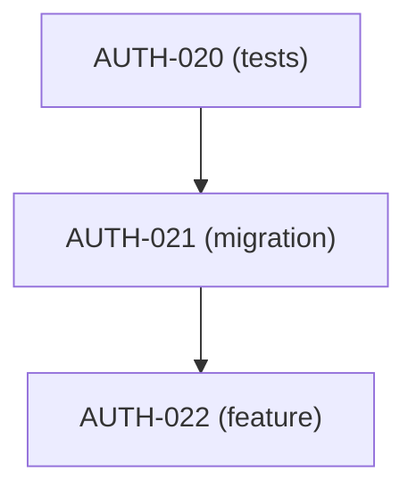

# Task Plan Standard

> Целевой формат задач и планов в COD-DOC.
> За основу взят Restate (`Docs/standards/task-plan.md`) — формат проверен на десятках активных планов.
> Отличие: в COD-DOC формат markdown — это **проекция**; источник истины — БД. Все правила ниже равно применяются и к БД-сущностям, и к экспортированному markdown.

## 1. Два формата

| Формат | Когда |
|--------|-------|
| **Split** | План ≥ 15 задач или модуль редактируется параллельно несколькими исполнителями. Parent plan + dedicated `tasks/section-*.md`. |
| **Inline** | Короткий план (≤ 15 задач), один автор. Все секции — в одном файле. |

Миграция между форматами идёт через `cod-doc plan convert --format split`.

## 2. Структура файлов (projection)

```text
docs/plans/<module-slug>/
├── <module>-task-plan.md            ← parent (execution plan)
├── <module>-completed-tasks.md      ← при ≥ 20 задач
└── tasks/
    └── section-<letter>-<slug>.md   ← только для split
```

Корневая директория для планов — настраиваемая (`project.config.json` / `config_json`). По умолчанию `docs/plans/`; при импорте Restate — `Docs/obsidian/Modules/<Module>/`.

## 3. Execution plan — frontmatter

```yaml
---
type: execution-plan
scope: <module-id>-<kebab>           # M1-auth-module
status: pending | in-progress | done
principle: test-first | fix-first
created: YYYY-MM-DD
last_updated: YYYY-MM-DD
source_of_truth:
  module_spec: modules/<module>/overview
completed_log: plans/<module>/<module>-completed-tasks   # если ≥ 20 задач
---
```

Правила: идентичны Restate §2.1 с поправкой на `doc_key` вместо относительных путей.

## 4. Обязательные секции execution-plan

1. **Navigation** — ссылки на Home, module spec, NAVIGATION, completed-log.
2. **Progress Overview** — генерируется из `section_totals`; трогать руками нельзя.
3. **Gap Analysis Summary** — что уже реализовано, что — нет.
4. **Next Batch** — до 7 задач; генерируется из view `ready_tasks`.
5. **Dependency Graph** — Mermaid; обязателен при ≥ 15 задач.

## 5. Task — обязательные поля

| Поле | Валидация |
|------|-----------|
| `id` | `<PREFIX>-<NNN>`; PREFIX ∈ `[A-Z]{2,5}`; globally unique по проекту |
| `title` | начинается с verb pattern (§ 7) |
| `section` | `<LETTER>-<KebabSlug>` |
| `status` | `pending` / `in-progress` / `done` |
| `type` | см. § 6 |
| `priority` | `critical` / `high` / `medium` / `low` |
| `depends_on` | массив task-id; проверяется на циклы и существование |

Рекомендовано:

- `affected_files` — для feature/test/bug/refactor. Включает pg diff-based sync (см. § 9).

## 6. Типы задач (closed enum)

`test`, `e2e-test`, `feature`, `migration`, `refactor`, `bug`, `docs`, `frontend`, `api-docs`.

Запрещено: `implementation` (use `feature`), compound `migration+feature` (split).

## 7. Verb-patterns заголовков

| Pattern | Type |
|---------|------|
| `Test: <subject>` | test |
| `Test + Implement: <subject>` | feature (test-first) |
| `Implement: <subject>` | feature |
| `Migration: <subject>` | migration |
| `Refactor: <subject>` | refactor |
| `Fix: <subject>` | bug |
| `E2E: <subject>` | e2e-test |
| `Design + document: <subject>` | api-docs |
| `Docs: <subject>` | docs |

Нарушение — hard error `cod-doc audit`.

## 8. Нумерация внутри плана

Каждая секция резервирует decade: A → 001-009, B → 010-019, C → 020-029, …
`cod-doc task new --plan <plan> --section B` сам выберет ближайший свободный номер.
Подзадача: `<PARENT>A`, `<PARENT>B` (`AGN-021A`).

## 9. `affected_files` — diff-based status sync

| Паттерн | Действие |
|---------|----------|
| N:1 (один task матчит changed files) | `task.status` auto-update через `TaskService` |
| N:M (несколько task-ов) | Агент показывает кандидатов, пользователь выбирает |
| 0 match | Fallback: ищем `[<TASK-ID>]` в commit message |
| task уже `done` | Skip |

Алгоритм применяется:
- через git pre-commit hook (`cod-doc hooks install --git`);
- через MCP `task.sync_from_diff`.

Это прямой перенос механики из Restate `Docs/standards/task-plan.md §4.6`, но без логики Logical Commits — тут достаточно вызова сервиса.

## 10. Completed tasks log

- Не нужен при < 10 задач.
- Рекомендован при ≥ 10.
- Обязателен при ≥ 20.

Log генерируется полностью из БД; ручных правок быть не должно.

Формат:

```markdown
| ID | Title | Section | Commit | Date |
|:---|:------|:--------|:-------|:-----|
| AGN-001 | Test: getMyAgency returns profile | A-Test-Coverage | a187f6d | 2026-04-08 |
```

## 11. Переход задачи в `done`

Правила (применяются сервисом `TaskService.complete`):

1. Все `depends_on` должны быть `done`.
2. Обязателен `completion note`: `> ✅ **Implemented YYYY-MM-DD** (commit `<sha>`): <one-liner>.`
3. При split-формате запись остаётся в section-файле; в completed-log добавляется строка.
4. Пишется `revision` с `diff` по задаче.
5. Triggering `PlanService.recalc()` для пересчёта Progress Overview.

## 12. Dependency Graph (проекция)

Из БД в markdown — через Mermaid:



Cross-plan зависимости — те же самые `depends_on`, БД видит их автоматически. Правило Restate про «loadExecutionPlans() резолвит cross-plan» у нас вырождается — все задачи и так в одном запросе.

## 13. Чеклист при создании нового плана

```markdown
- [ ] Frontmatter: type, scope, status, principle, created, last_updated, source_of_truth
- [ ] Navigation section
- [ ] Gap Analysis
- [ ] Секции пронумерованы A, B, C, ...
- [ ] Все task id уникальны и попадают в range секции
- [ ] Каждая задача имеет title/type/priority/status/depends_on
- [ ] affected_files указан для feature/test/bug/refactor
- [ ] Progress Overview и Next Batch сгенерированы (не руками)
- [ ] Dependency Graph при ≥ 15 задачах
- [ ] completed_log при ≥ 20 задачах
- [ ] `cod-doc audit` без ошибок
```

## 14. Обратная совместимость со стандартом Restate

Форматы совместимы: импорт Restate task-plan работает без ручного редактирования при условии:

- Файлы следуют Restate §1-§8 полностью.
- Обязательные поля присутствуют.
- Нет запрещённых enum-значений (`active`, `implementation`, compound types).

Подробности миграции — [migration/from-restate.md](../migration/from-restate.md).
