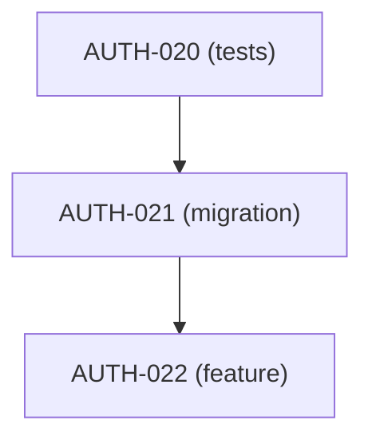

# Task Plan Standard

> The target format of tasks and plans in COD-DOC.
> Based on Restate (`Docs/standards/task-plan.md`) — the format is proven on dozens of active plans.
> Difference: in COD-DOC the markdown format is a **projection**; the source of truth is the DB. All rules below apply equally to DB entities and to exported markdown.

## 1. Two formats

| Format | When |
|--------|-------|
| **Split** | A plan ≥ 15 tasks or the module is edited in parallel by several contributors. Parent plan + dedicated `tasks/section-*.md`. |
| **Inline** | A short plan (≤ 15 tasks), one author. All sections in one file. |

Migration between formats goes through `cod-doc plan convert --format split`.

> **Terminology (DOC-LO-2).** Distinguish: **section** — a plan division (DB entity
> `plan_section`, letter + slug, reserves a decade of numbers, see §8); **section-file** — a
> markdown file `tasks/section-<letter>-<slug>.md`, exists only in the split format
> as a projection of one section. In the inline format, sections live in one plan file
> and there are no separate section-files. "Section file" = section-file; "section" = section.

## 2. File structure (projection)

```text
docs/plans/<module-slug>/
├── <module>-task-plan.md            ← parent (execution plan)
├── <module>-completed-tasks.md      ← when ≥ 20 tasks
└── tasks/
    └── section-<letter>-<slug>.md   ← only for split
```

The root directory for plans is configurable (`project.config.json` / `config_json`). The default is `docs/plans/`; on Restate import — `Docs/obsidian/Modules/<Module>/`.

## 3. Execution plan — frontmatter

```yaml
---
type: execution-plan
scope: <module-id>-<kebab>           # M1-auth-module
status: pending | in-progress | done
principle: test-first | fix-first
created: YYYY-MM-DD
last_updated: YYYY-MM-DD
source_of_truth:
  module_spec: modules/<module>/overview
  completed_log: plans/<module>/<module>-completed-tasks   # when ≥ 20 tasks
---
```

Rules: identical to Restate §2.1 with the adjustment for `doc_key` instead of relative paths.

## 4. Mandatory sections of an execution-plan

1. **Navigation** — links to Home, module spec, NAVIGATION, completed-log.
2. **Progress Overview** — generated from `section_totals`; manual editing is forbidden.
3. **Gap Analysis Summary** — what is already implemented, what is not.
4. **Next Batch** — up to 7 tasks; generated from the `ready_tasks` view.
5. **Dependency Graph** — Mermaid; mandatory when ≥ 15 tasks.

## 5. Task — mandatory fields

| Field | Validation |
|------|-----------|
| `id` | `<PREFIX>-<NNN>`; PREFIX ∈ `[A-Z]{2,5}`; globally unique within the project |
| `title` | starts with a verb pattern (§ 7) |
| `section` | `<LETTER>-<KebabSlug>` |
| `status` | `pending` / `in-progress` / `done` |
| `type` | see § 6 |
| `priority` | `critical` / `high` / `medium` / `low` |
| `depends_on` | array of task-ids; checked for cycles and existence |

Recommended:

- `affected_files` — for feature/test/bug/refactor. Includes pg diff-based sync (see § 9).

### 5.1 Priority rubric (DOC-ME-6)

`priority` is set by the **blocker × user-impact × scope** matrix — not "by eye":

| Priority | Blocker | User-impact | When |
|----------|---------|-------------|-------|
| `critical` | blocks a release / breaks prod | data loss, unavailability | fix immediately |
| `high` | blocks ≥1 dependent task | noticeable to the user/agent | in the current batch |
| `medium` | does not block, but in the cycle plan | indirect / DX | the nearest month |
| `low` | opportunistic | unnoticeable (refactor, docs, cleanup) | when possible |

Rules:

- **Escalation:** a task blocking ≥2 others (`depends_on`-reverse) — at least `high`.
- **De-escalation:** a pure refactor/docs with no behavioral effect — `low`, even if voluminous.
- **Tie-break:** on a tie, the higher priority is taken (safety-first).

## 6. Task types (closed enum)

`test`, `e2e-test`, `feature`, `migration`, `refactor`, `bug`, `docs`, `frontend`, `api-docs`.

Forbidden: `implementation` (use `feature`), compound `migration+feature` (split).

## 7. Verb-patterns of titles

| Pattern | Type |
|---------|------|
| `Test: <subject>` | test |
| `Test + Implement: <subject>` | feature (test-first) |
| `Implement: <subject>` | feature |
| `Migration: <subject>` | migration |
| `Refactor: <subject>` | refactor |
| `Fix: <subject>` | bug |
| `E2E: <subject>` | e2e-test |
| `Design + document: <subject>` | api-docs |
| `Docs: <subject>` | docs |

A violation is a hard error of `cod-doc audit`.

## 8. Numbering within a plan

Each section reserves a decade: A → 001-009, B → 010-019, C → 020-029, …
`cod-doc task new --plan <plan> --section B` will pick the nearest free number itself.
Subtask: `<PARENT>A`, `<PARENT>B` (`AGN-021A`).

## 9. `affected_files` — diff-based status sync

| Pattern | Action |
|---------|----------|
| N:1 (one task matches changed files) | `task.status` auto-update via `TaskService` |
| N:M (several tasks) | The agent shows candidates, the user chooses |
| 0 match | Fallback: look for `[<TASK-ID>]` in the commit message |
| task already `done` | Skip |

The algorithm is applied:
- via a git pre-commit hook (`cod-doc hooks install --git`);
- via MCP `task.sync_from_diff`.

This is a direct port of the mechanics from Restate `Docs/standards/task-plan.md §4.6`, but without the Logical Commits logic — a service call is enough here.

## 10. Completed tasks log

- Not needed with < 10 tasks.
- Recommended with ≥ 10.
- Mandatory with ≥ 20.

The log is generated entirely from the DB; there should be no manual edits.

Format:

```markdown
| ID | Title | Section | Commit | Date |
|:---|:------|:--------|:-------|:-----|
| AGN-001 | Test: getMyAgency returns profile | A-Test-Coverage | a187f6d | 2026-04-08 |
```

## 11. Transitioning a task to `done`

Rules (applied by the `TaskService.complete` service):

1. All `depends_on` must be `done`.
2. A `completion note` is mandatory: `> ✅ **Implemented YYYY-MM-DD** (commit `<sha>`): <one-liner>.`
3. In the split format, the entry stays in the section-file; a row is added to the completed-log.
4. A `revision` with the `diff` for the task is written.
5. Triggering `PlanService.recalc()` to recompute the Progress Overview.

## 12. Dependency Graph (projection)

From the DB to markdown — via Mermaid:


```mermaid
graph TD
  AUTH_020["AUTH-020 (tests)"]
  AUTH_021["AUTH-021 (migration)"]
  AUTH_022["AUTH-022 (feature)"]
  AUTH_020 --> AUTH_021
  AUTH_021 --> AUTH_022
```

Cross-plan dependencies are the same `depends_on`; the DB sees them automatically. The Restate rule about "loadExecutionPlans() resolves cross-plan" degenerates here — all tasks are in one query anyway.

## 13. Checklist when creating a new plan

```markdown
- [ ] Frontmatter: type, scope, status, principle, created, last_updated, source_of_truth
- [ ] Navigation section
- [ ] Gap Analysis
- [ ] Sections numbered A, B, C, ...
- [ ] All task ids are unique and fall within the section range
- [ ] Each task has title/type/priority/status/depends_on
- [ ] affected_files specified for feature/test/bug/refactor
- [ ] Progress Overview and Next Batch generated (not by hand)
- [ ] Dependency Graph when ≥ 15 tasks
- [ ] completed_log when ≥ 20 tasks
- [ ] `cod-doc audit` without errors
```

## 14. Backward compatibility with the Restate standard

The formats are compatible: Restate task-plan import works without manual editing provided:
- The files follow Restate §1-§8 in full.
- The mandatory fields are present.
- There are no forbidden enum values (`active`, `implementation`, compound types).

Migration details — [migration/from-restate.md](../migration/from-restate.md).
