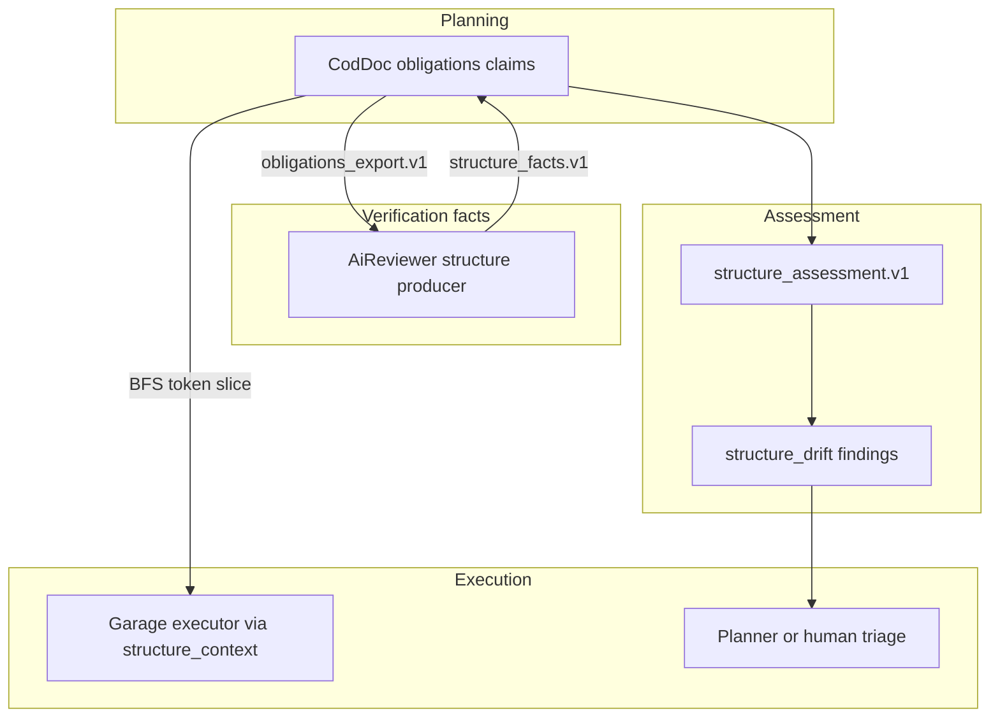
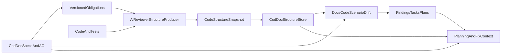

# 24 — Единый контур структуры, контрактов и тестовых сценариев

> **Статус: черновик** (2026-09-02) · Категория: 🔵 Архитектура · Риск: высокий
> · Зависимости: [22 Symbiosis](22-symbiosis-zairgrush-orakul.md) (hub, findings,
> pull ingest), [07 Routines](07-routines.md), [09 Activity log](09-activity-log.md)
> · Поглощает внешнюю часть [17 Living Specification](17-living-specification.md)

## 0. RACI триады (планирование / исполнение / верификация)

Три продукта образуют триаду. Этот RFC фиксирует **границу docs↔code** — не
«либо кодок, либо рой», а сервисный контур с разделением фактов и намерений.

| Продукт | Роль в триаде | Владеет | Не делает |
|---------|---------------|---------|-----------|
| **cod-doc** (кодок) | Планирование (намерения) | obligations, ADR, module specs, stories, plans, tasks; `doc_code_claim`; snapshots; `structure_drift`; `structure_context` | не наблюдает код сам; не переписывает чужие docs автоматически |
| **ai-reviewer** (рэвью) | Верификация (факты) | observed facts: код, тесты, deps, coverage; producer `structure_facts.v1` / `structure_assessment.v1` | не меняет документацию; не объявляет intentions проекта |
| **ZAIrgRush / garage** (рой) | Исполнение | потребляет `structure_context`, findings→tasks; пишет код/тесты по готовому slice | не inventит схему протокола; не пишет obligations; executor не проектирует границу |
| **Протокол** (JSON v1) | Граница сервиса | `obligations_export` / `structure_facts` / `structure_assessment` | Markdown — только проекция |

**Мышление на границе** разнесено:

- **форма/язык** — протокол + `doc_code_claim` в cod-doc;
- **наполнение claims** — человек или doc-агент (`draft` → `confirmed`);
- **наблюдение** — ai-reviewer (structure producer);
- **связка/триаж** — link-suggest/confirm, remediation target (`code|test|docs|claim`);
- **исполнение** — garage executor по BFS/token-budgeted slice из cod-doc.

**Важно:** Reviewer внутри ZAIrgRush (LLM в петле) ≠ ai-reviewer как structure
producer. Structure producer = детерминированный анализатор в ai-reviewer;
swarm Reviewer остаётся потребителем findings, не владельцем протокола.

**Planner** (роль мышления в рое или человек) заполняет gap между cod-doc
(высокоуровневые протоколы) и garage (тупой исполнитель): подтверждает claims,
триажит drift, формирует task с acceptance до checkout executor'ом.



### Связь с Symbiosis (RFC 22)

RFC 22 покрывает hub-БД, findings-ingest (`slimFinding`), `ctx docs`, `ctx drift`
(links/frontmatter). Этот RFC — **глубже**: structure/scenario/coverage,
`doc_code_claim`, blob snapshots. Не заменяет 22; идёт **после** SYM-005..009
(findings hub + pull ingest). `ingest structure` использует тот же adapter registry
и finding pipeline, не параллельный путь.

### Поглощение RFC 17

Внешняя часть Living Specification (ADR↔code drift, task acceptance vs docs)
реализуется через `doc_code_claim` + `structure_drift` + scenario assessment.
Routine `adr_drift` из 17 остаётся complementary для ADR-graph orphan checks.

---

## 1. Цель

Построить общий сервисный контур между ai-reviewer и cod-doc, который:

- наблюдает фактическую структуру кода и тестов;
- знает документированные контракты, ограничения и acceptance criteria;
- сопоставляет код, документацию и тестовые evidence;
- отличает фактическое покрытие кода от покрытия сценариев;
- выявляет непроверенные крайние случаи, расхождения code↔docs и точки высокого dependency-риска;
- выдаёт не общий Markdown, а адресный контекст для создания плана, точного исправления или расширения контракта.

**North star:** для любого boundary, контракта или задачи платформа может показать:
где это реализовано, кто зависит от контракта, какие обязательства зафиксированы
в документации, какие тестовые сценарии подтверждены, каких evidence не хватает
и что именно следует изменить.

## 1a. Текущее состояние (сверено 2026-09-05)

**Сторона producer'а — есть.** `Orange-hanter/ai-reviewer#6` смержен
2026-09-03: `lib/structure.mjs`, `lib/structure-{protocol,identity,graphify,
scip,lcov,tests,assessments,drift,export,evidence,context,mutation}.mjs`,
входные точки `bin/pr-review-structure.mjs` и `bin/pr-review-structure-mcp.mjs`,
четыре схемы в `schemas/` и фикстуры в `fixtures/structure/`.

**Сторона cod-doc — нет ничего.** На `main` отсутствуют и код, и следы в
планировании: grep по `structure_facts|structure_context|obligations_export`
в `*.md`/`*.py` даёт ноль совпадений, в БД нет задачи со `structure` в
названии, а `document` содержит `proposals/01`…`proposals/23` — без 24.

**Фундамент под ingest готов** и переиспользуется, а не строится заново:

- реестр ingest-адаптеров и `finding_service` — `cod_doc/services/finding_service.py`,
  CLI `cod-doc ingest ai_review --from-pr` (`cod_doc/cli/cmd_ingest.py`), SYM-006/009;
- hub-БД и таблицы findings — миграции `0027_shared_hub`, `0028_findings`
  (`cod_doc/infra/migrations/versions/`); текущий head — `0028_findings`;
- контекст под token budget — `cod_doc/services/context_service.py` (L0/L1/L2);
- projection drift, от которого structure drift обязан отличаться, —
  `cod_doc/services/projection_service/`, CLI `cod-doc doc drift`.

Незакрытый разрыв: `evidence-receipt.v1` существует как схема в producer'е, но
в этом RFC не определён — при декомпозиции либо описать его здесь, либо
исключить из потребляемых артефактов.

## 2. Ответственность инструментов

- **ai-reviewer / structure producer** владеет наблюдаемыми фактами о коде, тестах, зависимостях и coverage. Он не меняет документацию и не объявляет намерения проекта.
- **cod-doc** владеет документированными обязательствами, ADR, module specs, stories, plans и tasks. Он хранит structure snapshots, связывает их с документацией и считает drift.
- **Общий протокол** является границей сервиса. JSON — канонический machine artifact; Markdown — только человекочитаемая проекция.
- **PR merge-gate** остаётся отдельным контуром. Structure/scenario gaps не блокируют merge автоматически.

Протокол разделён на три independently-versioned документа:

- `obligations_export.v1` — cod-doc → analyzer; документированные claims/acceptance criteria;
- `structure_facts.v1` — ai-reviewer → cod-doc; факты для конкретного code snapshot;
- `structure_assessment.v1` — результаты сопоставления facts + obligations + test run + thresholds.

Так docs-only изменение создаёт новый assessment, но не копирует и не перестраивает code facts. Schema каждого документа имеет `$id`, `schemaRef`, major compatibility policy и canonical cross-repo fixture. Additive fields игнорируются старым consumer; удаление/изменение required fields требует новой major version.

## 3. Сквозной поток



**Двусторонний цикл:**

1. cod-doc экспортирует структурированные obligations с contentHash и code references;
2. ai-reviewer анализирует код/тесты с учётом obligations;
3. cod-doc принимает snapshot, нормализует его и сравнивает с текущими docs;
4. drift/hints превращаются в findings и при необходимости в tasks/plans;
5. task context возвращает агенту только релевантный structure slice.

## 4. Послойный анализ

Использовать двухпроходную схему, а не жёсткий waterfall:

1. Discovery — языки, manifests/workspaces, source/test/generated roots, path aliases.
2. Provisional boundaries — package/service/layer/module по manifests, профилю и путям.
3. Entities — files, functions, inferred classes/interfaces/types, methods, test cases.
4. Observed contracts — exports/re-exports, inherits/implements, entrypoints и доступные signatures/errors.
5. Dependencies — contains/method/imports/calls/inherits/implements.
6. Boundary refinement — уточнение по dependency graph/communities без изменения stable entity ids.
7. Coverage observations — LCOV files/functions и, когда доступно, per-test execution.
8. Scenario assessment — obligations ↔ contracts ↔ tests ↔ runtime evidence.
9. Metrics/hints — только после проверки freshness и data quality.

**Промежуточные слои кэшируются:**

- structure facts: `headSha + providerVersion + structureConfigHash`;
- obligations: `project + docsRevision/contentHashes`;
- coverage: `testRunId + coverageHash`;
- assessments: hashes трёх предыдущих входов + thresholds.

Новый LCOV не перестраивает entities/dependencies; изменение docs не переобходит код; изменение thresholds не пересчитывает facts.

## 5. Идентичность и временная согласованность

Произвольный rename невозможно надёжно распознать одним hash. Различать:

- **observedId** — детерминированный id сущности внутри snapshot из repo-relative path, qualified name и kind;
- **lineageId** — сквозная идентичность между snapshots;
- **identityEvents[]** — `created|renamed|moved|signature_changed|removed` с from/to, evidence и confidence.

Lineage переносится автоматически только при exact git rename + совместимом symbol/signature match. Неоднозначный move становится `identity_unresolved`: ссылка не считается сломанной, finding не закрывается и scenario не становится missing.

Contract/test/scenario ids имеют отдельные документированные формулы. Finding fingerprint не включает headSha; он строится по project + drift kind + obligation key + contract lineage + scenario kind, чтобы сохранять lifecycle между snapshots.

Каждый assessment фиксирует: `factsFingerprint`, `obligationsRevision`, `coverageHash`, `thresholdsHash`; `headSha`, `branchRef`, `prNumber?`, `isDefaultBranch`; `testRunId`, `coverageProducedAt`, `obligationsExportedAt`; `temporalAlignment: aligned|mismatch|unknown`.

LCOV от другого commit, snapshot не от текущего branch HEAD или docs revision после assessment переводят зависящие выводы в unverifiable/provisional. Автопромоут и auto-resolve при temporal mismatch запрещены.

## 6. Trust и ограничения ingest

Artifact считается входом из CI и валидируется до сохранения:

- trust tiers: `signed_ci`, `trusted_local`, `untrusted`;
- signed CI связывает repository, workflow/run id, actor и headSha через существующую forge/OIDC identity;
- untrusted snapshot доступен для просмотра, но не создаёт findings/tasks и не меняет current snapshot;
- только repo-relative normalized paths; absolute paths, `..`, NUL и path escape отклоняются;
- hard limits на compressed/uncompressed bytes, entities, edges, tests, obligations, string/path length и nesting depth;
- payload hash проверяется до decompression; decompression ratio ограничен;
- remote headSha проверяется против связанного repository/ref.

V1 delivery — pull существующего CI artifact через доверенный cod-doc runner. Push REST ingest откладывается до отдельной auth-модели.

## 7. Четыре уровня покрытия

Не сводить их к одному проценту:

| Уровень | Определение |
|---------|-------------|
| `code_coverage` | строки файла исполнялись (LCOV DA) |
| `function_execution` | функция/метод вызывались (FN/FNDA) |
| `scenario_evidence` | существует тест, связанный с контрактом, и имеются наблюдаемые evidence |
| `contract_edge_coverage` | подтверждён конкретный happy/error/boundary/invariant case |

**Ограничения:**

- Aggregate LCOV не показывает, какой тест вызвал функцию.
- FNDA > 0 не доказывает error path или invariant.
- Без source ranges нельзя честно считать line/branch coverage метода/класса.
- Dependency edge, инцидентный покрытым узлам, не считается пройденным автоматически.

## 8. Контракты и обязательства

**Observed contracts из кода:** exported/re-exported symbols; inheritance/implementation relations; entrypoints и callable signatures; declared/observed errors и boundary crossings; stable code reference: path + symbol + range/node id.

**Documented obligations из cod-doc:** MUST/SHOULD claims из module specs; story/task acceptance criteria; invariants, error semantics, compatibility constraints; explicit code links к contract/entity; priority, content hash и revision.

Для точной сверки cod-doc вводит структурированный `doc_code_claim`:

| Поле | Значения |
|------|----------|
| `kind` | `entity_exists`, `exports`, `signature`, `depends_on`, `forbids_dependency`, `scenario` |
| `doc_key`, `section_anchor`, `content_hash` | привязка к документу |
| `subject_ref`, `expected` | structured expected |
| `status` | `draft`, `confirmed`, `retired` |
| `provenance` | `manual`, `agent`, `import` |

**Реализовано (TSC-001…TSC-007, 2026-09-08):** claim'ы с `kind = scenario`
живут не в `doc_code_claim`, а в собственных таблицах `scenario` /
`scenario_step` / `scenario_link` (миграция `0031_scenarios`) — см. §12.
Поля `doc_key` / `section_anchor` / `doc_content_hash` / `subject_ref` /
`status` / `provenance` перенесены как есть. Значение `retired` добавлено
cod-doc'ом: id сценариев не переиспользуются, поэтому снятию нужен
собственный статус.

Неструктурированный prose может породить предложенный draft claim, но не участвует в строгом drift до подтверждения.

## 9. Сценарии и строгие статусы

> **Авторская половина сдана отдельно (TSC-001…TSC-007, 2026-09-08).**
> Виды сценариев из этого раздела реализованы дословно как `ScenarioKind`;
> **статусы покрытия ниже — нет**. `scenario.status` несёт только claim-статус
> §8 (`draft | confirmed | retired`), а `covered | partial | missing |
> unverifiable` остаются доказательствами producer'а и появятся в
> `scenario_assessment` (STR-002). Валидатор `SCV-003` отклоняет вердикт,
> переданный как статус, с объяснением: жёсткие правила ниже неисполнимы,
> если вердикт можно набрать руками.


Для каждого obligation формируется scenario: `happy_path`, `error_path`, `boundary_value`, `invariant`, `integration`.

| Статус | Условие |
|--------|---------|
| `covered` | obligation ↔ contract; конкретный test case; static/runtime link test→contract; evidence threshold; graph/docs свежие |
| `partial` | тест или execution evidence есть, но недостаточно для конкретного сценария |
| `missing` | obligation и contract связаны, inventory свежий и полный, но test/evidence нет |
| `unverifiable` | stale/missing graph, unresolved join, неоднозначная связь или недостаточный provider capability |

**Hard rules:**

- при `evidenceCeiling: aggregate_lcov` — `error_path`, `boundary_value`, `invariant` не могут быть `covered`; максимум `partial`;
- `happy_path` требует конкретный test case + static link + execution/assertion evidence; один FNDA > 0 даёт максимум `partial`;
- `unresolved` никогда не превращается в `missing`;
- AMBIGUOUS dependency/call edge не подтверждает сценарий;
- file coverage не подставляется вместо function/method/scenario coverage;
- `missing` запрещён, если test inventory completeness или join quality ниже profile thresholds → `unverifiable`;
- ambiguous obligation→contract resolution даёт candidate list и `unverifiable`, а не выбор первого совпадения;
- статус всегда содержит `statusReason`, `evidence[]` и `missingEvidence[]`.

## 10. Versioned protocol

### structure_facts.v1

```json
{
  "schemaRef": "code-structure/structure-facts.v1",
  "version": 1,
  "kind": "structure_facts",
  "fingerprint": "...",
  "provenance": {
    "headSha": "...",
    "branchRef": "main",
    "prNumber": null,
    "toolVersion": "...",
    "configHash": "...",
    "providerCapabilities": {},
    "graphStatus": "fresh",
    "warnings": []
  },
  "facts": {
    "boundaries": [],
    "entities": [],
    "contracts": [],
    "dependencies": [],
    "testCases": []
  },
  "identityEvents": [],
  "views": {
    "boundaryTree": [],
    "objectTree": [],
    "functionTree": [],
    "dependencyGraph": []
  }
}
```

### obligations_export.v1

Содержит project, revision, exportedAt, а также obligations/confirmed claims с contentHash, priority, source document/section/story/task и explicit contract/code refs.

### structure_assessment.v1

```json
{
  "schemaRef": "code-structure/structure-assessment.v1",
  "version": 1,
  "kind": "structure_assessment",
  "fingerprint": "...",
  "factsFingerprint": "...",
  "obligationsRevision": "...",
  "coverageHash": "...",
  "thresholdsHash": "...",
  "testRun": {
    "id": "...",
    "headSha": "...",
    "producedAt": "..."
  },
  "temporalAlignment": "aligned",
  "coverageObservations": [],
  "assessments": {
    "codeCoverage": {},
    "dependencyRisk": {},
    "contractScenarios": [],
    "dataQuality": {}
  },
  "hints": []
}
```

**Требования:** observed ids детерминированы внутри snapshot; continuity через lineage/identity events; каждое inferred поле имеет confidence/evidence; assessment содержит content hashes obligations; stable sorting для diff; facts и assessments — разные fingerprints и cache lifecycle; schema допускает additive fields; `normalizerVersion` сохраняется consumer-ом для replay после DB migrations.

## 11. SymbolProvider (нужен ли собственный AST)

Собственный parser в ai-reviewer не нужен. Нужен SymbolProvider:

```
discover(project)
extractBoundaries(scope)
extractEntities(scope)
extractContracts(scope)
extractDependencies(scope)
extractTests(scope)
capabilities()
```

V1 provider использует Graphify, LCOV и существующий ast-grep для test/assertion patterns.

Следующий provider: TypeScript compiler API; Tree-sitter/LSP для polyglot; framework adapters (Vitest/Jest/Pytest); per-test coverage/tracing.

Переход нужен, если: `unresolvedCoverageJoinRate > 10%` на двух пилотах; требуется exact method/class coverage; breaking-change detection по signatures; edge-case scenarios должны получать `covered`, а не только `partial`.

## 12. Глубокое хранение в cod-doc

Blob-first, не только Document/Section:

- `code_structure_snapshot` — immutable header, fingerprint, schemaRef, normalizerVersion, headSha/branchRef/prNumber, trust tier, payload sha256, zlib-compressed payload;
- `structure_assessment` — отдельная запись, ссылается на facts snapshot и obligations revision;
- `doc_code_claim`, `structure_waiver` — durable cod-doc data.

MVP не дублирует весь Graphify graph в SQL. После подтверждения query patterns нормализовать scoped `code_boundary`, `code_entity`, `code_contract`, `code_edge`.

**Scenario index больше не отложен.** Он реализован в миграции `0031_scenarios`
как `scenario` / `scenario_step` / `scenario_link` (TSC-001) и занимает именно
этот слот. STR-002 не переделывает его, а присоединяет к нему append-only
`scenario_assessment` по `scenario.row_id`: одна строка на прогон CI, чтобы
ingest не переписывал авторские строки и не заливал `revision` шумом. `repo_file` / `repo_symbol` / `module_code` остаются fallback lookup.

Связи: `external_ref(system=ai-reviewer)`; CODE links Document/Section ↔ entity/contract; structure hints → Finding pipeline; promoted findings → Task/Plan с affected_files и structure context.

Snapshot ingest: idempotent по fingerprint; `latest_main`, `latest_pr(N)`, explicit headSha — разные query semantics; hard caps MVP: 5000 entities, 15000 edges; retention: последние 10 на branchRef + referenced open findings; generated artifact никогда не меняет source-of-truth docs автоматически.

## 13. Code↔docs drift

Отдельный `structure_drift`, не смешивать с projection drift (`doc drift`):

- broken code link;
- unmapped module/boundary;
- confirmed export/signature claim расходится с observed contract;
- forbidden dependency появилась;
- documented dependency/entrypoint исчез;
- obligation не связан с contract;
- MUST obligation имеет missing|partial scenario;
- docs content hash изменился после assessment;
- snapshot не соответствует текущему HEAD.

Finding lifecycle: `open → in_progress → pending_verify → resolved|superseded`. Waiver подавляет triage, но не меняет facts/assessment.

## 14. Платформенные интерфейсы

**CLI:**

```bash
cod-doc obligation export -p <project> --json
cod-doc ingest structure -p <project> --facts <facts.json> [--assessment <assessment.json>]
cod-doc structure latest|diff|drift|entities|contracts|scenarios|triage
cod-doc structure link-suggest|link-confirm
cod-doc structure waive|waivers
cod-doc ctx structure -p <project> --scope <module|path|entity> --budget-tokens N
```

**REST:** `/api/projects/{slug}/obligations`, `/structure/snapshots`, `/structure/latest`, `/structure/context`, `/structure/drift`, `/structure/scenarios`.

**MCP (доказательная половина, STR-004):** `structure_get`, `structure_context`, `structure_drift`, `structure_scenarios`, `structure_diff`.

**MCP (авторская половина, сдано TSC-007):** `scenario_create`, `scenario_get`,
`scenario_list`, `scenario_update`, `scenario_retire`, `scenario_set_steps`,
`scenario_link`, `scenario_export`, `scenario_coverage` — профили
`standard`/`full`. Семейства не конкурируют и не пересекаются по именам:
`scenario_*` **пишет намерения**, `structure_scenarios` **читает намерение ⨝
доказательство**. CLI-зеркало — `cod-doc scenario new|list|show|update|retire|
steps|link|unlink|export|coverage`.

`structure_context` — BFS от seed, caps: 20 entities, 50 edges, 10 obligations, 15 gaps, 32KB JSON. Основной интерфейс для garage executor и Planner.

**Decision-oriented hints (V1):** `structure.graph_stale`, `docs.obligation_unlinked`, `coverage.function_unexecuted_high_fan_in`, `scenario.must_obligation_gap`, `contract.confirmed_claim_drift` — с remediation target `code|test|docs|claim`.

## 15. План реализации

| Фаза | Содержание | Репозиторий | Статус |
|------|------------|-------------|--------|
| 0 | Авторская половина сценариев: таблицы, сервис, валидаторы, проекция в `docs/system/scenarios/`, CLI + MCP | cod-doc | ✅ TSC-001…TSC-007 (2026-09-08) |
| 1 | Общий протокол: schemas, fixtures, contract tests | ai-reviewer + cod-doc | ✅ сделано в producer'е |
| 2 | Producer в ai-reviewer (`lib/structure*.mjs`, `pr-review-structure`) | ai-reviewer | ✅ сделано |
| 3 | Blob-first ingest, pull pilot | cod-doc | ⬜ STR-001 |
| 4 | Scoped indexes, obligations export, drift, finding lifecycle, `scenario_assessment` поверх готового scenario index | cod-doc | ⬜ STR-002 |
| 5 | Human triage loop, waiver, advisory CI (не merge blocker) | cod-doc | ⬜ STR-003 |
| 6 | `structure_context`, MCP, agent task card enrichment | cod-doc + garage consumer | ⬜ STR-004 |
| 7 | Exact providers, breaking diff, authenticated push | ai-reviewer | ⬜ |

**Фазы 1–2 закрыты 2026-09-03** — PR `Orange-hanter/ai-reviewer#6` смержен
(`lib/structure*.mjs`, `bin/pr-review-structure.mjs`, четыре схемы в
`schemas/`, фикстуры, `test/structure.test.mjs`); с тех пор producer доехал до
релиза 0.3.0. Владелец схем — producer: cod-doc обязан подтягивать его версию,
а не вести свою копию.

**Prerequisite:** SYM-005..009 (RFC 22) — hub, finding tables, pull ingest,
trust model. **Выполнен:** все SYM-005..009 в статусе `done` (SYM-009 закрыт в
спринте M4, 2026-09-02).

## 16. Non-goals первого релиза

- Не объявлять scenario `covered` по имени теста или aggregate LCOV.
- Не генерировать факты LLM-ом.
- Не переписывать docs автоматически.
- Не превращать scenario gap в merge blocker.
- Не строить собственный AST parser.
- Не нормализовать весь Graphify graph без scope/retention limits.

## 17. Критерии готовности

См. исходный документ: протокол (cross-repo fixtures), достоверность (hard caps на статусы), cod-doc (idempotent ingest, projection vs structure drift), security (untrusted tier), платформенный сценарий (bootstrap → confirm link → ingest → finding → structure_context → pending_verify → resolve).

## 17a. Оценка

Сторона cod-doc (фазы 3–6) — **4 задачи**, секция F плана `adoption-2026-08`.
Исходный код существует в ветке `cursor/structure-platform-a8c9` (+5621 строка,
draft PR #6) и режется по фазам, а не вливается одним куском.

| Задача | Фаза | Объём | Зависит от |
|---|---|---|---|
| STR-001 | 3 | Протокол, blob-first ingest, миграция 0029, trust-тиры | этот RFC |
| STR-002 | 4 | Scoped indexes, obligations export, structure drift | STR-001 |
| STR-003 | 5 | Triage, waiver, finding lifecycle (`pending_verify` → resolve) | STR-002 |
| STR-004 | 6 | `structure_context`, паритет MCP, обогащение task card | STR-003 |

Фаза 7 — сторона ai-reviewer, в оценку cod-doc не входит. Сроки не
планируются: спринт — упорядоченная очередь, а не окно (решение владельца
2026-08-30, действует с M4).

## 18. Источники

- [22 Symbiosis](22-symbiosis-zairgrush-orakul.md) — hub, findings, E5-C, pull ingest
- [17 Living Specification](17-living-specification.md) — ADR drift (поглощается)
- ai-reviewer: `lib/export.mjs`, `lib/findings.mjs`, Graphify, LCOV
- cod-doc: `repo_file`, `repo_symbol`, `module_code`, finding pipeline (RFC 22 §3.2)
