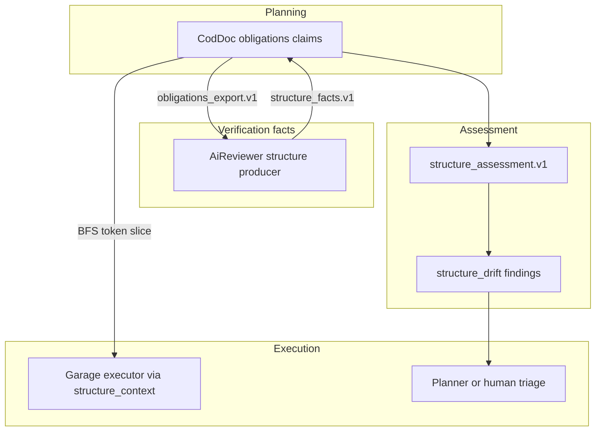
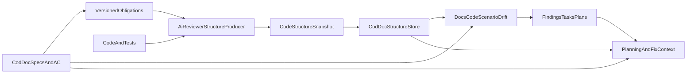

# 24 — Unified contour of structure, contracts and test scenarios

> **Status: 🟠 DEFERRED (2026-09-07)** — producer in ai-reviewer is ready (phases 1–2),
> but cod-doc tasks STR-001…STR-004 are deferred to M6. Prerequisite SYM-005..009 done.
> Category: 🔵 Architecture · Risk: high · Dependencies: [22 Symbiosis](22-symbiosis-zairgrush-orakul.md)
> (hub, findings, pull ingest), [07 Routines](07-routines.md), [09 Activity log](09-activity-log.md)
> · Absorbs the external part of [17 Living Specification](17-living-specification.md)

## 0. RACI triad (planning / execution / verification)

Three products form a triad. This RFC fixes the **docs↔code boundary** — not
"either codoc or swarm", but a service contour separating facts and intentions.

| Product | Role in triad | Owns | Does not do |
|---------|---------------|---------|-----------|
| **cod-doc** (codoc) | Planning (intentions) | obligations, ADR, module specs, stories, plans, tasks; `doc_code_claim`; snapshots; `structure_drift`; `structure_context` | does not observe code itself; does not auto-rewrite others' docs |
| **ai-reviewer** (review) | Verification (facts) | observed facts: code, tests, deps, coverage; producer `structure_facts.v1` / `structure_assessment.v1` | does not change docs; does not declare project intentions |
| **ZAIrgRush / garage** (swarm) | Execution | consumes `structure_context`, findings→tasks; writes code/tests per a ready slice | does not invent the protocol schema; does not write obligations; executor does not design the boundary |
| **Protocol** (JSON v1) | Service boundary | `obligations_export` / `structure_facts` / `structure_assessment` | Markdown — projection only |

**Thinking at the boundary** is split:

- **form/language** — protocol + `doc_code_claim` in cod-doc;
- **filling claims** — a human or doc-agent (`draft` → `confirmed`);
- **observation** — ai-reviewer (structure producer);
- **linking/triage** — link-suggest/confirm, remediation target (`code|test|docs|claim`);
- **execution** — garage executor per a BFS/token-budgeted slice from cod-doc.

**Important:** Reviewer inside ZAIrgRush (LLM in the loop) ≠ ai-reviewer as a
structure producer. Structure producer = a deterministic analyzer in
ai-reviewer; the swarm Reviewer stays a consumer of findings, not an owner
of the protocol.

**Planner** (the thinking role in the swarm or a human) fills the gap
between cod-doc (high-level protocols) and garage (a dumb executor):
confirms claims, triages drift, forms a task with acceptance before
checkout by the executor.



### Relation to Symbiosis (RFC 22)

RFC 22 covers the hub-DB, findings-ingest (`slimFinding`), `ctx docs`, `ctx drift`
(links/frontmatter). This RFC goes **deeper**: structure/scenario/coverage,
`doc_code_claim`, blob snapshots. It does not replace 22; it goes **after**
SYM-005..009 (findings hub + pull ingest). `ingest structure` uses the same
adapter registry and finding pipeline, not a parallel path.

### Absorption of RFC 17

The external part of Living Specification (ADR↔code drift, task acceptance
vs docs) is implemented via `doc_code_claim` + `structure_drift` + scenario
assessment. The `adr_drift` routine from 17 stays complementary for ADR-graph
orphan checks.

---

## 1. Goal

Build a common service contour between ai-reviewer and cod-doc that:

- observes the actual structure of code and tests;
- knows the documented contracts, constraints and acceptance criteria;
- compares code, documentation and test evidence;
- distinguishes actual code coverage from scenario coverage;
- reveals untested edge cases, code↔docs discrepancies and high
  dependency-risk points;
- yields not a general Markdown, but targeted context for creating a plan,
  a precise fix, or a contract extension.

**North star:** for any boundary, contract or task, the platform can show:
where it is implemented, who depends on the contract, which obligations
are recorded in the docs, which test scenarios are confirmed, what evidence
is missing and what exactly should change.

## 1a. Current state (verified 2026-09-05)

**Producer side — exists.** `Orange-hanter/ai-reviewer#6` merged
2026-09-03: `lib/structure.mjs`, `lib/structure-{protocol,identity,graphify,
scip,lcov,tests,assessments,drift,export,evidence,context,mutation}.mjs`,
entry points `bin/pr-review-structure.mjs` and `bin/pr-review-structure-mcp.mjs`,
four schemas in `schemas/` and fixtures in `fixtures/structure/`.

**cod-doc side — nothing.** On `main` there is neither code nor traces in
planning: grep over `structure_facts|structure_context|obligations_export`
in `*.md`/`*.py` gives zero matches, the DB has no task with `structure` in
the name, and `document` contains `proposals/01`…`proposals/23` — without 24.

**The foundation under ingest is ready** and reused, not built anew:

- ingest-adapter registry and `finding_service` — `cod_doc/services/finding_service.py`,
  CLI `cod-doc ingest ai_review --from-pr` (`cod_doc/cli/cmd_ingest.py`), SYM-006/009;
- hub-DB and findings tables — migrations `0027_shared_hub`, `0028_findings`
  (`cod_doc/infra/migrations/versions/`); current head — `0028_findings`;
- context under a token budget — `cod_doc/services/context_service.py` (L0/L1/L2);
- projection drift, from which structure drift must differ, —
  `cod_doc/services/projection_service/`, CLI `cod-doc doc drift`.

An unclosed gap: `evidence-receipt.v1` exists as a schema in the producer,
but is not defined in this RFC — on decomposition either describe it here, or
exclude it from consumed artifacts.

## 2. Responsibility of the tools

- **ai-reviewer / structure producer** owns the observed facts about code,
  tests, dependencies and coverage. It does not change docs and does not
  declare project intentions.
- **cod-doc** owns the documented obligations, ADR, module specs, stories,
  plans and tasks. It stores structure snapshots, links them with docs and
  computes drift.
- **The common protocol** is the service boundary. JSON is the canonical
  machine artifact; Markdown is only a human-readable projection.
- **PR merge-gate** stays a separate contour. Structure/scenario gaps do not
  block merge automatically.

The protocol is split into three independently-versioned documents:

- `obligations_export.v1` — cod-doc → analyzer; documented claims/acceptance criteria;
- `structure_facts.v1` — ai-reviewer → cod-doc; facts for a specific code snapshot;
- `structure_assessment.v1` — results of matching facts + obligations + test run + thresholds.

So a docs-only change creates a new assessment, but does not copy or rebuild
code facts. Each document schema has `$id`, `schemaRef`, major compatibility
policy and a canonical cross-repo fixture. Additive fields are ignored by an
old consumer; removal/change of required fields needs a new major version.

## 3. End-to-end flow



**Bidirectional cycle:**

1. cod-doc exports structured obligations with contentHash and code references;
2. ai-reviewer analyzes code/tests with obligations in mind;
3. cod-doc accepts a snapshot, normalizes it and compares with current docs;
4. drift/hints become findings and, if needed, tasks/plans;
5. task context returns to the agent only the relevant structure slice.

## 4. Layer-by-layer analysis

Use a two-pass scheme, not a hard waterfall:

1. Discovery — languages, manifests/workspaces, source/test/generated roots, path aliases.
2. Provisional boundaries — package/service/layer/module by manifests, profile and paths.
3. Entities — files, functions, inferred classes/interfaces/types, methods, test cases.
4. Observed contracts — exports/re-exports, inherits/implements, entrypoints and accessible signatures/errors.
5. Dependencies — contains/method/imports/calls/inherits/implements.
6. Boundary refinement — refinement by dependency graph/communities without changing stable entity ids.
7. Coverage observations — LCOV files/functions and, when available, per-test execution.
8. Scenario assessment — obligations ↔ contracts ↔ tests ↔ runtime evidence.
9. Metrics/hints — only after checking freshness and data quality.

**Intermediate layers are cached:**

- structure facts: `headSha + providerVersion + structureConfigHash`;
- obligations: `project + docsRevision/contentHashes`;
- coverage: `testRunId + coverageHash`;
- assessments: hashes of the three previous inputs + thresholds.

A new LCOV does not rebuild entities/dependencies; a docs change does not
re-walk the code; a thresholds change does not recompute facts.

## 5. Identity and temporal consistency

An arbitrary rename cannot be reliably recognized by a single hash. Distinguish:

- **observedId** — a deterministic id of an entity inside a snapshot from repo-relative path, qualified name and kind;
- **lineageId** — cross-snapshot identity;
- **identityEvents[]** — `created|renamed|moved|signature_changed|removed` with from/to, evidence and confidence.

Lineage is carried automatically only on exact git rename + compatible
symbol/signature match. An ambiguous move becomes `identity_unresolved`: a
link is not considered broken, a finding is not closed and a scenario does
not become missing.

Contract/test/scenario ids have separate documented formulas. A finding
fingerprint does not include headSha; it is built from project + drift kind +
obligation key + contract lineage + scenario kind, to preserve lifecycle
between snapshots.

Each assessment fixes: `factsFingerprint`, `obligationsRevision`,
`coverageHash`, `thresholdsHash`; `headSha`, `branchRef`, `prNumber?`,
`isDefaultBranch`; `testRunId`, `coverageProducedAt`, `obligationsExportedAt`;
`temporalAlignment: aligned|mismatch|unknown`.

An LCOV from another commit, a snapshot not from the current branch HEAD or
a docs revision after the assessment move dependent conclusions to
unverifiable/provisional. Auto-promote and auto-resolve on temporal mismatch
are forbidden.

## 6. Trust and ingest limits

An artifact is considered input from CI and validated before saving:

- trust tiers: `signed_ci`, `trusted_local`, `untrusted`;
- signed CI links repository, workflow/run id, actor and headSha via the existing forge/OIDC identity;
- an untrusted snapshot is viewable, but does not create findings/tasks and does not change the current snapshot;
- only repo-relative normalized paths; absolute paths, `..`, NUL and path escape are rejected;
- hard limits on compressed/uncompressed bytes, entities, edges, tests, obligations, string/path length and nesting depth;
- payload hash is checked before decompression; decompression ratio is bounded;
- remote headSha is checked against the linked repository/ref.

V1 delivery — pull of an existing CI artifact via a trusted cod-doc runner.
Push REST ingest is deferred to a separate auth-model.

## 7. Four levels of coverage

Do not reduce them to one percent:

| Level | Definition |
|---------|-------------|
| `code_coverage` | file lines were executed (LCOV DA) |
| `function_execution` | a function/method was called (FN/FNDA) |
| `scenario_evidence` | there is a test linked to a contract and observable evidence |
| `contract_edge_coverage` | a specific happy/error/boundary/invariant case is confirmed |

**Limitations:**

- Aggregate LCOV does not show which test called a function.
- FNDA > 0 does not prove an error path or invariant.
- Without source ranges you cannot honestly count line/branch coverage of a method/class.
- A dependency edge incident to covered nodes is not considered traversed automatically.

## 8. Contracts and obligations

**Observed contracts from code:** exported/re-exported symbols;
inheritance/implementation relations; entrypoints and callable signatures;
declared/observed errors and boundary crossings; stable code reference:
path + symbol + range/node id.

**Documented obligations from cod-doc:** MUST/SHOULD claims from module
specs; story/task acceptance criteria; invariants, error semantics,
compatibility constraints; explicit code links to a contract/entity;
priority, content hash and revision.

For precise matching cod-doc introduces a structured `doc_code_claim`:

| Field | Values |
|------|----------|
| `kind` | `entity_exists`, `exports`, `signature`, `depends_on`, `forbids_dependency`, `scenario` |
| `doc_key`, `section_anchor`, `content_hash` | binding to a document |
| `subject_ref`, `expected` | structured expected |
| `status` | `draft`, `confirmed` |
| `provenance` | `manual`, `agent`, `import` |

Unstructured prose can spawn a proposed draft claim, but does not participate
in strict drift until confirmed.

## 9. Scenarios and strict statuses

For each obligation a scenario is formed: `happy_path`, `error_path`,
`boundary_value`, `invariant`, `integration`.

| Status | Condition |
|--------|---------|
| `covered` | obligation ↔ contract; a specific test case; static/runtime link test→contract; evidence threshold; graph/docs fresh |
| `partial` | there is a test or execution evidence, but not enough for a specific scenario |
| `missing` | obligation and contract are linked, the inventory is fresh and complete, but there is no test/evidence |
| `unverifiable` | stale/missing graph, unresolved join, ambiguous link or insufficient provider capability |

**Hard rules:**

- on `evidenceCeiling: aggregate_lcov` — `error_path`, `boundary_value`, `invariant` cannot be `covered`; at most `partial`;
- `happy_path` requires a specific test case + static link + execution/assertion evidence; a single FNDA > 0 gives at most `partial`;
- `unresolved` never turns into `missing`;
- an AMBIGUOUS dependency/call edge does not confirm a scenario;
- file coverage is not substituted for function/method/scenario coverage;
- `missing` is forbidden if test inventory completeness or join quality is below profile thresholds → `unverifiable`;
- an ambiguous obligation→contract resolution gives a candidate list and `unverifiable`, not the first match;
- a status always contains `statusReason`, `evidence[]` and `missingEvidence[]`.

## 10. Versioned protocol

### structure_facts.v1

```json
{
  "schemaRef": "code-structure/structure-facts.v1",
  "version": 1,
  "kind": "structure_facts",
  "fingerprint": "...",
  "provenance": {
    "headSha": "...",
    "branchRef": "main",
    "prNumber": null,
    "toolVersion": "...",
    "configHash": "...",
    "providerCapabilities": {},
    "graphStatus": "fresh",
    "warnings": []
  },
  "facts": {
    "boundaries": [],
    "entities": [],
    "contracts": [],
    "dependencies": [],
    "testCases": []
  },
  "identityEvents": [],
  "views": {
    "boundaryTree": [],
    "objectTree": [],
    "functionTree": [],
    "dependencyGraph": []
  }
}
```

### obligations_export.v1

Contains project, revision, exportedAt, and obligations/confirmed claims
with contentHash, priority, source document/section/story/task and explicit
contract/code refs.

### structure_assessment.v1

```json
{
  "schemaRef": "code-structure/structure-assessment.v1",
  "version": 1,
  "kind": "structure_assessment",
  "fingerprint": "...",
  "factsFingerprint": "...",
  "obligationsRevision": "...",
  "coverageHash": "...",
  "thresholdsHash": "...",
  "testRun": {
    "id": "...",
    "headSha": "...",
    "producedAt": "..."
  },
  "temporalAlignment": "aligned",
  "coverageObservations": [],
  "assessments": {
    "codeCoverage": {},
    "dependencyRisk": {},
    "contractScenarios": [],
    "dataQuality": {}
  },
  "hints": []
}
```

**Requirements:** observed ids are deterministic within a snapshot;
continuity via lineage/identity events; every inferred field has
confidence/evidence; an assessment contains content hashes of obligations;
stable sorting for diff; facts and assessments have different fingerprints
and cache lifecycle; the schema allows additive fields; `normalizerVersion`
is saved by the consumer for replay after DB migrations.

## 11. SymbolProvider (is a custom AST needed)

A custom parser in ai-reviewer is not needed. A SymbolProvider is needed:

```
discover(project)
extractBoundaries(scope)
extractEntities(scope)
extractContracts(scope)
extractDependencies(scope)
extractTests(scope)
capabilities()
```

V1 provider uses Graphify, LCOV and the existing ast-grep for test/assertion
patterns.

Next provider: TypeScript compiler API; Tree-sitter/LSP for polyglot;
framework adapters (Vitest/Jest/Pytest); per-test coverage/tracing.

A transition is needed if: `unresolvedCoverageJoinRate > 10%` on two pilots;
exact method/class coverage is required; breaking-change detection by
signatures; edge-case scenarios must get `covered`, not only `partial`.

## 12. Deep storage in cod-doc

Blob-first, not only Document/Section:

- `code_structure_snapshot` — immutable header, fingerprint, schemaRef,
  normalizerVersion, headSha/branchRef/prNumber, trust tier, payload sha256,
  zlib-compressed payload;
- `structure_assessment` — a separate record, references the facts snapshot
  and the obligations revision;
- `doc_code_claim`, `structure_waiver` — durable cod-doc data.

MVP does not duplicate the entire Graphify graph in SQL. After query
patterns are confirmed, normalize scoped `code_boundary`, `code_entity`,
`code_contract`, `code_edge`, a scenario index. `repo_file` / `repo_symbol`
/ `module_code` stay a fallback lookup.

Links: `external_ref(system=ai-reviewer)`; CODE links Document/Section ↔
entity/contract; structure hints → Finding pipeline; promoted findings →
Task/Plan with affected_files and structure context.

Snapshot ingest: idempotent by fingerprint; `latest_main`,
`latest_pr(N)`, explicit headSha — different query semantics; hard MVP caps:
5000 entities, 15000 edges; retention: last 10 on branchRef + referenced open
findings; a generated artifact never changes source-of-truth docs
automatically.

## 13. Code↔docs drift

A separate `structure_drift`, do not mix with projection drift (`doc drift`):

- broken code link;
- unmapped module/boundary;
- confirmed export/signature claim diverges from the observed contract;
- a forbidden dependency appeared;
- a documented dependency/entrypoint disappeared;
- an obligation is not linked to a contract;
- a MUST obligation has a missing|partial scenario;
- docs content hash changed after the assessment;
- the snapshot does not match the current HEAD.

Finding lifecycle: `open → in_progress → pending_verify → resolved|superseded`.
A waiver suppresses triage, but does not change facts/assessment.

## 14. Platform interfaces

**CLI:**

```bash
cod-doc obligation export -p <project> --json
cod-doc ingest structure -p <project> --facts <facts.json> [--assessment <assessment.json>]
cod-doc structure latest|diff|drift|entities|contracts|scenarios|triage
cod-doc structure link-suggest|link-confirm
cod-doc structure waive|waivers
cod-doc ctx structure -p <project> --scope <module|path|entity> --budget-tokens N
```

**REST:** `/api/projects/{slug}/obligations`, `/structure/snapshots`,
`/structure/latest`, `/structure/context`, `/structure/drift`,
`/structure/scenarios`.

**MCP:** `structure_get`, `structure_context`, `structure_drift`,
`structure_scenarios`, `structure_diff`.

`structure_context` — BFS from a seed, caps: 20 entities, 50 edges, 10
obligations, 15 gaps, 32KB JSON. The main interface for the garage executor
and the Planner.

**Decision-oriented hints (V1):** `structure.graph_stale`,
`docs.obligation_unlinked`, `coverage.function_unexecuted_high_fan_in`,
`scenario.must_obligation_gap`, `contract.confirmed_claim_drift` — with a
remediation target `code|test|docs|claim`.

## 15. Implementation plan

| Phase | Content | Repository | Status |
|------|------------|-------------|--------|
| 1 | Common protocol: schemas, fixtures, contract tests | ai-reviewer + cod-doc | ✅ done in producer |
| 2 | Producer in ai-reviewer (`lib/structure*.mjs`, `pr-review-structure`) | ai-reviewer | ✅ done |
| 3 | Blob-first ingest, pull pilot | cod-doc | ⬜ STR-001 |
| 4 | Scoped indexes, obligations export, drift, finding lifecycle | cod-doc | ⬜ STR-002 |
| 5 | Human triage loop, waiver, advisory CI (not a merge blocker) | cod-doc | ⬜ STR-003 |
| 6 | `structure_context`, MCP, agent task card enrichment | cod-doc + garage consumer | ⬜ STR-004 |
| 7 | Exact providers, breaking diff, authenticated push | ai-reviewer | ⬜ |

**Phases 1–2 closed 2026-09-03** — PR `Orange-hanter/ai-reviewer#6` merged
(`lib/structure*.mjs`, `bin/pr-review-structure.mjs`, four schemas in
`schemas/`, fixtures, `test/structure.test.mjs`); since then the producer
reached release 0.3.0. The schema owner is the producer: cod-doc must pull
its version, not keep its own copy.

**Prerequisite:** SYM-005..009 (RFC 22) — hub, finding tables, pull ingest,
trust model. **Done:** all SYM-005..009 are in status `done` (SYM-009 closed
in sprint M4, 2026-09-02).

## 16. Non-goals of the first release

- Do not declare a scenario `covered` by test name or aggregate LCOV.
- Do not generate facts with an LLM.
- Do not rewrite docs automatically.
- Do not turn a scenario gap into a merge blocker.
- Do not build a custom AST parser.
- Do not normalize the entire Graphify graph without scope/retention limits.

## 17. Readiness criteria

See the source document: protocol (cross-repo fixtures), trustworthiness
(hard caps on statuses), cod-doc (idempotent ingest, projection vs structure
drift), security (untrusted tier), platform scenario (bootstrap → confirm
link → ingest → finding → structure_context → pending_verify → resolve).

## 17a. Estimate

cod-doc side (phases 3–6) — **4 tasks**, section F of the `adoption-2026-08`
plan. The source code exists in branch `cursor/structure-platform-a8c9` (+5621
lines, draft PR #6) and is cut by phases, not merged in one piece.

| Task | Phase | Size | Depends on |
|---|---|---|---|
| STR-001 | 3 | Protocol, blob-first ingest, migration 0029, trust-tiers | this RFC |
| STR-002 | 4 | Scoped indexes, obligations export, structure drift | STR-001 |
| STR-003 | 5 | Triage, waiver, finding lifecycle (`pending_verify` → resolve) | STR-002 |
| STR-004 | 6 | `structure_context`, MCP parity, task card enrichment | STR-003 |

Phase 7 — ai-reviewer side, not in the cod-doc estimate. Dates are not
planned: a sprint is an ordered queue, not a window (owner decision
2026-08-30, in effect from M4).

## 18. Relation to M6

RFC 24 is scheduled to launch in **M6 "Hub + cross-project"** after
completing track C/E adoption (SYM-*). Tasks STR-001…STR-004 are not started,
awaiting prioritization in the M6 plan. The producer in ai-reviewer is ready
(phases 1–2), prerequisite SYM-005..009 done.

## 19. Sources

- [22 Symbiosis](22-symbiosis-zairgrush-orakul.md) — hub, findings, E5-C, pull ingest
- [17 Living Specification](17-living-specification.md) — ADR drift (absorbed)
- ai-reviewer: `lib/export.mjs`, `lib/findings.mjs`, Graphify, LCOV
- cod-doc: `repo_file`, `repo_symbol`, `module_code`, finding pipeline (RFC 22 §3.2)
