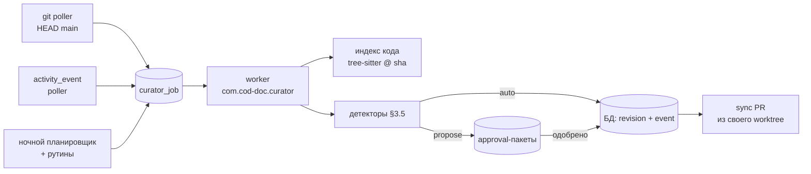

# 28 — Фоновый куратор: непрерывно улучшает документацию и сверяет её с кодом

> Категория: 🔵 Архитектура · Риск: высокий · Зависимости: RFC 25 (роль
> куратора, `curator_next`), RFC 24 (claims, structure drift, scenarios),
> proposal 07 (routines), proposal 12 (approvals), proposal 04 (run-id),
> ADR-014 (куратор, не исполнитель)

## 1. Контекст

RFC 25 и ADR-014 (принят 2026-09-27) сделали дефолтного агента куратором
документации. Но куратор — набор тулов и очередь `curator_next`: он работает,
только пока его ведёт внешний клиент. Без клиента работают одни cron-рутины,
и они только **находят**.

Цель владельца (2026-09-27): агент, который **в фоне непрерывно улучшает
документацию**, работает с кодом (читает его и правит только ссылки на него),
проверяет контракты «док ↔ код» — глубокий инструмент, а не санитария
frontmatter.

### 1.1. Решения владельца (интервью 2026-09-27)

| Вопрос | Решение |
|---|---|
| Граница автономии | Механика — сама, с ревизией; всё, где нужно суждение, — через approval |
| Триггер | События (мерж в main, правка дока) → точечная проверка затронутого; ночью — полный обход |
| Канал правок текста | Approval в cod-doc |
| Факты о коде | Свой индекс, расширенный tree-sitter; ai-reviewer — дополнительный источник для PR |
| Контракты | Агент извлекает draft, человек подтверждает; строгая проверка — только confirmed |
| Классы улучшений | Устаревшее относительно кода; пробелы покрытия; противоречия и дубли; связность и недостающие ADR |
| Перегрузка ревью | Потолок открытых предложений + приоритет; при потолке LLM на новые не тратится |
| Ссылки на код | Якорь на символ `path::Qualified.name`; однозначный переезд символа — auto, иначе approval |
| Источник событий | Опрос git (HEAD main) + `activity_event` |
| Рантайм | Четвёртый launchd-сервис `com.cod-doc.curator` |
| LLM | Два яруса: лёгкая модель — триаж и извлечение, сильная — текст; суточный лимит токенов на проект |
| Виды контрактов | Архитектурные правила, публичный API, факты-числа и конфиг, поведенческие инварианты |
| Док ≠ код | **Всегда спрашивать**: человек выбирает «править док» или «завести задачу на код» |
| Размер предложения | Пакет на причину: одна причина → один approval со всеми правками по ней |
| CI | Confirmed детерминированные контракты — гейт в CI; со временем заменяют ручные anti-drift тесты |
| Обучение | Правки предложений перед одобрением и причины отказов → память проекта → промпт |
| Коммит проекций | Агент выгружает markdown в **свой** worktree и держит один PR синхронизации |
| Код в облако | Можно всё, кроме пофайлового denylist; секретоподобные значения маскируются |
| Масштаб | Пилот на `cod-doc`; прежний план `auto-curator-2026-09` — фаза 1 |

## 2. Текущее состояние (проверено по коду 2026-09-27)

| # | Факт | Где |
|---|---|---|
| S1 | `curator_next` read-only, очередь из 8 видов с фиксированным рангом: drift `missing` → `edited_in_place` → `LINK-BROKEN` → hash `BROKEN` → hash `STALE` → `stale_export` → `unplaced` → finding | `services/curator_service.py:54-73, 341-368` |
| S2 | Детерминированно чинятся `missing`/`stale_export` (export), `edited_in_place` (import), hash `STALE`, `unplaced` с совпавшим правилом. Суждения требуют `LINK-BROKEN`, hash `BROKEN`, `unplaced` без правила, findings | `curator_service.py:244-338` |
| S3 | **Дрейф не видит конфликта.** Изменились и БД, и файл — документ получает `stale_export`; автоматический export затёр бы ручную правку | `projection_service/drift.py:104-111`; `_types.py:13-17` |
| S4 | `export_document` и `update_hashes` пишут файл без `author` и без activity-события (ADO-040) | `projection_service/export.py:200`; `core/hash_calc.py:128` |
| S5 | `on_finding` рутины — `create_task` / `update_existing_task` / `comment_only`; исправлять нечем. `trigger=event` валиден, но не диспатчится | `services/routine_service.py:53-54, 746-765` |
| S6 | `approval`: типы `plan_review/risky_action/fm_escalation/budget/manual`, `payload_json`, TTL 48 ч. После одобрения действие никто не исполняет; поверхность — только MCP | `services/approval_service.py:42, 154, 296-345`; `mcp/tools/approval_tools.py:185` |
| S7 | Прецедент «LLM предлагает, человек применяет» — `comment_service.apply_open_with_ai` + превью в вебе | `services/comment_service.py:272`; `api/web/pages/comments.py:189` |
| S8 | LLM вне оркестратора — sync `openai.OpenAI` через `ai_text._call_lite_raw`; учёта токенов нет, `agent_run.tokens_*` не инкрементируются | `services/ai_text.py:342`; `infra/models/revisions.py:63-86` |
| S9 | Legacy `Orchestrator` читает `tasks.yaml`, его тулы пишут файлы мимо сервисов; переиспользуемы `run_context`, консоль прогонов, адаптеры | `agent/orchestrator.py:219-244`; `agent/tools.py:99` |
| S10 | Индекс кода: `repo_file` / `repo_symbol(name, kind, line, parent_name)` / `repo_import(module, line)`; **только Python через `ast`**, без сигнатур и квалифицированных имён | `services/repo_index_service.py:40-133`; `infra/models/repo_index.py:53-90` |
| S11 | Таблица контрактов `doc_code_claim(kind, status, doc_key, section_anchor, content_hash, subject_ref, expected_json, provenance)` есть; её используют `structure_service`/`structure_obligations`/`structure_drift` | `infra/models/structure.py:206`; `services/structure_*.py` |
| S12 | Сценарии (RFC 24 §9) реализованы: `scenario`/`scenario_step`/`scenario_link` | `infra/models/scenarios.py:28`; TSC-001…014 |
| S13 | Три launchd-сервиса (mcp, mcp-agent, web), ни один не планировщик; тик рутин — пользовательский crontab из editable `.venv` | `services/launchd_service.py:86-90`; `crontab -l` |
| S14 | `actor_kind_for_author("agent:curator")` → `agent` | `domain/entities.py:365` |

Вывод: фундамент контрактов (S11, S12), индекс (S10) и очередь (S1) есть.
Нет: исполнителя без клиента (S13), расширенного индекса (S10), исполняемых
предложений (S6), безопасных записей (S3, S4) и учёта LLM (S8).

## 3. Предложение

### 3.1. Архитектура

- **Сервис** `com.cod-doc.curator` — четвёртый в `launchd_service.SERVICES`,
  тот же пиннованный рантайм, под `cod-doc runtime` и `cod-doc update`.
  Один процесс, один worker; LLM удалённая. Заменяет crontab-тик рутин:
  `routine_service.tick` зовёт сам сервис.
- **Очередь** — новая таблица `curator_job(project_id, kind, subject,
  cause, priority, status, attempts, not_before, run_id, created)`.
  RFC 25 §5 держал её в non-goals **MVP**; фоновому агенту с событиями и
  повторами она нужна: без неё событие, пришедшее при исчерпанном бюджете,
  теряется. Дедуп по `(project_id, kind, subject)` среди `pending`.
- **Чтение кода — только из git-объектов на HEAD `main`** (`git show
  <sha>:<path>`, `git diff --name-only <prev>..<sha>`), никогда из рабочего
  дерева владельца: незакоммиченное состояние не является фактом о коде.
- **Запись файлов — только в свой worktree** `~/.cod-doc/curator/<slug>/`
  на ветке `curator/sync`. Чекаут владельца агент не трогает никогда.

### 3.2. События и задания

| Источник | Как | Задания |
|---|---|---|
| Мерж в main | Опрос раз в 5 мин: `git rev-parse origin/main` после `git fetch` против последнего обработанного sha в `curator_state` | `reindex_delta(sha)` → `check_code_refs(files)` → `check_claims(files)` → `detect_stale(docs, связанных с файлами)` |
| Правка документа | Курсор по `activity_event` (`doc.*`, автор не `agent:curator`) | `extract_claims(doc)` → `detect_contradictions(doc)` → `check_links(doc)` |
| Ночь (02:00) | Планировщик | полный `sweep` (фаза 1), `detect_coverage`, `detect_contradictions(all)`, `detect_missing_adr(коммиты за сутки)`, рутины по cron |
| Одобрение approval | Хук в `approval_service.resolve` | применение пакета; `export_sync` |

Приоритет задания = ранг вида × вес причины (мерж > правка > ночь). Worker
берёт задания по приоритету, пока хватает суточного бюджета (§3.9); LLM-задания
без бюджета откладываются (`not_before` = следующие сутки), детерминированные
выполняются всегда.

### 3.3. Индекс кода и ссылки на код

- **Индекс по sha.** `repo_file` получает `commit_sha`; `repo_symbol` —
  `qualname` (`pkg.mod.Class.method`), `signature` (нормализованная строка
  параметров и возврата), `exported` (bool), `end_line`, `docstring_hash`.
  Парсер — tree-sitter (`tree-sitter-language-pack`) за интерфейсом
  `SymbolProvider`; первая грамматика — Python (паритет с текущим `ast`),
  затем TypeScript. Инкрементально: переиндексируются только файлы из
  `git diff` между sha.
- **Канон ссылки** — `path::Qualified.name` (без строки). Строка
  вычисляется индексом при отображении и экспорте. Ссылка на файл целиком —
  `path`.
- **Резолв ссылки** при каждом `check_code_refs`:

  | Результат | Действие |
  |---|---|
  | Символ на месте | ничего |
  | Символ исчез по пути, но **ровно один** символ с тем же `qualname`-хвостом и сигнатурой есть в другом файле (переезд) | **auto**: `link_retarget`, автор `agent:curator` |
  | Несколько кандидатов или изменилась сигнатура | **propose**: пакет с кандидатами |
  | Исчез без следа | **ask** (§3.6): «убрать упоминание» или «задача на код» |

- **Миграция `path:line`.** Разовый проход: `path:N` → символ, в чей
  диапазон попадает строка N на sha, когда ссылка была записана (из
  revision); однозначно — auto, иначе остаётся `path:line` с находкой.

### 3.4. Контракты

Модель — `doc_code_claim` из RFC 24 §8 (S11); этот RFC добавляет
извлечение, проверку по индексу и CI.

| Вид контракта | `kind` | Проверка (детерминированно, по индексу на sha) |
|---|---|---|
| Архитектурное правило | `forbids_dependency`, `depends_on` | `repo_import`: нет/есть импорта из `from_glob` в `to_glob` |
| Публичный API | `entity_exists`, `exports`, `signature` | `repo_symbol`: символ есть, экспортирован, сигнатура совпадает |
| Факт-число / конфиг | `value` (новый) | `expected_json = {probe, args, value}`; `probe` — из закрытого реестра: `constant(path::NAME)`, `count_symbols(pattern)`, `count_decorated(decorator)`, `cli_commands(group)`, `mcp_tools(profile)` |
| Поведенческий инвариант | `scenario` / `invariant` (новый) | ссылка на тест или сценарий существует и не `retired`; сам тест гоняет CI |

- **Извлечение.** Задание `extract_claims(doc)` отдаёт лёгкой модели
  секцию и вытаскивает кандидатов в JSON по схеме `kind`; каждый кандидат
  сразу прогоняется проверкой. Результат — пакет `contract_confirm`: «вот
  утверждение, вот цитата, вот что сейчас говорит код». Подтверждённые
  становятся `confirmed`, `provenance=agent`.
- **Строгость.** Только `confirmed` участвуют в `structure_drift` и CI.
  Расхождение confirmed-контракта с кодом → **ask** (§3.6), не правка.
- **Привязка к тексту.** `content_hash` секции: секцию переписали — контракт
  переходит в `stale` и уходит на повторное подтверждение.
- **CI-гейт.** `export_sync` кладёт confirmed-контракты в репо как
  `.cod-doc/contracts.json` (детерминированная сортировка, schema
  `contracts.v1`). Новая команда `cod-doc contracts check --file
  .cod-doc/contracts.json` строит индекс по рабочему дереву CI и проверяет
  без БД и без LLM; код выхода = число нарушений. Шаг добавляется в
  `ci.yml`. Ручные anti-drift тесты (`test_profile_counts_prose` и
  соседи) переводятся на контракты `value` по одному, когда контракт
  покрывает тест полностью.

### 3.5. Детекторы улучшений

| Детектор | Вход | Ярус LLM | Выход |
|---|---|---|---|
| `sweep` (фаза 1) | очередь `curator_next` | нет / лёгкий | auto + пакеты `doc_patch` |
| `check_code_refs` | ссылки дока на изменённые файлы | нет | auto / пакет / ask |
| `check_claims` | confirmed-контракты по изменённым файлам | нет | ask |
| `detect_stale` | секции, ссылающиеся на изменённые символы, + diff символа | сильный | пакет `doc_patch` с новой редакцией абзаца |
| `detect_coverage` | экспортированные символы и точки входа без единой ссылки из доков | лёгкий (отбор) + сильный (черновик) | пакет «новая секция» в разделе дерева по `doc_taxonomy` |
| `detect_contradictions` | пары секций с пересекающимися сущностями (общие ссылки, одинаковые числа/имена) | лёгкий (кандидаты) + сильный (вердикт) | пакет «свести к одному источнику»: одна секция — канон, остальные — ссылка |
| `detect_links` | упоминания сущностей без ссылки (имя символа, ADR-NNN, task_id в тексте) | нет | auto для однозначных, иначе пакет |
| `detect_missing_adr` | коммиты за сутки: новые зависимости, новые таблицы/миграции, смена публичного API | сильный | пакет «черновик ADR» (`adr_create`, статус `proposed`) |

Каждый детектор пишет находки в свою партицию `finding` (`source="curator"`,
`source_ref=<детектор>`) и сверяет её через `reconcile_partition` с
`close_after_misses=2` для LLM-детекторов (CLAUDE.md: гистерезис). Находка —
сырьё; пакет предложения собирается из находок одной причины.

### 3.6. Предложения: пакеты, выбор, потолок

- **Три типа approval** (строки в `VALID_TYPES`, миграция не нужна):

  | Тип | Когда | Что одобряет человек |
  |---|---|---|
  | `doc_patch` | правка текста, ссылок, раскладки, новая секция, черновик ADR | пакет операций из `CURATOR_OPS`, каждая с diff; принять целиком или по пунктам |
  | `doc_code_mismatch` | док ≠ код (исчезнувший символ, нарушенный confirmed-контракт, stale-абзац с изменённой семантикой) | **выбор**: (a) править док — агент готовит diff только после выбора, (b) задача на код — `task_create` в план `curator-inbox` проекта с цитатой контракта и фактом из индекса, (c) контракт устарел — `retired` |
  | `contract_confirm` | извлечённые draft-контракты секции | подтвердить / отклонить / поправить `expected` по каждому |

- **Пакет на причину.** Причина = мерж-sha, правка документа или ночная
  находка. Все операции одной причины — один approval; `payload.items[]`
  с отдельным `base_revision_id` на каждый. Частичное одобрение применяет
  выбранные пункты, остальные уходят в `denied` с памятью (§3.7).
- **Потолок.** `curator.max_pending` (по умолчанию 20) открытых approval на
  проект. На потолке LLM-задания не создают новых пакетов; находки копятся.
  Пакет с приоритетом выше самого низкого открытого вытесняет его
  (`superseded`, находки остаются). Приоритет пакета — максимум по пунктам;
  `doc_code_mismatch` по confirmed-контракту всегда выше `doc_patch`.
- **Исполнение** — закрытый реестр `CURATOR_OPS` (`link_retarget`,
  `doc_set_node`, `section_patch`, `section_add`, `claim_set_status`,
  `adr_create`, `task_create`) → сервисные функции с revision и событием,
  в транзакции `resolve`. Оптимистичная блокировка по `base_revision_id`;
  разошлось — пункт `expired(stale_base)`, задание ставится заново.
- **Поверхности** — CLI `cod-doc approval list|show|approve|deny`, веб
  «Предложения куратора» с diff и выбором, MCP `approval_resolve`
  (есть). Паритет — `_surface_parity` над `approval_service`.

### 3.7. Память проекта

- Таблица `curator_memory(project_id, kind, detector, pattern, example_before,
  example_after, reason, weight, created)`.
- Пишется при `resolve`: (a) человек поправил текст пункта перед одобрением
  → `kind=style`, до/после; (b) отказ с причиной (поле `reason` обязательно
  для `deny` пакета `doc_patch`) → `kind=rule`; (c) отказ без правки подряд
  3 раза на одном детекторе и подобных отпечатках → `kind=suppress`.
- Читается при сборке промпта детектора: до 5 ближайших `style`-примеров
  (по разделу дерева и детектору) и все `rule` проекта, в бюджете 1 КБ.
  `suppress` отключает детектор на классе отпечатков.
- Видна и правится: `cod-doc curator memory list|forget -p <slug>`; раз в
  месяц агент предлагает сжать накопленные `rule` в секцию скилла
  `doc-style` проекта (`doc_patch`).

### 3.8. Доставка: PR синхронизации

- После каждого применения (auto или одобрения) задание `export_sync`:
  worktree `~/.cod-doc/curator/<slug>/` → `git fetch` → ветка
  `curator/sync` от `origin/main` (или продолжение открытой) → `doc export`
  изменённых документов + `hash update` + `.cod-doc/contracts.json` →
  коммит `docs(curator): …` с перечнем причин и ссылками на approval.
- Один открытый PR на проект, создаётся и дополняется через `gh`, draft
  снимается раз в сутки после ночного обхода. Мерж — человеком. В `main`
  агент не пушит никогда.
- Конфликт ветки с `main` → ветка пересобирается с нуля от `origin/main`
  (проекция детерминирована: всё содержимое в БД), форс-пуш только в
  `curator/sync`.
- Правка владельца в своём чекауте приходит в БД обычным путём (`doc
  import` / мерж → `edited_in_place` → auto-import в фазе 1).
  `DriftStatus.CONFLICT` (S3) не даёт агенту затереть её выгрузкой.

### 3.9. LLM: ярусы, бюджет, приватность

- **Ярусы** — `config.yaml`: `curator.llm.lite` (gemma4:31b — триаж,
  извлечение, отбор кандидатов) и `curator.llm.strong` (qwen3.5:397b —
  текст, вердикты противоречий, черновики ADR). Оба через Ollama Cloud,
  клиент — существующий `ai_text` с возвратом `usage`.
- **Бюджет** — `curator.budget.tokens_per_day` на проект (по умолчанию
  400k) и `curator.budget.tokens_per_job`. Учёт в `agent_run.tokens_in/out`
  на задание и в `curator_state.spent_today`. Исчерпан — LLM-задания
  откладываются, детерминированные идут.
- **Приватность.** `.cod-doc/llm-ignore` (gitignore-синтаксис) + встроенный
  список по умолчанию (`.env*`, `*.pem`, `*secret*`, `*credentials*`,
  `config/*.local.*`). Такой файл не отправляется ни целиком, ни фрагментом.
  В отправляемом тексте маскируются значения, похожие на секреты (ключи
  провайдеров, JWT, строки подключения с паролем). Проект с
  `curator.llm: off` работает только детерминированной частью.

### 3.10. Инварианты безопасности

1. **Код не правится.** Агент пишет только в БД cod-doc и в markdown/
   `contracts.json` в своём worktree. Правка кода — только задачей через
   `doc_code_mismatch` → выбор человека.
2. **Конфликт — отдельный статус** `DriftStatus.CONFLICT` (S3); без него
   автоматика не включается.
3. **Каждая запись оставляет след**: revision и/или activity-событие с
   `author=agent:curator`; `export_document`/`update_hashes` получают
   `author` и событие (S4).
4. **Выключатели** на проект: `curator.enabled` (весь сервис),
   `curator.auto` (auto-уровень; выключен — только пакеты), `curator.llm`.
   По умолчанию всё выключено; включается явно.
5. **Потолки**: `max_auto` на задание, `max_pending` пакетов, бюджет токенов.
6. **Детерминированное — детерминированно**: CI-гейт и auto-уровень никогда
   не зависят от ответа модели.

## 4. Фазы

| Фаза | Суть | План |
|---|---|---|
| 1. Санитария без клиента | прежний RFC 28: `CONFLICT`, след у export/hash, `sweep` (auto + report), исполняемый `doc_patch`, CLI/веб approval, LLM-предлагатели ссылок и раскладки | `auto-curator-2026-09` (ACU-001…015), с правкой ACU-003 → worktree и sync PR |
| 2. Фоновый сервис | `com.cod-doc.curator`, `curator_job`, `curator_state`, опрос git и `activity_event`, ночной планировщик, перенос тика рутин, бюджет и учёт токенов, приватность | новый план |
| 3. Индекс и ссылки на код | tree-sitter `SymbolProvider`, индекс по sha, `qualname`/`signature`/`exported`, канон `path::symbol`, `check_code_refs`, миграция `path:line` | новый план |
| 4. Контракты | извлечение, `contract_confirm`, `value`/`invariant`, проверки по индексу, `doc_code_mismatch`, `contracts.json` + `contracts check` в CI | новый план |
| 5. Детекторы содержания | `detect_stale`, `detect_coverage`, `detect_contradictions`, `detect_links`, `detect_missing_adr`, пакеты на причину, потолок и вытеснение | новый план |
| 6. Память | `curator_memory`, правки и отказы → промпт, `suppress`, сжатие в `doc-style` | новый план |

Порядок: 1 → 2 → 3 → 4 → 5 → 6; 6 можно параллельно с 5 после появления
первых пакетов. Каждая фаза — свой план в БД (skill `plan-to-tasks`) после
закрытия предыдущей; сейчас декомпозирована только фаза 1.

## 5. Миграция / обратная совместимость

- `DriftStatus.CONFLICT` — новое значение статуса для потребителей
  `ctx_drift` (drift-гейт PR, RFC 22); гейт считает его блокирующим.
- `export_document(author=...)` — новый обязательный keyword; три вызова
  (`cli/doc/cmd_export.py:68`, `mcp/tools/doc_tools.py:566`,
  `scenario_service/export.py:153`) правятся одним коммитом.
- Новые таблицы: `curator_job`, `curator_state`, `curator_memory`;
  колонки `repo_file.commit_sha`, `repo_symbol.{qualname, signature,
  exported, end_line, docstring_hash}`. Миграции без `batch_alter_table` на
  `document` (CLAUDE.md).
- Crontab-тик рутин снимается, когда сервис фазы 2 берёт тик на себя.
- Legacy `cod-doc agent run`, `agent_enabled`, `tasks.yaml` — в
  deprecation: HANDBOOK §9 указывает на `com.cod-doc.curator`; удаление —
  отдельной задачей после фазы 2.
- Профиль MCP `agent` остаётся 6 тулов. Новые тулы (`curator_sweep`,
  `curator_jobs`, `curator_memory_*`, `contracts_check`) — на
  `standard`/`full`; счётчики правятся по `test_profile_counts_prose`.

## 6. Риски и что не делаем

**Риски**

- **Шум.** Противоречия и покрытие — самые шумные детекторы. Митигация:
  потолок, гистерезис партиций, `suppress` из памяти, включение детекторов
  по одному с замером доли одобренных пакетов.
- **Ложная уверенность в контрактах.** Draft без подтверждения в строгую
  проверку не попадает; `content_hash` отправляет контракт на повторное
  подтверждение после правки секции.
- **Нагрузка на M1 8 ГБ.** Один worker, tree-sitter без LSP, инкрементальный
  индекс, LLM удалённая. Замер RSS сервиса — критерий фазы 2.
- **Утечка кода.** Denylist + маскирование; проект может выключить LLM
  целиком.
- **Бюджет.** Детерминированная часть работает без токенов; LLM-задания
  откладываются, а не теряются.

**Non-goals**

- Правка кода, коммиты в `main`, мерж PR.
- LSP / SCIP / coverage внутри cod-doc — это остаётся ai-reviewer (RFC 24).
- Cloud-плейн (RFC 23) и работа на VPS.
- Автопринятие по таймауту и автоповышение доверия классу предложений.
- LLM в CI-гейте.

## 7. Оценка

| Фаза | Задач | Недель |
|---|---|---|
| 1 | 15 (ACU-001…015) | 2–3 |
| 2 | ~8 | 2 |
| 3 | ~7 | 2 |
| 4 | ~9 | 3 |
| 5 | ~10 | 3–4 |
| 6 | ~4 | 1 |

Итого ~53 задачи, 13–15 недель последовательно.

**Критерий успеха (пилот `cod-doc`)**

- Мерж, переименовавший символ, через ≤ 10 минут даёт auto-правку ссылок
  или пакет с кандидатами; без мержа агент не тратит токены.
- Каждое число из `PROSE_COUNTERS` покрыто контрактом `value`, CI падает
  при расхождении без `test_profile_counts_prose`.
- Доля одобренных пакетов ≥ 60% через месяц после включения детектора;
  ниже — детектор выключается до разбора.
- Утром `curator_next` показывает только то, что требует суждения, а PR
  синхронизации — всё, что агент поменял за сутки.
