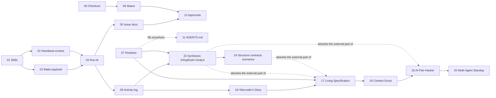

# Proposals: borrowings from `paperclipai/paperclip`

> 📊 Meta: `{"source": "github.com/paperclipai/paperclip", "studied": "2026-05-06", "context": "control plane for AI-agent companies (TS/Node monorepo)"}`

A set of RFCs on adapting successful paperclip patterns for cod-doc. Not "copy the monorepo", but take specific techniques that already fit the existing cod-doc model well (Snowball Protocol, MASTER.md, MCP-tools, the revision system).

## Selection principles

- **Take:** what strengthens existing cod-doc concepts or closes explicit gaps (context cost, audit, repeatability).
- **Do not take:** multi-tenant, hiring/org-chart, budget hard-stops, plugins with out-of-process workers — overkill for a document-centric single-user tool.

## Proposal map

| #   | Document                                                  | Category       | Effect                                          | Risk    |
| --- | --------------------------------------------------------- | --------------- | ----------------------------------------------- | ------- |
| 01  | [Skills layer](01-skills-layer.md)                        | 🎯 Direct       | Modular SYSTEM_PROMPT, Snowball for the agent    | low  |
| 02  | [Heartbeat-context endpoint](02-heartbeat-context.md)     | 🎯 Direct       | -50% tokens on iteration start                 | low  |
| 03  | [Wake-payload pattern](03-wake-payload.md)                | 🎯 Direct       | Removes reflexive reading of MASTER.md           | low  |
| 04  | [Run-id audit trail](04-run-id-audit.md)                  | 🎯 Direct       | "What the agent did in run X" out of the box    | low  |
| 05  | [Issue documents with revisions](05-issue-documents.md)  | 🟡 Adaptation   | Pinned plan/acceptance/verification on a task   | medium |
| 06  | [Atomic checkout](06-atomic-checkout.md)                 | 🟡 Adaptation   | Race protection in UI/CLI/MCP                    | low  |
| 07  | [Routines (cron)](07-routines.md)                         | 🟡 Adaptation   | Auto drift/links/hashes checks on a schedule    | medium |
| 08  | [Status taxonomy](08-status-taxonomy.md)                 | 🟡 Adaptation   | `in_review` ≠ `blocked`; FM-escalations formalized | low |
| 09  | [Activity & events log](09-activity-log.md)              | 🟡 Adaptation   | Unified timeline over revisions                 | medium |
| 10  | [Adapter pattern for LLM](10-adapter-pattern.md)        | 🔵 Architecture | Plug-in Claude/local models without a rewrite   | high |
| 11  | [AGENTS.md as a contract](11-agents-md.md)                | 🔵 Architecture | Contribution rules for humans and agents        | low  |
| 12  | [First-class approvals](12-approvals.md)                 | 🔵 Architecture | A structural replacement for ad-hoc escalations | medium |
| 13  | [Import UX redesign](13-import-ux-redesign.md)            | 🟡 Adaptation   | A modern wizard for YAML/JSON import             | medium |
| 14  | [Legacy tasks migration UX](14-legacy-tasks-migration-ux.md) | 🟡 Adaptation | Migration of legacy tasks into DB format        | medium |
| 15  | [Link system and rendering](15-link-system-and-rendering.md) | 🟡 Adaptation | Flexible cross-refs between entities            | medium |

## 🔌 Hackathon-track (external RFCs, 2026-06-04)

> A set of RFCs born from a brainstorm on vibecoding ideas. Not about
> paperclip — about using cod-doc as infrastructure for vibecoders and
> multi-agent systems. Each idea builds on existing proposals 01-15,
> extending their user value.

| #   | Document                                                | Category      | Effect                                            | Risk    |
| --- | ------------------------------------------------------- | -------------- | ------------------------------------------------- | ------- |
| 16  | [AI-Pair-Hacker](16-ai-pair-hacker.md)                  | 🔵 Architecture | cod-doc in vibecoder's git-hooks, auto-documentation | medium |
| 17  | [Living Specification](17-living-specification.md)      | 🟡 Adaptation   | ADR ↔ tasks ↔ code ↔ docs drift detector          | medium |
| 18  | [Vibecoder's Diary](18-vibecoders-diary.md)             | 🟡 Adaptation   | activity_log → human-friendly daily doc          | low  |
| 19  | [Context-Scout](19-context-scout.md)                    | 🟡 Adaptation   | "Smart grep" via cod-doc MCP, ranked evidence    | low  |
| 20  | [Multi-Agent Standup](20-multi-agent-standup.md)        | 🔵 Architecture | 2+ agents in one instance without races         | high |
| 21  | [Degraded-Path Auditability + Error Audit Trail](21-degraded-path-auditability.md) | 🟡 Adaptation | Visibility of degraded paths and hard exceptions | medium |

> ❌ **Rejection 2026-08-29 (ADO-056, closes ADO-013).** The M2 demand
> (friction-log ADO-005 #8/#10/#11/#14) is not closed by any of RFCs 16–21;
> verification of the "Current state" sections against code 2026-08-29. The M3-kickoff outcome —
> "all rejected"; see [ROADMAP](../docs/system/roadmap/ROADMAP.md) → M3.
>
> - **16** — rejected: the external part is absorbed by RFC 22 (Symbiosis); no friction-justification.
> - **17** — rejected: ADR↔code drift control is already done within RFC 22; no friction-justification.
> - **18** — rejected: no friction-log entry asks for a daily diary.
> - **19** — rejected: a quick win, but does not solve the recorded M2 problems (#8/#10/#11/#14).
> - **20** — rejected: a multi-agent pilot already lives in RFC 22; no friction-justification.
> - **21** — rejected: the "Current state" section is stale (8× `# pragma: no cover` are absent from the code, `ToolTraceModel` does not exist); findings M4/M5/M8/M15 need a new RFC.

## 🤝 Symbiosis-track (2026-08-24)

> RFC 22 replaces the hypothetical "vibecoders" from 16/17 with two real
> pilots (ZAIrgRush, Orakul/ai-review) and absorbs the external part of these
> proposals. Priority is set by ROADMAP (adoption > features).

| #   | Document                                                | Category      | Effect                                            | Risk    |
| --- | ------------------------------------------------------- | -------------- | ------------------------------------------------- | ------- |
| 22  | [Symbiosis: ZAIrgRush + Orakul](22-symbiosis-zairgrush-orakul.md) | 🔵 Architecture | Hub-DB, findings-ingest, doc-context for the external loop and AI-review | high |
| 24  | [Structure, contracts & scenarios](24-structure-contracts-scenarios.md) | 🔵 Architecture · **draft** | Unified docs↔code contour: obligations/facts/assessment, scenario coverage, `structure_context` for garage | high |

## ☁️ Cloud-track (2026-07-29)

> Designed by a Cursor-agent in branch `cursor/cloud-agent-plane-bff6` (draft PR
> #3) before the Symbiosis program. Merged 2026-08-25 **as number 23**: in the RFC branch
> it went as "16" and clashed with [16-ai-pair-hacker](16-ai-pair-hacker.md).
> Priority is set by [ROADMAP](../docs/system/roadmap/ROADMAP.md) — adoption above
> cloud profiles, tasks CAP-001…CAP-033 are not started.

| #   | Document                                                | Category      | Effect                                            | Risk    |
| --- | ------------------------------------------------------- | -------------- | ------------------------------------------------- | ------- |
| 23  | [Cloud decentralized agent plane](23-cloud-decentralized-agent-plane.md) | 🔵 Architecture | A team-node in the cloud, AI-workers via remote MCP, SoT = Postgres | high |

### Recommended order for the hackathon-track

> ⚠️ Canceled by the rejection 2026-08-29 (see above): all RFCs 16–21 are declined,
> the order below is left as historical context.

**Quick wins (1-2 weeks each):**
- 18 Vibecoder's Diary (closes `09-activity-log` with user value)
- 19 Context-Scout (CLI + FTS5, minimum new code)
- 17 Living Specification (routines + ADR-system = a natural extension)

**Heavy (3-4 weeks):**
- 16 AI-Pair-Hacker (needs integration with vibecoder tools)
- 20 Multi-Agent Standup (needs a registry, a demo, docs)

## Recommended implementation order

**Phase 1 (quick wins):** 01 → 03 → 02 → 04
**Phase 2 (structural audit):** 09 → 05 → 12
**Phase 3 (extensions):** 06 → 08 → 07 → 11
**Phase 4 (hackathon-track MVP):** 18 → 19 → 17
**Phase 5 (hackathon-track scale-up):** 16 → 20
**Phase 6 (on demand):** 10
**Symbiosis-track (2026-08, priority per ROADMAP):** 22 — instead of 16/20 as the path to real users; **24** — the deep structure/scenario contour; prerequisite SYM-005..009 done, producer merged 2026-09-03, cod-doc side — phases 3–6

## What stayed out of scope

Intentionally NOT considered:
- **Multi-company isolation** — cod-doc is multi-project, but not SaaS.
- **Budget/cost hard-stops** — not the scale of the task (one agent per project).
- **Org chart / hiring / OpenClaw onboarding** — about managing agent teams, not about documents.
- **Plugin system with IPC-workers** — too heavy infrastructure.

## Sources

- [paperclipai/paperclip](https://github.com/paperclipai/paperclip) (TypeScript, MIT, ~62k stars as of 2026-05-06)
- Key files studied: `AGENTS.md`, `ROADMAP.md`, `skills/paperclip/SKILL.md`, `skills/para-memory-files/SKILL.md`, `skills/diagnose-why-work-stopped/SKILL.md`, `skills/paperclip-converting-plans-to-tasks/SKILL.md`, `adapter-plugin.md`, the `packages/` structure, `server/src/`.
