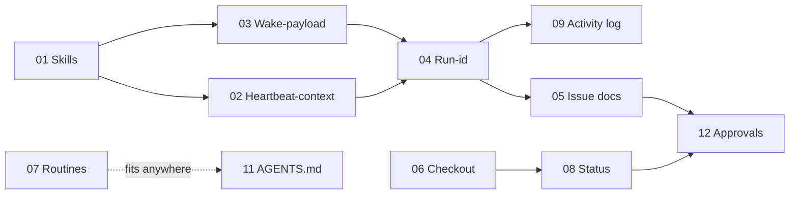

# Proposals: заимствования из `paperclipai/paperclip`

> 📊 Meta: `{"source": "github.com/paperclipai/paperclip", "studied": "2026-05-06", "context": "control plane для AI-агентских компаний (TS/Node monorepo)"}`

Набор RFC по адаптации удачных паттернов paperclip для cod-doc. Не «копировать монорепу», а взять конкретные приёмы, которые уже хорошо ложатся на существующую модель cod-doc (Snowball Protocol, MASTER.md, MCP-tools, revision-система).

## Принципы отбора

- **Берём:** то, что усиливает существующие концепции cod-doc или закрывает явные пробелы (контекст-стоимость, аудит, повторяемость).
- **Не берём:** multi-tenant, hiring/org-chart, budget hard-stops, плагины с out-of-process workers — overkill для документ-центричного однопользовательского инструмента.

## Карта предложений

| #   | Документ                                                  | Категория       | Эффект                                          | Риск    |
| --- | --------------------------------------------------------- | --------------- | ----------------------------------------------- | ------- |
| 01  | [Skills layer](01-skills-layer.md)                        | 🎯 Прямое       | Модульный SYSTEM_PROMPT, Snowball для агента    | низкий  |
| 02  | [Heartbeat-context endpoint](02-heartbeat-context.md)     | 🎯 Прямое       | -50% токенов на iteration старт                 | низкий  |
| 03  | [Wake-payload pattern](03-wake-payload.md)                | 🎯 Прямое       | Убирает рефлекторное чтение MASTER.md           | низкий  |
| 04  | [Run-id audit trail](04-run-id-audit.md)                  | 🎯 Прямое       | "Что натворил агент на прогоне X" из коробки    | низкий  |
| 05  | [Issue documents с ревизиями](05-issue-documents.md)      | 🟡 Адаптация    | Pinned plan/acceptance/verification на задаче   | средний |
| 06  | [Атомарный checkout](06-atomic-checkout.md)               | 🟡 Адаптация    | Защита от race в UI/CLI/MCP                     | низкий  |
| 07  | [Routines (cron)](07-routines.md)                         | 🟡 Адаптация    | Авто-проверки drift/links/hashes по расписанию  | средний |
| 08  | [Status taxonomy](08-status-taxonomy.md)                  | 🟡 Адаптация    | `in_review` ≠ `blocked`; FM-эскалации формализуются | низкий |
| 09  | [Activity & events log](09-activity-log.md)               | 🟡 Адаптация    | Единый таймлайн поверх revisions                | средний |
| 10  | [Adapter pattern для LLM](10-adapter-pattern.md)          | 🔵 Архитектура  | Plug-in Claude/локальных моделей без переписи   | высокий |
| 11  | [AGENTS.md как контракт](11-agents-md.md)                 | 🔵 Архитектура  | Правила вклада для людей и агентов              | низкий  |
| 12  | [First-class approvals](12-approvals.md)                  | 🔵 Архитектура  | Структурный заменитель ad-hoc эскалаций         | средний |
| 16  | [Cloud decentralized agent plane](16-cloud-decentralized-agent-plane.md) | 🔵 Архитектура | Облачный SoT + remote агенты + `agent_apply` | высокий |

> Proposals 13–15 живут в paperclip UX/migration треке (см. Section E
> [paperclip-adoption-task-plan](../docs/system/roadmap/paperclip-adoption-task-plan.md)).
> **16** — отдельный трек cloud agent plane (не paperclip-заимствование).

## Рекомендуемый порядок внедрения

**Фаза 1 (быстрые победы):** 01 → 03 → 02 → 04
**Фаза 2 (структурный аудит):** 09 → 05 → 12
**Фаза 3 (расширения):** 06 → 08 → 07 → 11
**Фаза 4 (по необходимости):** 10
**Фаза 5 (cloud agent plane, proposal 16):** foundation → `agent_apply` →
Bearer remote MCP → optional projection — см.
[cloud-agent-plane-task-plan](../docs/system/roadmap/cloud-agent-plane-task-plan.md).

## Что осталось за скобками

Намеренно НЕ рассматривается:
- **Multi-company isolation / SaaS billing** — cod-doc multi-project на
  одном team-узле, не multi-tenant продукт (proposal 16 тоже non-goal).
- **Budget/cost hard-stops** — не масштаб задачи (один агент на проект).
- **Org chart / hiring / OpenClaw onboarding** — про управление агентскими командами, не про документы.
- **Plugin system с IPC-воркерами** — слишком тяжёлая инфраструктура.
- **P2P-федерация нескольких COD-DOC узлов** — out of scope proposal 16.

## Источники

- [paperclipai/paperclip](https://github.com/paperclipai/paperclip) (TypeScript, MIT, ~62k stars на 2026-05-06)
- Ключевые файлы изучены: `AGENTS.md`, `ROADMAP.md`, `skills/paperclip/SKILL.md`, `skills/para-memory-files/SKILL.md`, `skills/diagnose-why-work-stopped/SKILL.md`, `skills/paperclip-converting-plans-to-tasks/SKILL.md`, `adapter-plugin.md`, структура `packages/`, `server/src/`.
