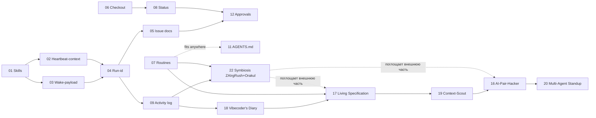

# Proposals: заимствования из `paperclipai/paperclip`

> 📊 Meta: `{"source": "github.com/paperclipai/paperclip", "studied": "2026-05-06", "context": "control plane для AI-агентских компаний (TS/Node monorepo)"}`

Набор RFC по адаптации удачных паттернов paperclip для cod-doc. Не «копировать монорепу», а взять конкретные приёмы, которые уже хорошо ложатся на существующую модель cod-doc (Snowball Protocol, MASTER.md, MCP-tools, revision-система).

## Принципы отбора

- **Берём:** то, что усиливает существующие концепции cod-doc или закрывает явные пробелы (контекст-стоимость, аудит, повторяемость).
- **Не берём:** multi-tenant, hiring/org-chart, budget hard-stops, плагины с out-of-process workers — overkill для документ-центричного однопользовательского инструмента.

## Карта предложений

| #   | Документ                                                  | Категория       | Эффект                                          | Риск    |
| --- | --------------------------------------------------------- | --------------- | ----------------------------------------------- | ------- |
| 01  | [Skills layer](01-skills-layer.md)                        | 🎯 Прямое       | Модульный SYSTEM_PROMPT, Snowball для агента    | низкий  |
| 02  | [Heartbeat-context endpoint](02-heartbeat-context.md)     | 🎯 Прямое       | -50% токенов на iteration старт                 | низкий  |
| 03  | [Wake-payload pattern](03-wake-payload.md)                | 🎯 Прямое       | Убирает рефлекторное чтение MASTER.md           | низкий  |
| 04  | [Run-id audit trail](04-run-id-audit.md)                  | 🎯 Прямое       | "Что натворил агент на прогоне X" из коробки    | низкий  |
| 05  | [Issue documents с ревизиями](05-issue-documents.md)      | 🟡 Адаптация    | Pinned plan/acceptance/verification на задаче   | средний |
| 06  | [Атомарный checkout](06-atomic-checkout.md)               | 🟡 Адаптация    | Защита от race в UI/CLI/MCP                     | низкий  |
| 07  | [Routines (cron)](07-routines.md)                         | 🟡 Адаптация    | Авто-проверки drift/links/hashes по расписанию  | средний |
| 08  | [Status taxonomy](08-status-taxonomy.md)                  | 🟡 Адаптация    | `in_review` ≠ `blocked`; FM-эскалации формализуются | низкий |
| 09  | [Activity & events log](09-activity-log.md)               | 🟡 Адаптация    | Единый таймлайн поверх revisions                | средний |
| 10  | [Adapter pattern для LLM](10-adapter-pattern.md)          | 🔵 Архитектура  | Plug-in Claude/локальных моделей без переписи   | высокий |
| 11  | [AGENTS.md как контракт](11-agents-md.md)                 | 🔵 Архитектура  | Правила вклада для людей и агентов              | низкий  |
| 12  | [First-class approvals](12-approvals.md)                  | 🔵 Архитектура  | Структурный заменитель ad-hoc эскалаций         | средний |
| 13  | [Import UX redesign](13-import-ux-redesign.md)            | 🟡 Адаптация    | Современный wizard для импорта YAML/JSON         | средний |
| 14  | [Legacy tasks migration UX](14-legacy-tasks-migration-ux.md) | 🟡 Адаптация | Миграция legacy-задач в DB-формат               | средний |
| 15  | [Link system and rendering](15-link-system-and-rendering.md) | 🟡 Адаптация | Гибкие cross-refs между сущностями              | средний |

## 🔌 Hackathon-track (внешние RFC, 2026-06-04)

> Набор RFC, рождённых из brainstorm по vibecoding-идеям. Не про paperclip —
> про применение cod-doc как infrastructure для vibecoder'ов и multi-agent систем.
> Каждая идея ложится на существующие proposal 01-15, расширяя их пользовательский value.

| #   | Документ                                                | Категория      | Эффект                                            | Риск    |
| --- | ------------------------------------------------------- | -------------- | ------------------------------------------------- | ------- |
| 16  | [AI-Pair-Hacker](16-ai-pair-hacker.md)                  | 🔵 Архитектура | cod-doc в git-hooks vibecoder'а, авто-документирование | средний |
| 17  | [Living Specification](17-living-specification.md)      | 🟡 Адаптация   | ADR ↔ tasks ↔ code ↔ docs drift detector          | средний |
| 18  | [Vibecoder's Diary](18-vibecoders-diary.md)             | 🟡 Адаптация   | activity_log → human-friendly daily doc          | низкий  |
| 19  | [Context-Scout](19-context-scout.md)                    | 🟡 Адаптация   | «Умный grep» через cod-doc MCP, ranked evidence  | низкий  |
| 20  | [Multi-Agent Standup](20-multi-agent-standup.md)        | 🔵 Архитектура | 2+ агента в одной инстанции без race             | высокий |
| 21  | [Degraded-Path Auditability + Error Audit Trail](21-degraded-path-auditability.md) | 🟡 Адаптация | Видимость degraded paths и hard exceptions     | средний |

## 🤝 Symbiosis-track (2026-08-24)

> RFC 22 заменяет гипотетических «vibecoder'ов» из 16/17 двумя реальными
> пилотами (ZAIrgRush, Orakul/ai-review) и поглощает внешнюю часть этих
> предложений. Приоритет задаёт ROADMAP (adoption > фичи).

| #   | Документ                                                | Категория      | Эффект                                            | Риск    |
| --- | ------------------------------------------------------- | -------------- | ------------------------------------------------- | ------- |
| 22  | [Symbiosis: ZAIrgRush + Orakul](22-symbiosis-zairgrush-orakul.md) | 🔵 Архитектура | Hub-БД, findings-ingest, doc-контекст для внешней петли и AI-ревью | высокий |

## ☁️ Cloud-track (2026-07-29)

> Спроектирован Cursor-агентом в ветке `cursor/cloud-agent-plane-bff6` (draft PR
> #3) до программы Symbiosis. Влит 2026-08-25 **под номером 23**: в ветке RFC
> шёл как «16» и сталкивался с [16-ai-pair-hacker](16-ai-pair-hacker.md).
> Приоритет задаёт [ROADMAP](../docs/system/roadmap/ROADMAP.md) — adoption выше
> облачных профилей, задачи CAP-001…CAP-033 не начаты.

| #   | Документ                                                | Категория      | Эффект                                            | Риск    |
| --- | ------------------------------------------------------- | -------------- | ------------------------------------------------- | ------- |
| 23  | [Cloud decentralized agent plane](23-cloud-decentralized-agent-plane.md) | 🔵 Архитектура | Team-узел в облаке, ИИ-воркеры через remote MCP, SoT = Postgres | высокий |

### Рекомендуемый порядок для hackathon-track

**Быстрые победы (1-2 недели каждая):**
- 18 Vibecoder's Diary (закрывает `09-activity-log` пользовательским value)
- 19 Context-Scout (CLI + FTS5, минимум нового кода)
- 17 Living Specification (routines + ADR-system = естественное расширение)

**Тяжёлые (3-4 недели):**
- 16 AI-Pair-Hacker (нужна интеграция с vibecoder-инструментами)
- 20 Multi-Agent Standup (нужен registry, demo, документация)

## Рекомендуемый порядок внедрения

**Фаза 1 (быстрые победы):** 01 → 03 → 02 → 04
**Фаза 2 (структурный аудит):** 09 → 05 → 12
**Фаза 3 (расширения):** 06 → 08 → 07 → 11
**Фаза 4 (hackathon-track MVP):** 18 → 19 → 17
**Фаза 5 (hackathon-track scale-up):** 16 → 20
**Фаза 6 (по необходимости):** 10
**Symbiosis-track (2026-08, приоритет по ROADMAP):** 22 — вместо 16/20 как путь к реальным пользователям

## Что осталось за скобками

Намеренно НЕ рассматривается:
- **Multi-company isolation** — cod-doc multi-project, но не SaaS.
- **Budget/cost hard-stops** — не масштаб задачи (один агент на проект).
- **Org chart / hiring / OpenClaw onboarding** — про управление агентскими командами, не про документы.
- **Plugin system с IPC-воркерами** — слишком тяжёлая инфраструктура.

## Источники

- [paperclipai/paperclip](https://github.com/paperclipai/paperclip) (TypeScript, MIT, ~62k stars на 2026-05-06)
- Ключевые файлы изучены: `AGENTS.md`, `ROADMAP.md`, `skills/paperclip/SKILL.md`, `skills/para-memory-files/SKILL.md`, `skills/diagnose-why-work-stopped/SKILL.md`, `skills/paperclip-converting-plans-to-tasks/SKILL.md`, `adapter-plugin.md`, структура `packages/`, `server/src/`.
