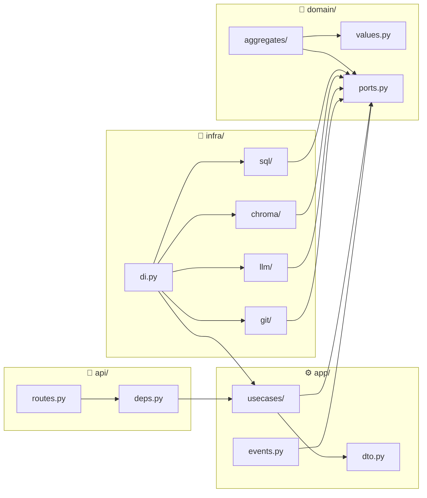

# 🧩 Module Specification: COD-DOC

> 📊 Meta: `{"version": "0.3", "last_updated": "2026-05-07", "scope": "specs", "layer": "modules", "status": "legacy-overview", "canonical_source": "docs/system/capabilities/"}`

> **🟡 LEGACY (overview document).** The api/app/domain/infra contract here is
> a compact bootstrap overview. The active capability breakdown, one file per
> capability, is in [`docs/system/capabilities/`](../docs/system/capabilities/).

## 1. Overview

The COD-DOC modular system is split into four layers: **api** (Presentation), **app** (Application), **domain** (Domain), **infra** (Infrastructure). Each module is an isolated Python package with clearly defined contracts.

**Dependency direction:** `api → app → domain ← infra`

---

## 2. Module: `api/` (Presentation Layer)

**Responsibility:** receiving external requests, routing, response serialization.

### 2.1 Contracts (incoming)

| Component | Protocol | Format | Description |
|-----------|----------|--------|----------|
| `GET /api/health` | HTTP | `{"status": "ok", "version": str}` | Health-check for Docker/load balancer |
| `GET /api/projects` | HTTP | `list[ProjectResponse]` | List of active projects |
| `POST /api/projects` | HTTP | `ProjectCreateRequest → ProjectResponse` | Create a project |
| `GET /api/projects/{id}` | HTTP | `ProjectResponse` | Project details |
| `POST /api/projects/{id}/tasks` | HTTP | `TaskCreateRequest → TaskResponse` | Add a task |
| `GET /api/projects/{id}/tasks` | HTTP | `list[TaskResponse]` | List of project tasks |
| `GET /api/projects/{id}/documents` | HTTP | `list[DocumentResponse]` | List of project documents |
| `POST /api/search` | HTTP | `SearchRequest → list[DocumentResponse]` | Semantic search |

### 2.2 Contracts (outgoing)

```python
# api → app (via DI)
class ApiDependencies:
    """Provided via deps.py (FastAPI Depends)."""
    create_project_uc: CreateProjectUseCase
    queue_task_uc: QueueTaskUseCase
    get_project_uc: GetProjectUseCase
    search_docs_uc: SearchDocumentsUseCase
```

### 2.3 Module rules
- ❌ Contains no business logic
- ❌ Does not access the DB directly
- ✅ All endpoints are typed via Pydantic schemas
- ✅ Dependencies are injected via `fastapi.Depends`

---

## 3. Module: `app/` (Application Layer)

**Responsibility:** orchestration of use cases, coordination of domain objects and infrastructure.

### 3.1 Use Cases

| Use Case | Input | Output | Side effects |
|----------|------|-------|-------------------|
| `CreateProject` | `name: str, repo_path: Path` | `Project` | Saves to `ProjectRepository`, publishes `ProjectCreated` |
| `QueueTask` | `project_id: ULID, title: str, ...` | `Task` | Saves to `TaskRepository`, publishes `TaskQueued` |
| `ExecuteTask` | `task_id: ULID` | `Task` (with result) | Calls LLM/Git/FS via ports, updates status |
| `IndexDocument` | `project_id: ULID, path: str` | `Document` | Reads the file, computes sha256, indexes in ChromaDB |
| `SearchDocuments` | `project_id: ULID, query: str, n: int` | `list[Document]` | Semantic search via `VectorIndexer` |
| `CheckStale` | `project_id: ULID` | `list[Document]` | Compares hashes, publishes `DocumentBecameStale` |
| `ArchiveProject` | `project_id: ULID` | `Project` | Transitions to `archived`, publishes `ProjectArchived` |

### 3.2 DTO (Data Transfer Objects)

```python
class ProjectCreateRequest(BaseModel):
    name: str
    repo_path: str

class TaskCreateRequest(BaseModel):
    project_id: str
    title: str
    description: str = ""
    priority: int = Field(default=5, ge=1, le=10)
    context_refs: list[str] = Field(default_factory=list)

class ProjectResponse(BaseModel):
    id: str
    name: str
    repo_path: str
    status: str
    created_at: datetime
    updated_at: datetime

class TaskResponse(BaseModel):
    id: str
    project_id: str
    title: str
    status: str
    priority: int
    result: str | None
    created_at: datetime
    completed_at: datetime | None

class DocumentResponse(BaseModel):
    id: str
    path: str
    sha256: str
    doc_status: str
    indexed_at: datetime
```

### 3.3 Event Handlers

| Handler | Event | Action |
|---------|---------|----------|
| `on_document_stale` | `DocumentBecameStale` | Creates a reindex task |
| `on_task_completed` | `TaskCompleted` | Updates the status of documents affected by the task |
| `on_project_created` | `ProjectCreated` | Scans the repository, creates indexing tasks |

### 3.4 Module rules
- ❌ Contains no domain logic (only delegates to Domain)
- ❌ Does not work with DB/files directly (only via ports)
- ✅ DTOs are flat structures, with no behavior
- ✅ Each use case is an atomic operation

---

## 4. Module: `domain/` (Domain Layer)

**Responsibility:** pure business logic, independent of infrastructure.

### 4.1 Aggregates

| Aggregate | File | Root | Child entities |
|---------|------|--------|-------------------|
| `Project` | `project.py` | ✅ | `Task`, `Document` |
| `Task` | `task.py` | — | — |
| `Document` | `document.py` | — | — |

### 4.2 Value Objects

| VO | File | Fields |
|----|------|------|
| `HybridRef` | `values.py` | `path: str`, `doc_id: str`, `sha: str` |
| `ProjectStatus` | `values.py` | Enum: `active`, `paused`, `archived` |
| `TaskStatus` | `values.py` | Enum: `pending`, `in_progress`, `completed`, `failed`, `cancelled` |
| `DocStatus` | `values.py` | Enum: `VERIFIED`, `DRAFT`, `STALE`, `BROKEN` |

### 4.3 Ports (abstract interfaces)

```python
# domain/ports.py — the single place to define infra contracts

class IProjectRepository(Protocol):
    async def get(self, project_id: ULID) -> Project | None: ...
    async def save(self, project: Project) -> None: ...
    async def list_active(self) -> list[Project]: ...

class ITaskRepository(Protocol):
    async def get(self, task_id: ULID) -> Task | None: ...
    async def save(self, task: Task) -> None: ...
    async def next_pending(self, project_id: ULID) -> Task | None: ...

class IDocumentRepository(Protocol):
    async def get_by_path(self, project_id: ULID, path: str) -> Document | None: ...
    async def save(self, document: Document) -> None: ...
    async def find_stale(self, project_id: ULID) -> list[Document]: ...

class IVectorIndexer(Protocol):
    async def index(self, document: Document) -> None: ...
    async def search(self, project_id: ULID, query: str, n: int = 5) -> list[Document]: ...

class ILLMProvider(Protocol):
    async def complete(self, system_prompt: str, user_prompt: str) -> str: ...

class IGitProvider(Protocol):
    async def clone(self, url: str, path: Path) -> None: ...
    async def commit(self, path: Path, message: str, files: list[str]) -> str: ...
```

### 4.4 Domain events

| Event | Source module | Subscribers (app) |
|---------|-----------------|-------------------|
| `ProjectCreated` | `Project.create()` | `on_project_created` |
| `TaskQueued` | `Task.queue()` | — (logging) |
| `TaskStarted` | `Task.start()` | — (logging) |
| `TaskCompleted` | `Task.complete()` | `on_task_completed` |
| `TaskFailed` | `Task.fail()` | — |
| `DocumentIndexed` | `Document.index()` | — |
| `DocumentBecameStale` | `Document.check_hash()` | `on_document_stale` |
| `ProjectArchived` | `Project.archive()` | — |

### 4.5 Module rules
- ❌ Zero external dependencies (no `import fastapi`, no `import sqlalchemy`)
- ❌ No I/O operations
- ✅ All external calls go through ports (Protocol)
- ✅ Business invariants are checked inside aggregates

---

## 5. Module: `infra/` (Infrastructure Layer)

**Responsibility:** implementation of ports, work with external systems.

### 5.1 Port implementations

| Port | Implementation | Technology |
|------|------------|------------|
| `IProjectRepository` | `SqlProjectRepository` | SQLAlchemy 2.0 (async) + PostgreSQL |
| `ITaskRepository` | `SqlTaskRepository` | SQLAlchemy 2.0 (async) + PostgreSQL |
| `IDocumentRepository` | `SqlDocumentRepository` | SQLAlchemy 2.0 (async) + PostgreSQL |
| `IVectorIndexer` | `ChromaIndexer` | ChromaDB (embedded) |
| `ILLMProvider` | `OpenRouterProvider` | openai SDK → OpenRouter API |
| `IGitProvider` | `GitPythonAdapter` | GitPython |
| `IFileSystem` | `LocalFileSystem` | `pathlib.Path` (stdlib) |

### 5.2 Configuration (DI wiring)

```python
# infra/di.py — the dependency assembly point

def configure(app: FastAPI) -> None:
    """Binds ports to implementations."""

    # infra → domain
    app.state.project_repo = SqlProjectRepository(session_factory)
    app.state.task_repo = SqlTaskRepository(session_factory)
    app.state.doc_repo = SqlDocumentRepository(session_factory)
    app.state.indexer = ChromaIndexer(persist_dir)
    app.state.llm = OpenRouterProvider(api_key)

    # app → domain (via ports)
    app.state.create_project_uc = CreateProjectUseCase(app.state.project_repo)
    app.state.queue_task_uc = QueueTaskUseCase(app.state.task_repo)
    ...
```

### 5.3 Module rules
- ✅ The only layer with the right to I/O
- ✅ Implements the interfaces defined in `domain/ports.py`
- ✅ Connected via DI (dependencies are not hardcoded)
- ✅ Transactionality via the SQLAlchemy `session_factory`

---

## 6. Dependency scheme



### Dependency rules

| From module | Can import | Cannot import |
|-----------|--------------------|-----------------------|
| `api/` | `app/`, `domain/` | `infra/` |
| `app/` | `domain/` | `infra/`, `api/` |
| `domain/` | — (stdlib only) | `infra/`, `app/`, `api/`, any frameworks |
| `infra/` | `domain/` | `app/`, `api/` |

---

## 7. Document dependencies

```
specs/modules.md
  ← arch/architecture.md     (architectural context: layers, ADRs, stack)
  ← models/domain.md         (domain models: aggregates, VO, ports)
```

---

## 8. Implementation status

| Module | Contracts | Implementation | Status |
|--------|-----------|------------|--------|
| `domain/` | Defined | Not started | `🟡 DRAFT` |
| `infra/` | Defined (ports) | Not started | `🟡 DRAFT` |
| `app/` | Defined | Not started | `🟡 DRAFT` |
| `api/` | Defined | Not started | `🟡 DRAFT` |
