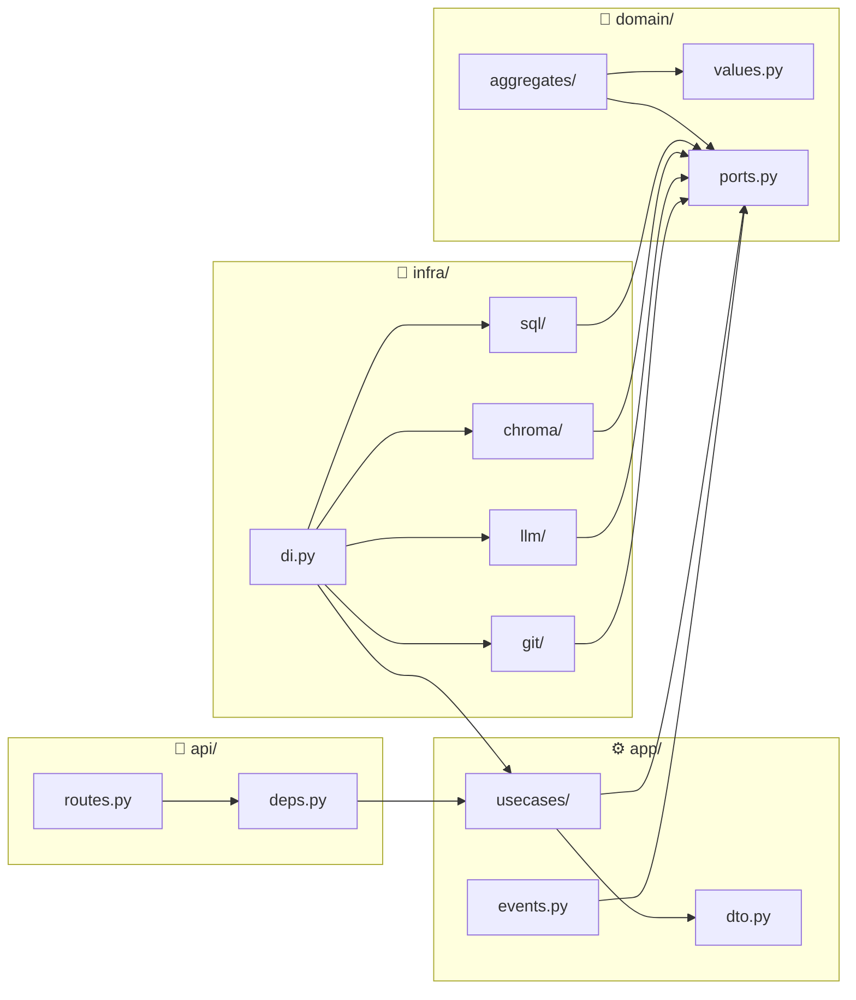

# 🧩 Спецификация модулей: COD-DOC

> 📊 Meta: `{"version": "0.3", "last_updated": "2026-05-07", "scope": "specs", "layer": "modules", "status": "legacy-overview", "canonical_source": "docs/system/capabilities/"}`

> **🟡 LEGACY (обзорный документ).** Контракт api/app/domain/infra здесь —
> compact bootstrap-обзор. Активная capability-разбивка по одному файлу на
> возможность — в [`docs/system/capabilities/`](../docs/system/capabilities/).

## 1. Обзор

Модульная система COD-DOC разделена на четыре слоя: **api** (Presentation), **app** (Application), **domain** (Domain), **infra** (Infrastructure). Каждый модуль — изолированный Python-пакет с чётко определёнными контрактами.

**Направление зависимостей:** `api → app → domain ← infra`

---

## 2. Модуль: `api/` (Presentation Layer)

**Ответственность:** приём внешних запросов, маршрутизация, сериализация ответов.

### 2.1 Контракты (входящие)

| Компонент | Протокол | Формат | Описание |
|-----------|----------|--------|----------|
| `GET /api/health` | HTTP | `{"status": "ok", "version": str}` | Health-check для Docker/балансировщика |
| `GET /api/projects` | HTTP | `list[ProjectResponse]` | Список активных проектов |
| `POST /api/projects` | HTTP | `ProjectCreateRequest → ProjectResponse` | Создание проекта |
| `GET /api/projects/{id}` | HTTP | `ProjectResponse` | Детали проекта |
| `POST /api/projects/{id}/tasks` | HTTP | `TaskCreateRequest → TaskResponse` | Добавление задачи |
| `GET /api/projects/{id}/tasks` | HTTP | `list[TaskResponse]` | Список задач проекта |
| `GET /api/projects/{id}/documents` | HTTP | `list[DocumentResponse]` | Список документов проекта |
| `POST /api/search` | HTTP | `SearchRequest → list[DocumentResponse]` | Семантический поиск |

### 2.2 Контракты (исходящие)

```python
# api → app (через DI)
class ApiDependencies:
    """Предоставляется через deps.py (FastAPI Depends)."""
    create_project_uc: CreateProjectUseCase
    queue_task_uc: QueueTaskUseCase
    get_project_uc: GetProjectUseCase
    search_docs_uc: SearchDocumentsUseCase
```

### 2.3 Правила модуля
- ❌ Не содержит бизнес-логики
- ❌ Не обращается к БД напрямую
- ✅ Все эндпоинты типизированы через Pydantic-схемы
- ✅ Зависимости инжектируются через `fastapi.Depends`

---

## 3. Модуль: `app/` (Application Layer)

**Ответственность:** оркестрация use-case'ов, координация доменных объектов и инфраструктуры.

### 3.1 Use Cases

| Use Case | Вход | Выход | Побочные эффекты |
|----------|------|-------|-------------------|
| `CreateProject` | `name: str, repo_path: Path` | `Project` | Сохраняет в `ProjectRepository`, публикует `ProjectCreated` |
| `QueueTask` | `project_id: ULID, title: str, ...` | `Task` | Сохраняет в `TaskRepository`, публикует `TaskQueued` |
| `ExecuteTask` | `task_id: ULID` | `Task` (с result) | Вызывает LLM/Git/FS через порты, обновляет статус |
| `IndexDocument` | `project_id: ULID, path: str` | `Document` | Читает файл, вычисляет sha256, индексирует в ChromaDB |
| `SearchDocuments` | `project_id: ULID, query: str, n: int` | `list[Document]` | Семантический поиск через `VectorIndexer` |
| `CheckStale` | `project_id: ULID` | `list[Document]` | Сравнивает хэши, публикует `DocumentBecameStale` |
| `ArchiveProject` | `project_id: ULID` | `Project` | Переводит в `archived`, публикует `ProjectArchived` |

### 3.2 DTO (Data Transfer Objects)

```python
class ProjectCreateRequest(BaseModel):
    name: str
    repo_path: str

class TaskCreateRequest(BaseModel):
    project_id: str
    title: str
    description: str = ""
    priority: int = Field(default=5, ge=1, le=10)
    context_refs: list[str] = Field(default_factory=list)

class ProjectResponse(BaseModel):
    id: str
    name: str
    repo_path: str
    status: str
    created_at: datetime
    updated_at: datetime

class TaskResponse(BaseModel):
    id: str
    project_id: str
    title: str
    status: str
    priority: int
    result: str | None
    created_at: datetime
    completed_at: datetime | None

class DocumentResponse(BaseModel):
    id: str
    path: str
    sha256: str
    doc_status: str
    indexed_at: datetime
```

### 3.3 Event Handlers

| Handler | Событие | Действие |
|---------|---------|----------|
| `on_document_stale` | `DocumentBecameStale` | Создаёт задачу на переиндексацию |
| `on_task_completed` | `TaskCompleted` | Обновляет статус документов, затронутых задачей |
| `on_project_created` | `ProjectCreated` | Сканирует репозиторий, создаёт задачи на индексацию |

### 3.4 Правила модуля
- ❌ Не содержит доменной логики (только делегирует Domain)
- ❌ Не работает с БД/файлами напрямую (только через порты)
- ✅ DTO — плоские структуры, без поведения
- ✅ Каждый use case — атомарная операция

---

## 4. Модуль: `domain/` (Domain Layer)

**Ответственность:** чистая бизнес-логика, независимая от инфраструктуры.

### 4.1 Агрегаты

| Агрегат | Файл | Корень | Дочерние сущности |
|---------|------|--------|-------------------|
| `Project` | `project.py` | ✅ | `Task`, `Document` |
| `Task` | `task.py` | — | — |
| `Document` | `document.py` | — | — |

### 4.2 Value Objects

| VO | Файл | Поля |
|----|------|------|
| `HybridRef` | `values.py` | `path: str`, `doc_id: str`, `sha: str` |
| `ProjectStatus` | `values.py` | Enum: `active`, `paused`, `archived` |
| `TaskStatus` | `values.py` | Enum: `pending`, `in_progress`, `completed`, `failed`, `cancelled` |
| `DocStatus` | `values.py` | Enum: `VERIFIED`, `DRAFT`, `STALE`, `BROKEN` |

### 4.3 Порты (абстрактные интерфейсы)

```python
# domain/ports.py — единственное место определения контрактов infra

class IProjectRepository(Protocol):
    async def get(self, project_id: ULID) -> Project | None: ...
    async def save(self, project: Project) -> None: ...
    async def list_active(self) -> list[Project]: ...

class ITaskRepository(Protocol):
    async def get(self, task_id: ULID) -> Task | None: ...
    async def save(self, task: Task) -> None: ...
    async def next_pending(self, project_id: ULID) -> Task | None: ...

class IDocumentRepository(Protocol):
    async def get_by_path(self, project_id: ULID, path: str) -> Document | None: ...
    async def save(self, document: Document) -> None: ...
    async def find_stale(self, project_id: ULID) -> list[Document]: ...

class IVectorIndexer(Protocol):
    async def index(self, document: Document) -> None: ...
    async def search(self, project_id: ULID, query: str, n: int = 5) -> list[Document]: ...

class ILLMProvider(Protocol):
    async def complete(self, system_prompt: str, user_prompt: str) -> str: ...

class IGitProvider(Protocol):
    async def clone(self, url: str, path: Path) -> None: ...
    async def commit(self, path: Path, message: str, files: list[str]) -> str: ...
```

### 4.4 Доменные события

| Событие | Модуль-источник | Подписчики (app) |
|---------|-----------------|-------------------|
| `ProjectCreated` | `Project.create()` | `on_project_created` |
| `TaskQueued` | `Task.queue()` | — (логгирование) |
| `TaskStarted` | `Task.start()` | — (логгирование) |
| `TaskCompleted` | `Task.complete()` | `on_task_completed` |
| `TaskFailed` | `Task.fail()` | — |
| `DocumentIndexed` | `Document.index()` | — |
| `DocumentBecameStale` | `Document.check_hash()` | `on_document_stale` |
| `ProjectArchived` | `Project.archive()` | — |

### 4.5 Правила модуля
- ❌ Ноль внешних зависимостей (no `import fastapi`, no `import sqlalchemy`)
- ❌ Никаких I/O операций
- ✅ Все внешние вызовы — через порты (Protocol)
- ✅ Бизнес-инварианты проверяются внутри агрегатов

---

## 5. Модуль: `infra/` (Infrastructure Layer)

**Ответственность:** реализация портов, работа с внешними системами.

### 5.1 Реализации портов

| Порт | Реализация | Технология |
|------|------------|------------|
| `IProjectRepository` | `SqlProjectRepository` | SQLAlchemy 2.0 (async) + PostgreSQL |
| `ITaskRepository` | `SqlTaskRepository` | SQLAlchemy 2.0 (async) + PostgreSQL |
| `IDocumentRepository` | `SqlDocumentRepository` | SQLAlchemy 2.0 (async) + PostgreSQL |
| `IVectorIndexer` | `ChromaIndexer` | ChromaDB (embedded) |
| `ILLMProvider` | `OpenRouterProvider` | openai SDK → OpenRouter API |
| `IGitProvider` | `GitPythonAdapter` | GitPython |
| `IFileSystem` | `LocalFileSystem` | `pathlib.Path` (stdlib) |

### 5.2 Конфигурация (DI wiring)

```python
# infra/di.py — точка сборки зависимостей

def configure(app: FastAPI) -> None:
    """Связывает порты с реализациями."""

    # infra → domain
    app.state.project_repo = SqlProjectRepository(session_factory)
    app.state.task_repo = SqlTaskRepository(session_factory)
    app.state.doc_repo = SqlDocumentRepository(session_factory)
    app.state.indexer = ChromaIndexer(persist_dir)
    app.state.llm = OpenRouterProvider(api_key)

    # app → domain (через порты)
    app.state.create_project_uc = CreateProjectUseCase(app.state.project_repo)
    app.state.queue_task_uc = QueueTaskUseCase(app.state.task_repo)
    ...
```

### 5.3 Правила модуля
- ✅ Единственный слой с правом на I/O
- ✅ Реализует интерфейсы, определённые в `domain/ports.py`
- ✅ Подключается через DI (зависимости не хардкодятся)
- ✅ Транзакционность через `session_factory` SQLAlchemy

---

## 6. Схема зависимостей



### Правила зависимостей

| Из модуля | Может импортировать | Не может импортировать |
|-----------|--------------------|-----------------------|
| `api/` | `app/`, `domain/` | `infra/` |
| `app/` | `domain/` | `infra/`, `api/` |
| `domain/` | — (только stdlib) | `infra/`, `app/`, `api/`, любые фреймворки |
| `infra/` | `domain/` | `app/`, `api/` |

---

## 7. Зависимости документа

```
specs/modules.md
  ← arch/architecture.md     (архитектурный контекст: слои, ADR, стек)
  ← models/domain.md         (доменные модели: агрегаты, VO, порты)
```

---

## 8. Статус реализации

| Модуль | Контракты | Реализация | Статус |
|--------|-----------|------------|--------|
| `domain/` | Определены | Не начата | `🟡 DRAFT` |
| `infra/` | Определены (ports) | Не начата | `🟡 DRAFT` |
| `app/` | Определены | Не начата | `🟡 DRAFT` |
| `api/` | Определены | Не начата | `🟡 DRAFT` |
